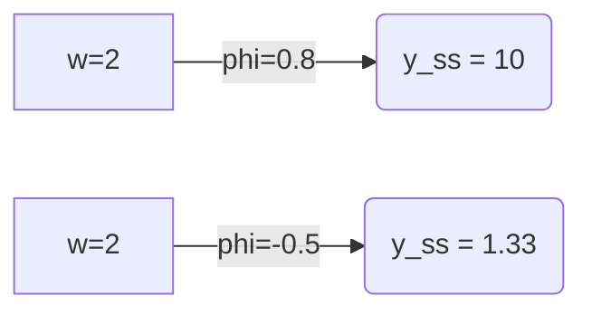

## Multiplicadores Dinâmicos em Equações de Diferença de Primeira Ordem

### Introdução

Este capítulo aprofunda a análise dos **multiplicadores dinâmicos** em equações de diferença de primeira ordem, construindo sobre os conceitos já estabelecidos nos capítulos anteriores [^1, 2, 3]. Como discutido, a equação de diferença de primeira ordem $y_t = \phi y_{t-1} + w_t$ descreve a evolução temporal de uma variável $y_t$ em função do seu valor anterior $y_{t-1}$, de uma entrada externa $w_t$ e do parâmetro $\phi$ [^1]. Os multiplicadores dinâmicos, formalmente expressos como $\frac{\partial y_{t+j}}{\partial w_t} = \phi^j$, são cruciais para entender como uma mudança na variável de entrada $w_t$ se propaga e afeta a variável de saída $y$ em diferentes períodos futuros, e como o parâmetro $\phi$ influencia essa propagação. Este capítulo também explorará métodos computacionais e otimizações para análise prática de multiplicadores dinâmicos em simulações de longo prazo.

### Multiplicadores Dinâmicos: Conceito e Derivação
Como visto, a solução geral da equação de diferença de primeira ordem é expressa por [^2]:

$$ y_t = \phi^{t+1} y_{-1} + \sum_{i=0}^{t} \phi^{t-i} w_i $$

Esta expressão revela que o valor de $y_t$ é uma função linear de seu valor inicial $y_{-1}$ e da história dos valores de entrada $w$. O multiplicador dinâmico mede a sensibilidade de $y_{t+j}$ a uma mudança em $w_t$ [^2], e é definido como:

$$ \frac{\partial y_{t+j}}{\partial w_t} = \phi^j $$

Esta derivada parcial, calculada mantendo os demais valores de $w$ e $y_{-1}$ constantes, indica que o efeito de uma perturbação em $w_t$ sobre o valor de $y$ em um período futuro $t+j$ é dado por $\phi^j$.

*O multiplicador dinâmico $\phi^j$ quantifica como uma alteração em $w_t$ se propaga e afeta $y$ em períodos futuros* [^3].

A derivação do multiplicador dinâmico pode ser obtida diretamente da solução geral. Dado que
$$ y_{t+j} = \phi^{t+j+1} y_{-1} + \sum_{i=0}^{t+j} \phi^{t+j-i} w_i, $$
Ao calcular a derivada parcial em relação a $w_t$, apenas o termo com $w_t$ na soma resulta em algo diferente de zero, ou seja, o termo $\phi^{t+j-t}w_t = \phi^j w_t$. Assim, obtemos:

$$ \frac{\partial y_{t+j}}{\partial w_t} = \frac{\partial}{\partial w_t} (\phi^j w_t) = \phi^j $$

A expressão $\phi^j$ indica que o multiplicador dinâmico depende apenas do valor do parâmetro $\phi$ e do horizonte de tempo $j$ entre o choque e a observação, e não do instante de tempo $t$ [^3]. Essa propriedade é uma característica de equações de diferença lineares de primeira ordem [^3].

**Lema 1**
O multiplicador dinâmico do efeito de um choque unitário em $w_t$ sobre $y_{t+j}$ para $j\ge 0$ é dado por:
$$ \frac{\partial y_{t+j}}{\partial w_t} = \phi^j $$
*Prova:*
I. A solução geral da equação de diferenças é dada por $y_{t+j} = \phi^{t+j+1}y_{-1} + \sum_{k=0}^{t+j} \phi^{t+j-k}w_k$.
II. Se o choque ocorrer em $t$, então $w_t=1$ e $w_{t+k}=0$ para $k \ne 0$.
III. Considerando também $y_{-1}=0$, a equação torna-se $y_{t+j} = \phi^{t+j-t}w_t = \phi^j w_t$ para $t+j\ge t$.
IV. Tomando a derivada parcial em relação a $w_t$, obtemos $\frac{\partial y_{t+j}}{\partial w_t} = \phi^j$.
$\blacksquare$

**Lema 1.1**
Se um choque em $w_t$ é não-unitário, digamos $w_t = \delta$, então o efeito em $y_{t+j}$ é dado por $\delta \phi^j$.
*Prova:*
I.  A solução geral da equação de diferença para um choque não-unitário $\delta$ em $w_t$ é $y_{t+j} = \phi^{t+j+1}y_{-1} + \sum_{i=0}^{t+j}\phi^{t+j-i}w_i$.
II. Com $y_{-1}=0$ e apenas $w_t = \delta \ne 0$, a equação torna-se $y_{t+j} = \phi^{t+j-t}\delta = \delta\phi^j$.
III. Tomando a derivada parcial de $y_{t+j}$ com relação a $w_t$, temos $\frac{\partial y_{t+j}}{\partial w_t} = \delta\phi^j$.
IV.  Assim, o efeito em $y_{t+j}$ é dado por $\delta\phi^j$.
$\blacksquare$

### Interpretação do Multiplicador Dinâmico
O multiplicador dinâmico $\phi^j$ revela como a influência de uma perturbação em $w_t$ se propaga ao longo do tempo, e seu comportamento é determinado pelo valor de $\phi$ [^3]:

*   **$|\phi| < 1$ (Estabilidade):** Quando o valor absoluto de $\phi$ é menor que 1, ou seja, $|\phi| < 1$, o multiplicador $\phi^j$ decai geometricamente para zero quando $j$ aumenta [^3]. Isso significa que o efeito de um choque em $w_t$ sobre $y$ diminui com o tempo, indicando que o sistema é estável.
    *   Se $0 < \phi < 1$, o efeito diminui monotonicamente para zero, ou seja, a resposta se aproxima de zero sem oscilações.
    *   Se $-1 < \phi < 0$, o efeito diminui em magnitude, mas alterna o sinal a cada período, indicando uma resposta oscilante amortecida.
    > 💡 **Exemplo Numérico:** Se $\phi = 0.8$ e um choque unitário em $w_0$, a resposta será: $y_1=0.8$, $y_2 = 0.64$, $y_3=0.512$, etc. O efeito decai para zero. Se $\phi = -0.5$, a resposta será: $y_1=-0.5$, $y_2=0.25$, $y_3=-0.125$. O efeito oscila e decai para zero.
    ```mermaid
    graph LR
        A[w_0 = 1] -->|phi=0.8| B(y_1 = 0.8);
        B -->|phi=0.8| C(y_2 = 0.64);
        C -->|phi=0.8| D(y_3 = 0.512);
        E[w_0 = 1] -->|phi=-0.5| F(y_1 = -0.5);
        F -->|phi=-0.5| G(y_2 = 0.25);
        G -->|phi=-0.5| H(y_3 = -0.125);
    ```
*   **$|\phi| > 1$ (Instabilidade):** Se o valor absoluto de $\phi$ for maior que 1, $|\phi| > 1$, o multiplicador $\phi^j$ aumenta exponencialmente com o tempo [^3]. Isso indica que o efeito de um choque em $w_t$ cresce a cada período futuro, e o sistema é instável.
    *   Se $\phi > 1$, o efeito cresce monotonicamente, indicando que a resposta aumenta exponencialmente.
    *   Se $\phi < -1$, o efeito cresce em magnitude, mas alterna o sinal a cada período, levando a oscilações explosivas.
    > 💡 **Exemplo Numérico:** Se $\phi = 1.2$ e um choque unitário em $w_0$, a resposta será: $y_1=1.2$, $y_2=1.44$, $y_3=1.728$, etc. O efeito cresce. Se $\phi = -1.5$, a resposta será: $y_1=-1.5$, $y_2=2.25$, $y_3=-3.375$. O efeito oscila e cresce em magnitude.
    ```mermaid
    graph LR
        A[w_0 = 1] -->|phi=1.2| B(y_1 = 1.2);
        B -->|phi=1.2| C(y_2 = 1.44);
        C -->|phi=1.2| D(y_3 = 1.728);
         E[w_0 = 1] -->|phi=-1.5| F(y_1 = -1.5);
        F -->|phi=-1.5| G(y_2 = 2.25);
        G -->|phi=-1.5| H(y_3 = -3.375);
    ```
*   **$\phi = 1$ (Sistema no Limite da Estabilidade):** Quando $\phi = 1$, o multiplicador $\phi^j$ permanece constante e igual a 1 para todo $j$. Isso significa que um choque em $w_t$ tem um efeito permanente sobre $y$, e o sistema não retorna ao estado anterior [^3].
    > 💡 **Exemplo Numérico:** Se $\phi = 1$ e um choque unitário em $w_0$, a resposta será: $y_1=1$, $y_2=1$, $y_3=1$, etc. O efeito não decai e é permanente.
    ```mermaid
        graph LR
            A[w_0 = 1] -->|phi=1| B(y_1 = 1);
            B -->|phi=1| C(y_2 = 1);
            C -->|phi=1| D(y_3 = 1);
    ```
*   **$\phi = -1$ (Oscilações Constantes):** Se $\phi = -1$, o multiplicador $\phi^j$ alterna entre 1 e -1, indicando que um choque em $w_t$ causa oscilações constantes em $y$, sem decaimento ou crescimento em magnitude.
    > 💡 **Exemplo Numérico:** Se $\phi = -1$ e um choque unitário em $w_0$, a resposta será: $y_1=-1$, $y_2=1$, $y_3=-1$, etc. A resposta oscila com magnitude constante.
    ```mermaid
        graph LR
            A[w_0 = 1] -->|phi=-1| B(y_1 = -1);
            B -->|phi=-1| C(y_2 = 1);
            C -->|phi=-1| D(y_3 = -1);
    ```
**Teorema 1.1**
O multiplicador dinâmico de um sistema estável (i.e., $|\phi|<1$) converge para zero quando o período $j$ tende ao infinito.

*Prova:*
I.  O multiplicador dinâmico é dado por $\phi^j$.
II.  O limite do multiplicador dinâmico quando $j \to \infty$ é dado por:
$$ \lim_{j\to\infty} \phi^j $$
III. Se $|\phi|<1$, então $\lim_{j\to\infty} \phi^j = 0$.
IV.  Portanto, para sistemas estáveis, o multiplicador dinâmico converge para zero quando o período $j$ tende ao infinito.
$\blacksquare$

**Proposição 1**
O multiplicador dinâmico $\phi^j$ para o efeito de um choque unitário em $w_t$ sobre $y_{t+j}$ não depende do tempo inicial $t$, mas somente do horizonte de tempo $j$.
*Prova:*
I. Pelo **Lema 1**, o multiplicador dinâmico é dado por $\phi^j$.
II. O multiplicador dinâmico não contém nenhum termo referente ao tempo inicial $t$, mas apenas ao horizonte de tempo $j$.
III. Portanto, o multiplicador dinâmico depende apenas de $\phi$ e do horizonte de tempo $j$, não do tempo inicial $t$.
$\blacksquare$

**Proposição 1.1**
O multiplicador dinâmico para o efeito de um choque em $w_t$ sobre $y_{t+j}$ pode ser expresso como uma função recursiva, dado que $\frac{\partial y_{t}}{\partial w_t} = 1$ e $\frac{\partial y_{t+j}}{\partial w_t} = \phi \frac{\partial y_{t+j-1}}{\partial w_t}$ para $j>0$.
*Prova:*
I. Pelo **Lema 1**, o multiplicador dinâmico é dado por $\frac{\partial y_{t+j}}{\partial w_t} = \phi^j$.
II. Para $j=0$, temos $\frac{\partial y_{t}}{\partial w_t} = \phi^0 = 1$
III. Para $j>0$,  $\frac{\partial y_{t+j}}{\partial w_t} = \phi^j$. Pode-se expressar $\phi^j$ como $\phi \times \phi^{j-1}$.
IV.  Observe que $\phi^{j-1} = \frac{\partial y_{t+j-1}}{\partial w_t}$. Assim, podemos reescrever o multiplicador dinâmico como $\frac{\partial y_{t+j}}{\partial w_t} = \phi \frac{\partial y_{t+j-1}}{\partial w_t}$
V.  Portanto, o multiplicador dinâmico pode ser expresso recursivamente como $\frac{\partial y_{t+j}}{\partial w_t} = \phi \frac{\partial y_{t+j-1}}{\partial w_t}$ para $j>0$, com $\frac{\partial y_{t}}{\partial w_t} = 1$.
$\blacksquare$

### Cálculo do Multiplicador Dinâmico
O multiplicador dinâmico pode ser calculado de duas formas principais: recursivamente ou analiticamente.

#### Cálculo Recursivo
O cálculo recursivo é direto e pode ser implementado computacionalmente. Em cada período $t$, a resposta $y_{t+j}$ a um choque em $w_t$ é dada pela aplicação iterativa da equação da diferença, onde a perturbação $w_t$ é aplicada no instante $t$ [^2, 3].

Para um choque unitário em $w_t$ (i.e., $w_t = 1$ e $w_{t+k} = 0$ para $k \neq 0$) e condição inicial $y_{-1} = 0$, a resposta $y_{t+j}$ é dada por:

- $y_t = 1$
- $y_{t+1} = \phi$
- $y_{t+2} = \phi y_{t+1} = \phi^2$
- ...
- $y_{t+j} = \phi^j$

Este processo é repetido para cada período, até o horizonte desejado. Esta abordagem é computacionalmente mais simples para um número limitado de períodos, especialmente quando o valor de $\phi$ é conhecido.

#### Cálculo Analítico

O cálculo analítico, como já demonstrado, deriva o multiplicador dinâmico diretamente da solução geral da equação de diferença. A derivada parcial de $y_{t+j}$ em relação a $w_t$ é dada por:

$$ \frac{\partial y_{t+j}}{\partial w_t} = \phi^j $$

Este resultado analítico é uma forma fechada que pode ser diretamente avaliada para qualquer valor de $j$.  O cálculo analítico é mais eficiente quando é necessário calcular o multiplicador dinâmico para um grande número de períodos futuros ou para analisar as propriedades do multiplicador.

> 💡 **Exemplo Numérico:**
>
> Suponha que $\phi = 0.7$ e queremos calcular os multiplicadores dinâmicos para os períodos $j=0, 1, 2, 3$ tanto recursivamente quanto analiticamente.
>
> **Cálculo Recursivo:**
> - $y_t = 1$ (choque inicial em $w_t$)
> - $y_{t+1} = 0.7 * y_t = 0.7 * 1 = 0.7$
> - $y_{t+2} = 0.7 * y_{t+1} = 0.7 * 0.7 = 0.49$
> - $y_{t+3} = 0.7 * y_{t+2} = 0.7 * 0.49 = 0.343$
>
> **Cálculo Analítico:**
> - $\frac{\partial y_{t}}{\partial w_t} = 0.7^0 = 1$
> - $\frac{\partial y_{t+1}}{\partial w_t} = 0.7^1 = 0.7$
> - $\frac{\partial y_{t+2}}{\partial w_t} = 0.7^2 = 0.49$
> - $\frac{\partial y_{t+3}}{\partial w_t} = 0.7^3 = 0.343$
>
>  Ambos os métodos levam aos mesmos resultados. O cálculo recursivo é direto para cada $j$, enquanto o analítico fornece uma solução direta para qualquer $j$.

### Otimizações Computacionais para Simulações de Longo Prazo

Quando simulamos sistemas dinâmicos para um grande número de períodos, otimizações computacionais podem aumentar a eficiência do cálculo dos multiplicadores dinâmicos. As principais estratégias incluem:

*   **Armazenamento dos Resultados Intermediários:** Em vez de recalcular os valores a cada período, armazenar os resultados intermediários (por exemplo, as potências de $\phi$) para reutilização.
*   **Utilização de Cálculo Vetorizado:** Utilizar bibliotecas numéricas que permitem operações vetorizadas, o que aumenta a velocidade do cálculo, em vez de usar loops explícitos.
*   **Aproveitamento da Forma Analítica:** Quando possível, usar a forma analítica $\phi^j$ diretamente, em vez de realizar cálculos recursivos para cada período.
*   **Cálculo Aproximado em Longos Horizontes:** Em horizontes muito longos, quando $|\phi| < 1$, podemos truncar a série de multiplicadores a um ponto onde a magnitude do multiplicador se torna insignificante para a aplicação em questão, reduzindo o número de cálculos necessários.
> 💡 **Exemplo Numérico:**
>
> Para ilustrar a otimização, vamos considerar $\phi = 0.9$ e um horizonte de 100 períodos.
>
> **Método sem Otimização (Recursivo):**
> ```python
> import numpy as np
>
> phi = 0.9
> horizon = 100
> multipliers = []
>
> current_multiplier = 1
> for j in range(horizon):
>     multipliers.append(current_multiplier)
>     current_multiplier *= phi
>
> print(multipliers[:5])  # Imprime os 5 primeiros valores
> ```
>
> **Método Otimizado (Analítico e Vetorizado):**
> ```python
> import numpy as np
>
> phi = 0.9
> horizon = 100
>
> j = np.arange(horizon) #Cria um vetor com os periodos
> multipliers = phi**j #Calcula todos os multiplicadores de uma vez
>
> print(multipliers[:5])  # Imprime os 5 primeiros valores
> ```
>
> No segundo método, o uso de `numpy` permite calcular todos os multiplicadores de uma vez, sem loop, tornando o processo muito mais rápido e eficiente para grandes horizontes. Além disso, o método analítico evita a recursão e realiza a operação diretamente. Para horizontes muito grandes, digamos j> 50, e com um $\phi = 0.9$, podemos truncar a série para j = 50, já que o multiplicador fica menor que 0.005.
>

**Teorema 1.2**
Se $w_t$ for uma série temporal de choques, então o efeito cumulativo em $y_{t+j}$ é a soma ponderada dos efeitos de cada choque individual, onde o peso de cada choque $w_i$ é dado por $\phi^{t+j-i}$.
*Prova:*
I. A solução geral da equação de diferença é $y_{t+j} = \phi^{t+j+1}y_{-1} + \sum_{i=0}^{t+j}\phi^{t+j-i}w_i$.
II. Assumindo $y_{-1}=0$, temos $y_{t+j} = \sum_{i=0}^{t+j}\phi^{t+j-i}w_i$.
III. O termo $\phi^{t+j-i}w_i$ representa o efeito do choque $w_i$ em $y_{t+j}$.
IV. Portanto, o efeito cumulativo é a soma de cada termo, que corresponde ao efeito de cada choque individual. O peso de cada choque é dado por $\phi^{t+j-i}$.
$\blacksquare$

**Observação 1**
Em sistemas estáveis ($|\phi| < 1$), a influência de choques em $w_t$ diminui ao longo do tempo, como demonstrado em **Teorema 1.1**. Consequentemente, para horizontes de tempo suficientemente grandes, o efeito de choques passados torna-se desprezível. Isso implica que o estado atual do sistema é mais influenciado por choques recentes do que por choques distantes no passado.

**Teorema 2** (Decomposição da Resposta)
A resposta $y_{t+j}$ a uma série de choques $w_t$ pode ser decomposta em duas partes: a resposta transitória, que decai no tempo para sistemas estáveis, e a resposta do estado estacionário.

*Prova:*
I. A solução geral, com $y_{-1} = 0$, é $y_{t+j} = \sum_{i=0}^{t+j} \phi^{t+j-i}w_i$.
II. Se o sistema é estável, então $|\phi|<1$.
III. A resposta transitória, $\sum_{i=0}^{t} \phi^{t+j-i}w_i$,  representa os efeitos dos choques até o tempo t, e decai para zero quando $j$ aumenta.
IV. A resposta de estado estacionário é a parte de $y_{t+j}$ que persiste quando $j$ cresce. Em particular, para um choque constante $w$,  $y_{t+j}$ se aproxima de $\sum_{i=0}^{\infty} \phi^{j+t-i}w$, que corresponde a um novo equilíbrio do sistema.
V. Para $|\phi|<1$, $\sum_{i=0}^{\infty} \phi^{j+t-i}$ converge e representa um efeito constante.
VI.  Portanto, a resposta $y_{t+j}$ pode ser decomposta nas partes transitória e de estado estacionário.
$\blacksquare$

**Corolário 1**
Em sistemas instáveis ($|\phi| > 1$), a resposta a um choque cresce indefinidamente, não havendo um estado estacionário. A resposta é predominantemente transitória e explosiva.

*Prova:*
I. Pelo **Teorema 1.2**, a resposta a uma série de choques é dada por $y_{t+j} = \sum_{i=0}^{t+j}\phi^{t+j-i}w_i$.
II. Se $|\phi| > 1$, cada termo da soma $\phi^{t+j-i}w_i$ cresce exponencialmente com $j$.
III. Consequentemente, a soma cresce indefinidamente, e não existe um estado estacionário.
IV. Portanto, em sistemas instáveis, a resposta é transitória e explosiva.
$\blacksquare$

**Teorema 2.1**
A resposta de estado estacionário em um sistema estável, sujeito a um choque constante $w$, é dada por $y_{ss} = \frac{w}{1-\phi}$.

*Prova:*
I. Pelo **Teorema 2**, a resposta de estado estacionário para um choque constante $w$ é dada por $y_{ss} =  \sum_{i=0}^{\infty} \phi^{j+t-i}w$.
II. Assumindo que o sistema já atingiu o estado estacionário, o tempo inicial $t$ e o período futuro $j$ são irrelevantes, e podemos simplificar a expressão para $y_{ss} = w \sum_{k=0}^{\infty} \phi^{k}$.
III. A soma $\sum_{k=0}^{\infty} \phi^{k}$ é a soma de uma série geométrica, que converge para $\frac{1}{1-\phi}$ quando $|\phi|<1$.
IV. Portanto, $y_{ss} = w \frac{1}{1-\phi} = \frac{w}{1-\phi}$.
$\blacksquare$
> 💡 **Exemplo Numérico:**
>
> Se $\phi=0.8$ e $w=2$, o estado estacionário será $y_{ss} = \frac{2}{1-0.8} = \frac{2}{0.2} = 10$. Isso significa que após um longo período, o sistema se estabilizará em torno de 10 quando sujeito a um choque constante de 2.
> Se $\phi=-0.5$ e $w=2$, o estado estacionário será $y_{ss} = \frac{2}{1-(-0.5)} = \frac{2}{1.5} = 1.33$. Isso significa que o sistema se estabilizará em torno de 1.33 quando sujeito a um choque constante de 2, oscilando em torno desse valor.
>


**Observação 2**
O **Teorema 2.1** mostra que, em sistemas estáveis, o efeito de longo prazo de um choque constante é amplificado ou atenuado pelo fator $\frac{1}{1-\phi}$. Se $0<\phi<1$, o efeito é amplificado. Se $-1<\phi<0$, o efeito é atenuado.

**Corolário 2**
Para um sistema estável com $\phi \neq 0$, a resposta no estado estacionário a um choque constante $w$ é sempre diferente de zero.
*Prova:*
I. Pelo **Teorema 2.1**, a resposta no estado estacionário é dada por $y_{ss} = \frac{w}{1-\phi}$.
II. Se $\phi \ne 1$, o denominador da expressão não é zero.
III. Para $w \ne 0$, $y_{ss}$ será não nulo.
IV. Portanto, para um choque constante não nulo $w$ e $\phi \ne 1$, a resposta de estado estacionário é sempre diferente de zero.
$\blacksquare$

### Conclusão
Este capítulo detalhou o conceito e a importância dos multiplicadores dinâmicos em equações de diferença de primeira ordem. Através da derivação analítica e do cálculo recursivo, vimos como uma mudança em $w_t$ afeta a variável de saída $y$ em diferentes períodos futuros, com a magnitude dessa influência determinada pelo parâmetro $\phi$. A análise da convergência do multiplicador dinâmico em sistemas estáveis, juntamente com as otimizações computacionais, oferece um quadro completo para modelar e analisar sistemas dinâmicos com respostas temporais em séries temporais. O entendimento do multiplicador dinâmico é fundamental para a modelagem de séries temporais e a previsão de resultados em sistemas dinâmicos de primeira ordem.

### Referências
[^1]: Página 1 do texto fornecido.
[^2]: Página 2 do texto fornecido.
[^3]: Página 3 do texto fornecido.
<!-- END -->
