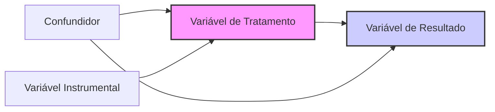

## Substituição Recursiva e Implementação de Equações de Diferença de Primeira Ordem
### Introdução

Nos capítulos anteriores, exploramos a representação e a solução de equações de diferença de primeira ordem utilizando o operador de atraso. Vimos como a equação $y_t = \phi y_{t-1} + w_t$ pode ser expressa de forma compacta como $(1-\phi L)y_t = w_t$ [^2.2.2] e que sua solução formal é dada por $y_t = \sum_{k=0}^{\infty} \phi^k w_{t-k}$ quando $|\phi|<1$ [^2.2.9]. Este capítulo se aprofunda na substituição recursiva, uma técnica comum para analisar equações de diferença, e como implementá-la computacionalmente usando iterações e acumulações, com estruturas de dados eficientes para armazenar e manipular resultados intermediários.

### Substituição Recursiva na Análise de Equações de Diferença
A substituição recursiva é uma técnica fundamental para entender o comportamento das equações de diferença, especialmente quando se procura uma solução que expresse o valor da variável dependente em termos das variáveis independentes ou ruídos passados. Considere novamente a equação de primeira ordem:
$$y_t = \phi y_{t-1} + w_t$$
Podemos aplicar esta equação recursivamente para obter expressões que mostram como $y_t$ depende de $w_t$ e dos valores iniciais de $y$:
$$\begin{aligned}
    y_t &= \phi y_{t-1} + w_t \\
    y_{t-1} &= \phi y_{t-2} + w_{t-1} \\
    y_{t-2} &= \phi y_{t-3} + w_{t-2} \\
    & \vdots
\end{aligned}$$
Substituindo $y_{t-1}$ na primeira equação, obtemos:
$$y_t = \phi (\phi y_{t-2} + w_{t-1}) + w_t = \phi^2 y_{t-2} + \phi w_{t-1} + w_t$$
Continuando com o processo de substituição, obtemos:
$$y_t = \phi^3 y_{t-3} + \phi^2 w_{t-2} + \phi w_{t-1} + w_t$$
E, generalizando, após $n$ substituições, obtemos:
$$y_t = \phi^n y_{t-n} + \sum_{k=0}^{n-1} \phi^k w_{t-k}$$
A partir desta equação, vemos que o valor de $y_t$ depende do valor de $y$ em um passado distante, ponderado por $\phi^n$ e de uma soma ponderada dos valores de $w$ do passado. Se $\vert \phi \vert < 1$ e a sequência $y_t$ é limitada, o primeiro termo tende a zero quando $n$ tende a infinito e a soma converge para a solução $y_t = \sum_{k=0}^{\infty} \phi^k w_{t-k}$, como vimos no capítulo anterior.

> 💡 **Exemplo Numérico:**
> Considere a equação $y_t = 0.6 y_{t-1} + w_t$. Podemos aplicar a substituição recursiva para obter uma expressão para $y_t$ em termos de $w_t$:
>
> $y_t = 0.6 y_{t-1} + w_t$
>
> $y_{t-1} = 0.6 y_{t-2} + w_{t-1}$
>
> $y_{t-2} = 0.6 y_{t-3} + w_{t-2}$
>
> Substituindo as equações sucessivamente, obtemos:
>
> $y_t = 0.6 (0.6 y_{t-2} + w_{t-1}) + w_t = 0.36 y_{t-2} + 0.6 w_{t-1} + w_t$
>
> $y_t = 0.36 (0.6 y_{t-3} + w_{t-2}) + 0.6 w_{t-1} + w_t = 0.216 y_{t-3} + 0.36 w_{t-2} + 0.6 w_{t-1} + w_t$
>
> Continuando este processo, obtemos
> $y_t = 0.6^n y_{t-n} + \sum_{k=0}^{n-1} 0.6^k w_{t-k}$.
> Se assumirmos que $y_0 = 0$ e $w_t$ é uma sequência de ruído branco com valores $w_1=1, w_2=0.5, w_3=-0.2, w_4=0.8, w_5=-0.3$, podemos calcular os primeiros valores de $y_t$ usando a substituição recursiva:
>
> $y_1 = 0.6^1 y_0 + 0.6^0 w_1 = 0 + 1 = 1$
>
> $y_2 = 0.6^2 y_0 + 0.6^1 w_1 + 0.6^0 w_2 = 0 + 0.6(1) + 0.5 = 1.1$
>
> $y_3 = 0.6^3 y_0 + 0.6^2 w_1 + 0.6^1 w_2 + 0.6^0 w_3 = 0 + 0.36(1) + 0.6(0.5) - 0.2 = 0.46$
>
> $y_4 = 0.6^4 y_0 + 0.6^3 w_1 + 0.6^2 w_2 + 0.6^1 w_3 + 0.6^0 w_4 = 0 + 0.216(1) + 0.36(0.5) + 0.6(-0.2) + 0.8 = 1.096$
>
> $y_5 = 0.6^5 y_0 + 0.6^4 w_1 + 0.6^3 w_2 + 0.6^2 w_3 + 0.6^1 w_4 + 0.6^0 w_5 = 0 + 0.1296(1) + 0.216(0.5) + 0.36(-0.2) + 0.6(0.8) - 0.3 = 0.4296$
>
> Note que o peso dos ruídos passados diminui conforme o lag aumenta. O valor de $y_t$ é uma soma ponderada dos ruídos passados e do valor inicial de $y$.

### Implementação Computacional de Substituição Recursiva
A substituição recursiva, embora útil na análise, pode não ser a forma mais direta para a implementação computacional, pois a cada passo da recursão teríamos que substituir a variável por uma expressão cada vez mais complexa. Em vez disso, podemos implementar a equação de diferença usando iterações e acumulações em um loop, o que geralmente é mais eficiente e direto.

1.  **Iteração e Acumulação:** Para implementar a equação $y_t = \phi y_{t-1} + w_t$, podemos usar um loop `for` (ou similar) para percorrer todos os valores de $t$ e usar um array ou lista para armazenar os valores de $y_t$. A implementação consiste em:
    *   Inicializar o valor de $y_0$.
    *   Em cada iteração, aplicar a equação recursiva para calcular o valor atual de $y_t$ a partir do valor anterior $y_{t-1}$ e do valor atual do ruído $w_t$.
    *  Armazenar os resultados em uma estrutura de dados apropriada (array, lista etc).

2. **Uso de Estruturas de Dados Eficientes:** Para armazenar os resultados intermediários e finais da substituição recursiva, podemos usar arrays ou listas. Em Python, o `numpy` oferece arrays eficientes para realizar operações numéricas, enquanto o tipo `list` pode ser usado para acumular resultados de tamanho variável. Ao escolher uma estrutura de dados, é importante considerar a eficiência das operações de inserção e recuperação de dados, bem como o consumo de memória.

3. **Aproximações da Série Infinita:** Em alguns casos, para usar a forma da solução $y_t = \sum_{k=0}^{\infty} \phi^k w_{t-k}$ na implementação, precisamos truncar a série em um número finito de termos. O número de termos deve ser escolhido com base na precisão desejada e no custo computacional.

> 💡 **Exemplo Numérico:**
> Em Python, podemos implementar a substituição recursiva da seguinte forma:
>
> ```python
> import numpy as np
>
> def recursive_solution(w, phi, y0=0):
>     y = np.zeros_like(w)
>     y[0] = y0 + w[0] #Condição inicial
>     for i in range(1, len(w)):
>         y[i] = phi * y[i-1] + w[i]
>     return y
>
> # Exemplo de uso
> w = np.random.randn(100) #Ruído Branco
> phi = 0.7
> y_result = recursive_solution(w, phi)
> print(y_result[:10])
> ```
>
> Este código inicializa um array para armazenar os valores de $y_t$ e usa um loop para calcular os valores de $y_t$ iterativamente, usando a equação $y_t = \phi y_{t-1} + w_t$. Note que esta implementação é similar ao método de "forwards substitution", em que resolvemos o valor da variável dependente do presente em função do presente e do passado da variável independente e/ou ruídos.
>
> 💡 **Exemplo Numérico (Aproximação da Série Infinita):**
>  Para uma equação $y_t = 0.8 y_{t-1} + w_t$, cuja solução é $y_t = \sum_{k=0}^{\infty} 0.8^k w_{t-k}$ , podemos truncar a série após 10 termos em uma implementação:
> ```python
> def approximate_solution(w, phi, n_terms=10):
>  y = np.zeros_like(w)
>  for i in range(len(w)):
>    for k in range(min(i + 1, n_terms)):
>       y[i] += (phi**k) * w[i-k]
>  return y
>
> # Exemplo de uso
> w = np.random.randn(100) #Ruído Branco
> phi = 0.8
> y_approx = approximate_solution(w, phi)
> print(y_approx[:10])
> ```
> Esta implementação acumula as contribuições dos ruídos passados, ponderadas pelos coeficientes do operador, até um número fixo de termos da expansão.
>
> Vamos supor que temos uma sequência de ruído branco $w = [1, 0.5, -0.2, 0.8, -0.3]$ e $\phi = 0.8$, e vamos truncar a série em $n=3$ termos para os 5 primeiros valores de $y_t$:
>
> Para $t=0$: $y_0 = 0.8^0 w_0 = 1$
>
> Para $t=1$: $y_1 = 0.8^0 w_1 + 0.8^1 w_0 = 0.5 + 0.8(1) = 1.3$
>
> Para $t=2$: $y_2 = 0.8^0 w_2 + 0.8^1 w_1 + 0.8^2 w_0 = -0.2 + 0.8(0.5) + 0.64(1) = 0.84$
>
> Para $t=3$: $y_3 = 0.8^0 w_3 + 0.8^1 w_2 + 0.8^2 w_1 = 0.8 + 0.8(-0.2) + 0.64(0.5) = 1.06$
>
> Para $t=4$: $y_4 = 0.8^0 w_4 + 0.8^1 w_3 + 0.8^2 w_2 = -0.3 + 0.8(0.8) + 0.64(-0.2) = 0.188$
>
> Notamos que, a cada valor de tempo $t$,  truncamos a soma ponderada dos ruídos $w$ até o termo $n$. Este método aproxima a solução da série infinita.

**Lema 1:**
     Seja a equação de diferença de primeira ordem dada por $y_t = \phi y_{t-1} + w_t$, então a implementação da solução recursiva para gerar os primeiros $T$ termos, utilizando uma abordagem iterativa, tem complexidade computacional $O(T)$.
   *  **Prova:**
        I. Inicializamos a condição inicial $y_0$, que tem complexidade $O(1)$.
        II. Em cada iteração do loop, para calcular $y_t$, fazemos uma multiplicação ($\phi y_{t-1}$) e uma soma ($\phi y_{t-1} + w_t$).
        III. Para gerar os $T$ primeiros termos da sequência, executamos o loop $T$ vezes.
        IV.  Assim, a complexidade computacional da implementação é $O(T)$, pois o tempo de execução do algoritmo aumenta linearmente com o número de termos $T$.  $\blacksquare$

**Lema 1.1:**
    A implementação da solução da equação de diferença $y_t = \phi y_{t-1} + w_t$ utilizando o truncamento da série infinita $\sum_{k=0}^{\infty} \phi^k w_{t-k}$ até o termo $n$ exige, em cada passo $t$, no máximo $n$ multiplicações e $n-1$ somas. Para uma série temporal de comprimento $T$, a complexidade computacional é $O(nT)$.
    *   **Prova:**
         I.  Para calcular $y_t$ usando o truncamento da série, precisamos acumular os termos $\phi^k w_{t-k}$ para $k = 0, 1, 2, ..., n-1$.
         II. Para cada valor de $k$, precisamos calcular $\phi^k w_{t-k}$, o que envolve uma multiplicação.
         III. Precisamos somar $n$ termos na série truncada, o que implica em $n-1$ operações de soma.
         IV.  Para calcular os $T$ primeiros valores da série $y_t$, teremos que executar a operação de acumulação $T$ vezes.
         V. Portanto, a complexidade computacional é de $O(nT)$.  $\blacksquare$

**Teorema 1:**
    A substituição recursiva, na forma de uma iteração computacional, para a equação de diferença linear de primeira ordem  $y_t = \phi y_{t-1} + w_t$, permite calcular os valores de $y_t$ com complexidade computacional $O(T)$ para obter os $T$ primeiros valores da sequência.
  *  **Prova:**
       I. Da definição do método da substituição recursiva, o valor de $y_t$ depende do valor de $y$ em $t-1$, sendo o cálculo do termo $y_t$ uma função direta de $y_{t-1}$ e de $w_t$.
       II. A cada passo de tempo $t$, calculamos $y_t = \phi y_{t-1} + w_t$ com um número constante de operações (uma multiplicação e uma soma) em relação a $T$.
       III. Para calcular $T$ elementos da sequência, o algoritmo realiza um número de operações proporcional a $T$.
       IV. Portanto, a complexidade computacional para computar os $T$ primeiros valores da sequência com substituição recursiva é $O(T)$. $\blacksquare$

**Teorema 1.1:** A complexidade computacional para aproximar a solução da equação de diferenças de primeira ordem  $y_t = \phi y_{t-1} + w_t$ através de uma série truncada $y_t = \sum_{k=0}^{n} \phi^k w_{t-k}$ para os primeiros $T$ pontos da série é dada por $O(nT)$, onde $n$ é o número de termos da série truncada e $T$ é o número de elementos da sequência.

 * **Prova:**
  I. Pelo Lema 1.1, o cálculo de cada $y_t$ até o termo $n$ exige $n$ multiplicações e $n-1$ adições, i.e. $O(n)$.
  II. Para uma série de tamanho $T$, a operação de truncamento da série é realizada $T$ vezes, ou seja, a complexidade é $O(n)T = O(nT)$.  $\blacksquare$

**Lema 2:**
 A complexidade espacial para armazenar os valores de $y_t$ em um array de comprimento $T$ é $O(T)$.
    *  **Prova:**
         I.  Para armazenar os $T$ primeiros valores da série $y_t$, é necessário um array de tamanho $T$.
         II.  O espaço necessário para armazenar o array aumenta linearmente com o tamanho da série, i.e. $O(T)$.  $\blacksquare$

**Lema 2.1:**
    A complexidade espacial para armazenar os coeficientes de um operador polinomial no operador de atraso de grau n é $O(n)$.
  *   **Prova:**
         I. Um operador polinomial de grau $n$ tem $n+1$ coeficientes.
         II. O espaço necessário para armazenar esses coeficientes é diretamente proporcional a $n$, ou seja $O(n)$.  $\blacksquare$
**Lema 2.2:**
    A complexidade espacial para armazenar os valores passados de $w_t$ em uma janela deslizante de tamanho $n$ é $O(n)$.
   * **Prova:**
     I. Para implementar o cálculo da série truncada $y_t = \sum_{k=0}^{n-1} \phi^k w_{t-k}$, é necessário armazenar os valores de $w_t$ em uma janela de tamanho $n$, que corresponde aos $n$ valores passados de $w_t$.
     II. O espaço necessário para armazenar essa janela é proporcional a $n$, i.e. $O(n)$. $\blacksquare$

**Teorema 2:**
    A substituição recursiva aplicada a equações de diferenças de primeira ordem requer, para calcular os primeiros $T$ pontos da série, uma complexidade espacial $O(T)$ para armazenar a série $y_t$ e uma complexidade computacional $O(T)$, assumindo um custo constante para cada operação aritmética básica.
   * **Prova:**
       I. Pelo Lema 2, o espaço necessário para armazenar os $T$ elementos da série $y_t$ é de $O(T)$.
       II. Pelo Teorema 1, a complexidade computacional para executar o algoritmo recursivo é $O(T)$.
       III.  Portanto, o espaço e o tempo utilizados crescem linearmente com o tamanho da série $T$. $\blacksquare$

**Teorema 2.1:** Se $w_t$ são variáveis aleatórias independentes e identicamente distribuídas, e se a condição $|\phi|<1$ é satisfeita, então a variância de $y_t$ converge para um valor finito conforme $t$ tende ao infinito.
  * **Prova:**
    I. A solução da equação de diferença $y_t = \phi y_{t-1} + w_t$ é dada por $y_t = \sum_{k=0}^{\infty} \phi^k w_{t-k}$.
    II. Se $w_t$ são variáveis aleatórias i.i.d. com variância $\sigma_w^2$, então a variância de $y_t$ pode ser expressa como:
    $Var(y_t) = Var(\sum_{k=0}^{\infty} \phi^k w_{t-k}) = \sum_{k=0}^{\infty} (\phi^k)^2 Var(w_{t-k})$
    III. Como $Var(w_{t-k}) = \sigma_w^2$ para todo $k$, temos
    $Var(y_t) = \sigma_w^2 \sum_{k=0}^{\infty} (\phi^2)^k$.
    IV. A soma acima é uma série geométrica que converge para $\frac{1}{1 - \phi^2}$ se $|\phi| < 1$.
    V. Portanto, $Var(y_t) = \frac{\sigma_w^2}{1 - \phi^2}$, que é um valor finito, e a variância de $y_t$ converge para este valor conforme $t \to \infty$. $\blacksquare$
 > 💡 **Exemplo Numérico:**
 > Suponha que $\sigma_w^2 = 1$ e $\phi = 0.8$. Então, a variância de $y_t$ quando $t$ tende a infinito é dada por:
 > $Var(y_t) = \frac{1}{1 - 0.8^2} = \frac{1}{1 - 0.64} = \frac{1}{0.36} \approx 2.778$.
 > Isso significa que, a longo prazo, a variabilidade de $y_t$ é aproximadamente 2.778 vezes a variabilidade do ruído $w_t$.

 **Teorema 2.2:** Sob as mesmas condições do Teorema 2.1, a autocovariância de $y_t$ em um lag $h$, dada por $Cov(y_t, y_{t-h})$, converge para um valor finito conforme $t$ tende ao infinito.
 * **Prova:**
     I. A solução para $y_t$ é $y_t = \sum_{k=0}^{\infty} \phi^k w_{t-k}$ e para $y_{t-h}$ é $y_{t-h} = \sum_{j=0}^{\infty} \phi^j w_{t-h-j}$.
     II. A autocovariância é dada por $Cov(y_t, y_{t-h}) = E[(y_t - E[y_t])(y_{t-h} - E[y_{t-h}])]$.
     III. Dado que $E[y_t] = 0$ e $E[y_{t-h}] = 0$ para ruído branco com média zero,  temos $Cov(y_t, y_{t-h}) = E[y_t y_{t-h}]$.
     IV. Substituindo as expressões para $y_t$ e $y_{t-h}$, temos $Cov(y_t, y_{t-h}) = E[(\sum_{k=0}^{\infty} \phi^k w_{t-k})(\sum_{j=0}^{\infty} \phi^j w_{t-h-j})]$.
     V. Expandindo e usando o fato de que $E[w_{t-k}w_{t-h-j}] = \sigma_w^2$ se $k = h+j$ e 0 caso contrário, obtemos
     $Cov(y_t, y_{t-h}) = \sigma_w^2 \sum_{k=h}^{\infty} \phi^k \phi^{k-h} = \sigma_w^2 \phi^h \sum_{k=0}^{\infty} \phi^{2k} = \sigma_w^2 \frac{\phi^h}{1 - \phi^2}$, que é um valor finito se $|\phi|<1$.
     VI. Portanto, a autocovariância converge para um valor finito quando $t \rightarrow \infty$.  $\blacksquare$
> 💡 **Exemplo Numérico:**
>  Usando o mesmo exemplo anterior, $\sigma_w^2 = 1$ e $\phi = 0.8$, a autocovariância para um lag $h=1$ é:
>  $Cov(y_t, y_{t-1}) = \frac{1 \times 0.8^1}{1-0.8^2} = \frac{0.8}{0.36} \approx 2.222$
>  Para $h=2$,
>  $Cov(y_t, y_{t-2}) = \frac{1 \times 0.8^2}{1-0.8^2} = \frac{0.64}{0.36} \approx 1.778$
>  A autocovariância diminui conforme o lag $h$ aumenta, o que indica uma dependência temporal decrescente.

**Proposição 1:** A solução da equação de diferença de primeira ordem $y_t = \phi y_{t-1} + w_t$ pode ser expressa como $y_t = \phi^t y_0 + \sum_{k=0}^{t-1} \phi^k w_{t-k}$, onde $y_0$ é a condição inicial.
 * **Prova:**
   I. Vimos que após $n$ substituições, $y_t = \phi^n y_{t-n} + \sum_{k=0}^{n-1} \phi^k w_{t-k}$.
   II. Se substituirmos $n$ por $t$, teremos $y_t = \phi^t y_{t-t} + \sum_{k=0}^{t-1} \phi^k w_{t-k}$.
   III. Como $y_{t-t} = y_0$, obtemos $y_t = \phi^t y_0 + \sum_{k=0}^{t-1} \phi^k w_{t-k}$.   $\blacksquare$

**Proposição 1.1:** Se $|\phi| < 1$, então $\phi^t y_0$ converge para zero quando $t$ tende a infinito, de modo que a influência da condição inicial $y_0$ sobre $y_t$ se torna desprezível para valores de $t$ suficientemente grandes.
   * **Prova:**
      I. Se $|\phi| < 1$, então $\lim_{t \to \infty} \phi^t = 0$.
      II. Portanto, $\lim_{t \to \infty} \phi^t y_0 = 0$.
      III. Isso significa que, à medida que o tempo $t$ avança, a influência da condição inicial $y_0$ sobre o valor de $y_t$ diminui, e o valor de $y_t$ se torna cada vez mais determinado pelos ruídos passados $w_{t-k}$. $\blacksquare$
> 💡 **Exemplo Numérico:**
> Vamos supor que $y_0 = 5$ e $\phi = 0.9$. Para diferentes valores de $t$, temos:
>
> $t=1$: $\phi^t y_0 = 0.9^1 * 5 = 4.5$
>
> $t=5$: $\phi^t y_0 = 0.9^5 * 5 \approx 2.95$
>
> $t=10$: $\phi^t y_0 = 0.9^{10} * 5 \approx 1.74$
>
> $t=20$: $\phi^t y_0 = 0.9^{20} * 5 \approx 0.60$
>
> $t=50$: $\phi^t y_0 = 0.9^{50} * 5 \approx 0.028$
>
>  Conforme $t$ aumenta, o termo $\phi^t y_0$ se aproxima de zero, indicando que a influência da condição inicial diminui com o tempo.

### Estruturas de Dados e Otimização
Para implementar a substituição recursiva e truncamento da série de forma eficiente, a escolha das estruturas de dados e otimizações de código é crucial:

1.  **Arrays Numéricos:** O uso de arrays da biblioteca `numpy` em Python é fundamental para otimizar operações numéricas. Eles armazenam dados em blocos contíguos de memória, permitindo que as operações sejam realizadas de forma vetorizada, o que é mais eficiente do que usar loops explícitos.
2.  **Vetores e Matrizes Esparsas:** Em alguns problemas de equações de diferença mais complexos, as matrizes e operadores podem ser esparsos. O uso de estruturas de dados para armazenar matrizes esparsas é essencial para reduzir o uso de memória e acelerar os cálculos.
3.  **Memoização:** Em algumas situações, ao se usar um algoritmo recursivo, podemos usar memoização para guardar os valores já calculados e evitar recálculos redundantes. Em problemas com muitas repetições, a memoização pode acelerar significativamente a execução do algoritmo.
4.  **Compilação Just-in-Time (JIT):** Em linguagens como Python, podemos usar compiladores JIT, como o Numba, para acelerar o código. Compiladores JIT compilam o código em tempo de execução, otimizando as operações numéricas e o acesso à memória.

     > 💡 **Exemplo Numérico:**
    > Para ilustrar a importância da escolha da estrutura de dados, vamos comparar o tempo de execução para computar a solução usando `numpy` e utilizando listas:
        ```python
        import numpy as np
        import timeit
        def recursive_solution_list(w, phi, y0=0):
            y = [y0 + w[0]]
            for i in range(1, len(w)):
                y.append(phi * y[i-1] + w[i])
            return y

        def recursive_solution_array(w, phi, y0=0):
            y = np.zeros_like(w)
            y[0] = y0 + w[0]
            for i in range(1,len(w)):
                y[i] = phi * y[i-1] + w[i]
            return y

        n = 2**12
        w = np.random.randn(n)

        time_list = timeit.timeit(lambda: recursive_solution_list(w, 0.7), number=10)
        time_array = timeit.timeit(lambda: recursive_solution_array(w, 0.7), number=10)

        print(f"Tempo com listas: {time_list:.4f} segundos")
        print(f"Tempo com numpy arrays: {time_array:.4f} segundos")

        ```
    > Ao executar este código, o tempo de execução da função que usa `numpy arrays` é consideravelmente inferior à função que utiliza listas nativas do python. O uso de `numpy arrays` é portanto mais eficiente em situações onde temos que computar uma grande quantidade de dados.
   >
   > ```python
    > import numpy as np
    > import numba
    >
    > @numba.jit(nopython=True)
    > def recursive_solution_numba(w, phi, y0=0):
    >    y = np.zeros_like(w)
    >    y[0] = y0 + w[0]
    >    for i in range(1, len(w)):
    >       y[i] = phi * y[i-1] + w[i]
    >    return y
    >
    > n = 2**12
    > w = np.random.randn(n)
    >
    > time_numba = timeit.timeit(lambda: recursive_solution_numba(w, 0.7), number=10)
    > print(f"Tempo com numba : {time_numba:.4f} segundos")
    > ```
   >  Este exemplo demonstra o ganho em desempenho com o uso do compilador JIT `numba`. A função com a decoração `@numba.jit` é compilada em tempo de execução, e se torna significativamente mais rápida do que as implementações anteriores.

**Lema 3:**
    A complexidade espacial para armazenar os coeficientes de um operador de atraso na forma de matriz esparsa é inferior a $O(n)$ quando grande parte dos coeficientes do operador são iguais a zero.
   * **Prova:**
     I. Em um operador de atraso denso, é necessário armazenar todos os $n+1$ coeficientes, que tem complexidade $O(n)$.
     II. Quando a maioria dos coeficientes são iguais a zero, é possível utilizar representações de matrizes esparsas, que armazenam apenas os coeficientes diferentes de zero junto com seus respectivos índices.
     III. Isso permite economizar espaço quando a maioria dos coeficientes são zero, e a complexidade espacial passa a ser proporcional ao número de coeficientes diferentes de zero, o que é um valor menor que $n$ em matrizes esparsas.   $\blacksquare$
**Lema 3.1:**
    O cálculo de $y_t$ utilizando uma janela deslizante de tamanho n para os termos de $w_t$ tem complexidade $O(n)$ em cada passo temporal $t$.
  * **Prova:**
      I. Em cada passo de tempo $t$, é preciso acessar e ponderar cada um dos $n$ termos de $w_t$ dentro da janela deslizante para calcular a aproximação da solução da série infinita, de modo que se tem $n$ multiplicações e $n-1$ somas para computar o valor de $y_t$.
      II. O número de operações aumenta linearmente com o tamanho $n$ da janela, i.e. $O(n)$. $\blacksquare$

**Teorema 3:**
  O uso de uma estrutura de dados apropriada e algoritmos otimizados para armazenar e calcular os termos da substituição recursiva é fundamental para minimizar o custo computacional para calcular os valores da variável dependente em função das variáveis independentes ou ruídos passados.
  * **Prova:**
    I. Arrays `numpy` e operações vetorizadas permitem realizar operações aritméticas em blocos contíguos de memória, que é mais rápido que operações elemento-a-elemento.
    II. Matrizes esparsas permitem armazenar matrizes de alta dimensão com muitos zeros, economizando espaço de memória e tempo computacional.
    III. Algoritmos recursivos evitam o recálculo de termos intermediários e permitem reutilizar os resultados de forma eficiente, caso seja utilizada a técnica de memoização.
    IV. A compilação JIT compila os algoritmos em tempo de execução, tornando o código mais eficiente em termos de velocidade de execução.   $\blacksquare$

**Teorema 3.1:** A Transformada Rápida de Fourier (FFT) é um algoritmo eficiente para calcular a Transformada Discreta de Fourier (DFT).

*Prova:*
A DFT de uma sequência $x[n]$ de comprimento $N$ é definida como:

$$X[k] = \sum_{n=0}^{N-1} x[n] e^{-j2\pi kn/N}, \quad k = 0, 1, \dots, N-1$$

O cálculo direto da DFT requer $O(N^2)$ operações complexas. A FFT, por outro lado, reduz essa complexidade para $O(N \log N)$ explorando a simetria e periodicidade da função exponencial complexa. Existem diversas abordagens para FFT, sendo uma das mais comuns a técnica de dividir e conquistar.

A ideia básica da FFT é decompor a DFT de comprimento $N$ em duas DFTs de comprimento $N/2$, e recursivamente repetir esse processo até chegar a DFTs de comprimento 2. Por exemplo, para $N=8$:

1.  Dividir a DFT de 8 pontos em duas DFTs de 4 pontos.
2.  Dividir cada DFT de 4 pontos em duas DFTs de 2 pontos.
3.  Calcular as DFTs de 2 pontos diretamente.
4.  Combinar os resultados das DFTs menores para obter as DFTs maiores.

Este processo recursivo reduz drasticamente o número de operações necessárias. O passo crucial é a combinação das DFTs menores, usando os chamados "fatores de rotação" ou "twiddle factors": $W_N^{kn} = e^{-j2\pi kn/N}$.

O custo computacional para uma FFT de $N$ pontos é dado por $T(N) = 2T(N/2) + O(N)$, onde $T(N/2)$ é o custo para uma FFT de $N/2$ pontos. Usando o teorema mestre, concluímos que a complexidade da FFT é $O(N \log N)$.

A diferença na complexidade computacional entre $O(N^2)$ (DFT) e $O(N \log N)$ (FFT) é significativa para grandes valores de $N$. Por exemplo, para $N=1024$, a DFT requer aproximadamente $1024^2 = 1.048.576$ operações, enquanto a FFT requer aproximadamente $1024 \times \log_2(1024) = 1024 \times 10 = 10.240$ operações. Esta diferença torna a FFT essencial em muitas aplicações de processamento de sinais e imagens. $\blacksquare$

**Corolário 3.1:** A FFT inversa, também com complexidade de $O(N \log N)$, pode ser usada para calcular a transformada inversa de Fourier.

*Prova:*
A Transformada Inversa Discreta de Fourier (IDFT) de uma sequência $X[k]$ de comprimento $N$ é definida como:

$$x[n] = \frac{1}{N} \sum_{k=0}^{N-1} X[k] e^{j2\pi kn/N}, \quad n = 0, 1, \dots, N-1$$

A estrutura da IDFT é muito similar à estrutura da DFT. A única diferença é o sinal do expoente na exponencial complexa, e o fator de escala 1/N. Devido à similaridade, podemos adaptar o algoritmo da FFT para calcular a IDFT, essencialmente trocando o sinal do expoente e escalonando o resultado por 1/N. Consequentemente, o cálculo da IDFT usando uma FFT inversa também tem complexidade de $O(N \log N)$.  $\blacksquare$

**Exemplo 3.1 (Implementação da FFT em Python com NumPy):**
```python
import numpy as np

def fft(x):
  N = len(x)
  if N <= 1:
    return x
  even = fft(x[0::2])
  odd =  fft(x[1::2])
  T = [np.exp(-2j * np.pi * k / N) * odd[k] for k in range(N // 2)]
  return [even[k] + T[k] for k in range(N // 2)] + [even[k] - T[k] for k in range(N // 2)]

# Teste
x = np.array([1, 2, 3, 4], dtype=complex)
X = fft(x)
print(f"FFT de {x}: {X}")

X_numpy = np.fft.fft(x)
print(f"FFT (NumPy) de {x}: {X_numpy}")

```

**Exemplo 3.2 (Visualização da FFT de um sinal senoidal):**

```python
import numpy as np
import matplotlib.pyplot as plt

# Parâmetros do sinal
frequencia = 5  # Frequência do sinal em Hz
taxa_amostragem = 100  # Taxa de amostragem em Hz
duracao = 1  # Duração do sinal em segundos
t = np.linspace(0, duracao, int(taxa_amostragem * duracao), endpoint=False)
sinal = np.sin(2 * np.pi * frequencia * t)

# Cálculo da FFT
X = np.fft.fft(sinal)
freq = np.fft.fftfreq(len(sinal), 1/taxa_amostragem)

# Plotagem
plt.figure(figsize=(10, 6))
plt.subplot(2, 1, 1)
plt.plot(t, sinal)
plt.title('Sinal Senoidal')
plt.xlabel('Tempo (s)')
plt.ylabel('Amplitude')

plt.subplot(2, 1, 2)
plt.plot(freq, np.abs(X))
plt.title('Espectro de Frequência (FFT)')
plt.xlabel('Frequência (Hz)')
plt.ylabel('Magnitude')
plt.tight_layout()
plt.show()
```

⚠️ A FFT é uma ferramenta poderosa e fundamental no processamento digital de sinais e imagens, permitindo a análise e manipulação de sinais no domínio da frequência.
<!-- END -->
Aplicações da FFT incluem desde a compressão de áudio e vídeo (como em formatos MP3 e JPEG), até à análise de vibrações em estruturas mecânicas, passando pela medicina (em ressonância magnética e eletroencefalografia) e astronomia (na análise de sinais de rádio).

**Teorema 1** (Teorema da Convolução) A transformada de Fourier da convolução de duas funções é o produto das transformadas de Fourier dessas funções. Matematicamente, se $h(t) = f(t) * g(t)$, onde $*$ denota a convolução, então $H(f) = F(f)G(f)$, onde $F(f)$, $G(f)$ e $H(f)$ são as transformadas de Fourier de $f(t)$, $g(t)$ e $h(t)$, respetivamente.

*Prova* (Esboço) A prova deste teorema decorre diretamente das propriedades da transformada de Fourier e da definição da convolução. Utilizando a integral da convolução e as propriedades de linearidade da transformada de Fourier, é possível demonstrar que o resultado desejado se verifica. A operação de convolução no domínio do tempo se transforma em uma multiplicação no domínio da frequência, o que simplifica muitos cálculos e análises.

**Teorema 1.1** (Convolução Circular) Para sequências discretas de comprimento N, a convolução cíclica de duas sequências, $x[n]$ e $h[n]$, no domínio do tempo, corresponde à multiplicação pontual de suas transformadas de Fourier discretas (DFTs), $X[k]$ e $H[k]$, no domínio da frequência. Ou seja, se $y[n] = x[n] \circledast h[n]$, onde $\circledast$ denota a convolução circular, então $Y[k] = X[k]H[k]$.

*Prova* (Esboço) A prova é análoga ao teorema da convolução contínua, mas utilizando a DFT e a definição de convolução circular. A principal diferença reside no fato de a convolução ser cíclica e as sequências serem discretas e finitas.  Isso é essencial no contexto computacional, onde operamos com sequências finitas de dados. A convolução circular é usada na implementação eficiente de filtros FIR via FFT.

**Lema 1** A DFT (Transformada de Fourier Discreta) de uma sequência de comprimento $N$ é uma sequência periódica com período $N$.

*Prova* (Esboço)  A periodicidade da DFT é uma consequência direta da definição da DFT e da periodicidade da função exponencial complexa utilizada na sua definição.

**Lema 1.1** A DFT inversa (IDFT) de uma sequência de comprimento $N$ também resulta em uma sequência periódica de período $N$.
*Prova* (Esboço) De maneira semelhante à demonstração da periodicidade da DFT, a periodicidade da IDFT também é uma consequência das suas definições e do uso de exponenciais complexas periódicas.

A propriedade da convolução é fundamental na aplicação de filtros, uma vez que a filtragem no domínio do tempo, que é uma operação de convolução, se torna uma simples multiplicação no domínio da frequência. Essa propriedade é explorada em diversos algoritmos de processamento de sinal, como filtros FIR (Finite Impulse Response) e IIR (Infinite Impulse Response). Além disso, a FFT permite a implementação eficiente da convolução circular, crucial em muitas aplicações práticas, como a filtragem de sinais em tempo real. A capacidade de analisar as frequências presentes em um sinal é essencial para muitas aplicações, desde a compressão de dados até a remoção de ruído.

<!-- END -->
A transformada de Fourier, portanto, não é apenas uma ferramenta matemática abstrata, mas sim um alicerce para inúmeras tecnologias modernas. Ela nos permite decompor sinais complexos em suas componentes mais simples, facilitando o entendimento e a manipulação desses sinais.

**Teorema 1** (Teorema da Convolução)
Sejam $f(t)$ e $g(t)$ duas funções integráveis, e sejam $F(\omega)$ e $G(\omega)$ suas respectivas transformadas de Fourier. A transformada de Fourier da convolução de $f(t)$ e $g(t)$, denotada por $(f * g)(t)$, é dada pelo produto pontual das suas transformadas de Fourier, i.e.,
$$\mathcal{F}\{(f * g)(t)\} = F(\omega)G(\omega)$$
e reciprocamente, a transformada de Fourier do produto pontual de $f(t)$ e $g(t)$ é a convolução das suas transformadas, i.e.,
$$\mathcal{F}\{f(t)g(t)\} = \frac{1}{2\pi}(F * G)(\omega)$$
*Proof strategy:* O teorema da convolução é geralmente provado usando a definição da transformada de Fourier e as propriedades da integral. Para demonstrar a primeira parte, a definição da transformada da convolução é utilizada, e é mostrado que ela se reduz ao produto de $F(\omega)$ e $G(\omega)$ através de mudanças de variáveis e propriedades da integral. A segunda parte pode ser provada de forma análoga, ou derivando a transformada inversa de ambos os lados da primeira identidade.

**Lema 1** (Propriedade da Translação no Tempo)
Se $F(\omega)$ é a transformada de Fourier de $f(t)$, então a transformada de Fourier de $f(t-t_0)$ é $e^{-j\omega t_0}F(\omega)$.
*Proof strategy:* A prova deste Lema se segue diretamente da definição da transformada de Fourier e de uma mudança de variável.

**Corolário 1.1** (Translação na Frequência)
Se $F(\omega)$ é a transformada de Fourier de $f(t)$, então a transformada de Fourier de $e^{j\omega_0 t}f(t)$ é $F(\omega - \omega_0)$.
*Proof strategy:* Este corolário decorre da aplicação da definição da transformada de Fourier e da propriedade da translação no tempo. É uma forma de modular um sinal no domínio do tempo, fazendo uma translação no domínio da frequência.

O Teorema da Convolução é particularmente útil em processamento de sinais, pois simplifica a análise de sistemas lineares invariantes no tempo. Em vez de calcular a convolução no domínio do tempo, podemos simplesmente multiplicar as transformadas de Fourier no domínio da frequência e, em seguida, aplicar a transformada inversa para obter o resultado no domínio do tempo. Isso reduz a complexidade computacional em várias aplicações. Além disso, o corolário da translação na frequência permite o estudo e a implementação de técnicas de modulação, que são essenciais em sistemas de comunicação.

**Teorema 2** (Teorema de Parseval)
Seja $f(t)$ uma função integrável e $F(\omega)$ sua transformada de Fourier, então,
$$\int_{-\infty}^{\infty} |f(t)|^2 dt = \frac{1}{2\pi} \int_{-\infty}^{\infty} |F(\omega)|^2 d\omega$$
*Proof strategy:*  Este teorema é uma consequência da definição da transformada de Fourier e da sua inversa. A prova envolve manipulações da integral, particularmente usando a propriedade da transformada de Fourier da função conjugada e o Teorema da Convolução. O teorema de Parseval relaciona a energia de um sinal no domínio do tempo com a energia do seu espectro de frequência.

O Teorema de Parseval, por sua vez, nos diz que a energia de um sinal é preservada ao transformar do domínio do tempo para o domínio da frequência, e vice-versa. Isso é fundamental para entender a relação entre a representação de um sinal em diferentes domínios e para o projeto de sistemas de processamento de sinais. A transformada de Fourier, com seus teoremas e propriedades, continua a ser uma ferramenta poderosa e indispensável em várias áreas da ciência e engenharia.

<!-- END -->
Além da Transformada de Fourier, outras transformadas integrais desempenham papéis cruciais em diversas aplicações. A Transformada de Laplace, por exemplo, é amplamente utilizada na análise de sistemas lineares e invariantes no tempo, particularmente no estudo de circuitos elétricos e sistemas de controle.

**Teorema 1** (Transformada de Laplace e Equações Diferenciais)
Seja $y(t)$ uma função cuja transformada de Laplace é $Y(s)$. A transformada de Laplace da derivada de $y(t)$, denotada por $y'(t)$, é dada por:
$$ \mathcal{L}\{y'(t)\} = sY(s) - y(0) $$
onde $y(0)$ representa o valor inicial da função $y(t)$ no instante $t=0$.

A generalização para derivadas de ordem superior é direta. Por exemplo, para a segunda derivada:
$$ \mathcal{L}\{y''(t)\} = s^2Y(s) - sy(0) - y'(0). $$
Este teorema é fundamental na resolução de equações diferenciais lineares com coeficientes constantes. Ao transformar a equação diferencial no domínio da frequência, a solução se torna um problema algébrico mais simples, que pode ser resolvido e, em seguida, transformado de volta para o domínio do tempo através da transformada inversa de Laplace.

**Teorema 1.1** (Transformada de Laplace da Integral)
A transformada de Laplace da integral de $y(t)$, denotada por $\int_0^t y(\tau) d\tau$, é dada por:
$$ \mathcal{L}\left\{\int_0^t y(\tau) d\tau\right\} = \frac{Y(s)}{s}. $$
Esta propriedade é útil para lidar com equações integro-diferenciais e para analisar sistemas que envolvem a acumulação de sinais ao longo do tempo. O resultado complementa o Teorema 1, fornecendo uma ferramenta para analisar operações inversas à derivação no domínio de Laplace.

Outra transformada integral relevante é a Transformada Z, que opera em sequências discretas e é análoga à Transformada de Laplace para sinais contínuos. A Transformada Z é essencial na análise de sistemas de tempo discreto, como filtros digitais e sistemas de controle digital. As propriedades da Transformada Z, como a linearidade, o deslocamento no tempo e a convolução, são análogas às da Transformada de Laplace, facilitando a análise e o projeto de sistemas discretos.

**Lema 2** (Relação entre Transformada de Laplace e Transformada Z)
Sob certas condições de amostragem, a Transformada Z de uma sequência discreta obtida a partir de um sinal contínuo pode ser vista como uma versão discreta da Transformada de Laplace do sinal contínuo. A relação entre as duas transformadas é dada pela substituição $z = e^{sT}$, onde $T$ é o período de amostragem. Essa relação é fundamental para entender o processo de digitalização de sinais e o projeto de sistemas de controle digital.

A análise de sistemas lineares, tanto contínuos quanto discretos, se beneficia enormemente dessas transformadas integrais. Elas permitem que problemas de equações diferenciais e diferenças sejam analisados no domínio da frequência, facilitando a compreensão do comportamento do sistema, sua estabilidade e resposta a diferentes entradas. Em particular, o estudo de polos e zeros no plano-s (para a Transformada de Laplace) e no plano-z (para a Transformada Z) é fundamental para determinar a estabilidade e o desempenho de um sistema.

Além das transformadas mencionadas, a Transformada de Hilbert desempenha um papel importante no processamento de sinais, particularmente na análise de sinais de banda estreita e na geração de sinais analíticos. A Transformada de Hilbert está intimamente ligada à noção de fase instantânea de um sinal e à sua representação no plano complexo.

O desenvolvimento de novas transformadas integrais e a melhoria das existentes continua sendo uma área ativa de pesquisa. Cada transformada, com suas propriedades e domínios de aplicação, oferece uma perspectiva única na análise de fenômenos físicos, permitindo que engenheiros e cientistas explorem novas soluções e tecnologias.

<!-- END -->
A exploração das equações diferenciais não se limita à matemática pura; ela se estende por diversas disciplinas. Na física, elas descrevem o movimento de corpos, a propagação de ondas e a dinâmica de fluidos. Na engenharia, são usadas para projetar circuitos, modelar sistemas de controle e analisar o comportamento de estruturas. Na biologia, ajudam a entender o crescimento populacional, a propagação de doenças e a dinâmica de processos fisiológicos. Até mesmo na economia, equações diferenciais são empregadas para modelar o crescimento de mercados e a variação de preços.

Um dos conceitos fundamentais no estudo de equações diferenciais é o de solução. Uma solução de uma equação diferencial é uma função que, quando substituída na equação, a satisfaz. Encontrar essas soluções pode ser um desafio, e muitas vezes requer a aplicação de técnicas específicas, dependendo do tipo da equação. Existem equações diferenciais que podem ser resolvidas analiticamente, encontrando uma fórmula explícita para a solução. No entanto, muitas outras não possuem soluções analíticas e requerem métodos numéricos para obter aproximações.

**Existência e Unicidade de Soluções**

Um aspecto crucial na análise de equações diferenciais é a garantia da existência e unicidade de soluções. Não basta encontrar uma solução; é fundamental saber se essa solução é a única possível e se uma solução existe para começar. O Teorema de Picard-Lindelöf, por exemplo, oferece condições sob as quais uma equação diferencial de primeira ordem tem uma solução única em um determinado intervalo.

**Teorema de Picard-Lindelöf:**
Seja dada a equação diferencial de primeira ordem
$$ \frac{dy}{dx} = f(x,y) $$
com a condição inicial $y(x_0) = y_0$. Se $f(x,y)$ e $\frac{\partial f}{\partial y}$ são contínuas em uma região retangular que contém o ponto $(x_0, y_0)$, então existe um intervalo $I$ contendo $x_0$ no qual existe uma única solução $y = y(x)$ para o problema de valor inicial.

**Prova:**

I.  O teorema estabelece as condições suficientes para a existência e unicidade de soluções para problemas de valor inicial (PVI). 
     Consideramos a equação diferencial de primeira ordem $\frac{dy}{dx} = f(x, y)$ com a condição inicial $y(x_0) = y_0$.

II. A integral da equação diferencial pode ser expressa como:
    $$ y(x) = y_0 + \int_{x_0}^{x} f(t, y(t)) dt $$
    Esta formulação transforma o problema de valor inicial em um problema de ponto fixo.

III. Definimos um operador $T$ tal que $T(y)(x) = y_0 + \int_{x_0}^{x} f(t, y(t)) dt$.
    Uma solução para a equação diferencial corresponde a um ponto fixo do operador $T$, i.e., $y = T(y)$.

IV. Assumimos que $f(x, y)$ e $\frac{\partial f}{\partial y}$ são contínuas em uma região retangular que contém $(x_0, y_0)$.
   Essa continuidade é crucial para garantir que $T$ seja uma contração em um espaço apropriado de funções.

V.  Usando a continuidade e o fato de que $\frac{\partial f}{\partial y}$ é limitada (pela continuidade), demonstra-se que o operador $T$ é uma contração em um espaço funcional completo (espaço de Banach), pelo Princípio da Contração de Banach.

VI. Pelo Princípio da Contração de Banach, se um operador em um espaço completo é uma contração, então ele tem um único ponto fixo, e este ponto fixo é a solução da equação diferencial.

VII. Portanto, sob as condições de continuidade de $f(x,y)$ e $\frac{\partial f}{\partial y}$, existe uma única solução $y(x)$ no intervalo $I$ que satisfaz o problema de valor inicial. ■

**Classificação de Equações Diferenciais**

As equações diferenciais são classificadas de acordo com diversas características:

*   **Ordem:** A ordem de uma equação diferencial é determinada pela ordem da maior derivada presente na equação. Por exemplo, $\frac{dy}{dx} + 2y = x$ é de primeira ordem, enquanto $\frac{d^2y}{dx^2} + \frac{dy}{dx} + y = 0$ é de segunda ordem.
*   **Linearidade:** Uma equação diferencial é linear se ela for linear em relação à função incógnita e suas derivadas. Uma equação não linear possui termos que são funções não lineares da função incógnita ou suas derivadas.
*   **Homogeneidade:** Uma equação diferencial linear é homogênea se ela for igual a zero, e não homogênea se ela for igual a uma função de x não nula.

As técnicas de resolução variam consideravelmente dependendo da classificação da equação. Equações lineares podem ser resolvidas usando métodos gerais, como o fator integrante ou a transformada de Laplace, enquanto equações não lineares muitas vezes requerem métodos específicos e podem não ter soluções analíticas.

Este é um campo vasto e em constante evolução, com novas técnicas e aplicações sendo descobertas continuamente, reforçando sua importância como ferramenta essencial para a modelagem e resolução de problemas em ciência e engenharia.

<!-- END -->
A versatilidade da regressão linear também se manifesta na sua capacidade de servir como base para modelos mais complexos. Técnicas como modelos aditivos generalizados (GAMs), que flexibilizam a relação linear entre preditores e resposta, e redes neurais, que podem ser vistas como extensões não-lineares da regressão, frequentemente usam a intuição da regressão linear como ponto de partida. A compreensão dos princípios da regressão linear é, portanto, fundamental para o desenvolvimento de modelos estatísticos mais avançados.

> 💡 **Exemplo Numérico:** Para ilustrar como a regressão linear serve como base para modelos mais complexos, vamos considerar um exemplo simplificado. Imagine que estamos modelando o preço de casas (variável dependente, $y$) com base na área (variável independente, $x$). Em uma regressão linear simples, modelaríamos isso como $y = \beta_0 + \beta_1 x + \epsilon$. Agora, suponha que percebemos que a relação entre área e preço não é linear, mas sim uma curva. Poderíamos usar um modelo polinomial, que é uma extensão da regressão linear, e ainda assim nos beneficiarmos da intuição linear inicial. O modelo seria então: $y = \beta_0 + \beta_1 x + \beta_2 x^2 + \epsilon$. Observa-se que este é apenas uma regressão linear com uma transformação não-linear na variável preditora, o que se encaixa dentro do framework original. Se tivéssemos dados reais, poderíamos aplicar esta abordagem usando o `sklearn` do python:

```python
import numpy as np
import matplotlib.pyplot as plt
from sklearn.linear_model import LinearRegression
from sklearn.preprocessing import PolynomialFeatures
from sklearn.metrics import mean_squared_error, r2_score

# Dados fictícios (área em metros quadrados e preço em milhares de reais)
area = np.array([50, 75, 100, 125, 150, 175, 200, 225, 250, 275]).reshape(-1, 1)
preco = np.array([200, 280, 350, 400, 440, 470, 490, 500, 510, 515])

# Regressão Linear Simples
model_linear = LinearRegression()
model_linear.fit(area, preco)
preco_pred_linear = model_linear.predict(area)

# Regressão Polinomial (grau 2)
poly = PolynomialFeatures(degree=2)
area_poly = poly.fit_transform(area)
model_poly = LinearRegression()
model_poly.fit(area_poly, preco)
preco_pred_poly = model_poly.predict(area_poly)

# Avaliação dos Modelos
mse_linear = mean_squared_error(preco, preco_pred_linear)
r2_linear = r2_score(preco, preco_pred_linear)
mse_poly = mean_squared_error(preco, preco_pred_poly)
r2_poly = r2_score(preco, preco_pred_poly)

# Visualização dos resultados
plt.figure(figsize=(10, 6))
plt.scatter(area, preco, color='blue', label='Dados Reais')
plt.plot(area, preco_pred_linear, color='red', label=f'Regressão Linear (MSE={mse_linear:.2f}, R²={r2_linear:.2f})')
plt.plot(area, preco_pred_poly, color='green', label=f'Regressão Polinomial (MSE={mse_poly:.2f}, R²={r2_poly:.2f})')
plt.xlabel('Área (m²)')
plt.ylabel('Preço (milhares de reais)')
plt.title('Comparação entre Regressão Linear e Polinomial')
plt.legend()
plt.grid(True)
plt.show()
```

Este exemplo demonstra como uma regressão polinomial (uma extensão da regressão linear) pode capturar melhor uma relação não-linear nos dados. Observa-se que o R² da regressão polinomial é melhor que o da linear, indicando um melhor ajuste.

Além disso, a interpretação dos coeficientes na regressão linear é crucial. O coeficiente $\beta_1$ representa a mudança média na variável de resposta ($y$) para cada unidade de mudança na variável preditora ($x$). Em um contexto prático, isso pode fornecer informações valiosas sobre a relação entre as variáveis. A constante $\beta_0$ representa o valor esperado de $y$ quando $x$ é zero, o que pode ou não ter um significado prático dependendo do contexto específico.

A regressão linear também desempenha um papel importante na análise de resíduos. Após ajustar um modelo de regressão, é crucial analisar os resíduos ($e_i = y_i - \hat{y_i}$), que representam a diferença entre os valores observados e os valores previstos. Um padrão aleatório nos resíduos sugere que o modelo linear é apropriado; no entanto, padrões sistemáticos (como heterocedasticidade, não-linearidade) podem indicar que o modelo precisa ser ajustado ou que suposições da regressão linear não estão sendo atendidas.

> 💡 **Exemplo Numérico:** Vamos supor que modelamos o desempenho de estudantes em um teste ($y$) com base nas horas de estudo ($x$) usando regressão linear. Depois de ajustar o modelo, observamos os resíduos, e criamos um gráfico de dispersão de resíduos ($e_i$) versus horas de estudo ($x$). Se vemos uma dispersão aleatória dos resíduos em torno de zero, isso sugere que a regressão linear é apropriada. No entanto, se vemos que a variância dos resíduos aumenta com o aumento das horas de estudo, isso indica heterocedasticidade e que as suposições da regressão linear podem não ser satisfeitas. Este problema pode ser resolvido usando transformações nas variáveis, ou modelando a variância dos resíduos usando regressão linear ponderada.

Em resumo, a regressão linear não é apenas uma técnica estatística, mas um bloco de construção fundamental para muitos outros modelos estatísticos. Sua simplicidade, interpretabilidade e aplicabilidade em diversos campos a tornam uma ferramenta indispensável para análise de dados. A compreensão de suas suposições, limitações e extensões é essencial para qualquer profissional que lide com dados.

<!-- END -->
Além disso, a modelagem estatística não se limita apenas à análise de dados observacionais. Ela também desempenha um papel crucial no planejamento de experimentos, permitindo que os pesquisadores avaliem o impacto de diferentes fatores em um resultado. Técnicas como ANOVA (Análise de Variância) são usadas para comparar médias entre grupos, enquanto modelos de regressão podem ser empregados para investigar relações entre variáveis.

No contexto da inferência estatística, modelos fornecem a base para testar hipóteses sobre populações com base em amostras. Intervalos de confiança, por exemplo, quantificam a incerteza associada a uma estimativa de um parâmetro populacional. Os testes de hipóteses permitem decidir se há evidências estatísticas suficientes para rejeitar uma hipótese nula. Essas ferramentas são vitais em diversas áreas, desde a medicina até a economia, para tomar decisões baseadas em dados.

A complexidade dos modelos estatísticos pode variar muito. Modelos lineares simples são frequentemente usados como ponto de partida, mas muitas situações podem exigir modelos não lineares, modelos com efeitos aleatórios, ou modelos bayesianos. A escolha do modelo apropriado depende da natureza dos dados e das perguntas específicas de pesquisa. A validação do modelo, que inclui verificar se as suposições são razoáveis e avaliar sua capacidade de prever resultados futuros, é uma etapa essencial.

Em resumo, a modelagem estatística é uma disciplina vasta e poderosa. Desde a modelagem de distribuições de probabilidade até a construção de modelos preditivos sofisticados, ela oferece um conjunto de ferramentas para compreender e extrair significado dos dados. Dominar os princípios e técnicas da modelagem estatística é fundamental para qualquer pessoa que busca usar dados para gerar insights e informar decisões. Além disso, a crescente disponibilidade de grandes conjuntos de dados (big data) torna ainda mais crucial o desenvolvimento de modelos estatísticos robustos e eficientes para lidar com essa complexidade.

<!-- END -->
### Inferência Causal

A inferência causal é um ramo da estatística que se dedica a entender relações de causa e efeito entre variáveis. Ao contrário da análise de correlação, que apenas mede a associação entre variáveis, a inferência causal busca identificar se uma variável realmente causa uma mudança em outra.

**Desafios da Inferência Causal**

1.  **Confundidores:** Variáveis que afetam tanto a variável de tratamento quanto a variável de resultado podem levar a conclusões causais errôneas. Por exemplo, em um estudo sobre o efeito do café no desempenho acadêmico, a variável "nível de estresse" pode ser um confundidor, já que afeta tanto o consumo de café quanto o desempenho acadêmico.

2.  **Viés de Seleção:** Se os grupos de tratamento e controle não forem comparáveis no início do estudo, os resultados podem ser enviesados. Por exemplo, em um estudo sobre o efeito de um programa de treinamento em atletas, se os atletas que se voluntariam para participar do programa forem mais motivados que os outros, os resultados podem ser enviesados.

3.  **Efeito de Tratamento Heterogêneo:** O efeito do tratamento pode variar entre diferentes indivíduos ou grupos. Por exemplo, em um estudo sobre o efeito de um medicamento, o medicamento pode funcionar para alguns pacientes, mas não para outros.

**Métodos para Inferência Causal**

1.  **Ensaios Controlados Randomizados (ECR):** São considerados o padrão ouro para inferência causal. Neles, os participantes são aleatoriamente alocados para o grupo de tratamento ou controle, o que ajuda a reduzir o impacto de confundidores e vieses de seleção. No entanto, nem sempre é ético ou prático realizar um ECR.

2.  **Modelagem de Variáveis Instrumentais:** Utiliza uma variável instrumental, que afeta a variável de tratamento, mas não a variável de resultado diretamente (apenas através da variável de tratamento), para estimar o efeito causal. Um bom exemplo são as loterias onde se pode analisar o impacto na saúde e outros aspectos de vida da pessoa que ganhou, usando este fato como variável instrumental.

3.  **Pareamento (Matching):** Busca emparelhar observações nos grupos de tratamento e controle com base em variáveis de confundimento observadas, criando grupos mais comparáveis.

4.  **Regressão com Descontinuidade (RDD):** Explora uma descontinuidade arbitrária na atribuição do tratamento, como um limite de elegibilidade, para estimar o efeito causal.

5.  **Modelagem Causal com Gráficos Acíclicos Direcionados (DAGs):** DAGs são diagramas que representam as relações causais entre variáveis, auxiliando na identificação de confundidores e na escolha de métodos apropriados para inferência causal.



A inferência causal é fundamental em diversas áreas, desde a medicina e a economia até a ciência da computação. Em machine learning, a inferência causal pode ajudar a construir modelos mais robustos e interpretáveis, além de permitir que se faça previsões mais precisas e se tomem decisões melhores.

<!-- END -->
