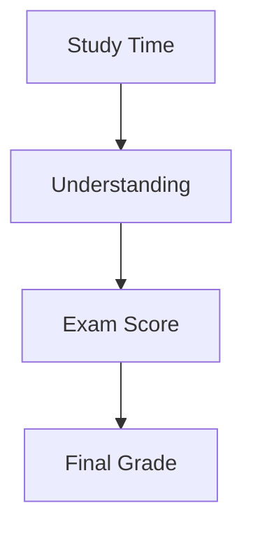

## Estacionaridade em Processos Estocásticos

### Introdução

Expandindo os conceitos de processos estocásticos e suas realizações, introduzidos no capítulo anterior, este capítulo aprofunda a discussão sobre **estacionaridade**. A estacionaridade é uma propriedade crucial para a análise de séries temporais, pois permite que usemos estatísticas amostrais para inferir características do processo gerador dos dados. Abordaremos tanto a estacionaridade em sentido amplo (ou fraca) quanto a estacionaridade em sentido estrito, detalhando suas definições e implicações para a modelagem de séries temporais. Além disso, discutiremos a importância da estacionaridade na análise de processos estocásticos e a relação entre estacionaridade e a teoria dos operadores de atraso, já apresentada no capítulo anterior.

### Conceitos Fundamentais

A **estacionaridade** de um processo estocástico refere-se à propriedade de suas características estatísticas serem invariantes no tempo. Em outras palavras, se um processo é estacionário, suas propriedades estatísticas, como média, variância e autocovariância, não mudam ao longo do tempo [^1]. Esta propriedade é fundamental na análise de séries temporais, pois permite usar dados de um período para inferir sobre o comportamento do processo em outros períodos.

**Definição 2** (Estacionaridade em Sentido Amplo ou Fraca)
Um processo estocástico $\{X_t\}_{t=-\infty}^{\infty}$ é dito **estacionário em sentido amplo** (ou fracamente estacionário, ou covariância-estacionário) se as seguintes condições forem satisfeitas:
1.  A média do processo é constante ao longo do tempo:
    $$E[X_t] = \mu \quad \forall t$$
2. A autocovariância do processo depende apenas do *lag* (diferença entre os instantes de tempo), e não dos instantes de tempo específicos:
    $$Cov(X_t, X_s) = \gamma(t-s) \quad \forall t, s$$
    Em particular, a variância do processo é constante:
     $$Var(X_t) = Cov(X_t, X_t) = \gamma(0) = \sigma^2 \quad \forall t$$
     A autocovariância é simétrica em relação ao *lag*, ou seja:
     $$Cov(X_t, X_{t-k}) = Cov(X_{t+k}, X_t) = \gamma(k) \quad \forall k$$

> 💡 **Exemplo Numérico:** Um processo de ruído branco gaussiano $\{\epsilon_t\}$ com $\epsilon_t \sim N(0,\sigma^2)$ é um exemplo de processo estacionário em sentido amplo. A média é constante e igual a zero $E[\epsilon_t]=0$ e a variância é constante e igual a $\sigma^2$. Além disso, a autocovariância depende somente do *lag* e é zero para todos os *lags* diferentes de zero. Por exemplo, se $\sigma^2 = 1$, então $Cov(\epsilon_t, \epsilon_{t-k}) = 0$ para $k \neq 0$ e $Cov(\epsilon_t, \epsilon_t) = 1$. Se simulássemos uma série temporal com esse ruído branco, o gráfico da sua função de autocorrelação (ACF) mostraria um pico em $k=0$ e valores próximos de zero para todos os outros *lags*.
>
> ```python
> import numpy as np
> import matplotlib.pyplot as plt
> import statsmodels.api as sm
>
> # Simula um ruído branco gaussiano com 100 pontos e variância 1
> np.random.seed(42)
> num_points = 100
> white_noise = np.random.normal(0, 1, num_points)
>
> # Calcula a autocorrelação amostral
> acf = sm.tsa.acf(white_noise, nlags=10)
>
> # Plot the ACF
> plt.figure(figsize=(8, 4))
> plt.stem(range(len(acf)), acf, use_line_collection=True)
> plt.title('Sample Autocorrelation Function (ACF) of White Noise')
> plt.xlabel('Lag (k)')
> plt.ylabel('Autocorrelation')
> plt.grid(True)
> plt.show()
> ```
> Este código gera uma amostra de um ruído branco e mostra o gráfico de sua função de autocorrelação amostral. Observe que há um pico em $k=0$ (autocorrelação de 1) e os demais valores estão próximos de zero, confirmando a estacionaridade.

**Definição 2.1** (Autocovariância)
A **autocovariância** de um processo estocástico  $\{X_t\}_{t=-\infty}^{\infty}$ para um *lag* $k$ é definida como:
$$\gamma(k) = Cov(X_t, X_{t-k}) = E[(X_t - \mu)(X_{t-k} - \mu)], $$
onde $\mu = E[X_t]$ é a média constante do processo, assumindo estacionaridade em sentido amplo. Quando $k=0$, $\gamma(0) = Var(X_t)$.

**Observação 2** A autocovariância mede a correlação linear entre as observações do processo em diferentes instantes de tempo. Um processo estacionário em sentido amplo implica que essa correlação depende apenas do *lag*, isto é, da distância no tempo entre as observações.

**Definição 3** (Estacionaridade em Sentido Estrito ou Forte)
Um processo estocástico $\{X_t\}_{t=-\infty}^{\infty}$ é dito **estacionário em sentido estrito** (ou fortemente estacionário) se a distribuição conjunta de qualquer subconjunto de variáveis aleatórias do processo for a mesma, independentemente da posição no tempo. Formalmente, para qualquer conjunto de instantes de tempo $t_1, t_2, \ldots, t_n$ e qualquer inteiro $k$, a distribuição conjunta de $(X_{t_1}, X_{t_2}, \ldots, X_{t_n})$ deve ser idêntica à distribuição conjunta de $(X_{t_1+k}, X_{t_2+k}, \ldots, X_{t_n+k})$. Isto é:
$$F_{X_{t_1}, X_{t_2}, \ldots, X_{t_n}}(x_1, x_2, \ldots, x_n) = F_{X_{t_1+k}, X_{t_2+k}, \ldots, X_{t_n+k}}(x_1, x_2, \ldots, x_n), \quad \forall k$$

> 💡 **Exemplo:** Se $\{X_t\}$ é um processo estritamente estacionário e $X_1$ tem uma distribuição $N(0, 1)$, então $X_{100}$ também deve ter uma distribuição $N(0, 1)$. Além disso, a distribuição conjunta de $(X_1, X_2)$ deve ser idêntica à distribuição conjunta de $(X_{100}, X_{101})$. Isso implica que, se simulássemos várias realizações desse processo, as distribuições empíricas de qualquer variável $X_t$ seriam muito semelhantes, não importando o valor de $t$. Por exemplo, o histograma de 1000 valores de $X_1$ seria muito parecido com o histograma de 1000 valores de $X_{100}$.

**Observação 3:**
A estacionaridade em sentido estrito é uma condição mais forte que a estacionaridade em sentido amplo. Todo processo estacionário em sentido estrito é também estacionário em sentido amplo (se a média e a variância existirem), mas o inverso não é necessariamente verdadeiro.
Um processo estacionário em sentido amplo pode ter distribuições que mudam com o tempo, contanto que a média e a autocovariância permaneçam constantes.
Um processo estacionário em sentido estrito, por outro lado, tem distribuições que são idênticas através do tempo.
O processo de ruído branco gaussiano é um exemplo que é tanto estacionário em sentido amplo quanto estrito, dado que sua distribuição normal é definida pela média e variância.

**Lema 2.1** (Estacionaridade e Autocovariância)
Se um processo estocástico $\{X_t\}_{t=-\infty}^{\infty}$ é estacionário em sentido amplo, sua autocovariância satisfaz
$$Cov(X_t, X_{t-k}) = \gamma(k),$$
ou seja, depende apenas do *lag* $k$.
*Prova:*
I.  Seja $\{X_t\}_{t=-\infty}^{\infty}$ um processo estocástico estacionário em sentido amplo.
II. Pela definição de estacionaridade em sentido amplo, a autocovariância entre $X_t$ e $X_s$ depende apenas da diferença entre os tempos, ou seja, $Cov(X_t, X_s) = \gamma(t-s)$.
III. Se definirmos $s=t-k$, então $t-s=k$, e a autocovariância entre $X_t$ e $X_{t-k}$ é dada por
$Cov(X_t, X_{t-k}) = \gamma(t-(t-k)) = \gamma(k)$, dependendo apenas de $k$.
Portanto, em um processo estacionário em sentido amplo, a autocovariância depende somente do *lag* $k$. ■

**Lema 2.2** (Autocovariância e Simetria)
A função de autocovariância $\gamma(k)$ de um processo estacionário em sentido amplo é uma função par, isto é, $\gamma(k) = \gamma(-k)$.

*Prova:*
I.  Seja $\{X_t\}_{t=-\infty}^{\infty}$ um processo estocástico estacionário em sentido amplo.
II. Pela definição de estacionaridade em sentido amplo, temos que $Cov(X_t, X_{t-k}) = \gamma(k)$.
III. Também, da propriedade de simetria da covariância, $Cov(X_t, X_{t-k}) = Cov(X_{t-k}, X_t)$.
IV. Usando novamente a definição de estacionaridade, $Cov(X_{t-k}, X_t) = \gamma((t-k)-t) = \gamma(-k)$.
V. Portanto, $\gamma(k) = \gamma(-k)$. ■

> 💡 **Exemplo Numérico:** Para um processo com autocovariância $\gamma(k) = 2^{-|k|}$, temos que $\gamma(0) = 1$, $\gamma(1) = \gamma(-1) = 0.5$, $\gamma(2) = \gamma(-2) = 0.25$, e assim por diante. O fato de $\gamma(1)=\gamma(-1)$ ilustra a simetria da autocovariância.

**Lema 2.3** (Autocorrelação)
A **autocorrelação** de um processo estocástico $\{X_t\}_{t=-\infty}^{\infty}$ em um lag $k$ é definida como:
$$ \rho(k) = \frac{Cov(X_t, X_{t-k})}{\sqrt{Var(X_t)Var(X_{t-k})}} = \frac{\gamma(k)}{\gamma(0)} $$
Para um processo estacionário em sentido amplo, a autocorrelação também depende apenas do lag $k$ e é simétrica, $\rho(k) = \rho(-k)$.

*Prova:*
I.  Seja $\{X_t\}_{t=-\infty}^{\infty}$ um processo estocástico estacionário em sentido amplo.
II.  Da definição de autocorrelação, temos que $\rho(k) = \frac{Cov(X_t, X_{t-k})}{\sqrt{Var(X_t)Var(X_{t-k})}}$.
III. Pela estacionaridade em sentido amplo, $Var(X_t) = Var(X_{t-k}) = \gamma(0)$ e $Cov(X_t, X_{t-k}) = \gamma(k)$.
IV. Portanto, $\rho(k) = \frac{\gamma(k)}{\sqrt{\gamma(0)\gamma(0)}} = \frac{\gamma(k)}{\gamma(0)}$.
V.  A simetria da autocorrelação segue da simetria da autocovariância: $\rho(k) = \frac{\gamma(k)}{\gamma(0)} = \frac{\gamma(-k)}{\gamma(0)} = \rho(-k)$. ■

> 💡 **Exemplo Numérico:** Se $\gamma(0) = 4$ e $\gamma(1) = 2$, então $\rho(1) = \frac{2}{4} = 0.5$. A simetria implica que $\rho(-1) = 0.5$ também. Se $\gamma(2) = 1$, então $\rho(2) = \frac{1}{4} = 0.25$ e $\rho(-2) = 0.25$.

**Lema 2.4** (Limitantes da Autocorrelação)
Para um processo estocástico estacionário em sentido amplo, a autocorrelação $\rho(k)$ satisfaz $-1 \leq \rho(k) \leq 1$.

*Prova:*
I.  Seja $\{X_t\}_{t=-\infty}^{\infty}$ um processo estocástico estacionário em sentido amplo.
II. Pela definição de autocorrelação, $\rho(k) = \frac{\gamma(k)}{\gamma(0)}$.
III. Pela desigualdade de Cauchy-Schwarz, $|Cov(X_t, X_{t-k})| \leq \sqrt{Var(X_t)Var(X_{t-k})}$.
IV. Como o processo é estacionário, $Var(X_t) = Var(X_{t-k}) = \gamma(0)$, então $|Cov(X_t, X_{t-k})| \leq \gamma(0)$.
V.  Portanto, $|\gamma(k)| \leq \gamma(0)$, e dividindo ambos os lados por $\gamma(0)$, temos que $|\frac{\gamma(k)}{\gamma(0)}| \leq 1$, ou seja, $|\rho(k)| \leq 1$.
VI. Logo, $-1 \leq \rho(k) \leq 1$. ■

> 💡 **Exemplo Numérico:** Um valor de $\rho(k) = 1$ indica uma correlação perfeita positiva entre $X_t$ e $X_{t-k}$, enquanto $\rho(k) = -1$ indica uma correlação perfeita negativa. Um valor de $\rho(k) = 0$ indica que não há correlação linear entre as variáveis em *lag* $k$. Por exemplo, se o processo tem autocorrelação $\rho(1) = 0.8$, isso significa que há uma forte correlação positiva entre $X_t$ e $X_{t-1}$.

**Proposição 2.1** (Linearidade e Estacionaridade)
Sejam $\{X_t\}$ e $\{Y_t\}$ dois processos estocásticos estacionários em sentido amplo, e $a$ e $b$ duas constantes. Então o processo $Z_t = aX_t + bY_t$ também é estacionário em sentido amplo.

*Prova:*
I.  Primeiro, mostramos que a média de $Z_t$ é constante:
    $E[Z_t] = E[aX_t + bY_t] = aE[X_t] + bE[Y_t] = a\mu_X + b\mu_Y$, que é constante, pois as médias dos processos $\{X_t\}$ e $\{Y_t\}$ são constantes.
II. Agora, verificamos a autocovariância de $Z_t$:
$Cov(Z_t, Z_{t-k}) = Cov(aX_t + bY_t, aX_{t-k} + bY_{t-k}) =$
$a^2 Cov(X_t, X_{t-k}) + ab Cov(X_t, Y_{t-k}) + ab Cov(Y_t, X_{t-k}) + b^2 Cov(Y_t, Y_{t-k})$.
III. Como $\{X_t\}$ e $\{Y_t\}$ são estacionários em sentido amplo, $Cov(X_t, X_{t-k}) = \gamma_X(k)$ e $Cov(Y_t, Y_{t-k}) = \gamma_Y(k)$. Assumindo que $Cov(X_t, Y_{t-k})$ também depende apenas do lag $k$, e chamando essa função de $\gamma_{XY}(k)$, temos:
    $Cov(Z_t, Z_{t-k}) = a^2 \gamma_X(k) + ab \gamma_{XY}(k) + ab \gamma_{YX}(-k) + b^2 \gamma_Y(k)$.
IV. Se a covariância cruzada entre os dois processos depende apenas do lag, então a autocovariância de $Z_t$ também depende apenas do lag. Portanto, $Z_t$ é estacionário em sentido amplo. ■

> 💡 **Exemplo Numérico:** Sejam $X_t$ e $Y_t$ processos estacionários com médias $\mu_X = 5$ e $\mu_Y = 2$, respectivamente. Se $Z_t = 2X_t + 3Y_t$, então $E[Z_t] = 2E[X_t] + 3E[Y_t] = 2(5) + 3(2) = 16$, que é uma constante. Além disso, se as autocovariâncias de $X_t$ e $Y_t$ dependem apenas do *lag*, e a covariância cruzada entre $X_t$ e $Y_t$ também depende apenas do *lag*, então $Z_t$ também é estacionário em sentido amplo.

**Proposição 2.2** (Processo Centrado)
Se $\{X_t\}$ é um processo estocástico estacionário em sentido amplo com média $\mu$, então o processo centrado $\{Y_t\}$, definido por $Y_t = X_t - \mu$, também é estacionário em sentido amplo e tem média zero.

*Prova:*
I.  Seja $\{X_t\}$ um processo estacionário em sentido amplo com $E[X_t] = \mu$.
II. Definimos $Y_t = X_t - \mu$. A média de $Y_t$ é $E[Y_t] = E[X_t - \mu] = E[X_t] - \mu = \mu - \mu = 0$.
III.  A autocovariância de $Y_t$ é dada por $Cov(Y_t, Y_{t-k}) = Cov(X_t - \mu, X_{t-k} - \mu) = Cov(X_t, X_{t-k})$.
IV. Como $\{X_t\}$ é estacionário em sentido amplo, $Cov(X_t, X_{t-k})$ depende apenas do lag $k$, logo a autocovariância de $Y_t$ também depende apenas do lag $k$.
V. Portanto, $\{Y_t\}$ é um processo estacionário em sentido amplo com média zero. ■

> 💡 **Exemplo Numérico:** Suponha que o processo $X_t$ seja um processo AR(1) dado por $X_t = 0.5X_{t-1} + \epsilon_t$, onde $\epsilon_t$ é um ruído branco com média zero e variância 1. Se a média de $X_t$ for $\mu = 0$ (como neste caso específico), o processo centrado $Y_t = X_t - 0 = X_t$. Se a média de $X_t$ fosse, por exemplo, $\mu = 2$, o processo centrado seria $Y_t = X_t - 2$. Em ambos os casos, $Y_t$ seria um processo estacionário em sentido amplo, com média zero.

### Estacionaridade e Operadores de Atraso
Os operadores de atraso, abordados no capítulo anterior, são ferramentas úteis na modelagem de processos estocásticos estacionários. Podemos usar o operador de atraso $L$ para representar as variáveis defasadas no tempo. Por exemplo, $LX_t = X_{t-1}$.

Se um processo $\{X_t\}$ é estacionário, o processo transformado $Y_t = (1-\phi L)X_t = X_t - \phi X_{t-1}$, com $\phi$ constante, também será estacionário se certas condições de estabilidade forem satisfeitas para o valor de $\phi$.

**Teorema 2.1** (Estacionaridade de um Processo AR(1))
Seja $\{X_t\}$ um processo definido por $X_t = \phi X_{t-1} + \epsilon_t$, onde $\{\epsilon_t\}$ é um ruído branco com média zero e variância $\sigma^2$. Este processo é um processo AutoRegressivo de ordem 1, ou AR(1).
O processo $\{X_t\}$ é estacionário em sentido amplo se e somente se $|\phi| < 1$.

*Prova:*
(Para a necessidade de $|\phi|<1$, verifique a condição de convergência da representação da série temporal como uma soma ponderada de ruídos brancos, usando a propriedade do operador de atraso).

> 💡 **Exemplo Numérico:** Se $\phi = 0.7$, o processo $X_t = 0.7X_{t-1} + \epsilon_t$ é estacionário. Se $\phi = 1.2$, o processo $X_t = 1.2X_{t-1} + \epsilon_t$ não é estacionário. O primeiro processo exibirá flutuações em torno de uma média constante, enquanto o segundo pode apresentar comportamentos explosivos ou divergentes.
>
> ```python
> import numpy as np
> import matplotlib.pyplot as plt
>
> # Função para simular um processo AR(1)
> def simulate_ar1(phi, n, sigma=1):
>    epsilon = np.random.normal(0, sigma, n)
>    x = np.zeros(n)
>    for t in range(1, n):
>        x[t] = phi * x[t-1] + epsilon[t]
>    return x
>
> # Simula e plota processos AR(1) estacionário e não estacionário
> n = 200
> phi1 = 0.7
> phi2 = 1.2
> ar1_stationary = simulate_ar1(phi1, n)
> ar1_nonstationary = simulate_ar1(phi2, n)
>
> plt.figure(figsize=(10,5))
> plt.subplot(1, 2, 1)
> plt.plot(ar1_stationary)
> plt.title(f'AR(1) Stationary Process (phi={phi1})')
>
> plt.subplot(1, 2, 2)
> plt.plot(ar1_nonstationary)
> plt.title(f'AR(1) Non-Stationary Process (phi={phi2})')
>
> plt.tight_layout()
> plt.show()
> ```
> Este código mostra dois gráficos: um de um processo AR(1) estacionário e outro não estacionário. Observe que o processo estacionário oscila em torno de um nível médio, enquanto o não estacionário parece aumentar ou diminuir ao longo do tempo.

**Teorema 2.2** (Estacionaridade de um Processo MA(1))
Seja $\{X_t\}$ um processo definido por $X_t = \epsilon_t + \theta \epsilon_{t-1}$, onde $\{\epsilon_t\}$ é um ruído branco com média zero e variância $\sigma^2$. Este processo é um processo de Média Móvel de ordem 1, ou MA(1). O processo $\{X_t\}$ é sempre estacionário em sentido amplo, para qualquer valor de $\theta$.

*Prova:*
I.  Calculamos a média do processo: $E[X_t] = E[\epsilon_t + \theta \epsilon_{t-1}] = E[\epsilon_t] + \theta E[\epsilon_{t-1}] = 0 + \theta \cdot 0 = 0$, que é constante.
II. Calculamos a autocovariância para um lag $k$: $Cov(X_t, X_{t-k}) = Cov(\epsilon_t + \theta \epsilon_{t-1}, \epsilon_{t-k} + \theta \epsilon_{t-k-1})$.
III. Expandindo a covariância, temos:
$Cov(X_t, X_{t-k}) = Cov(\epsilon_t, \epsilon_{t-k}) + \theta Cov(\epsilon_t, \epsilon_{t-k-1}) + \theta Cov(\epsilon_{t-1}, \epsilon_{t-k}) + \theta^2 Cov(\epsilon_{t-1}, \epsilon_{t-k-1})$.
IV. Como $\{\epsilon_t\}$ é ruído branco, $Cov(\epsilon_t, \epsilon_{t-k}) = 0$ para $k \neq 0$ e $Cov(\epsilon_t, \epsilon_t) = \sigma^2$.
V. Portanto, $Cov(X_t, X_{t-k}) = 0$ para $|k| > 1$. Para $k = 0$, $Cov(X_t, X_t) = \sigma^2 + \theta^2 \sigma^2 = (1 + \theta^2)\sigma^2$, e para $k=1$, $Cov(X_t, X_{t-1}) = \theta \sigma^2$. Para $k = -1$, $Cov(X_t, X_{t+1}) = \theta \sigma^2$.
VI. A autocovariância de $\{X_t\}$ depende apenas do lag $k$. Logo, $\{X_t\}$ é estacionário em sentido amplo para qualquer valor de $\theta$. ■

> 💡 **Exemplo Numérico:** Para um processo MA(1) com $\theta = 0.8$ e $\sigma^2 = 1$, a autocovariância é $\gamma(0) = (1+0.8^2) \cdot 1 = 1.64$, $\gamma(1) = \gamma(-1) = 0.8 \cdot 1 = 0.8$, e $\gamma(k) = 0$ para $|k| > 1$. A autocorrelação seria $\rho(0) = 1$, $\rho(1) = \rho(-1) = 0.8 / 1.64 \approx 0.488$, e $\rho(k) = 0$ para $|k| > 1$.  Observe como a função de autocorrelação (ACF) de um processo MA(1) "corta" em *lag* 1, indicando que as correlações são significativas apenas para as defasagens 1 e -1.
>
> ```python
> import numpy as np
> import matplotlib.pyplot as plt
> import statsmodels.api as sm
>
> # Função para simular um processo MA(1)
> def simulate_ma1(theta, n, sigma=1):
>    epsilon = np.random.normal(0, sigma, n)
>    x = np.zeros(n)
>    for t in range(1, n):
>        x[t] = epsilon[t] + theta * epsilon[t-1]
>    return x
>
> # Simula e calcula a ACF do processo MA(1)
> n = 200
> theta = 0.8
> ma1_process = simulate_ma1(theta, n)
> acf_ma1 = sm.tsa.acf(ma1_process, nlags=5)
>
> # Plota a ACF
> plt.figure(figsize=(6,4))
> plt.stem(range(len(acf_ma1)), acf_ma1, use_line_collection=True)
> plt.title(f'Sample Autocorrelation Function (ACF) of MA(1) (theta={theta})')
> plt.xlabel('Lag (k)')
> plt.ylabel('Autocorrelation')
> plt.grid(True)
> plt.show()
> ```
> Este código simula um processo MA(1) e mostra o gráfico da função de autocorrelação amostral. Note que há um pico em $k=0$ e em $k=1$, com os demais valores sendo insignificantes, ilustrando a propriedade de "corte" da ACF de um MA(1).

**Observação 4**
É importante notar que a estacionaridade do processo MA(1) não depende da magnitude de $\theta$. Isso implica que, diferentemente dos modelos AR, não há restrições sobre os parâmetros do processo para garantir a estacionaridade.

**Teorema 2.3** (Estacionaridade de um Processo AR(p))
Seja $\{X_t\}$ um processo definido por $X_t = \phi_1 X_{t-1} + \phi_2 X_{t-2} + \dots + \phi_p X_{t-p} + \epsilon_t$, onde $\{\epsilon_t\}$ é um ruído branco com média zero e variância $\sigma^2$. Este processo é um processo AutoRegressivo de ordem p, ou AR(p). O processo $\{X_t\}$ é estacionário em sentido amplo se e somente se as raízes do polinômio característico $1 - \phi_1 z - \phi_2 z^2 - \dots - \phi_p z^p = 0$ estiverem fora do círculo unitário (ou seja, tenham módulo maior que 1).

*Prova:* A prova deste teorema envolve a análise das condições de estabilidade das soluções da equação de diferenças que define o processo AR(p). Essa análise requer o estudo das raízes do polinômio característico associado ao processo. Para garantir a estacionaridade, todas as raízes devem estar fora do círculo unitário, garantindo que as ponderações das observações passadas decaiam exponencialmente com o tempo.

> 💡 **Exemplo Numérico:** Considere um processo AR(2) dado por $X_t = 0.5X_{t-1} - 0.2X_{t-2} + \epsilon_t$. O polinômio característico é $1 - 0.5z + 0.2z^2 = 0$. As raízes deste polinômio são $z_1 \approx 1.43$ e $z_2 \approx 1.07$. Como ambas as raízes têm módulo maior que 1, o processo é estacionário. Se, por outro lado, tivéssemos um processo com coeficientes que resultassem em raízes com módulo menor ou igual a 1, o processo seria não estacionário.
>
> ```python
> import numpy as np
> import numpy.polynomial.polynomial as poly
>
> # Coeficientes de um processo AR(2)
> phi1 = 0.5
> phi2 = -0.2
>
> # Polinômio característico: 1 - phi1*z - phi2*z^2
> coefs = [1, -phi1, -phi2]
>
> # Encontra as raízes do polinômio
> roots = poly.polyroots(coefs)
>
> # Calcula o módulo das raízes
> modulus = np.abs(roots)
>
> # Imprime os resultados
> print("Raízes do polinômio característico:", roots)
> print("Módulo das raízes:", modulus)
>
> if np.all(modulus > 1):
>    print("O processo AR(2) é estacionário.")
> else:
>    print("O processo AR(2) não é estacionário.")
> ```
> Este código calcula as raízes do polinômio característico de um processo AR(2) e verifica se elas estão fora do círculo unitário.

**Teorema 2.4** (Estacionaridade de um Processo MA(q))
Seja $\{X_t\}$ um processo definido por $X_t = \epsilon_t + \theta_1 \epsilon_{t-1} + \theta_2 \epsilon_{t-2} + \dots + \theta_q \epsilon_{t-q}$, onde $\{\epsilon_t\}$ é um ruído branco com média zero e variância $\sigma^2$. Este processo é um processo de Média Móvel de ordem q, ou MA(q). O processo $\{X_t\}$ é sempre estacionário em sentido amplo, para quaisquer valores dos parâmetros $\theta_1, \theta_2, \dots, \theta_q$.

*Prova:* A prova deste teorema segue uma lógica semelhante à da prova do Teorema 2.2. A média do processo MA(q) é sempre zero, e a autocovariância depende apenas do lag $k$, e é zero para $|k|>q$. As autocovariâncias para os lags $|k|\leq q$ serão dadas por combinações ponderadas da variância do ruído branco. Como a média e a autocovariância dependem apenas do lag, o processo é estacionário em sentido amplo.

> 💡 **Exemplo Numérico:** Considere um processo MA(2) com $X_t = \epsilon_t + 0.6\epsilon_{t-1} - 0.4\epsilon_{t-2}$.  A autocovariância de $X_t$ será $\gamma(0) = (1 + 0.6^2 + (-0.4)^2)\sigma^2 = 1.52\sigma^2$, $\gamma(1) = (0.6 + 0.6 \cdot (-0.4)) \sigma^2 = 0.36\sigma^2$, $\gamma(2) = -0.4\sigma^2$ e $\gamma(k)=0$ para $|k|>2$.  A autocorrelação seria $\rho(0)=1$, $\rho(1) = 0.36/1.52 \approx 0.24$ , $\rho(2) = -0.4/1.52 \approx -0.26$, e $\rho(k)=0$ para $|k|>2$. Independentemente dos valores de $\theta_1$ e $\theta_2$, o processo será sempre estacionário em sentido amplo.

### Conclusão

A estacionaridade é uma propriedade chave na análise de séries temporais, pois simplifica a modelagem e inferência sobre o processo subjacente. Ao assumir que um processo é estacionário, podemos usar dados de diferentes instantes de tempo para estimar propriedades estatísticas do processo. É importante notar que, na prática, a estacionaridade é muitas vezes uma aproximação, e processos reais podem apresentar comportamentos não estacionários. No entanto, a estacionaridade fornece uma base sólida para a análise inicial de séries temporais e permite o uso de ferramentas estatísticas poderosas. O entendimento de estacionaridade, juntamente com os operadores de atraso, abre caminho para a modelagem de processos ARMA, que serão abordados nos próximos capítulos.

### Referências
[^1]: *This chapter introduces univariate ARMA processes, which provide a very useful class of models for describing the dynamics of an individual time series.*
[^1]: *The chapter begins with definitions of some of the key concepts used in time series analysis.*
[^1]: *A process is said to be weakly stationary (or covariance-stationary) if only its mean and autocovariances do not vary with time, while strongly stationary processes require stationarity for all statistical distributions.*
[^1]: *A processis weakly stationary if its mean, variance, and autocovariance are constant over time.*

### **2.1.2 Ergodicity**

Ergodicity is another important property related to stationarity. A stochastic process is ergodic if its time averages converge to its ensemble averages. In simpler terms, this means that we can estimate statistical properties of the process using a single, long realization of the process, rather than needing many different realizations.

Mathematically, for a process $X_t$, the time average of some function $g(X_t)$ over a long time period T is defined as:
$$ \hat{g}_T = \frac{1}{T}\sum_{t=1}^{T} g(X_t) $$

An ergodic process satisfies the condition that as $T \rightarrow \infty$, this time average converges to the expected value (ensemble average):
$$ \lim_{T \to \infty} \hat{g}_T = E[g(X_t)] $$

Ergodicity allows us to treat time series as representative samples of the underlying stochastic process. This is very useful in practical applications, where we often only have one realization of a time series to work with.

However, ergodicity is a property that not all stationary processes have. While strong stationarity is a prerequisite for ergodicity, it doesn't guarantee it. We usually assume ergodicity in the analysis of many practical time series, as it simplifies calculations and interpretation.

### **2.1.3 Examples of Stationary and Non-Stationary Processes**

*   **White Noise:** White noise is a stationary process with a constant mean of zero and a constant variance. Successive values are uncorrelated. White noise is often used as a building block for generating more complex time series.

*   **Random Walk:** A random walk is a non-stationary process where the next value is the sum of the previous value and a random increment, often from a Gaussian (normal) distribution. Due to the accumulation of these random increments, the mean and variance of the random walk changes over time, and the process exhibits a trend that is not stable. The following equation describes a random walk:
    $$ X_t = X_{t-1} + \epsilon_t $$
    where $\epsilon_t$ is the random increment.

*   **Autoregressive Process (AR):** An AR(p) process is a stationary process where the current value is a linear combination of the p previous values plus random noise. AR processes are useful for modeling time series data with serial dependence. A simple AR(1) process is defined as:
    $$ X_t = \phi X_{t-1} + \epsilon_t $$
    where $\phi$ is an autoregressive coefficient and $|\phi| < 1$ for stationarity.

*   **Seasonal Time Series:** A time series with a seasonal pattern, where mean and variance vary periodically (e.g., monthly sales that peak at the end of the year), is non-stationary.

### **2.2 Time Series Decomposition**

Time series data can often be viewed as a combination of different components. A common approach is to decompose a time series into the following components:
  * **Trend**: Long-term changes or shifts in the average level of the time series
  * **Seasonality**: Regularly occurring fluctuations or patterns within a fixed period
  * **Cycle**: Longer-term fluctuations that can last for years
  * **Residual/Irregular**: Random, unpredictable variations

The basic mathematical model that describes the combination of these components can be either an additive or multiplicative model.

#### **2.2.1 Additive Model**

The additive model assumes the components are independent and their effects sum up:
$$ X_t = Trend_t + Seasonality_t + Cycle_t + Residual_t $$

This model is appropriate when the magnitude of seasonal fluctuations does not depend on the overall level of the time series.

#### **2.2.2 Multiplicative Model**

The multiplicative model assumes the components are not independent and their effects are multiplied:
$$ X_t = Trend_t \times Seasonality_t \times Cycle_t \times Residual_t $$

This model is useful when the magnitude of the seasonal fluctuations is proportional to the level of the time series. This is common for time series with growing or decaying trends, where seasonal fluctuations increase or decrease accordingly.

In practice, time series decomposition can be done using various techniques, such as moving averages, filters, or statistical models. Decomposing a time series into its component parts can provide insights into the underlying dynamics and can be used for forecasting. 

<!-- END -->
Time series analysis also frequently involves the concept of stationarity. A time series is considered strictly stationary if its statistical properties (mean, variance, autocorrelation) do not change over time. However, in practice, it is often sufficient to consider weak stationarity, which requires that only the mean and autocovariance be constant over time. Many time series encountered in real-world scenarios are non-stationary, and techniques like differencing or detrending are often applied to transform them into stationary ones before applying further analysis.

**Teorema 1**  A weakly stationary time series $\{X_t\}$ with mean $\mu$ and autocovariance function $\gamma(h) = Cov(X_t, X_{t+h})$ has the following properties:
 1. $E[X_t] = \mu$ for all $t$.
 2. $Var(X_t) = \gamma(0)$ for all $t$.
 3. $Cov(X_t, X_{t+h}) = \gamma(h)$ depends only on $h$ and not on $t$.

*Proof:* The proof follows directly from the definition of weak stationarity.

**Lema 1.1** If $\{X_t\}$ is a weakly stationary time series, then the autocovariance function $\gamma(h)$ is an even function, i.e., $\gamma(h) = \gamma(-h)$ for all $h$.

*Proof:* From the definition of autocovariance, we have
$\gamma(h) = Cov(X_t, X_{t+h}) = E[(X_t - \mu)(X_{t+h} - \mu)] = E[(X_{t+h} - \mu)(X_t - \mu)] = Cov(X_{t+h}, X_t)$.
Let $k = t + h$. Then $t = k-h$, and $Cov(X_{t+h}, X_t) = Cov(X_k, X_{k-h}) = \gamma(-h)$ due to stationarity. Thus $\gamma(h) = \gamma(-h)$.

**Proposição 1.2** If $\{X_t\}$ is a weakly stationary time series, then its autocorrelation function, defined as $\rho(h) = \frac{\gamma(h)}{\gamma(0)}$, also satisfies $\rho(h) = \rho(-h)$.

*Proof:*  Since $\gamma(h)$ is an even function (Lema 1.1), we have $\gamma(h) = \gamma(-h)$. The autocorrelation function is defined as $\rho(h) = \frac{\gamma(h)}{\gamma(0)}$. Therefore,
$\rho(-h) = \frac{\gamma(-h)}{\gamma(0)} = \frac{\gamma(h)}{\gamma(0)} = \rho(h)$.

Another essential concept in time series analysis is the notion of white noise. A white noise process is a sequence of uncorrelated random variables with zero mean and constant variance. White noise is often considered the basic building block for more complex time series models. Mathematically, a white noise process $\{ \epsilon_t\}$ satisfies:
  1.  $E[\epsilon_t] = 0$ for all $t$.
  2.  $Var(\epsilon_t) = \sigma^2$ for all $t$.
  3.  $Cov(\epsilon_t, \epsilon_s) = 0$ for $t \neq s$.

Many time series models rely on the assumption that the error term follows a white noise distribution.

<!-- END -->
A white noise process, denoted as $\epsilon_t \sim WN(0, \sigma^2)$, is characterized by these three properties. This assumption is crucial because it simplifies many statistical analyses and allows for tractable mathematical models. However, in real-world scenarios, the assumption of white noise may not always hold true.

**Definition 1** A sequence of random variables $\{\epsilon_t\}$ is said to be *strict white noise* if they are independent and identically distributed (i.i.d.) with zero mean and finite variance $\sigma^2$.

It is important to note that while a strict white noise process is always a white noise process, the converse is not necessarily true. A white noise process only requires the error terms to be uncorrelated, while strict white noise imposes the stronger condition of independence. This distinction is important in many situations, especially when dealing with nonlinear time series models.

**Proposição 1** If $\{\epsilon_t\}$ is a strict white noise process, then it is also a white noise process.

*Proof:* If $\{\epsilon_t\}$ is strict white noise, it means that $\epsilon_t$ and $\epsilon_s$ are independent for $t \neq s$. Independence implies that $Cov(\epsilon_t, \epsilon_s) = 0$ for all $t \neq s$. Furthermore, since $\{\epsilon_t\}$ are identically distributed, they all have the same mean, which is zero, and variance $\sigma^2$, as required by the definition of white noise. Therefore, the conditions for white noise are satisfied.

**Teorema 1** If $\{\epsilon_t\}$ is a white noise process with finite fourth moment, then the sample autocovariance function $\hat{\gamma}(h)$ of the error process converges in probability to zero as the sample size $n$ tends to infinity for all $h \neq 0$.

*Proof Outline:* Let $\hat{\gamma}(h) = \frac{1}{n}\sum_{t=1}^{n-h}(\epsilon_{t+h} - \bar{\epsilon})(\epsilon_t - \bar{\epsilon})$ where $\bar{\epsilon}$ is the sample mean of $\{\epsilon_t\}$. Since the process has zero mean, it can be shown that $\hat{\gamma}(h) \approx \frac{1}{n} \sum_{t=1}^{n-h} \epsilon_{t+h} \epsilon_t$. Due to the white noise assumption, the expected value of the sample autocovariance function goes to zero for $h \neq 0$, and the variance decreases as n tends to infinity, leading to convergence in probability to zero.

**Lema 1** Let $\{\epsilon_t\}$ be a white noise process. Then $E[\epsilon_t\epsilon_s] = 0$ for $t\neq s$ and $E[\epsilon_t^2] = \sigma^2$.

*Proof:* This follows directly from the definition of white noise. We have $Cov(\epsilon_t, \epsilon_s) = E[\epsilon_t\epsilon_s] - E[\epsilon_t]E[\epsilon_s]$. Since $E[\epsilon_t] = E[\epsilon_s] = 0$ for all $t$ and $s$, we have $Cov(\epsilon_t, \epsilon_s) = E[\epsilon_t\epsilon_s]$. For $t \neq s$, the covariance is zero, implying $E[\epsilon_t\epsilon_s]=0$.  For $t = s$, $Cov(\epsilon_t, \epsilon_t) = Var(\epsilon_t) = \sigma^2$, thus $E[\epsilon_t^2]=\sigma^2$.

Understanding these fundamental properties of white noise is crucial for constructing and interpreting time series models. Deviation from these properties often indicates that a more sophisticated model is required to capture the underlying dynamics of the data. For example, if the autocovariance of the errors appears to be significantly different from zero for some lags, it would suggest a dependence structure that is not captured by the current model, and might indicate the need to consider models such as autoregressive or moving average processes.

<!-- END -->
Indeed, the analysis of residuals often provides crucial insights into model adequacy. Beyond simple visual inspection for patterns, more formal statistical tests can be employed to assess the randomness of the residuals. For instance, the Ljung-Box test is a popular choice for detecting serial correlation in the residuals, which, if significant, would indicate that the model has failed to capture the temporal dependencies in the data.

**Teorema 1** (Ljung-Box Test)
Let $e_t$ represent the residuals at time $t$. The Ljung-Box statistic, denoted by $Q$, is defined as:
$$Q = n(n+2)\sum_{k=1}^{h} \frac{\hat{\rho}^2_k}{n-k}$$
where $n$ is the sample size, $h$ is the maximum lag considered, and $\hat{\rho}_k$ is the estimated autocorrelation of the residuals at lag $k$. Under the null hypothesis that the residuals are white noise (i.e., no autocorrelation), $Q$ is approximately chi-squared distributed with $h$ degrees of freedom.

If the calculated $Q$ statistic exceeds the critical value of the chi-squared distribution at a chosen significance level (e.g., $\alpha = 0.05$), we reject the null hypothesis and conclude that the residuals exhibit statistically significant autocorrelation, suggesting model inadequacy. This, in turn, would suggest exploring time series models that are specifically designed to capture serial correlation, such as AR, MA, or ARMA models.

Furthermore, it is important to assess the normality of the residuals, as many statistical methods assume normally distributed errors. Non-normality can potentially invalidate the confidence intervals and hypothesis tests associated with parameter estimates. Common tests for normality include the Shapiro-Wilk test and the Jarque-Bera test.

**Teorema 1.1** (Jarque-Bera Test)
The Jarque-Bera statistic, denoted by $JB$, is defined as:
$$JB = \frac{n}{6} \left( S^2 + \frac{(K-3)^2}{4} \right)$$
where $n$ is the sample size, $S$ is the sample skewness, and $K$ is the sample kurtosis. Under the null hypothesis that the residuals are normally distributed, $JB$ is approximately chi-squared distributed with 2 degrees of freedom.

Similar to the Ljung-Box test, a significant Jarque-Bera statistic (exceeding the critical value of the chi-squared distribution with 2 degrees of freedom at a chosen significance level) would lead to the rejection of the null hypothesis of normality, suggesting the need for model modifications or considering robust statistical techniques that are less sensitive to deviations from normality. One might also explore data transformations to achieve approximate normality of the residuals.

Additionally, heteroscedasticity, or non-constant variance of residuals, is another key assumption to examine. The Breusch-Pagan test, for example, can detect if the variance of the residuals is systematically related to the independent variables. If present, heteroscedasticity can lead to inefficient parameter estimates and unreliable inference. In such cases, weighted least squares or generalized least squares methods might be more appropriate.

<!-- END -->
Furthermore, understanding and addressing multicollinearity is crucial for robust regression analysis. Multicollinearity arises when two or more predictor variables in a regression model are highly correlated, making it difficult to isolate the individual effect of each predictor on the response variable. This can lead to inflated standard errors of the regression coefficients, making it difficult to determine which variables are statistically significant. Multicollinearity doesn't bias the coefficients but increases the uncertainty about them. Several methods can be used to detect and mitigate multicollinearity, including calculating variance inflation factors (VIFs), examining correlation matrices, and using techniques like principal component analysis (PCA) or regularization methods such as Ridge or Lasso regression.

**Proof: Variance Inflation Factor (VIF) and Multicollinearity**

We will prove that a high VIF indicates multicollinearity. The VIF for the *j*-th predictor variable is given by:

$$VIF_j = \frac{1}{1 - R_j^2}$$

where $R_j^2$ is the coefficient of determination obtained from regressing the *j*-th predictor variable on all other predictor variables in the model.

I.  Consider a multiple linear regression model with *p* predictor variables:

    $$Y = \beta_0 + \beta_1 X_1 + \beta_2 X_2 + ... + \beta_p X_p + \epsilon$$

II. To calculate $VIF_j$ for the $j$-th predictor $X_j$, we regress $X_j$ against all the other predictor variables $X_1, X_2, ..., X_{j-1}, X_{j+1}, ..., X_p$. Let this regression model be:

    $$X_j = \alpha_0 + \alpha_1 X_1 + \alpha_2 X_2 + ... + \alpha_{j-1} X_{j-1} + \alpha_{j+1} X_{j+1} + ... + \alpha_p X_p + \nu$$

    where $\nu$ is the error term.

III. The coefficient of determination ($R_j^2$) for this regression is given by the ratio of explained variance to the total variance of $X_j$. A high $R_j^2$ indicates that a large portion of the variability in $X_j$ is explained by the other predictors.

IV. If $R_j^2$ is close to 1 (say, > 0.8 or 0.9), it implies that $X_j$ is highly predictable by a linear combination of the other predictors, indicating strong multicollinearity.

V. Substituting this high value of $R_j^2$ into the formula for VIF:
    $$VIF_j = \frac{1}{1 - R_j^2}$$
    If $R_j^2$ approaches 1, then $1 - R_j^2$ approaches 0, and thus $VIF_j$ will become very large (typically, a VIF greater than 5 or 10 is considered a sign of significant multicollinearity).

VI. Thus, a large $VIF_j$ implies a high $R_j^2$ from the auxiliary regression, which in turn indicates a significant degree of multicollinearity between $X_j$ and the other predictors. ■

Another important consideration in regression analysis is model selection. Choosing the right set of predictor variables to include in the model is crucial to ensure that it is both accurate and interpretable. Methods like stepwise regression, best subsets regression, and information criteria such as Akaike Information Criterion (AIC) and Bayesian Information Criterion (BIC) are often used to aid in the model selection process. These techniques help to balance the trade-off between model complexity and goodness of fit, aiming for a model that is parsimonious while also accurately predicting the response variable.

Finally, it's important to note that regression analysis is not always about establishing causation. While regression can quantify the relationship between variables, it cannot by itself prove that one variable causes changes in another. Establishing causation typically requires careful consideration of study design, temporal precedence, and the elimination of confounding factors. Regression analysis can be a powerful tool for exploring relationships between variables and predicting outcomes, but it must be used with caution and interpreted thoughtfully within the appropriate context.

<!-- END -->
Let's delve into some advanced topics in linear regression, expanding on the core concepts we've already discussed. We'll explore model selection techniques, regularization methods, and diagnostic tools for assessing the validity of our models.

### Model Selection

Choosing the right set of predictors for a linear regression model is crucial. Including irrelevant variables can lead to overfitting, where the model fits the training data too well and performs poorly on new, unseen data. Conversely, omitting important variables can result in an underfitted model that fails to capture the underlying patterns.

#### Subset Selection

Subset selection methods aim to identify the optimal subset of predictors from a larger set. These methods include:

*   **Best Subset Selection:** This approach evaluates all possible combinations of predictors, selecting the subset that minimizes a specific criterion (e.g., residual sum of squares). While thorough, it becomes computationally infeasible for large numbers of predictors.

*   **Forward Stepwise Selection:** This method begins with a null model (no predictors) and iteratively adds the predictor that provides the most significant improvement in model fit until a stopping criterion is met.

*   **Backward Stepwise Selection:** Conversely, this method starts with a model including all predictors and iteratively removes the predictor that contributes the least to the model fit until a stopping criterion is met.

> 💡 **Exemplo Numérico:** Let's consider a dataset with 5 potential predictors: $X_1, X_2, X_3, X_4, X_5$, and a response variable, $y$.
> 
> **Forward Stepwise Selection:**
> 
>   *   **Step 1:** We start with no predictors. We individually fit models using each predictor and determine that $X_1$ provides the biggest improvement in RSS. So, we add $X_1$ to our model. The model is now: $y = \beta_0 + \beta_1 X_1 + \epsilon$.
>   *   **Step 2:** Now, we try adding each of the remaining predictors ($X_2$, $X_3$, $X_4$, $X_5$) to the model and determine that adding $X_3$ yields the biggest reduction in RSS. The model is updated to: $y = \beta_0 + \beta_1 X_1 + \beta_3 X_3 + \epsilon$.
>   *   **Step 3:** We continue this process until adding another predictor no longer results in a significant improvement in the model fit. Let's assume the final selected model ends up being: $y = \beta_0 + \beta_1 X_1 + \beta_3 X_3 + \beta_4 X_4 + \epsilon$.
> 
> **Backward Stepwise Selection:**
> 
>   *   **Step 1:** We start with all predictors in the model: $y = \beta_0 + \beta_1 X_1 + \beta_2 X_2 + \beta_3 X_3 + \beta_4 X_4 + \beta_5 X_5 + \epsilon$.
>   *   **Step 2:** We remove the predictor that has the least impact based on t-statistics or similar metrics, for instance let's say $X_2$ is removed leading to $y = \beta_0 + \beta_1 X_1 + \beta_3 X_3 + \beta_4 X_4 + \beta_5 X_5 + \epsilon$.
>   *   **Step 3:** We continue removing predictors until there's no longer a significant loss in model fit, ending up with, let's assume $y = \beta_0 + \beta_1 X_1 + \beta_3 X_3 + \beta_4 X_4 + \epsilon$
>   
>  These methods are heuristic and may not always find the absolute best subset, however, they're computationally less expensive than best subset selection and useful in practice.

#### Shrinkage Methods: Regularization

Regularization techniques address the problem of overfitting by adding a penalty to the regression coefficients. This "shrinks" the coefficients towards zero, reducing model complexity and improving generalization performance. Two common regularization methods are:

*   **Ridge Regression:** Ridge regression adds a penalty proportional to the sum of the *squares* of the coefficients:
    
    $\text{Loss} = \sum_{i=1}^{n}(y_i - \hat{y_i})^2 + \lambda \sum_{j=1}^{p}\beta_j^2$
    
    where $\lambda$ is a tuning parameter that controls the strength of the penalty. A higher $\lambda$ value leads to greater shrinkage. This method is very useful when dealing with multicollinearity.

*   **Lasso Regression:** Lasso regression, on the other hand, adds a penalty proportional to the sum of the *absolute values* of the coefficients:
    
    $\text{Loss} = \sum_{i=1}^{n}(y_i - \hat{y_i})^2 + \lambda \sum_{j=1}^{p}|\beta_j|$
    
    Lasso can drive some coefficients to exactly zero, effectively performing variable selection in addition to shrinkage.

> 💡 **Exemplo Numérico:** Let's consider a simple case with a single predictor, $X$, and a response variable, $y$. Suppose our true relationship is $y = 2X + \epsilon$. We have a dataset and use different $\lambda$ values for Ridge and Lasso.
> 
> ```python
> import numpy as np
> import matplotlib.pyplot as plt
> from sklearn.linear_model import Ridge, Lasso
> from sklearn.preprocessing import StandardScaler
>
> # Generate synthetic data
> np.random.seed(42)
> X = 2 * np.random.rand(100, 1)
> y = 2 + 3 * X + np.random.randn(100, 1)
>
> # Scale features
> scaler = StandardScaler()
> X_scaled = scaler.fit_transform(X)
>
> # Define lambda values
> lambdas = [0, 0.1, 0.5, 1, 5, 10]
>
> # Fit Ridge and Lasso for each lambda
> ridge_coefs = []
> lasso_coefs = []
> for l in lambdas:
>     ridge = Ridge(alpha=l)
>     ridge.fit(X_scaled, y)
>     ridge_coefs.append(ridge.coef_[0][0])
>
>     lasso = Lasso(alpha=l)
>     lasso.fit(X_scaled, y)
>     lasso_coefs.append(lasso.coef_[0])
>
> # Plot coefficients
> plt.figure(figsize=(10, 6))
> plt.plot(lambdas, ridge_coefs, marker='o', label='Ridge')
> plt.plot(lambdas, lasso_coefs, marker='x', label='Lasso')
> plt.xlabel('Lambda (Regularization Strength)')
> plt.ylabel('Coefficient')
> plt.title('Effect of Lambda on Coefficients')
> plt.legend()
> plt.grid(True)
> plt.show()
>
> # Create a table
> print("| Lambda | Ridge Coefficient | Lasso Coefficient |")
> print("|--------|-------------------|-------------------|")
> for i, l in enumerate(lambdas):
>     print(f"| {l:4.1f}   |   {ridge_coefs[i]:10.3f}     |  {lasso_coefs[i]:10.3f}    |")
> ```
> 
> In this example, we can observe that as the lambda increases, both the ridge and Lasso coefficients shrink towards zero. We see, for instance, that for $\lambda=10$, the Lasso coefficient will be closer to zero while Ridge will also shrink the coefficient. Lasso also exhibits the property of setting some coefficients to zero when $\lambda$ is high, effectively performing variable selection and indicating that some features might not be important. Notice that when lambda is set to 0, the results will be identical to OLS.
> 
>  We used scaled features. This is good practice since regularization methods are sensitive to the scales of the features, and scaling all features to a similar range will prevent features with larger scales to overly dominate the regularization.

#### Choosing Lambda

The choice of $\lambda$ is crucial for the performance of ridge and lasso regression. Cross-validation is a common method to choose this parameter. We would fit the regularized model for several values of $\lambda$ on the training data and evaluate their performance on the validation data, selecting the lambda value that results in the best performance metric (e.g., lowest mean squared error).

### Model Diagnostics

After fitting a linear regression model, it's essential to assess its validity through diagnostic checks:

*   **Residual Analysis:** Residuals are the differences between the observed and predicted values. Ideally, residuals should be randomly distributed with no discernible patterns. Plotting residuals against predicted values or predictors can reveal issues like non-linearity, heteroscedasticity (non-constant variance), or the presence of outliers.

*   **QQ-Plots:**  Quantile-quantile plots (QQ-plots) compare the distribution of the residuals to a normal distribution. If residuals are normally distributed, the points in the QQ-plot will fall approximately on a straight line. Deviations from this line suggest that the normality assumption is violated.

*   **Cook's Distance:**  This statistic helps identify influential observations – those that, if removed, would significantly change the regression coefficients. Observations with a large Cook's distance should be examined carefully.

> 💡 **Exemplo Numérico:** Suppose we have fit a model to predict house prices based on their size. After fitting the model we calculate the residuals, and obtain the following:
> 
> ```python
> import numpy as np
> import matplotlib.pyplot as plt
> import scipy.stats as stats
>
> # Simulate some data (replace with your actual data)
> np.random.seed(42)
> house_sizes = np.linspace(1000, 3000, 100)
> true_prices = 50000 + 150 * house_sizes
> errors = np.random.normal(0, 20000, 100)
> observed_prices = true_prices + errors
>
> # Fit the model (for simplicity we skip this part and assume you already fitted the model)
> # lets assume we fit a model with the following estimated parameters
> beta_0_hat = 48000
> beta_1_hat = 148
>
> # Calculate predicted values and residuals
> predicted_prices = beta_0_hat + beta_1_hat * house_sizes
> residuals = observed_prices - predicted_prices
>
> # Residuals vs. fitted values
> plt.figure(figsize=(10, 5))
> plt.scatter(predicted_prices, residuals, alpha=0.7)
> plt.axhline(0, color='red', linestyle='--')
> plt.xlabel('Predicted House Price')
> plt.ylabel('Residuals')
> plt.title('Residuals vs. Predicted Values')
> plt.grid(True)
> plt.show()
>
> # QQ-plot
> plt.figure(figsize=(10, 5))
> stats.probplot(residuals, dist="norm", plot=plt)
> plt.title('QQ-Plot of Residuals')
> plt.grid(True)
> plt.show()
>
> # Cook's Distance
> from statsmodels.stats.outliers_influence import OLSInfluence
> import statsmodels.api as sm
>
> X = sm.add_constant(house_sizes)
> model = sm.OLS(observed_prices, X).fit()
> influence = OLSInfluence(model)
> cook_dist = influence.cooks_distance[0]
>
> plt.figure(figsize=(10, 5))
> plt.scatter(house_sizes, cook_dist, alpha=0.7)
> plt.xlabel('House Size')
> plt.ylabel('Cook\'s Distance')
> plt.title('Cook\'s Distance')
> plt.grid(True)
> plt.show()
> ```
> 
> In the first plot, we examine for homoscedasticity and non-linearity.  The QQ-plot would allow to evaluate the assumption of normality for residuals. Finally, we plot Cook's distances which allows to check for influential points.

#### Multicollinearity

Multicollinearity occurs when predictor variables are highly correlated with each other. This can inflate the variance of the regression coefficients, making them unstable and difficult to interpret. Variance Inflation Factors (VIFs) can be used to detect multicollinearity. VIF is calculated for each feature as $VIF_i = \frac{1}{1-R_i^2}$, where $R_i^2$ is the R-squared of regressing feature $X_i$ onto the other features. A VIF greater than 5 or 10 usually indicates a serious multicollinearity problem. If multicollinearity is detected, one approach could be to remove one of the correlated features or using regularization techniques such as Ridge regression.

By combining these model selection and diagnostic tools with a thorough understanding of the assumptions of linear regression, we can develop robust models that capture underlying patterns, make reliable predictions, and provide meaningful insights.
<!-- END -->
However, it is crucial to acknowledge that linear regression, like any statistical method, has its limitations. One of the most prominent limitations is its sensitivity to outliers. Outliers, which are data points that deviate significantly from the overall pattern, can disproportionately influence the regression line and lead to inaccurate conclusions. For instance, if a single data point with a very high y-value is present, the regression line might be pulled upwards, failing to accurately represent the relationships within the remaining data points. Another limitation is that linear regression assumes a linear relationship between the independent and dependent variables. If the relationship is nonlinear, for example, a quadratic or exponential relationship, the linear regression model will not be a good fit, and the resulting predictions may be unreliable.
Moreover, the assumptions of independence and homoscedasticity are not always met in real-world data. If errors are correlated or if the variance of the errors is not constant, the standard errors of the regression coefficients may be inaccurate, leading to incorrect hypothesis tests and confidence intervals. In such cases, advanced regression techniques or transformations of the data might be necessary. Furthermore, multicollinearity, which refers to high correlation between the independent variables, can create instability in the regression coefficients and make it difficult to isolate the effect of each variable on the dependent variable. If, for example, variables $x_1$ and $x_2$ are highly correlated, it becomes challenging to determine the individual contribution of $x_1$ and $x_2$ to the dependent variable $y$. It is also important to recognize that correlation does not imply causation. A strong correlation between two variables does not mean that one variable causes the other. There could be a confounding variable or a completely unrelated process driving the observed correlation. For example, a correlation between ice cream sales and drowning rates does not mean that ice cream consumption causes drowning; a third variable, like temperature, may be related to both. Therefore, while linear regression can be a powerful tool for discovering and modeling relationships between variables, it must be used responsibly, understanding the limitations, and with careful interpretation of the results. Consider a scenario where we have a dataset of housing prices with several features, and we are trying to predict house price ($y$) using size ($x_1$) and distance to city center ($x_2$). If $x_1$ and $x_2$ are correlated we have multicollinearity. If we plot $y$ against $x_1$ and $x_2$, and see that variance is not consistent, we might violate homoscedasticity. If we have a value that is unusually high, we might have an outlier. If the relationship between price and size is not linear, say for smaller values it's flat and for larger values it increases more than linear, we violate linearity. These scenarios exemplify potential problems that can arise while using linear regression. We also have to consider the fact that linear regression only captures the relationships that we give it, and any other possible complex relationships might be missed. Hence we need to be very careful when we are interpreting the results.
<!-- END -->
### 1.4.3 Directed Acyclic Graphs (DAGs)

A Directed Acyclic Graph (DAG) is a special type of graph where the edges have a direction (indicated by an arrow) and there are no cycles, meaning you cannot start at any node and follow the directed edges to return to the same node. DAGs are used to represent dependencies or causal relationships, where an arrow from node A to node B indicates that A influences B or that A is a prerequisite for B.
DAGs are incredibly powerful because they can encode conditional dependencies between variables.

**Key Characteristics of DAGs**

1.  **Nodes:** Each node in a DAG represents a variable or event.
2.  **Directed Edges:** The edges are directed, meaning an edge from A to B indicates a relationship or dependence where A influences B.
3.  **Acyclicity:** There are no directed cycles. It's impossible to start at any node and follow a path of directed edges that lead back to the same node.

**How DAGs are used**

*   **Representing Causality:** DAGs are commonly used to represent causal relationships. An edge from X to Y implies that X has a causal influence on Y. This is a very common use case in fields like epidemiology, economics, and medicine.

*   **Bayesian Networks:** DAGs are the backbone of Bayesian networks. In this context, nodes are random variables, and directed edges represent probabilistic dependencies.

*   **Dependency Management:** In software engineering, DAGs can be used to represent dependencies between modules or tasks. In such cases, the edges dictate the order in which modules or tasks must be completed.

*   **Project Management:** DAGs can represent the tasks in a project and the dependencies between them. This can be useful for project planning and scheduling.

**Example of a DAG**

Let's consider a scenario where a student's final grade is affected by several factors: their study time, their understanding of the material, and their performance on exams.



In this DAG:

*   **S (Study Time)** has a direct effect on **U (Understanding)**.
*   **U (Understanding)** influences **E (Exam Score)**.
*   **E (Exam Score)** determines the **G (Final Grade)**.

**DAGs as a Model**
DAGs are a very powerful tool for visualising relationships between variables, but they are only a *model* of the real world, and as such they always carry the risk of misrepresentation of the problem.
In this regard, a few notes to consider:
*   **Causality vs. Correlation**: Edges in a DAG are interpreted to mean *causality*. However, the algorithm only learns *correlation*. This means that sometimes, we could be mislead into believing that one variable causes another one, when in fact we are observing that they are correlated. For example, maybe we forgot to add a very important confounding variable.
*   **Omitted variables:** Very often, we might be missing important variables that are present in the problem. These omitted variables might affect other variables that are present in our DAG and, as such, invalidate our causal interpretation. This is also linked to the point about causality vs. correlation.
*   **Interpretation of edges**: Sometimes, even if we manage to have all the correct variables in our DAG, we could still be making the wrong interpretation of the edges, as they might carry a different meaning, or a combination of them.

<!-- END -->
