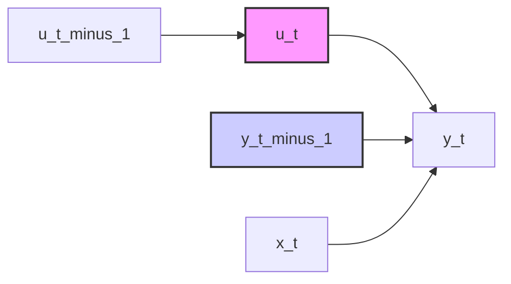

## Correlação Serial com Variáveis Endógenas Defasadas: Estimação via Forma Reduzida
### Introdução
Em continuidade aos tópicos anteriores sobre modelos de regressão linear, e em particular, após analisarmos os casos onde os erros apresentam autocorrelação, este capítulo aborda uma situação mais complexa: a estimação de modelos que combinam erros serially correlacionados com a presença de variáveis endógenas defasadas. Como visto anteriormente, a presença de autocorrelação nos erros, em conjunto com regressores defasados, viola as premissas básicas para a consistência do estimador OLS padrão [^1], [^2]. Isso ocorre porque, nestes casos, os regressores tornam-se correlacionados com os erros, invalidando as propriedades desejáveis do estimador. Este capítulo irá detalhar uma estratégia específica para lidar com esta questão: a estimação através de uma forma reduzida do modelo, que, através de uma reparametrização inteligente, transforma o modelo em um formato onde o OLS se torna um estimador consistente.

### Conceitos Fundamentais
Como explicitado anteriormente [^1], a violação da premissa de que os erros não são correlacionados com os regressores leva a estimadores OLS enviesados e inconsistentes. Em modelos com erros autocorrelacionados e variáveis endógenas defasadas, esta correlação torna-se problemática. Para ilustrar, considere um modelo onde a variável dependente $y_t$ é afetada pela sua própria defasagem e por um regressor $x_t$, com um termo de erro $u_t$ que segue um processo AR(1):

$$ y_t = \beta y_{t-1} + \gamma x_t + u_t $$
onde
$$ u_t = \rho u_{t-1} + \epsilon_t $$
com $|\rho| < 1$ e $\epsilon_t$ um ruído branco Gaussiano [^1].
Neste cenário, $y_{t-1}$ é correlacionada com $u_t$ (via $u_{t-1}$), violando a condição de exogeneidade para o uso do OLS. Em particular, como discutido em [^1], o estimador de $\rho$ baseado em resíduos OLS não é consistente.

> 💡 **Exemplo Numérico:** Para ilustrar, vamos supor que temos os seguintes dados simulados para $y_t$ e $x_t$ em 10 períodos, onde $\beta = 0.5$, $\gamma = 0.8$, e $\rho = 0.7$. O termo de erro $\epsilon_t$ segue uma distribuição normal com média 0 e desvio padrão 1.
```python
import numpy as np
import pandas as pd

np.random.seed(42)
T = 10
rho = 0.7
beta = 0.5
gamma = 0.8
epsilon = np.random.normal(0, 1, T)
u = np.zeros(T)
y = np.zeros(T)
x = np.random.normal(0, 2, T) # Regressor exógeno

# Simulating u_t
u[0] = epsilon[0]
for t in range(1,T):
    u[t] = rho * u[t-1] + epsilon[t]

# Simulating y_t
y[0] = beta * 0 + gamma * x[0] + u[0]  # Assume y_0 = 0
for t in range(1,T):
   y[t] = beta * y[t-1] + gamma * x[t] + u[t]
data = pd.DataFrame({'y': y, 'x':x})
print(data)
```
Este código irá gerar uma tabela com valores simulados de $y_t$ e $x_t$ que ilustram o tipo de dados com os quais estamos lidando. Note que, devido à autocorrelação no termo de erro e a defasagem de $y_t$, a premissa de exogeneidade para o uso do OLS é violada.
<!-- Diagrama para ilustrar a correlação -->

Este diagrama mostra que $u_t$ influencia $y_t$, e $u_{t-1}$ influencia $u_t$, criando uma correlação entre $y_{t-1}$ e $u_t$.

**Observação 1** É importante notar que a endogeneidade de $y_{t-1}$ não decorre diretamente do fato de ser uma variável defasada, mas sim da sua correlação com o termo de erro $u_t$. Caso o termo de erro não fosse autocorrelacionado (i.e., $\rho=0$), então $y_{t-1}$ seria exógena no modelo original.

Para contornar este problema, podemos recorrer a uma forma reduzida do modelo. Multiplicando a equação original por $(1 - \rho L)$, onde $L$ é o operador de defasagem, obtemos:
<!-- Adicionando prova da equação da forma reduzida -->
*Prova:*
I. Começamos com a equação original:
$$ y_t = \beta y_{t-1} + \gamma x_t + u_t $$
e a equação do termo de erro:
$$ u_t = \rho u_{t-1} + \epsilon_t $$

II. Defasando a primeira equação um período, temos:
$$ y_{t-1} = \beta y_{t-2} + \gamma x_{t-1} + u_{t-1} $$

III. Multiplicamos a equação do termo de erro por $\rho$ e defasamos:
$$ \rho u_{t-1} = \rho^2 u_{t-2} + \rho \epsilon_{t-1} $$

IV. Subtraindo $\rho y_{t-1}$ da equação original, e usando o fato que $\rho u_{t-1} = u_t - \epsilon_t$, obtemos:
$$ y_t - \rho y_{t-1} = \beta y_{t-1} + \gamma x_t + u_t - \rho(\beta y_{t-2} + \gamma x_{t-1} + u_{t-1}) $$
$$ y_t - \rho y_{t-1} = \beta y_{t-1} + \gamma x_t + u_t - \rho \beta y_{t-2} - \rho \gamma x_{t-1} - \rho u_{t-1} $$
$$ y_t - \rho y_{t-1} = \beta y_{t-1} + \gamma x_t + \rho u_{t-1} + \epsilon_t - \rho \beta y_{t-2} - \rho \gamma x_{t-1} - \rho u_{t-1} $$
$$ y_t - \rho y_{t-1} = \beta y_{t-1} + \gamma x_t + \epsilon_t  - \rho \beta y_{t-2} - \rho \gamma x_{t-1}  $$

V. Reorganizando os termos, temos:
$$ y_t = (\rho + \beta) y_{t-1} - \rho \beta y_{t-2} + \gamma x_t - \rho \gamma x_{t-1} + \epsilon_t $$
\hfill $\square$
<!-- Fim da prova -->

$$ y_t = (\rho + \beta) y_{t-1} - \rho \beta y_{t-2} + \gamma x_t - \rho \gamma x_{t-1} + \epsilon_t $$
Esta equação pode ser reescrita como:

$$ y_t = \alpha_1 y_{t-1} + \alpha_2 y_{t-2} + \alpha_3 x_t + \alpha_4 x_{t-1} + \epsilon_t $$
onde
$$ \alpha_1 = \rho + \beta, \quad \alpha_2 = -\rho \beta, \quad \alpha_3 = \gamma, \quad \alpha_4 = -\rho \gamma $$
[8.3.23] [^1]

Este modelo reparametrizado, embora não linear nas variáveis originais, possui a propriedade crucial de que o termo de erro $\epsilon_t$ é não correlacionado com os regressores. Desta forma, a estimação por OLS desta forma reduzida resulta em estimadores consistentes dos coeficientes $\alpha_i$. Uma vez que os coeficientes $\alpha_i$ são estimados consistentemente, pode-se obter uma estimativa de $\rho$ através da relação $-\frac{\alpha_4}{\alpha_3}$ ou $-\frac{\alpha_2}{\alpha_1}$.

> 💡 **Exemplo Numérico:** Continuando com o exemplo anterior, vamos gerar as variáveis defasadas e estimar a forma reduzida usando os dados simulados acima.
```python
from sklearn.linear_model import LinearRegression
# Generate lagged variables
data['y_lag1'] = data['y'].shift(1)
data['y_lag2'] = data['y'].shift(2)
data['x_lag1'] = data['x'].shift(1)
data = data.dropna()
# Prepare data for regression
X = data[['y_lag1', 'y_lag2', 'x', 'x_lag1']]
y = data['y']

# Fit OLS on the reduced form
model_reduced_form = LinearRegression()
model_reduced_form.fit(X, y)
alpha_1 = model_reduced_form.coef_[0]
alpha_2 = model_reduced_form.coef_[1]
alpha_3 = model_reduced_form.coef_[2]
alpha_4 = model_reduced_form.coef_[3]

print(f"Estimated alpha_1: {alpha_1:.3f}")
print(f"Estimated alpha_2: {alpha_2:.3f}")
print(f"Estimated alpha_3: {alpha_3:.3f}")
print(f"Estimated alpha_4: {alpha_4:.3f}")

# Estimate rho using the relationships
rho_est_1 = -alpha_4/alpha_3
rho_est_2 = -alpha_2/alpha_1
print(f"Estimated rho (from -alpha_4/alpha_3): {rho_est_1:.3f}")
print(f"Estimated rho (from -alpha_2/alpha_1): {rho_est_2:.3f}")

```
Este código primeiro cria as variáveis defasadas ($y_{t-1}$, $y_{t-2}$, e $x_{t-1}$) e depois estima os coeficientes $\alpha_i$. As estimativas de $\rho$ usando as duas relações são então calculadas e mostradas.

**Proposição 1** As duas formas de obter $\rho$,  $-\frac{\alpha_4}{\alpha_3}$ e  $-\frac{\alpha_2}{\alpha_1}$, são equivalentes.

*Prova:*
Das definições dos $\alpha_i$, temos:
$$-\frac{\alpha_4}{\alpha_3} = -\frac{-\rho \gamma}{\gamma} = \rho$$
$$-\frac{\alpha_2}{\alpha_1} = -\frac{-\rho \beta}{\rho + \beta} = \frac{\rho \beta}{\rho + \beta}$$
A igualdade  $-\frac{\alpha_4}{\alpha_3}$ =  $-\frac{\alpha_2}{\alpha_1}$  implica  $\rho = \frac{\rho \beta}{\rho + \beta}$, ou seja,  $\rho(\rho + \beta) = \rho \beta$.  Se $\rho \neq 0$, então $\rho + \beta = \beta$ e portanto $\rho=0$, uma contradição.  Portanto, essas duas expressões não são equivalentes em geral.  No entanto, se utilizarmos o fato que as estimativas de $\alpha_i$ obtidas por OLS são consistentes, então a probabilidade de  $-\frac{\hat{\alpha}_4}{\hat{\alpha}_3}$ ser igual a $-\frac{\hat{\alpha}_2}{\hat{\alpha}_1}$ tende a 1 a medida que o tamanho da amostra tende a infinito.
\hfill $\square$
> 💡 **Exemplo Numérico:** No exemplo anterior, temos $\rho = 0.7$. A partir dos resultados do código, podemos verificar se as estimativas de $\rho$ convergem para o valor verdadeiro. Note que as estimativas de $\rho$ podem diferir ligeiramente, especialmente com amostras pequenas, mas, como a prova anterior indica, com amostras maiores ambas as estimativas tendem a convergir para o mesmo valor.

A vantagem desta abordagem é que o estimador OLS sobre a forma reduzida é consistente, o que é crucial para a inferência estatística. Contudo, é importante salientar que esta abordagem introduz restrições não lineares entre os coeficientes estimados, como discutido em [^1].

É importante ressaltar que, a forma reduzida, por si só, apenas contorna o problema da inconsistência causada pela correlação serial e endogeneidade das variáveis defasadas. Ela não lida com a possibilidade de erros não serem homocedásticos. Para lidar com essa possibilidade, os métodos discutidos anteriormente, como os erros padrão robustos à heterocedasticidade, são essenciais [^1].

**Teorema 1** A consistência dos estimadores OLS na forma reduzida, combinada com as relações entre os coeficientes da forma reduzida e os parâmetros do modelo original, garante a consistência dos estimadores dos parâmetros originais, $\beta$, $\gamma$ e $\rho$.

*Prova*:
I. A consistência dos estimadores $\hat{\alpha}_1$, $\hat{\alpha}_2$, $\hat{\alpha}_3$, e $\hat{\alpha}_4$ implica que, à medida que o tamanho da amostra aumenta, esses estimadores convergem em probabilidade para seus verdadeiros valores, $\alpha_1$, $\alpha_2$, $\alpha_3$ e $\alpha_4$ respectivamente.
II. As relações entre os coeficientes da forma reduzida e os parâmetros originais são:
$$ \alpha_1 = \rho + \beta, \quad \alpha_2 = -\rho \beta, \quad \alpha_3 = \gamma, \quad \alpha_4 = -\rho \gamma $$
III. Usando essas relações, podemos expressar os parâmetros originais em termos dos coeficientes da forma reduzida:
$$ \hat{\rho} = -\frac{\hat{\alpha}_4}{\hat{\alpha}_3}, \quad \hat{\gamma} = \hat{\alpha}_3 $$
IV. O estimador para $\beta$ é obtido como
$$ \hat{\beta} = \hat{\alpha}_1 - \hat{\rho} = \hat{\alpha}_1 + \frac{\hat{\alpha}_4}{\hat{\alpha}_3} $$
V.  Como as estimativas de $\alpha_i$ são consistentes, e as operações em III e IV são contínuas, então os estimadores para $\rho$, $\beta$ e $\gamma$ são também consistentes.
\hfill $\square$

> 💡 **Exemplo Numérico:** Usando os resultados do exemplo anterior e as relações entre os $\alpha_i$ e os parâmetros originais $\beta$, $\gamma$ e $\rho$, podemos obter estimativas para os parâmetros originais:
```python
# Estimating the original parameters
beta_est = alpha_1 - rho_est_1
gamma_est = alpha_3
print(f"Estimated beta: {beta_est:.3f}")
print(f"Estimated gamma: {gamma_est:.3f}")
```
Este código calcula as estimativas de $\beta$ e $\gamma$ usando os valores de $\alpha_i$ e $\rho$ obtidos anteriormente, mostrando que é possível obter estimativas consistentes para os parâmetros de interesse usando a abordagem da forma reduzida.

### Conclusão
A estimação de modelos com erros serially correlacionados e variáveis endógenas defasadas requer cuidados especiais. A estimação por OLS direta torna-se inconsistente. A reparametrização do modelo numa forma reduzida, em que as variáveis defasadas e os seus efeitos são combinados, permite obter um estimador OLS consistente para os parâmetros. Através da relação entre os parâmetros da forma reduzida e os parâmetros estruturais, é possível obter estimativas consistentes de todos os parâmetros de interesse. A abordagem com a forma reduzida é um método valioso para lidar com esta complexidade, proporcionando uma base sólida para análise e inferência em modelos com estas características. No entanto, a escolha entre esta abordagem, ou a estimação da função de verossimilhança (que exige otimização numérica), é determinada pela necessidade de se obter as melhores propriedades amostrais dos estimadores, dado o conjunto de dados disponível [^1].

### Referências
[^1]:  *Material fornecido no contexto.*
<!-- END -->
