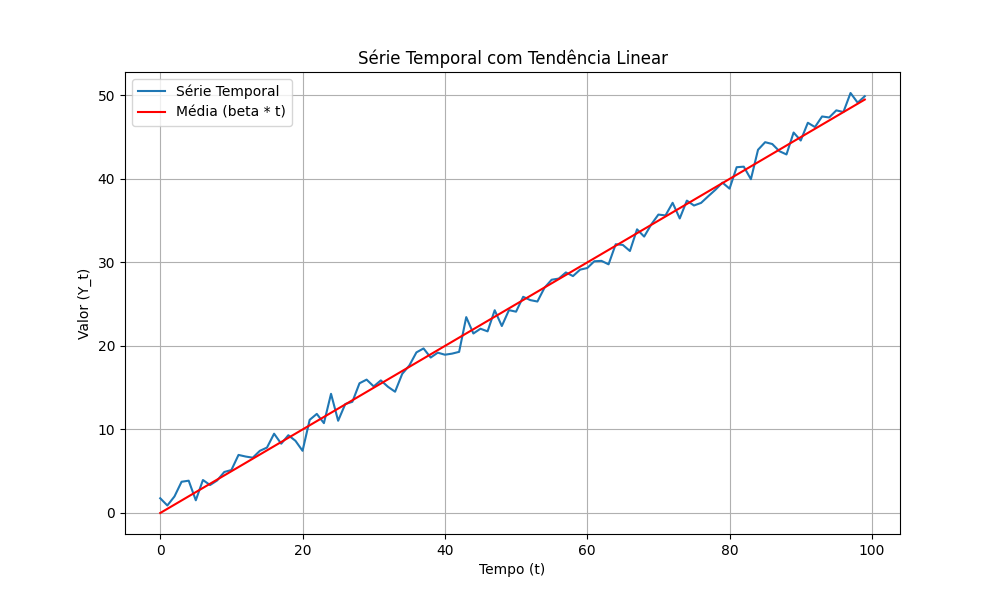

## A Variância como Autocovariância de Ordem Zero em Processos ARMA

### Introdução

No contexto de modelos ARMA, a autocovariância de ordem zero, denotada por $\gamma_{0t}$, desempenha um papel fundamental, pois ela coincide com a variância do processo no instante $t$ [^Autocovariância (γjt) measures the covariance between Yt and its lagged value Yt-j, calculated as γjt = E[(Yt - μt)(Yt-j - μt-j)]. It can be viewed as the (1, j+1) element of the variance-covariance matrix of the vector xt.]. A variância, por sua vez, quantifica a dispersão dos valores da série temporal em torno de sua média. Este capítulo explora em profundidade o significado da autocovariância de ordem zero, suas propriedades, e como ela se manifesta em diferentes processos estocásticos, especialmente no contexto de modelos ARMA.

### Conceitos Fundamentais

**Definição Formal**

A autocovariância de ordem zero, $\gamma_{0t}$, é definida como a covariância de $Y_t$ consigo mesmo, ou seja [^3.1.9]:

$$
\gamma_{0t} = E[(Y_t - \mu_t)(Y_t - \mu_t)] = E[(Y_t - \mu_t)^2]
$$

onde $E[\cdot]$ representa o operador de esperança, $Y_t$ é o valor da série temporal no instante $t$, e $\mu_t = E[Y_t]$ é a média da série temporal no instante $t$. Esta expressão é, por definição, a variância de $Y_t$.

**Interpretação da Variância**

A variância $\gamma_{0t}$ quantifica o grau de dispersão ou variabilidade dos valores da série temporal em torno de sua média $\mu_t$. Uma variância alta indica que os valores da série temporal tendem a se desviar significativamente da média, enquanto uma variância baixa indica que os valores estão mais concentrados em torno da média.

> 💡 **Exemplo Numérico:** Suponha que $\gamma_{0t} = 10$ para uma série temporal. Isso indica que os valores da série temporal exibem uma dispersão considerável em torno de sua média. Em contraste, se $\gamma_{0t} = 0.5$, os valores da série temporal estão muito mais concentrados em torno da média. Imagine uma série temporal representando a temperatura diária em uma cidade. Se $\gamma_{0t} = 10$, as temperaturas variam amplamente ao longo dos dias (por exemplo, de 10°C a 30°C, com média de 20°C). Se $\gamma_{0t} = 0.5$, as temperaturas são mais estáveis (por exemplo, de 19°C a 21°C, com média de 20°C).

**Relação com a Estacionaridade**

Em um processo *covariance-stationary*, a variância, assim como a média e as autocovariâncias, é constante ao longo do tempo. Isso significa que [^Estacionaridade]:

$$
\gamma_{0t} = \gamma_0 \quad \text{para todo } t
$$

A estacionaridade implica que a dispersão dos valores da série temporal em torno de sua média não muda ao longo do tempo.

**Proposição 2**
Para um processo estacionário, a autocovariância de ordem zero ($\gamma_0$) é sempre maior ou igual a zero.

*Proof:*
Pela definição de variância, $\gamma_0 = E[(Y_t - \mu)^2]$. Como $(Y_t - \mu)^2$ é um quadrado, é sempre não negativo. A esperança de uma quantidade não negativa é também não negativa. Portanto, $\gamma_0 \geq 0$. $\blacksquare$

**Teorema 3**
Se $Y_t$ é um processo estacionário com média $\mu$, então $E[(Y_t - \mu)^4]$ é constante ao longo do tempo.

*Proof:*
Como $Y_t$ é estacionário, a distribuição de $Y_t$ é a mesma para todo $t$. Portanto, todos os momentos de $Y_t$ são constantes ao longo do tempo, incluindo $E[(Y_t - \mu)^4]$. $\blacksquare$

**Exemplo: Ruído Branco Gaussiano**

Em um processo de ruído branco Gaussiano com média zero e variância $\sigma^2$, a autocovariância de ordem zero é simplesmente a variância $\sigma^2$.  Como as observações são independentes e identicamente distribuídas, a variância permanece constante ao longo do tempo. Para ruído branco, a autocovariância é zero para todas as outras defasagens [^3.2.3].

> 💡 **Exemplo Numérico:** Se um processo de ruído branco Gaussiano tem variância $\sigma^2 = 4$, então $\gamma_0 = 4$. Isso significa que os valores da série temporal se desviam em média por 2 unidades (raiz quadrada da variância) de sua média, que é zero.  Podemos simular esse processo em Python e verificar a variância amostral:

```python
import numpy as np

# Define a semente para reprodutibilidade
np.random.seed(0)

# Número de observações
n_observations = 1000

# Variância do ruído branco
variance = 4

# Gera ruído branco Gaussiano
white_noise = np.random.normal(loc=0, scale=np.sqrt(variance), size=n_observations)

# Calcula a variância amostral
sample_variance = np.var(white_noise)

print(f"Variância teórica: {variance}")
print(f"Variância amostral: {sample_variance}")
```

**Exemplo: Processo com Tendência Linear e Ruído Branco Gaussiano**

Considere o processo não estacionário $Y_t = \beta t + \epsilon_t$, onde $\beta$ é uma constante e $\epsilon_t$ é ruído branco Gaussiano com variância $\sigma^2$ [^3.1.7]. A variância de $Y_t$ é:

$$
\gamma_{0t} = E[(Y_t - \beta t)^2] = E[\epsilon_t^2] = \sigma^2
$$

Neste caso, embora a variância seja constante ao longo do tempo, o processo *não* é estacionário porque a média $E[Y_t] = \beta t$ varia com $t$ [^3.1.8].  A autocovariância de ordem zero (variância) deste processo é constante, mas a média não, violando a definição de estacionaridade.

> 💡 **Exemplo Numérico:** Seja $\beta = 0.5$ e $\sigma^2 = 1$.  Simulemos esse processo e visualizemos a série temporal e sua média variável.



A autocovariância de ordem zero (variância) será aproximadamente igual a 1, mas a média da série temporal crescerá linearmente com o tempo, demonstrando a não estacionaridade.

**Proposição 3.1**
Considere o processo não estacionário $Y_t = f(t) + \epsilon_t$, onde $f(t)$ é uma função de $t$ e $\epsilon_t$ é ruído branco Gaussiano com variância $\sigma^2$.  A variância de $Y_t$ é $\gamma_{0t} = \sigma^2$, que é constante, mas o processo não é estacionário se $f(t)$ não for constante.

*Proof:*
A variância de $Y_t$ é dada por $E[(Y_t - E[Y_t])^2] = E[(f(t) + \epsilon_t - f(t))^2] = E[\epsilon_t^2] = \sigma^2$.  Se $f(t)$ não é constante, então $E[Y_t] = f(t)$ também não é constante, e portanto o processo não é estacionário. $\blacksquare$

**Exemplo: Processo MA(1)**

Considere o processo MA(1) definido como [^3.3.1]:

$$
Y_t = \mu + \epsilon_t + \theta \epsilon_{t-1}
$$

onde $\mu$ e $\theta$ são constantes e $\epsilon_t$ é ruído branco com média zero e variância $\sigma^2$. A autocovariância de ordem zero (variância) é dada por [^3.3.3]:

$$
\gamma_0 = E[(Y_t - \mu)^2] = (1 + \theta^2)\sigma^2
$$

Neste caso, a variância é constante e depende apenas dos parâmetros $\theta$ e $\sigma^2$.  Como mencionado, a independência do tempo é consistente com o processo ser *covariance-stationary*.

> 💡 **Exemplo Numérico:** Para um processo MA(1) com $\theta = 0.8$ e $\sigma^2 = 1$, a autocovariância de ordem zero (variância) é $\gamma_0 = (1 + 0.8^2) \times 1 = 1.64$. Podemos simular esse processo e estimar a variância amostral:

```python
import numpy as np

# Define a semente para reprodutibilidade
np.random.seed(0)

# Número de observações
n_observations = 1000

# Parâmetros
mu = 0
theta = 0.8
sigma_squared = 1

# Gera ruído branco Gaussiano
epsilon = np.random.normal(loc=0, scale=np.sqrt(sigma_squared), size=n_observations)

# Cria a série temporal MA(1)
Y = mu + epsilon[1:] + theta * epsilon[:-1]

# Calcula a variância amostral
sample_variance = np.var(Y)

print(f"Variância teórica: {(1 + theta**2) * sigma_squared}")
print(f"Variância amostral: {sample_variance}")
```

**Lema 2**

Se $Y_t$ é um processo *covariance-stationary*, então a autocovariância de ordem zero ($\gamma_0$) é igual à variância incondicional de $Y_t$.

*Proof:*
Pela definição de estacionaridade, $\mu_t = \mu$ para todo $t$. Portanto, $\gamma_{0t} = E[(Y_t - \mu)^2]$ é a variância de $Y_t$, que é constante e igual a $\gamma_0$. $\blacksquare$

**Teorema 4**
Para um processo AR(1) definido por $Y_t = \phi Y_{t-1} + \epsilon_t$, onde $|\phi| < 1$ e $\epsilon_t$ é ruído branco com variância $\sigma^2$, a autocovariância de ordem zero é dada por $\gamma_0 = \frac{\sigma^2}{1 - \phi^2}$.

*Proof:*
Provaremos que para um processo AR(1) definido por $Y_t = \phi Y_{t-1} + \epsilon_t$, onde $|\phi| < 1$ e $\epsilon_t$ é ruído branco com variância $\sigma^2$, a autocovariância de ordem zero é dada por $\gamma_0 = \frac{\sigma^2}{1 - \phi^2}$.

I. Tomando a variância de ambos os lados da equação $Y_t = \phi Y_{t-1} + \epsilon_t$, temos:
   $Var(Y_t) = Var(\phi Y_{t-1} + \epsilon_t)$

II. Assumindo estacionaridade, $Var(Y_t) = Var(Y_{t-1}) = \gamma_0$. Como $Y_{t-1}$ e $\epsilon_t$ são independentes:
   $\gamma_0 = \phi^2 \gamma_0 + \sigma^2$

III. Resolvendo para $\gamma_0$:
    $\gamma_0(1 - \phi^2) = \sigma^2$

IV. Portanto, a autocovariância de ordem zero é:
    $\gamma_0 = \frac{\sigma^2}{1 - \phi^2}$  $\blacksquare$

> 💡 **Exemplo Numérico:** Considere um processo AR(1) com $\phi = 0.5$ e $\sigma^2 = 2$. A autocovariância de ordem zero teórica é $\gamma_0 = \frac{2}{1 - 0.5^2} = \frac{2}{0.75} = 2.6667$. Simulemos esse processo e comparemos com a estimativa amostral.

```python
import numpy as np

# Define a semente para reprodutibilidade
np.random.seed(0)

# Número de observações
n_observations = 1000

# Parâmetros
phi = 0.5
sigma_squared = 2

# Gera ruído branco Gaussiano
epsilon = np.random.normal(loc=0, scale=np.sqrt(sigma_squared), size=n_observations)

# Inicializa a série temporal AR(1)
Y = np.zeros(n_observations)
Y[0] = epsilon[0]  # Define o primeiro valor como ruído branco

# Cria a série temporal AR(1)
for t in range(1, n_observations):
    Y[t] = phi * Y[t-1] + epsilon[t]

# Calcula a variância amostral
sample_variance = np.var(Y)

print(f"Variância teórica: {sigma_squared / (1 - phi**2)}")
print(f"Variância amostral: {sample_variance}")
```

**Cálculo Empírico da Autocovariância de Ordem Zero**

Em aplicações práticas, a autocovariância de ordem zero (variância) pode ser estimada a partir de uma amostra de dados usando a seguinte fórmula:

$$
\hat{\gamma}_0 = \frac{1}{T} \sum_{t=1}^{T} (Y_t - \bar{Y})^2
$$

onde $T$ é o número de observações na amostra e $\bar{Y}$ é a média amostral:

$$
\bar{Y} = \frac{1}{T} \sum_{t=1}^{T} Y_t
$$

Esta estimativa fornece uma medida da dispersão dos dados em torno da média amostral.

> 💡 **Exemplo Numérico:** Considere uma série temporal com os seguintes valores: [2, 4, 6, 8, 10]. Primeiro, calculamos a média amostral: $\bar{Y} = (2 + 4 + 6 + 8 + 10) / 5 = 6$. Em seguida, calculamos a autocovariância de ordem zero:
>
> $$
> \hat{\gamma}_0 = \frac{1}{5} [(2-6)^2 + (4-6)^2 + (6-6)^2 + (8-6)^2 + (10-6)^2] = \frac{1}{5} [16 + 4 + 0 + 4 + 16] = \frac{40}{5} = 8
> $$
>
> Portanto, a estimativa da variância é 8.

```python
import numpy as np

# Dados de exemplo
Y = np.array([2, 4, 6, 8, 10])
T = len(Y)

# Calcular a média amostral
Y_mean = np.mean(Y)

# Calcular a autocovariância de ordem zero
gamma_hat_0 = np.sum((Y - Y_mean)**2) / T

print(f"Média amostral: {Y_mean}")
print(f"Autocovariância de ordem zero (variância) estimada: {gamma_hat_0}")
```

### Conclusão

A autocovariância de ordem zero, equivalente à variância, é uma estatística fundamental na análise de séries temporais e modelos ARMA. Ela quantifica a dispersão dos dados em torno da média e, em conjunto com outras autocovariâncias, auxilia na caracterização da estrutura temporal do processo estocástico. Em processos estacionários, a variância é constante ao longo do tempo, simplificando a análise e modelagem. O cálculo empírico da variância permite estimar a dispersão dos dados a partir de uma amostra finita, fornecendo informações valiosas para a compreensão do comportamento da série temporal.

### Referências
[^3.1.7]:  *Texto referente ao processo com tendência linear e ruído branco Gaussiano*.
[^3.1.8]:  *Texto referente à média do processo com tendência linear e ruído branco Gaussiano*.
[^3.1.9]: *Texto referente à definição de autocovariância*.
[^3.2.3]:  *Texto referente às propriedades do ruído branco*.
[^3.3.1]:  *Texto referente à definição do processo MA(1)*.
[^3.3.3]:  *Texto referente à variância do processo MA(1)*.
[^Autocovariância (γjt) measures the covariance between Yt and its lagged value Yt-j, calculated as γjt = E[(Yt - μt)(Yt-j - μt-j)]. It can be viewed as the (1, j+1) element of the variance-covariance matrix of the vector xt.]:  *Texto referente à definição da autocovariância*.
[^Estacionaridade]: *Texto referente à estacionaridade*.
<!-- END -->