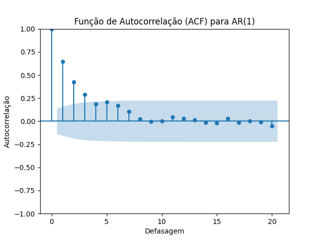
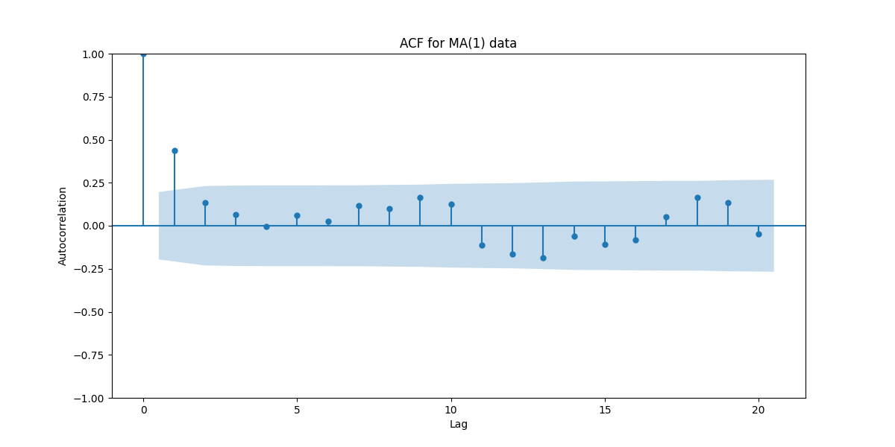

## Autocorrelação em Processos Estacionários ARMA

### Introdução

A autocorrelação, denotada por $\rho_j$, é uma medida de dependência linear entre uma série temporal e suas versões defasadas, normalizada pela variância do processo. Em processos estacionários, a autocorrelação de ordem $j$ quantifica a similaridade entre $Y_t$ e $Y_{t-j}$, independentemente do tempo $t$. Este capítulo explora a autocorrelação, suas propriedades, sua relação com a autocovariância, e como ela se manifesta em diferentes processos estocásticos, com ênfase em modelos ARMA.

### Conceitos Fundamentais

**Definição Formal**

A autocorrelação de ordem $j$, denotada por $\rho_j$, é definida como a autocovariância de ordem $j$ dividida pela variância do processo [^3.3.6]:

$$
\rho_j = \frac{\gamma_j}{\gamma_0}
$$

onde $\gamma_j$ é a autocovariância na defasagem $j$ e $\gamma_0$ é a autocovariância de ordem zero (variância) [^A Variância como Autocovariância de Ordem Zero em Processos ARMA].

**Interpretação da Autocorrelação**

A autocorrelação $\rho_j$ quantifica o grau de correlação linear entre $Y_t$ e $Y_{t-j}$, variando entre -1 e 1. Um valor de $\rho_j$ próximo de 1 indica uma forte correlação positiva, onde valores altos (ou baixos) de $Y_t$ tendem a ser seguidos por valores altos (ou baixos) de $Y_{t-j}$. Um valor de $\rho_j$ próximo de -1 indica uma forte correlação negativa, onde valores altos de $Y_t$ tendem a ser seguidos por valores baixos de $Y_{t-j}$, e vice-versa. Um valor de $\rho_j$ próximo de 0 indica uma fraca correlação linear.

> 💡 **Exemplo Numérico:** Se $\rho_1 = 0.7$ para uma série temporal, existe uma correlação positiva forte entre observações consecutivas. Se observamos um valor acima da média no tempo $t$, é provável que o valor no tempo $t-1$ também estivesse acima da média. Se $\rho_2 = -0.6$, há uma correlação negativa moderada entre observações separadas por dois períodos.

**Propriedades da Autocorrelação**

1.  **Simetria:** Para um processo estacionário, a função de autocorrelação é simétrica, ou seja, $\rho_j = \rho_{-j}$ [^3.1.13].

2.  **Valor em zero:** A autocorrelação na defasagem zero é sempre igual a 1, ou seja, $\rho_0 = 1$ [^3.3.6]. Isso decorre da definição, pois $\rho_0 = \frac{\gamma_0}{\gamma_0} = 1$.

3.  **Limites:** A autocorrelação varia entre -1 e 1, ou seja, $|\rho_j| \leq 1$ para todo $j$ [^3.3.6]. Isso é uma consequência da desigualdade de Cauchy-Schwarz.

> 💡 **Exemplo Numérico:** Considere uma série temporal de temperaturas diárias. A autocorrelação $\rho_1$ (correlação entre a temperatura de hoje e a de ontem) provavelmente será alta e positiva (perto de 1) porque dias quentes tendem a ser seguidos por dias quentes, e dias frios por dias frios. A autocorrelação $\rho_{180}$ (correlação entre a temperatura de hoje e a de 180 dias atrás) pode ser negativa (perto de -1) se houver uma forte sazonalidade invertida (verão x inverno).

**Prova da Simetria da Autocorrelação:**
I. Pela definição, $\rho_j = \frac{\gamma_j}{\gamma_0}$ e $\rho_{-j} = \frac{\gamma_{-j}}{\gamma_0}$.
II. Para um processo estacionário, $\gamma_j = \gamma_{-j}$.
III. Portanto, $\rho_j = \frac{\gamma_j}{\gamma_0} = \frac{\gamma_{-j}}{\gamma_0} = \rho_{-j}$. $\blacksquare$

**Prova de $\rho_0 = 1$:**
I. Pela definição, $\rho_0 = \frac{\gamma_0}{\gamma_0}$.
II. Como $\gamma_0$ é a variância do processo, $\gamma_0 \neq 0$.
III. Portanto, $\rho_0 = \frac{\gamma_0}{\gamma_0} = 1$. $\blacksquare$

**Prova de $|\rho_j| \leq 1$:**
I. A correlação é definida como $Corr(Y_t, Y_{t-j}) = \frac{Cov(Y_t, Y_{t-j})}{\sqrt{Var(Y_t)Var(Y_{t-j})}}$.
II. Para um processo estacionário, $Var(Y_t) = Var(Y_{t-j}) = \gamma_0$, e $Cov(Y_t, Y_{t-j}) = \gamma_j$.
III. Então $\rho_j = \frac{\gamma_j}{\sqrt{\gamma_0\gamma_0}} = \frac{\gamma_j}{\gamma_0}$.
IV. Pela desigualdade de Cauchy-Schwarz, $|Cov(Y_t, Y_{t-j})| \leq \sqrt{Var(Y_t)Var(Y_{t-j})}$.
V. Portanto, $|\gamma_j| \leq \gamma_0$, e $|\frac{\gamma_j}{\gamma_0}| \leq 1$, implicando $|\rho_j| \leq 1$. $\blacksquare$

**Relação com a Autocovariância**

A autocorrelação é simplesmente uma versão normalizada da autocovariância. Ela facilita a comparação da dependência temporal entre diferentes séries temporais, pois a normalização remove a influência da escala da série. Conhecendo a variância e a autocorrelação, podemos reconstruir a autocovariância:

$$
\gamma_j = \rho_j \gamma_0
$$

> 💡 **Exemplo Numérico:** Se a variância de uma série temporal ( $\gamma_0$) é 10 e a autocorrelação na defasagem 2 ( $\rho_2$) é 0.4, então a autocovariância na defasagem 2 ( $\gamma_2$) é $0.4 \times 10 = 4$.

**Lema 1**
Dado um processo estacionário com autocovariância $\gamma_j$ e autocorrelação $\rho_j$, a variância pode ser expressa em termos da autocorrelação:
$$
\gamma_0 = \frac{\gamma_j}{\rho_j}, \text{ para } \rho_j \neq 0
$$

*Proof:*
I. Por definição, $\rho_j = \frac{\gamma_j}{\gamma_0}$.
II. Multiplicando ambos os lados por $\gamma_0$ e dividindo por $\rho_j$ (assumindo $\rho_j \neq 0$), obtemos $\gamma_0 = \frac{\gamma_j}{\rho_j}$. $\blacksquare$

**Exemplo: Ruído Branco Gaussiano**

Para um processo de ruído branco Gaussiano, a autocorrelação é zero para todas as defasagens diferentes de zero, e 1 para a defasagem zero. Isso significa que as observações são não correlacionadas.

> 💡 **Exemplo Numérico:** Se temos um ruído branco Gaussiano, então $\rho_0 = 1$ e $\rho_j = 0$ para $j \neq 0$. Isso implica que não há dependência linear entre observações em diferentes momentos.

**Exemplo: Processo MA(1)**

Considere o processo MA(1) definido como [^3.3.1]:

$$
Y_t = \mu + \epsilon_t + \theta \epsilon_{t-1}
$$

A autocorrelação na defasagem 1 é dada por [^3.3.7]:

$$
\rho_1 = \frac{\theta}{1 + \theta^2}
$$

e a autocorrelação é zero para todas as outras defasagens maiores que 1 [^3.3.5].

Para fins de completude, vamos derivar esta autocorrelação.

**Derivação de $\rho_1$ para MA(1):**
I. Dado o processo MA(1): $Y_t = \mu + \epsilon_t + \theta \epsilon_{t-1}$.
II. Assumimos que $E[\epsilon_t] = 0$ e $Var(\epsilon_t) = \sigma^2$.
III. Primeiro, calculamos a autocovariância $\gamma_0 = Var(Y_t)$:
   $$\gamma_0 = E[(Y_t - \mu)^2] = E[(\epsilon_t + \theta \epsilon_{t-1})^2] = E[\epsilon_t^2 + 2\theta \epsilon_t \epsilon_{t-1} + \theta^2 \epsilon_{t-1}^2]$$
   Como $E[\epsilon_t \epsilon_{t-1}] = 0$, temos:
   $$\gamma_0 = E[\epsilon_t^2] + \theta^2 E[\epsilon_{t-1}^2] = \sigma^2 + \theta^2 \sigma^2 = (1 + \theta^2)\sigma^2$$
IV. Agora, calculamos a autocovariância $\gamma_1 = Cov(Y_t, Y_{t-1})$:
   $$\gamma_1 = E[(Y_t - \mu)(Y_{t-1} - \mu)] = E[(\epsilon_t + \theta \epsilon_{t-1})(\epsilon_{t-1} + \theta \epsilon_{t-2})]$$
   $$\gamma_1 = E[\epsilon_t \epsilon_{t-1} + \theta \epsilon_{t-1}^2 + \theta \epsilon_t \epsilon_{t-2} + \theta^2 \epsilon_{t-1} \epsilon_{t-2}] = \theta E[\epsilon_{t-1}^2] = \theta \sigma^2$$
V. Finalmente, calculamos a autocorrelação $\rho_1$:
   $$\rho_1 = \frac{\gamma_1}{\gamma_0} = \frac{\theta \sigma^2}{(1 + \theta^2)\sigma^2} = \frac{\theta}{1 + \theta^2}$$  $\blacksquare$

> 💡 **Exemplo Numérico:** Para um processo MA(1) com $\theta = 0.5$, temos $\rho_1 = \frac{0.5}{1 + 0.5^2} = 0.4$, e $\rho_j = 0$ para $j > 1$.
Para um processo MA(1) com $\theta = 1$, temos $\rho_1 = \frac{1}{1 + 1^2} = 0.5$, e $\rho_j = 0$ para $j > 1$.
Para um processo MA(1) com $\theta = -0.5$, temos $\rho_1 = \frac{-0.5}{1 + (-0.5)^2} = -0.4$, e $\rho_j = 0$ para $j > 1$.
Para um processo MA(1) com $\theta = -1$, temos $\rho_1 = \frac{-1}{1 + (-1)^2} = -0.5$, e $\rho_j = 0$ para $j > 1$.

**Proposição 4**

Para um processo MA(1), a autocorrelação na defasagem 1 é sempre menor ou igual a 0.5 em valor absoluto, ou seja, $|\rho_1| \leq 0.5$.

*Proof:* Para um processo MA(1), $\rho_1 = \frac{\theta}{1 + \theta^2}$. Para encontrar o máximo valor de $\rho_1$, podemos derivar em relação a $\theta$ e igualar a zero:

$$
\frac{d\rho_1}{d\theta} = \frac{(1 + \theta^2) - \theta(2\theta)}{(1 + \theta^2)^2} = \frac{1 - \theta^2}{(1 + \theta^2)^2}
$$

Igualando a zero, obtemos $1 - \theta^2 = 0$, ou $\theta = \pm 1$. Substituindo $\theta = 1$ na equação de $\rho_1$, temos $\rho_1 = \frac{1}{1 + 1^2} = 0.5$. Substituindo $\theta = -1$, temos $\rho_1 = \frac{-1}{1 + (-1)^2} = -0.5$. Portanto, o valor máximo de $|\rho_1|$ é 0.5. $\blacksquare$

**Lema 2**
Para o processo MA(1) definido anteriormente, a função de autocorrelação (ACF) corta após a defasagem 1.

*Proof:*
I. Por definição do processo MA(1), $Y_t = \mu + \epsilon_t + \theta \epsilon_{t-1}$.
II. A autocorrelação $\rho_j$ mede a correlação entre $Y_t$ e $Y_{t-j}$.
III. Para $j > 1$, $Y_t$ e $Y_{t-j}$ não compartilham nenhum termo $\epsilon$, pois $\epsilon_t$ são independentes.
IV. Portanto, $Cov(Y_t, Y_{t-j}) = 0$ para $j > 1$.
V. Consequentemente, $\rho_j = \frac{Cov(Y_t, Y_{t-j})}{Var(Y_t)} = 0$ para $j > 1$.
VI. Isso implica que a ACF corta após a defasagem 1. $\blacksquare$

**Exemplo: Processo AR(1)**

Considere um processo AR(1) definido como:

$$
Y_t = c + \phi Y_{t-1} + \epsilon_t
$$

onde $c$ e $\phi$ são constantes e $\epsilon_t$ é ruído branco com média zero e variância $\sigma^2$. A autocorrelação na defasagem $j$ é dada por [^3.4.6]:

$$
\rho_j = \phi^j
$$

Nesse caso, a autocorrelação decai geometricamente com a defasagem $j$. Se $|\phi| < 1$, o processo é estacionário e a autocorrelação converge para zero à medida que $j$ aumenta.

Para fins de completude, vamos derivar esta autocorrelação.

**Derivação de $\rho_j$ para AR(1):**
I. Dado o processo AR(1): $Y_t = \phi Y_{t-1} + \epsilon_t$ (assumindo $c = 0$ para simplificar, sem perda de generalidade).
II. Multiplicando ambos os lados por $Y_{t-j}$ e tomando a expectativa:
   $$E[Y_t Y_{t-j}] = E[\phi Y_{t-1} Y_{t-j} + \epsilon_t Y_{t-j}]$$
   Como $E[\epsilon_t Y_{t-j}] = 0$ para $j > 0$, temos:
   $$\gamma_j = \phi \gamma_{j-1}$$
III. Dividindo ambos os lados por $\gamma_0$:
   $$\frac{\gamma_j}{\gamma_0} = \phi \frac{\gamma_{j-1}}{\gamma_0}$$
   $$\rho_j = \phi \rho_{j-1}$$
IV. Aplicando recursivamente:
   $$\rho_j = \phi \rho_{j-1} = \phi (\phi \rho_{j-2}) = \phi^2 \rho_{j-2} = \ldots = \phi^j \rho_0$$
V. Como $\rho_0 = 1$, temos:
   $$\rho_j = \phi^j$$  $\blacksquare$

> 💡 **Exemplo Numérico:** Para um processo AR(1) com $\phi = 0.8$, temos $\rho_1 = 0.8$, $\rho_2 = 0.8^2 = 0.64$, $\rho_3 = 0.8^3 = 0.512$, e assim por diante. A autocorrelação decai gradualmente à medida que a defasagem aumenta.
Para um processo AR(1) com $\phi = -0.5$, temos $\rho_1 = -0.5$, $\rho_2 = (-0.5)^2 = 0.25$, $\rho_3 = (-0.5)^3 = -0.125$, e assim por diante. A autocorrelação alterna entre valores positivos e negativos, decaindo em magnitude.

> 💡 **Exemplo Numérico:** Simulação e visualização da ACF para diferentes valores de $\phi$ em um processo AR(1).

```python
import numpy as np
import matplotlib.pyplot as plt
from statsmodels.graphics.tsaplots import plot_acf

# Define os valores de phi a serem testados
phi_values = [0.3, 0.7, -0.5, -0.9]
lags = 10  # Número de defasagens para a ACF

# Cria a figura e os subplots
fig, axes = plt.subplots(2, 2, figsize=(12, 8))
axes = axes.flatten()

# Itera sobre os valores de phi e plota a ACF para cada um
for i, phi in enumerate(phi_values):
    # Calcula a ACF teoricamente
    acf_theoretical = [phi**k for k in range(lags + 1)]

    # Plota a ACF teórica
    ax = axes[i]
    ax.stem(range(lags + 1), acf_theoretical, basefmt="k-", use_line_collection=True)
    ax.set_title(f'AR(1) com φ = {phi}')
    ax.set_xlabel('Defasagem (k)')
    ax.set_ylabel('Autocorrelação')
    ax.set_xlim([-1, lags + 1])
    ax.grid(True)

plt.tight_layout()
plt.show()
```

> 💡 **Interpretação:** O código acima gera a ACF teórica para diferentes valores de $\phi$ em um processo AR(1). Para valores positivos de $\phi$, a ACF decai gradualmente de forma exponencial. Para valores negativos de $\phi$, a ACF alterna entre valores positivos e negativos, decaindo em magnitude. Quanto maior o valor absoluto de $\phi$, mais lento é o decaimento da ACF.

**Teorema 5**

Se $Y_t$ é um processo AR(1) definido por $Y_t = \phi Y_{t-1} + \epsilon_t$, onde $|\phi| < 1$ e $\epsilon_t$ é ruído branco com variância $\sigma^2$, então $|\rho_j| \rightarrow 0$ quando $j \rightarrow \infty$.

*Proof:*
I. A autocorrelação é dada por $\rho_j = \phi^j$.
II. Se $|\phi| < 1$, então $|\phi^j| \rightarrow 0$ quando $j \rightarrow \infty$.
III. Portanto, $|\rho_j| \rightarrow 0$ quando $j \rightarrow \infty$. $\blacksquare$

**Teorema 5.1**

Se $Y_t$ é um processo AR(1) definido por $Y_t = \phi Y_{t-1} + \epsilon_t$, onde $\epsilon_t$ é ruído branco com variância $\sigma^2$, então a soma infinita das autocorrelações converge se $|\phi| < 1$.

*Proof:*
I.  A autocorrelação é dada por $\rho_j = \phi^j$.
II. Queremos mostrar que $\sum_{j=0}^{\infty} |\rho_j|$ converge se $|\phi| < 1$.
III. $\sum_{j=0}^{\infty} |\rho_j| = \sum_{j=0}^{\infty} |\phi^j| = \sum_{j=0}^{\infty} |\phi|^j$.
IV. Esta é uma série geométrica com razão $|\phi|$. Se $|\phi| < 1$, a série converge para $\frac{1}{1 - |\phi|}$.
V. Portanto, a soma infinita das autocorrelações converge se $|\phi| < 1$. $\blacksquare$

**Função de Autocorrelação (ACF)**

A função de autocorrelação (ACF) é um gráfico que mostra a autocorrelação $\rho_j$ em função da defasagem $j$. A ACF é uma ferramenta valiosa para identificar a ordem de dependência temporal em uma série temporal e auxiliar na identificação de modelos ARMA apropriados [^3.4.6].

> 💡 **Exemplo Prático:** Ao analisar a ACF de uma série temporal, podemos observar um decaimento exponencial das autocorrelações, o que sugere um modelo AR. Se a ACF apresentar um corte abrupto após uma determinada defasagem, isso sugere um modelo MA.



> 💡 **Exemplo Numérico:** Um exemplo de como usar a ACF para diferenciar entre um AR(1) e um MA(1)



> 💡 **Interpretação:** O gráfico da ACF para AR(1) mostra um decaimento gradual, enquanto o gráfico da ACF para MA(1) mostra um corte após a primeira defasagem. Isso demonstra visualmente como a ACF pode ajudar a identificar o tipo de processo gerador da série temporal.

### Conclusão

A autocorrelação é uma estatística chave na análise de séries temporais estacionárias, fornecendo uma medida normalizada da dependência linear entre observações defasadas. Suas propriedades, como simetria e limites, simplificam a interpretação. A ACF é uma ferramenta valiosa para identificar padrões de dependência temporal e auxiliar na especificação de modelos ARMA apropriados. A compreensão da autocorrelação é essencial para modelagem, previsão e análise inferencial de séries temporais.

### Referências

[^3.1.13]: *Texto referente à propriedade da autocovariância em processos estacionários*.
[^3.3.1]: *Texto referente à definição do processo MA(1)*.
[^3.3.5]: *Texto referente à autocovariância em defasagens maiores que 1 do processo MA(1)*.
[^3.3.6]: *Texto referente à definição de autocorrelação*.
[^3.3.7]: *Texto referente à autocorrelação na defasagem 1 do processo MA(1)*.
[^3.4.6]: *Texto referente à autocorrelação para um processo AR(1)*.
[^A Variância como Autocovariância de Ordem Zero em Processos ARMA]: *Referência ao capítulo anterior que define e explora a autocovariância de ordem zero (variância)*.
<!-- END -->