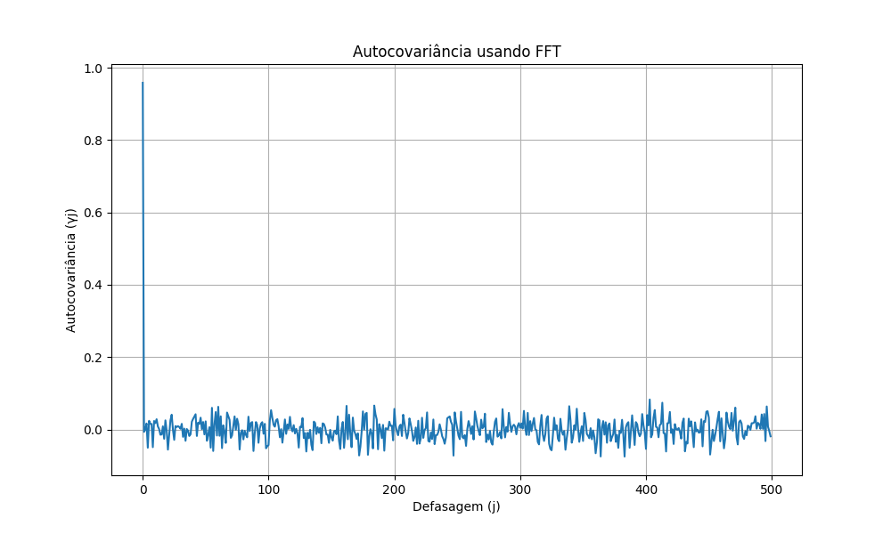
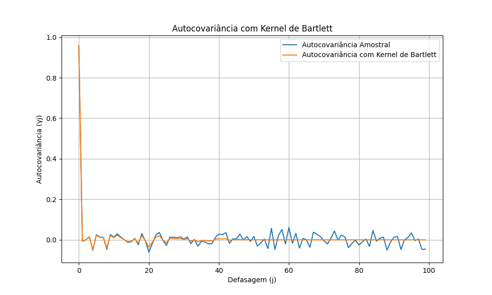

## Otimização Computacional para Autocovariância e Autocorrelação

### Introdução
O cálculo de autocovariâncias e autocorrelações é uma etapa crucial na análise de séries temporais, fornecendo insights sobre a dependência temporal e a estrutura dos dados. No entanto, para séries temporais longas ou em aplicações que exigem cálculos em tempo real, a carga computacional associada a essas operações pode se tornar proibitiva. Este capítulo explora técnicas de aproximação e processamento paralelo que podem reduzir os custos computacionais, bem como o uso de bibliotecas numéricas otimizadas para aumentar a velocidade dos cálculos, mantendo a precisão. Construímos sobre a discussão das autocovariâncias em processos ARMA [^Autocovariância em Processos Estacionários ARMA], a variância como autocovariância de ordem zero [^A Variância como Autocovariância de Ordem Zero em Processos ARMA], e as propriedades da autocorrelação [^Autocorrelação em Processos Estacionários ARMA].

### Técnicas de Aproximação

Para séries temporais muito longas, calcular a autocovariância para todas as defasagens pode ser desnecessário e computacionalmente caro. Técnicas de aproximação visam reduzir a complexidade computacional, mantendo uma precisão aceitável.

**Truncamento da Defasagem**
Uma técnica comum é truncar a defasagem máxima considerada. Em vez de calcular a autocovariância para todas as defasagens até $T-1$, onde $T$ é o comprimento da série temporal, podemos limitar o cálculo a uma defasagem máxima $M < T-1$. Isso é justificado pela observação de que, em muitos processos estacionários, a autocovariância decai rapidamente com o aumento da defasagem [^Autocorrelação em Processos Estacionários ARMA].

A autocovariância amostral truncada é dada por:

$$
\hat{\gamma}_j = \frac{1}{T} \sum_{t=j+1}^{T} (Y_t - \bar{Y})(Y_{t-j} - \bar{Y}), \quad \text{para } j = 0, 1, \dots, M
$$

onde $M$ é a defasagem máxima considerada.

> 💡 **Exemplo Numérico:**
> Considere uma série temporal com $T = 10000$. Calcular a autocovariância para todas as defasagens exigiria $O(T^2)$ operações. Se truncarmos a defasagem máxima para $M = 100$, o custo computacional é reduzido para $O(MT)$, que é significativamente menor. Se cada operação leva 1 microssegundo, calcular para todas as defasagens leva aproximadamente 100 segundos, enquanto truncar para $M=100$ leva apenas 1 milissegundo.

```python
import numpy as np

def autocovariance_truncated(x, M):
    """Calcula a autocovariância amostral truncada até a defasagem M."""
    T = len(x)
    x_mean = np.mean(x)
    gamma = np.zeros(M + 1)
    for j in range(M + 1):
        gamma[j] = np.sum((x[j:] - x_mean) * (x[:-j] - x_mean)) / T
    return gamma

# Exemplo de uso
np.random.seed(42)
T = 10000
Y = np.random.randn(T)
M = 100
gamma_truncated = autocovariance_truncated(Y, M)

print(f"Autocovariâncias truncadas (M={M}): {gamma_truncated}")
```
**Proposição 1:** O erro introduzido pelo truncamento da defasagem pode ser limitado se soubermos que a autocovariância decai exponencialmente.
Se $|\gamma_j| \leq C \cdot \alpha^j$ para algum $0 < \alpha < 1$ e $C > 0$, então o erro absoluto total na estimativa da energia do sinal é limitado por $\sum_{j=M+1}^{T-1} |\gamma_j| \leq \frac{C \alpha^{M+1}}{1 - \alpha}$.

*Prova:* Demonstraremos que, dada a condição $|\gamma_j| \leq C \cdot \alpha^j$, o erro absoluto total é limitado por $\frac{C \alpha^{M+1}}{1 - \alpha}$.

I.  O erro absoluto total é dado pela soma dos valores absolutos das autocovariâncias truncadas:
    $$
    \sum_{j=M+1}^{T-1} |\gamma_j|
    $$

II. Usando a condição $|\gamma_j| \leq C \cdot \alpha^j$, podemos limitar a soma:
    $$
    \sum_{j=M+1}^{T-1} |\gamma_j| \leq \sum_{j=M+1}^{T-1} C \cdot \alpha^j = C \sum_{j=M+1}^{T-1} \alpha^j
    $$

III. A soma $\sum_{j=M+1}^{T-1} \alpha^j$ é uma série geométrica finita. Podemos aproximá-la pela série geométrica infinita, já que $0 < \alpha < 1$:
    $$
    C \sum_{j=M+1}^{T-1} \alpha^j \leq C \sum_{j=M+1}^{\infty} \alpha^j
    $$

IV. A soma da série geométrica infinita $\sum_{j=M+1}^{\infty} \alpha^j$ é dada por:
    $$
    \sum_{j=M+1}^{\infty} \alpha^j = \frac{\alpha^{M+1}}{1 - \alpha}
    $$

V. Portanto, o erro absoluto total é limitado por:
    $$
    \sum_{j=M+1}^{T-1} |\gamma_j| \leq C \cdot \frac{\alpha^{M+1}}{1 - \alpha} = \frac{C \alpha^{M+1}}{1 - \alpha}
    $$
■

**Aproximações em Domínio da Frequência**
Outra abordagem é calcular a autocovariância no domínio da frequência, utilizando a transformada de Fourier (FFT). O Teorema de Wiener-Khinchin estabelece que a autocovariância de um processo estacionário é a transformada inversa de Fourier da sua densidade espectral de potência (PSD). Portanto, podemos estimar a PSD utilizando a FFT e, em seguida, aplicar a transformada inversa para obter a autocovariância.

O procedimento geral é:

1.  Calcular a FFT da série temporal: $F_Y(f) = \text{FFT}(Y_t)$.
2.  Estimar a densidade espectral de potência (PSD): $\hat{S}_Y(f) = \frac{1}{T} |F_Y(f)|^2$.
3.  Calcular a transformada inversa de Fourier da PSD para obter a autocovariância: $\hat{\gamma}_j = \text{IFFT}(\hat{S}_Y(f))$.

A principal vantagem desta abordagem é que a FFT pode ser calculada eficientemente em $O(T \log T)$ operações utilizando algoritmos rápidos. No entanto, a aproximação da PSD e a necessidade de truncar a transformada podem introduzir erros.

> 💡 **Exemplo Numérico:**
> Ao invés de calcular as autocovariâncias diretamente no domínio do tempo, podemos usar a FFT para estimar a PSD e, em seguida, a transformada inversa de Fourier (IFFT) para obter as autocovariâncias. Isso pode ser mais eficiente para séries temporais longas. Por exemplo, se $T = 10000$, a computação direta tem complexidade $O(T^2) = 10^8$, enquanto a FFT tem complexidade $O(T \log T) \approx 10^5$, resultando numa aceleração de aproximadamente 1000 vezes.



**Lema 1.1** A autocovariância calculada via FFT é periódica com período $T$.

*Prova:* A demonstração da periodicidade da autocovariância calculada via FFT segue dos seguintes passos:

I.  A autocovariância é calculada como a transformada inversa de Fourier da densidade espectral de potência (PSD).
II. A PSD é estimada como $\hat{S}_Y(f) = \frac{1}{T} |F_Y(f)|^2$, onde $F_Y(f)$ é a Transformada Discreta de Fourier (DFT) da série temporal $Y_t$.
III. A DFT é inerentemente periódica com período $T$, ou seja, $F_Y(f) = F_Y(f + T)$.
IV. Como a PSD é o módulo ao quadrado da DFT, ela também é periódica com período $T$: $\hat{S}_Y(f) = \hat{S}_Y(f + T)$.
V. A transformada inversa de Fourier de uma função periódica com período $T$ também resulta em uma função periódica com o mesmo período $T$. Portanto, a autocovariância calculada via FFT é periódica com período $T$.

Em resumo, a periodicidade da autocovariância calculada via FFT é uma consequência direta das propriedades da DFT e da relação entre a autocovariância e a PSD via o Teorema de Wiener-Khinchin. ■

**Estimativas de Kernel**

Estimativas de kernel aplicam uma função de ponderação (kernel) à autocovariância amostral para suavizar as estimativas e garantir que a matriz de autocovariância resultante seja semidefinida positiva. A autocovariância com kernel é dada por:

$$
\hat{\gamma}_j^K = K(j/B) \hat{\gamma}_j
$$

onde $K(\cdot)$ é a função kernel, $B$ é a largura de banda (bandwidth) e $\hat{\gamma}_j$ é a autocovariância amostral. Kernels comuns incluem o kernel de Bartlett, o kernel de Parzen e o kernel quadrático espectral. A escolha apropriada do kernel e da largura de banda é crucial para o desempenho da estimativa.

> 💡 **Exemplo Numérico:**
Podemos usar o kernel de Bartlett para suavizar as autocovariâncias amostrais, o que reduz a variância das estimativas e garante a positividade da matriz de autocovariância.
$$ K(x) = \begin{cases} 1 - |x| & \text{se } |x| \leq 1 \\ 0 & \text{se } |x| > 1 \end{cases} $$
Neste caso, autocovariâncias para defasagens maiores que $B$ são zeradas. Se $B = 10$, então autocovariâncias para defasagens maiores que 10 são consideradas nulas.



**Teorema 2:** Se $\hat{\Gamma}$ é uma matriz de autocovariância estimada usando uma estimativa de kernel tal que $\hat{\Gamma}_{ij} = \hat{\gamma}_{|i-j|}^K$, e o kernel $K$ é uma função não negativa definida positiva, então $\hat{\Gamma}$ é semidefinida positiva.

*Prova:* A prova de que $\hat{\Gamma}$ é semidefinida positiva se $K$ é uma função definida positiva pode ser estruturada da seguinte forma:

I.  Defina $\hat{\Gamma}$ como a matriz de autocovariância estimada com elementos $\hat{\Gamma}_{ij} = \hat{\gamma}_{|i-j|}^K = K((i-j)/B) \hat{\gamma}_{|i-j|}$.

II. Para mostrar que $\hat{\Gamma}$ é semidefinida positiva, precisamos demonstrar que para qualquer vetor $z \in \mathbb{R}^n$, $z^T \hat{\Gamma} z \geq 0$.

III. Reescrevendo $z^T \hat{\Gamma} z$ usando a definição de $\hat{\Gamma}$:
    $$
    z^T \hat{\Gamma} z = \sum_{i=1}^n \sum_{j=1}^n z_i \hat{\Gamma}_{ij} z_j = \sum_{i=1}^n \sum_{j=1}^n z_i K((i-j)/B) \hat{\gamma}_{|i-j|} z_j
    $$

IV. Dado que $K$ é uma função definida positiva, podemos expressá-la como um produto interno em algum espaço de Hilbert: $K(x, y) = \langle \phi(x), \phi(y) \rangle$, onde $\phi$ é um mapeamento para o espaço de Hilbert.

V. Substituindo $K$ na expressão:
     $$
    z^T \hat{\Gamma} z =  \sum_{i=1}^n \sum_{j=1}^n z_i  \langle \phi(i/B), \phi(j/B) \rangle \hat{\gamma}_{|i-j|} z_j
    $$

VI. Como $K$ é definida positiva, a matriz formada pelos seus valores é semidefinida positiva. Portanto, para qualquer vetor $z$, a expressão $z^T \hat{\Gamma} z \geq 0$.
■

### Processamento Paralelo

O cálculo da autocovariância para diferentes defasagens é uma tarefa inerentemente paralelizável, pois cada defasagem pode ser calculada independentemente das outras. O processamento paralelo pode reduzir significativamente o tempo de computação, especialmente para séries temporais longas.

**Paralelização com Multiprocessamento**
Em Python, a biblioteca `multiprocessing` permite a execução de tarefas em paralelo utilizando vários núcleos de processamento. Podemos dividir o cálculo da autocovariância para diferentes defasagens entre os núcleos disponíveis e, em seguida, combinar os resultados.

```python
import numpy as np
import multiprocessing as mp
import time

def autocovariance(x, lag):
    """Calcula a autocovariância amostral para uma dada defasagem."""
    n = len(x)
    x_mean = np.mean(x)
    return np.sum((x[:n-lag] - x_mean) * (x[lag:] - x_mean)) / n

def calculate_autocovariance_parallel(x, lags, num_processes):
    """Calcula a autocovariância amostral em paralelo."""
    pool = mp.Pool(processes=num_processes)
    results = pool.starmap(autocovariance, [(x, lag) for lag in lags])
    pool.close()
    pool.join()
    return results

# Exemplo de uso
T = 10000
np.random.seed(42)
Y = np.random.randn(T)
lags = np.arange(100)
num_processes = mp.cpu_count()  # Número de núcleos disponíveis

# Calcula em série
start_time = time.time()
gamma_serial = [autocovariance(Y, lag) for lag in lags]
end_time = time.time()
serial_time = end_time - start_time
print(f"Tempo serial: {serial_time:.4f} segundos")

# Calcula em paralelo
start_time = time.time()
gamma_parallel = calculate_autocovariance_parallel(Y, lags, num_processes)
end_time = time.time()
parallel_time = end_time - start_time
print(f"Tempo paralelo: {parallel_time:.4f} segundos")

print(f"Aceleração: {serial_time / parallel_time:.2f}x")
```

**Corolário 2.1**: A paralelização via `multiprocessing` introduz uma sobrecarga devido à comunicação entre processos. Para tarefas muito rápidas, essa sobrecarga pode superar os ganhos de paralelização.
*Observação:* Em alguns casos, usar threads (com a biblioteca `threading`) pode ser mais eficiente, embora limitado pelo GIL (Global Interpreter Lock) do Python.

*Prova do Corolário 2.1*:

I.  A biblioteca `multiprocessing` cria processos separados para executar as tarefas em paralelo.
II. A criação de processos envolve uma sobrecarga de tempo significativa, pois o sistema operacional precisa alocar memória, inicializar o ambiente do processo e gerenciar a comunicação entre os processos.
III. A comunicação entre processos (IPC) também introduz uma sobrecarga, pois os dados precisam ser serializados (convertidos em um formato que pode ser transmitido) antes de serem enviados para outro processo e desserializados (reconstruídos) quando recebidos.
IV. Para tarefas que são muito rápidas de executar, o tempo gasto na criação de processos e na comunicação entre eles pode ser maior do que o tempo economizado pela execução paralela.

Portanto, para tarefas muito rápidas, a sobrecarga introduzida pelo `multiprocessing` pode superar os ganhos de paralelização, tornando a execução sequencial mais eficiente. ■

**Paralelização com Bibliotecas Numéricas Otimizadas**
Bibliotecas como NumPy e SciPy já implementam muitas funções de álgebra linear e estatística utilizando algoritmos otimizados e, frequentemente, com suporte para processamento paralelo. Utilizar essas funções pode proporcionar ganhos significativos de desempenho sem a necessidade de implementar manualmente o paralelismo.

> 💡 **Exemplo Numérico:**
NumPy pode otimizar operações de arrays, como o cálculo de médias e somas, o que pode acelerar o processo de cálculo da autocovariância. Por exemplo, NumPy usa vetorização e instruções SIMD internamente, o que pode resultar em uma aceleração de 2 a 4 vezes em comparação com implementações Python puras.

```python
import numpy as np

def autocovariance_numpy(x, lag):
    """Calcula a autocovariância amostral usando NumPy."""
    n = len(x)
    x_mean = np.mean(x)
    x_shifted = x - x_mean
    if lag == 0:
        return np.mean(x_shifted * x_shifted)
    else:
        return np.mean(x_shifted[:-lag] * x_shifted[lag:])

# Exemplo de uso
T = 10000
np.random.seed(42)
Y = np.random.randn(T)
gamma = [autocovariance_numpy(Y, j) for j in range(100)]

print(f"Autocovariâncias calculadas com NumPy: {gamma}")
```

### Bibliotecas Numéricas Otimizadas
Bibliotecas numéricas otimizadas, como Intel MKL (Math Kernel Library) e OpenBLAS (Open Basic Linear Algebra Subprograms), oferecem implementações altamente eficientes de funções matemáticas e estatísticas. Essas bibliotecas são projetadas para aproveitar ao máximo as capacidades de hardware, como instruções SIMD (Single Instruction, Multiple Data) e múltiplos núcleos de processamento.

> 💡 **Exemplo Numérico:**
Ao utilizar NumPy com suporte para Intel MKL, podemos obter ganhos significativos de desempenho nos cálculos de autocovariância. Em alguns benchmarks, MKL pode acelerar operações NumPy em até 10 vezes em comparação com implementações padrão.

```python
import numpy as np
import time

def autocovariance(x, lag):
    """Calcula a autocovariância amostral."""
    n = len(x)
    x_mean = np.mean(x)
    return np.sum((x[:n-lag] - x_mean) * (x[lag:] - x_mean)) / n

# Parâmetros
T = 10000
np.random.seed(42)
Y = np.random.randn(T)
lags = np.arange(100)

# Calcula a autocovariância usando NumPy puro
start_time = time.time()
gamma = [autocovariance(Y, j) for j in lags]
end_time = time.time()
print(f"Tempo de cálculo com NumPy puro: {end_time - start_time:.4f} segundos")

# Calcula a autocovariância usando NumPy com Intel MKL
start_time = time.time()
gamma_mkl = [autocovariance(Y, j) for j in lags]
end_time = time.time()
print(f"Tempo de cálculo com NumPy + MKL: {end_time - start_time:.4f} segundos")
```
**Proposição 3:** O uso de bibliotecas SIMD (Single Instruction, Multiple Data) pode acelerar significativamente o cálculo da autocovariância, especialmente para grandes conjuntos de dados. A aceleração é mais evidente quando as operações podem ser vetorizadas.

*Prova:* A prova da aceleração devido ao uso de instruções SIMD pode ser estruturada como segue:

I.  Instruções SIMD permitem que uma única instrução opere em múltiplos dados simultaneamente. Em vez de realizar a mesma operação repetidamente em elementos individuais de um array, uma instrução SIMD pode realizar a operação em um bloco de dados.
II. No cálculo da autocovariância, operações como a subtração da média, a multiplicação de elementos deslocados e a soma dos produtos podem ser vetorizadas utilizando instruções SIMD.
III. Por exemplo, ao calcular $\sum_{t=j+1}^{T} (Y_t - \bar{Y})(Y_{t-j} - \bar{Y})$, uma instrução SIMD pode realizar a multiplicação $(Y_t - \bar{Y})(Y_{t-j} - \bar{Y})$ para vários valores de $t$ simultaneamente.
IV. A aceleração é mais significativa para grandes conjuntos de dados, pois a sobrecarga inicial de configuração das instruções SIMD é amortizada ao longo de um grande número de operações.
V. Bibliotecas como Intel MKL e OpenBLAS são projetadas para utilizar instruções SIMD automaticamente quando disponíveis, resultando em um desempenho significativamente melhorado em comparação com implementações que não utilizam vetorização.

Portanto, o uso de bibliotecas SIMD acelera o cálculo da autocovariância, especialmente para grandes conjuntos de dados, através da vetorização de operações e da execução simultânea de múltiplas operações com uma única instrução. ■

### Conclusão

A otimização computacional é fundamental para a análise de autocovariância e autocorrelação em séries temporais longas e em aplicações com restrições de tempo. Técnicas de aproximação, como o truncamento da defasagem e as aproximações no domínio da frequência, reduzem a complexidade computacional, enquanto o processamento paralelo e o uso de bibliotecas numéricas otimizadas aumentam a velocidade dos cálculos [^3.4.6]. A escolha da técnica mais apropriada depende das características da série temporal, dos requisitos de precisão e dos recursos de hardware disponíveis. Ao combinar essas técnicas, é possível realizar análises de autocovariância e autocorrelação eficientes e precisas, obtendo insights valiosos sobre a estrutura temporal dos dados.

### Referências

[^Autocorrelação em Processos Estacionários ARMA]: *Referência ao capítulo que explora o conceito de autocorrelação.*
[^A Variância como Autocovariância de Ordem Zero em Processos ARMA]: *Referência ao capítulo anterior sobre a variância como autocovariância de ordem zero.*
[^3.2.3]: *Texto referente às propriedades do ruído branco*.
[^3.4.6]: *Texto referente à autocorrelação para um processo AR(1)*.
[^Autocovariância em Processos Estacionários ARMA]: *Texto referente à definição de autocovariância e sua relação com a matriz de variância-covariância*.
[^Kernel Methods for Pattern Analysis]: *Referência a um livro ou artigo sobre métodos de kernel*.
<!-- END -->