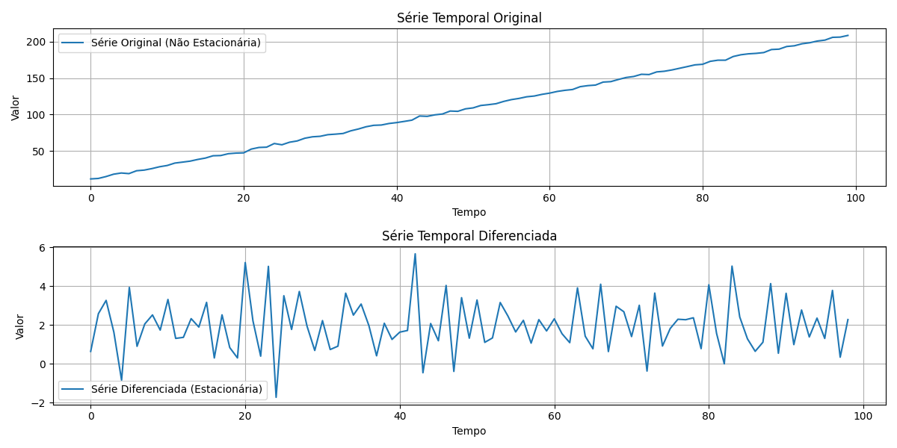

## Covariância-Estacionaridade em Séries Temporais

### Introdução
Dando continuidade ao estudo de processos estocásticos e suas propriedades estatísticas, este capítulo se aprofunda no conceito de **covariância-estacionaridade**, também conhecida como estacionaridade fraca. Essa propriedade, crucial na análise de séries temporais, impõe restrições sobre como as características estatísticas de um processo evoluem ao longo do tempo. Em particular, concentraremos nossa atenção em processos **covariância-estacionários** onde a média e as autocovariâncias não dependem do tempo. Essa condição simplifica a análise e permite a aplicação de ferramentas estatísticas baseadas em amostras únicas de séries temporais.

### Conceitos Fundamentais
A **estacionaridade** é uma propriedade fundamental de séries temporais que se manifesta em diferentes níveis de rigor. Um processo estocástico $\{Y_t\}$ é dito ser *estritamente estacionário* se a distribuição conjunta de $(Y_{t_1}, Y_{t_2}, ..., Y_{t_n})$ é a mesma que a distribuição conjunta de $(Y_{t_1+h}, Y_{t_2+h}, ..., Y_{t_n+h})$ para qualquer $t_1, t_2, ..., t_n$ e qualquer $h$. Intuitivamente, isso significa que as propriedades estatísticas do processo são invariantes a translações no tempo.

Uma forma mais branda de estacionaridade é a **covariância-estacionaridade** (ou estacionaridade fraca), que impõe condições menos restritivas. Um processo $\{Y_t\}$ é covariância-estacionário se satisfaz as seguintes condições:

1.  A média do processo é constante ao longo do tempo:
    $$E[Y_t] = \mu \quad \text{para todo } t$$
2.  A autocovariância entre $Y_t$ e $Y_{t-j}$ depende apenas da defasagem $j$ e não de $t$:
    $$E[(Y_t - \mu)(Y_{t-j} - \mu)] = \gamma_j \quad \text{para todo } t \text{ e qualquer } j$$

Em outras palavras, para um processo covariância-estacionário, a média $\mu$ é um valor constante e a função de autocovariância $\gamma_j$ é uma função apenas da diferença de tempo $j$.  A função $\gamma_j$ é denominada **função de autocovariância**. Note que $\gamma_0$ representa a variância do processo, ou seja, $\gamma_0 = E[(Y_t - \mu)^2] = Var(Y_t)$.

> 💡 **Exemplo Numérico:** Suponha que temos uma série temporal $\{Y_t\}$ com $Y_t = 5 + \epsilon_t$, onde $\epsilon_t$ é ruído branco com média 0 e variância 1. Aqui, $E[Y_t] = 5$ para todo $t$, mostrando que a média é constante. Além disso, $E[(Y_t - 5)(Y_{t-j} - 5)] = E[\epsilon_t \epsilon_{t-j}]$. Se $j=0$, então $E[\epsilon_t^2] = 1$, e se $j \neq 0$, então $E[\epsilon_t \epsilon_{t-j}] = 0$. Portanto, a autocovariância depende apenas de $j$ e não de $t$.

**Teorema 1:** *A função de autocovariância $\gamma_j$ de um processo covariância-estacionário é uma função par, ou seja, $\gamma_j = \gamma_{-j}$ para todo $j$.*

**Prova:** Provaremos que para um processo covariância-estacionário, sua função de autocovariância satisfaz $\gamma_j = \gamma_{-j}$.

I. Iniciamos com a definição da função de autocovariância:
   $$\gamma_j = E[(Y_t - \mu)(Y_{t-j} - \mu)]$$

II. Agora, considere $\gamma_{-j}$:
    $$\gamma_{-j} = E[(Y_t - \mu)(Y_{t+j} - \mu)]$$

III. Para tornar a notação consistente, podemos mudar o índice de tempo na segunda equação.  Seja $k = t+j$, então $t = k-j$. Substituindo:
     $$\gamma_{-j} = E[(Y_{k-j} - \mu)(Y_{k} - \mu)]$$

IV. Devido à propriedade comutativa da multiplicação, podemos reescrever a expressão dentro da esperança:
    $$\gamma_{-j} = E[(Y_{k} - \mu)(Y_{k-j} - \mu)]$$

V. Observando que a expressão em IV é idêntica à expressão em I (apenas com um índice diferente), concluímos que:
   $$\gamma_j = \gamma_{-j}$$
   Portanto, a função de autocovariância é uma função par. ■

**Exemplo:** Considere o processo de ruído branco Gaussiano, onde $Y_t = \epsilon_t$ e $\epsilon_t \sim N(0, \sigma^2)$ são variáveis aleatórias independentes e identicamente distribuídas (i.i.d.). Neste caso, $E[Y_t] = E[\epsilon_t] = 0$ para todo $t$. A autocovariância é dada por:

$$
E[Y_tY_{t-j}] = E[\epsilon_t \epsilon_{t-j}] =
\begin{cases}
\sigma^2, & \text{se } j=0 \\
0, & \text{se } j \neq 0
\end{cases}
$$

Portanto, o ruído branco Gaussiano é um processo covariância-estacionário, já que a média e a autocovariância não dependem de $t$.

> 💡 **Exemplo Numérico:** Seja $\sigma^2 = 4$. Então, para o ruído branco gaussiano, $\gamma_0 = 4$ e $\gamma_j = 0$ para $j \neq 0$. Isso significa que a variância do processo é constante e igual a 4, e a covariância entre quaisquer dois pontos no tempo diferentes é 0.

**Definição:** A **função de autocorrelação** (FAC) de um processo covariância-estacionário é definida como:

$$
\rho_j = \frac{\gamma_j}{\gamma_0} = \frac{E[(Y_t - \mu)(Y_{t-j} - \mu)]}{Var(Y_t)}
$$

Note que $\rho_0 = 1$ e, como $\gamma_j$ é uma função par, $\rho_j$ também é uma função par, ou seja, $\rho_j = \rho_{-j}$. Além disso, $|\rho_j| \leq 1$ para todo $j$.

**Lema 1.1:** *Para um processo covariância-estacionário, a função de autocorrelação $\rho_j$ satisfaz $|\rho_j| \leq 1$ para todo $j$.*

**Prova:** Provaremos que a função de autocorrelação $\rho_j$ de um processo covariância-estacionário tem magnitude menor ou igual a 1.

I. Começamos com a desigualdade de Cauchy-Schwarz aplicada a variáveis aleatórias centradas:
   $$|E[(Y_t - \mu)(Y_{t-j} - \mu)]| \leq \sqrt{E[(Y_t - \mu)^2] E[(Y_{t-j} - \mu)^2]}$$

II. Reconhecemos que $E[(Y_t - \mu)^2]$ e $E[(Y_{t-j} - \mu)^2]$ representam a variância de $Y_t$ e $Y_{t-j}$, respectivamente.  Para um processo covariância-estacionário, essas variâncias são iguais e denotadas por $\gamma_0$. Assim:
    $$|\gamma_j| \leq \sqrt{\gamma_0 \gamma_0} = \gamma_0$$

III. Dividimos ambos os lados da desigualdade por $\gamma_0$ (que é a variância e, portanto, positiva) para obter a função de autocorrelação:
     $$\left|\frac{\gamma_j}{\gamma_0}\right| \leq \frac{\gamma_0}{\gamma_0} = 1$$

IV. Pela definição da função de autocorrelação $\rho_j = \frac{\gamma_j}{\gamma_0}$, concluímos:
   $$|\rho_j| \leq 1$$
   Portanto, a magnitude da função de autocorrelação é sempre menor ou igual a 1. ■

**Exemplo:** Para o processo de ruído branco Gaussiano, a função de autocorrelação é dada por:

$$
\rho_j =
\begin{cases}
1, & \text{se } j=0 \\
0, & \text{se } j \neq 0
\end{cases}
$$

> 💡 **Exemplo Numérico:** Usando o exemplo anterior com ruído branco gaussiano e $\sigma^2 = 4$, temos $\gamma_0 = 4$. Portanto, $\rho_0 = \gamma_0 / \gamma_0 = 4/4 = 1$, e $\rho_j = \gamma_j / \gamma_0 = 0/4 = 0$ para $j \neq 0$. Isso confirma que a autocorrelação é 1 no lag 0 e 0 em todos os outros lags.

**Relação entre estacionaridade estrita e covariância-estacionaridade:** Se um processo é estritamente estacionário e possui momentos de segunda ordem finitos (isto é, média e variância finitas), então ele é também covariância-estacionário. No entanto, a recíproca não é necessariamente verdadeira. Um processo pode ser covariância-estacionário sem ser estritamente estacionário [^3]. Isso pode ocorrer, por exemplo, se momentos de ordem superior (além da média e autocovariância) dependem do tempo, mesmo que a média e a autocovariância sejam constantes.

**Importância da covariância-estacionaridade:** A covariância-estacionaridade é uma propriedade desejável em séries temporais, pois permite que a análise estatística seja realizada com base em uma única realização da série temporal. Se um processo é covariância-estacionário, podemos estimar a média e a função de autocovariância a partir de uma amostra da série temporal, e essas estimativas serão representativas do processo em qualquer período de tempo. Isso justifica o uso de estimativas de médias amostrais e autocovariâncias amostrais para inferir propriedades do processo estocástico subjacente [^3].

**Transformações para estacionaridade:** Muitas séries temporais encontradas na prática não são estacionárias. Nesses casos, é comum aplicar transformações aos dados para torná-los aproximadamente estacionários. Algumas transformações comuns incluem:

*   **Diferenciação:** Calcular a diferença entre valores consecutivos da série temporal. Isso pode remover tendências lineares ou polinomiais.
*   **Transformação logarítmica:** Aplicar o logaritmo aos dados. Isso pode estabilizar a variância e linearizar relações não lineares.
*   **Deflação:** Dividir a série temporal por um índice de preços. Isso pode remover os efeitos da inflação.

> 💡 **Exemplo Numérico:** Suponha que temos uma série temporal de preços de ações que cresce linearmente ao longo do tempo: $Y_t = 10 + 2t + \epsilon_t$, onde $\epsilon_t$ é ruído branco. Esta série não é estacionária porque sua média $E[Y_t] = 10 + 2t$ depende do tempo. Ao aplicar a diferenciação, obtemos uma nova série $Z_t = Y_t - Y_{t-1} = (10 + 2t + \epsilon_t) - (10 + 2(t-1) + \epsilon_{t-1}) = 2 + \epsilon_t - \epsilon_{t-1}$.  A média de $Z_t$ é $E[Z_t] = 2$, que é constante.  A autocovariância de $Z_t$ também não depende de t, tornando $Z_t$ covariância-estacionária.

Após aplicar essas transformações, é importante verificar se a série resultante é aproximadamente estacionária. Isso pode ser feito visualmente (por meio de gráficos da série temporal e de sua função de autocorrelação) ou por meio de testes estatísticos de estacionaridade, como o teste de Dickey-Fuller aumentado (ADF).

### Conclusão
A covariância-estacionaridade é um conceito central na análise de séries temporais. Ela simplifica a análise e permite que inferências sobre o processo estocástico sejam feitas a partir de uma única realização da série temporal. Embora nem todas as séries temporais sejam estacionárias, muitas podem ser transformadas para se tornarem aproximadamente estacionárias, permitindo a aplicação de ferramentas estatísticas baseadas em estacionaridade.

### Referências
[^3]: Retomado dos conceitos abordados anteriormente.
<!-- END -->