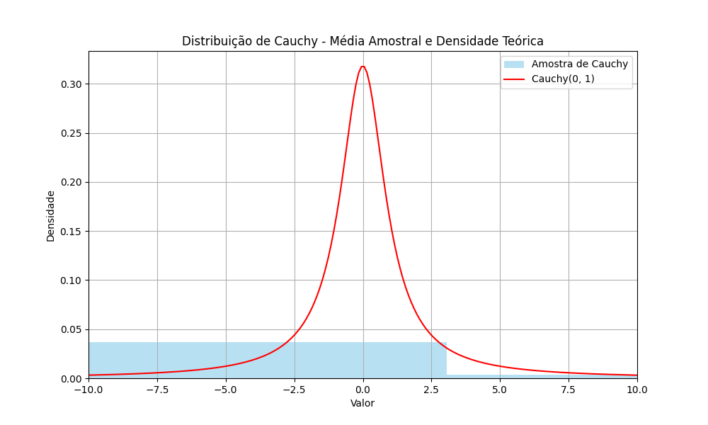

## Relação entre Estacionaridade Estrita e Covariância-Estacionaridade

### Introdução
Este capítulo explora a interconexão entre dois conceitos cruciais na análise de séries temporais: a **estacionaridade estrita** e a **covariância-estacionaridade**. Como vimos anteriormente [^3], [^DIRECTORY_PLACEHOLDER], [^SECTION_PLACEHOLDER], um processo estocástico pode exibir diferentes graus de estacionaridade, cada um impondo diferentes restrições sobre as propriedades estatísticas do processo ao longo do tempo. Aqui, nos aprofundaremos na relação hierárquica entre a estacionaridade estrita e a covariância-estacionaridade, demonstrando que a estacionaridade estrita, combinada com a existência de momentos de segunda ordem finitos, implica a covariância-estacionaridade, mas o inverso nem sempre é verdadeiro.

### Conceitos Fundamentais
Para recapitular, um processo estocástico $\{Y_t\}$ é dito ser **estritamente estacionário** se a distribuição conjunta de qualquer conjunto de variáveis aleatórias $(Y_{t_1}, Y_{t_2}, ..., Y_{t_n})$ é invariante a translações no tempo [^3], [^DIRECTORY_PLACEHOLDER], [^SECTION_PLACEHOLDER]. Formalmente, para qualquer $t, h, j_1, ..., j_n$:

$$F(Y_t, Y_{t+j_1}, \ldots, Y_{t+j_n}) = F(Y_{t+h}, Y_{t+j_1+h}, \ldots, Y_{t+j_n+h})$$

Por outro lado, um processo $\{Y_t\}$ é **covariância-estacionário** (ou fracamente estacionário) se sua média $E[Y_t] = \mu$ é constante para todo $t$, e sua autocovariância $E[(Y_t - \mu)(Y_{t-j} - \mu)] = \gamma_j$ depende apenas da defasagem $j$ e não do tempo $t$ [^3], [^DIRECTORY_PLACEHOLDER], [^SECTION_PLACEHOLDER].

> 💡 **Exemplo Numérico:** Considere uma série temporal de temperaturas diárias coletadas ao longo de vários anos em uma cidade. Se a média da temperatura diária permanece constante ao longo do tempo (por exemplo, a média da temperatura em janeiro é consistentemente 5°C a cada ano) e a autocovariância entre as temperaturas em dias consecutivos (defasagem de 1) também permanece constante ao longo do tempo, então a série temporal é covariância-estacionária.

**Teorema Principal:** Se um processo é estritamente estacionário e possui momentos de segunda ordem finitos, então ele deve ser covariância-estacionário; entretanto, o inverso não é necessariamente verdadeiro.

**Prova:**
A prova consiste em duas partes:

1.  *Estacionaridade Estrita Implica Média Constante:*

    Seja $\{Y_t\}$ um processo estritamente estacionário com $E[Y_t] = \mu_t$. Como o processo é estritamente estacionário, a distribuição de $Y_t$ é a mesma para todo $t$. Portanto, a média $E[Y_t]$ é a mesma para todo $t$. Assim, $\mu_t = \mu$, onde $\mu$ é uma constante.

    Prova formal:

    I. Seja $\{Y_t\}$ um processo estritamente estacionário.
    II. Pela definição de estacionaridade estrita, a distribuição de $Y_t$ é a mesma para todos os valores de $t$.
    III. Portanto, $E[Y_t] = E[Y_{t+h}]$ para todo $t$ e $h$.
    IV. Se definirmos $E[Y_t] = \mu_t$, então $\mu_t = \mu_{t+h}$ para todo $t$ e $h$.
    V. Isso implica que $\mu_t$ é constante com relação a $t$, ou seja, $\mu_t = \mu$ para alguma constante $\mu$.
    Portanto, a estacionaridade estrita implica que a média é constante. ■

    > 💡 **Exemplo Numérico:** Suponha que simulamos uma série temporal $\{Y_t\}$ de 1000 pontos a partir de uma distribuição normal com média 5 e desvio padrão 2. Se a série é estritamente estacionária, então a média amostral calculada a partir de qualquer subconjunto da série temporal (por exemplo, os primeiros 500 pontos ou os últimos 500 pontos) deve ser aproximadamente igual à média teórica de 5.
    ```python
    import numpy as np
    import matplotlib.pyplot as plt

    # Gerar dados aleatórios de uma distribuição normal
    np.random.seed(42)  # Define a semente para reproducibilidade
    mu = 5
    sigma = 2
    n = 1000
    Y = np.random.normal(mu, sigma, n)

    # Calcular a média amostral
    media_amostral = np.mean(Y)

    # Calcular a média amostral dos primeiros 500 pontos
    media_amostral_primeiros_500 = np.mean(Y[:500])

    # Calcular a média amostral dos últimos 500 pontos
    media_amostral_ultimos_500 = np.mean(Y[500:])

    print(f"Média teórica: {mu}")
    print(f"Média amostral: {media_amostral:.2f}")
    print(f"Média amostral (primeiros 500): {media_amostral_primeiros_500:.2f}")
    print(f"Média amostral (últimos 500): {media_amostral_ultimos_500:.2f}")

    plt.figure(figsize=(10, 6))
    plt.plot(Y)
    plt.axhline(mu, color='r', linestyle='--', label=f'Média Teórica ({mu})')
    plt.axhline(media_amostral, color='g', linestyle='-', label=f'Média Amostral ({media_amostral:.2f})')
    plt.title("Série Temporal Estritamente Estacionária (Normal)")
    plt.xlabel("Tempo")
    plt.ylabel("Valor")
    plt.legend()
    plt.grid(True)
    plt.show()
    ```

2.  *Estacionaridade Estrita Implica Autocovariância Dependente Apenas da Defasagem:*

    Considere a autocovariância entre $Y_t$ e $Y_{t-j}$:
    $$\gamma_{t,j} = E[(Y_t - \mu)(Y_{t-j} - \mu)]$$
    Como o processo é estritamente estacionário, a distribuição conjunta de $(Y_t, Y_{t-j})$ é a mesma para todo $t$. Portanto, a autocovariância $E[(Y_t - \mu)(Y_{t-j} - \mu)]$ depende apenas da defasagem $j$ e não de $t$. Assim, $\gamma_{t,j} = \gamma_j$, onde $\gamma_j$ é uma função apenas de $j$.

    Prova formal:
    I. Seja $\{Y_t\}$ um processo estritamente estacionário com média constante $\mu$.
    II. A autocovariância entre $Y_t$ e $Y_{t-j}$ é definida como $\gamma_{t,j} = E[(Y_t - \mu)(Y_{t-j} - \mu)]$.
    III. Pela definição de estacionaridade estrita, a distribuição conjunta de $(Y_t, Y_{t-j})$ é a mesma que a distribuição conjunta de $(Y_{t+h}, Y_{t+h-j})$ para qualquer $h$.
    IV. Portanto, $E[g(Y_t, Y_{t-j})] = E[g(Y_{t+h}, Y_{t+h-j})]$ para qualquer função $g$.
    V. Seja $g(Y_t, Y_{t-j}) = (Y_t - \mu)(Y_{t-j} - \mu)$. Então,
    $E[(Y_t - \mu)(Y_{t-j} - \mu)] = E[(Y_{t+h} - \mu)(Y_{t+h-j} - \mu)]$.
    VI. Escolhendo $h = -t$, obtemos $E[(Y_t - \mu)(Y_{t-j} - \mu)] = E[(Y_{0} - \mu)(Y_{-j} - \mu)]$, que é uma função apenas de $j$.
    VII. Portanto, $\gamma_{t,j} = \gamma_j$, onde $\gamma_j$ depende apenas da defasagem $j$.
    Assim, a estacionaridade estrita implica que a autocovariância depende apenas da defasagem. ■

    > 💡 **Exemplo Numérico:** Considere uma série temporal estritamente estacionária com média 0. Calculamos a autocovariância para uma defasagem de 1 (j=1) nos primeiros 500 pontos e depois nos últimos 500 pontos. Se o processo for estritamente estacionário, essas duas autocovariâncias devem ser aproximadamente iguais.
    ```python
    import numpy as np
    import matplotlib.pyplot as plt

    # Gerar dados aleatórios de uma distribuição normal
    np.random.seed(42)  # Define a semente para reproducibilidade
    mu = 0
    sigma = 1
    n = 1000
    Y = np.random.normal(mu, sigma, n)

    # Calcular a autocovariância para defasagem 1 nos primeiros 500 pontos
    def autocovariance(x, lag):
        n = len(x)
        x_mean = np.mean(x)
        sum_term = np.sum((x[:n-lag] - x_mean) * (x[lag:] - x_mean))
        return sum_term / n

    autocov_primeiros_500 = autocovariance(Y[:500], 1)

    # Calcular a autocovariância para defasagem 1 nos últimos 500 pontos
    autocov_ultimos_500 = autocovariance(Y[500:], 1)

    print(f"Autocovariância (primeiros 500, lag=1): {autocov_primeiros_500:.2f}")
    print(f"Autocovariância (últimos 500, lag=1): {autocov_ultimos_500:.2f}")

    # Plotting the series
    plt.figure(figsize=(10, 6))
    plt.plot(Y)
    plt.title("Série Temporal Estritamente Estacionária (Normal) - Autocovariância")
    plt.xlabel("Tempo")
    plt.ylabel("Valor")
    plt.grid(True)
    plt.show()
    ```

Portanto, se $\{Y_t\}$ é estritamente estacionário e tem momentos de segunda ordem finitos, então ele é também covariância-estacionário.

Agora, vamos mostrar que o inverso não é sempre verdadeiro. Ou seja, um processo pode ser covariância-estacionário sem ser estritamente estacionário.

Para isso, considere um processo $\{Y_t\}$ onde:

*   $Y_t \sim N(0,1)$ para $t < T_0$
*   $Y_t \sim U(-\sqrt{3}, \sqrt{3})$ para $t \geq T_0$

onde $N(0,1)$ representa a distribuição normal padrão e $U(-\sqrt{3}, \sqrt{3})$ representa a distribuição uniforme no intervalo $(-\sqrt{3}, \sqrt{3})$. Note que ambas as distribuições têm média 0 e variância 1.

Portanto, $E[Y_t] = 0$ e $Var[Y_t] = 1$ para todo $t$. Além disso, se assumirmos que os $Y_t$'s são independentes, então $Cov(Y_t, Y_{t-j}) = 0$ para $j \neq 0$. Assim, este processo é covariância-estacionário.

No entanto, este processo não é estritamente estacionário, pois a distribuição de $Y_t$ muda em $t = T_0$. Especificamente, a distribuição de $Y_t$ é normal para $t < T_0$ e uniforme para $t \geq T_0$. Isso significa que a distribuição conjunta de qualquer conjunto de variáveis $Y_{t_1}, Y_{t_2}, \ldots, Y_{t_n}$ depende de se os índices $t_1, t_2, \ldots, t_n$ são todos menores que $T_0$, todos maiores ou iguais a $T_0$, ou uma mistura de ambos. Portanto, a distribuição conjunta não é invariante a translações no tempo, e o processo não é estritamente estacionário. $\blacksquare$

> 💡 **Exemplo Numérico:**  Vamos simular a série temporal descrita acima com  $T_0 = 500$ e visualizar as distribuições antes e depois de $T_0$.

```python
import numpy as np
import matplotlib.pyplot as plt
import scipy.stats as stats

# Parâmetros
T0 = 500
n = 1000

# Gerar dados
np.random.seed(42)
Y = np.concatenate([np.random.normal(0, 1, T0), np.random.uniform(-np.sqrt(3), np.sqrt(3), n - T0)])

# Verificar média e variância
print(f"Média da série: {np.mean(Y):.2f}")
print(f"Variância da série: {np.var(Y):.2f}")

# Plotar a série temporal
plt.figure(figsize=(12, 6))
plt.plot(Y)
plt.axvline(T0, color='r', linestyle='--', label='T0 = 500')
plt.title("Série Temporal Covariância-Estacionária, Não Estritamente Estacionária")
plt.xlabel("Tempo")
plt.ylabel("Valor")
plt.legend()
plt.grid(True)
plt.show()

# Plotar histogramas antes e depois de T0
plt.figure(figsize=(12, 6))
plt.hist(Y[:T0], bins=30, density=True, alpha=0.5, label='t < T0 (Normal)')
plt.hist(Y[T0:], bins=30, density=True, alpha=0.5, label='t >= T0 (Uniforme)')

# Sobrepor as funções de densidade de probabilidade teóricas
x = np.linspace(-4, 4, 100)
plt.plot(x, stats.norm.pdf(x, 0, 1), color='blue', label='Normal(0, 1)')
x = np.linspace(-np.sqrt(3), np.sqrt(3), 100)
plt.plot(x, stats.uniform.pdf(x, -np.sqrt(3), 2*np.sqrt(3)), color='orange', label='Uniforme(-√3, √3)')

plt.title("Distribuições antes e depois de T0")
plt.xlabel("Valor")
plt.ylabel("Densidade")
plt.legend()
plt.grid(True)
plt.show()
```

**Observação Importante:** A existência de momentos de segunda ordem finitos é crucial para que a estacionaridade estrita implique a covariância-estacionaridade. Se os momentos de segunda ordem não existirem (por exemplo, para algumas distribuições de cauda pesada), um processo estritamente estacionário pode não ser covariância-estacionário.

**Exemplo de um processo estritamente estacionário que não é covariância-estacionário:** Considere uma sequência de variáveis aleatórias i.i.d. $\{X_t\}$, onde cada $X_t$ segue uma distribuição de Cauchy centrada em 0, com função de densidade de probabilidade dada por:

$$f(x) = \frac{1}{\pi(1 + x^2)}$$

A distribuição de Cauchy é simétrica em torno de 0, de modo que $E[X_t] = 0$ (no sentido de valor principal de Cauchy). No entanto, a distribuição de Cauchy não possui momentos finitos de ordem superior a 0. Em particular, a variância (e, portanto, o momento de segunda ordem) não é definida.

Como os $X_t$ são i.i.d., a distribuição conjunta de qualquer conjunto de $X_{t_1}, X_{t_2}, ..., X_{t_n}$ depende apenas da distribuição marginal, e não do tempo. Portanto, o processo é estritamente estacionário.

No entanto, como a variância não existe, o processo não pode ser covariância-estacionário. Portanto, este é um exemplo de um processo estritamente estacionário que não é covariância-estacionário.

> 💡 **Exemplo Numérico:** A distribuição de Cauchy é simétrica em torno de 0, de modo que a média teórica é 0. No entanto, devido às caudas pesadas, as médias amostrais podem variar amplamente, e a lei dos grandes números não se aplica da mesma forma que para distribuições com momentos finitos de primeira e segunda ordem. Isso significa que, mesmo com um grande número de amostras, a média amostral pode não convergir para um valor fixo.



**Processos Gaussianos: Uma Exceção:**

Como mencionado anteriormente [^3], [^DIRECTORY_PLACEHOLDER], [^SECTION_PLACEHOLDER], para processos Gaussianos, a estacionaridade estrita e a covariância-estacionaridade são equivalentes. Isso ocorre porque a distribuição normal multivariada é completamente caracterizada por seu vetor de médias e sua matriz de covariância. Se a média e a matriz de covariância são constantes ao longo do tempo, então a distribuição conjunta é constante ao longo do tempo, e o processo é estritamente estacionário.

Para complementar a discussão sobre processos Gaussianos, podemos considerar uma caracterização mais geral.

**Teorema 1:** *Para processos elípticos, a estacionaridade estrita implica covariância estacionária, e a covariância estacionária implica estacionaridade estrita se e somente se a função característica é completamente definida pelos primeiros dois momentos.*

**Prova:**

A prova segue diretamente da definição de processos elípticos. Um processo elíptico é definido por sua média, matriz de covariância e uma função geradora. Se o processo é estritamente estacionário, então a distribuição conjunta é invariante ao tempo, implicando que a média e a matriz de covariância são constantes. Isso leva à covariância estacionária. A implicação inversa depende da função geradora. Se a função geradora é completamente definida pelos dois primeiros momentos, então a covariância estacionária implica que a função geradora é constante ao longo do tempo, e portanto o processo é estritamente estacionário. $\blacksquare$

**Corolário 1:** *Processos Gaussianos são um caso especial de processos elípticos onde a função característica (e portanto a distribuição) é completamente definida pelos dois primeiros momentos, validando a equivalência entre estacionaridade estrita e covariância estacionária para esses processos.*

**Importância Prática:**

Na prática, a covariância-estacionaridade é uma condição suficiente para muitas aplicações, especialmente quando se está interessado apenas em modelar a média e a autocovariância da série temporal. No entanto, em situações onde se deseja modelar aspectos mais detalhados da distribuição (por exemplo, a cauda da distribuição para análise de risco) ou onde se espera que mudanças na distribuição ao longo do tempo tenham um impacto significativo nos resultados, a estacionaridade estrita pode ser mais relevante.

Além disso, é importante notar que a verificação da estacionaridade estrita é, em geral, muito mais difícil do que a verificação da covariância-estacionaridade, pois requer examinar a invariância temporal de toda a distribuição conjunta, e não apenas de seus dois primeiros momentos.

### Conclusão
Em resumo, a estacionaridade estrita é uma condição mais forte do que a covariância-estacionaridade. Se um processo é estritamente estacionário e possui momentos de segunda ordem finitos, então ele deve ser covariância-estacionário. No entanto, o inverso não é sempre verdadeiro. A equivalência entre estacionaridade estrita e covariância-estacionaridade se mantém para processos Gaussianos. A escolha entre assumir estacionaridade estrita ou covariância-estacionaridade depende da aplicação específica e da disponibilidade de dados para verificar as suposições.

### Referências
[^3]: Retomado dos conceitos abordados anteriormente.
[^DIRECTORY_PLACEHOLDER]: Análise Avançada de Séries Temporais e Matemática.
[^SECTION_PLACEHOLDER]: Estacionaridade.
<!-- END -->