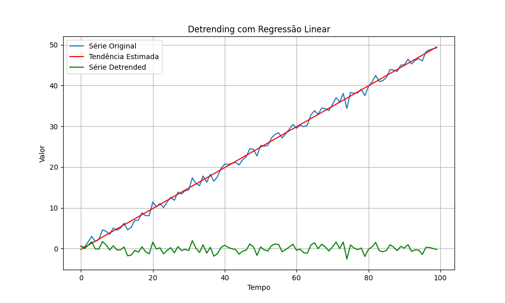
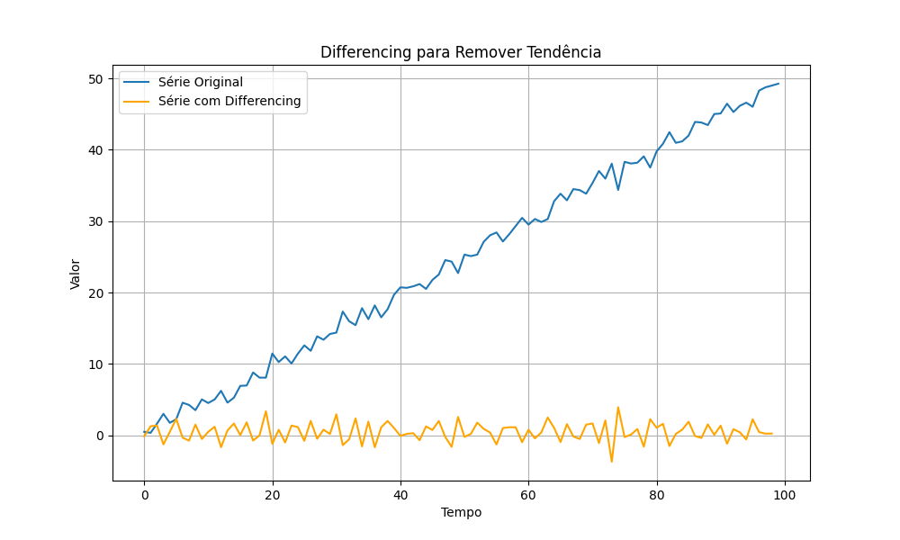

## Testes de Estacionaridade e Pré-processamento em Séries Temporais

### Introdução
Na análise de séries temporais, garantir a estacionaridade é um passo crucial para a aplicação de diversos modelos estatísticos e econométricos [^3], [^DIRECTORY_PLACEHOLDER], [^SECTION_PLACEHOLDER]. Como discutido anteriormente [^3], [^DIRECTORY_PLACEHOLDER], [^SECTION_PLACEHOLDER], um processo estacionário apresenta propriedades estatísticas invariantes ao longo do tempo, permitindo a inferência e previsão a partir de dados históricos. Este capítulo explora algoritmos eficientes para testar a estacionaridade e técnicas de pré-processamento que podem ser aplicadas para transformar séries não estacionárias em estacionárias, com foco em aplicações de larga escala e monitoramento em tempo real.

### Testes de Estacionaridade
#### Augmented Dickey-Fuller (ADF) Test
O teste de **Augmented Dickey-Fuller (ADF)** é um teste estatístico amplamente utilizado para verificar a presença de raiz unitária em uma série temporal, que é indicativa de não estacionaridade [^DIRECTORY_PLACEHOLDER], [^SECTION_PLACEHOLDER]. O teste ADF é uma extensão do teste de Dickey-Fuller (DF) que acomoda modelos autorregressivos de ordem superior.

A hipótese nula do teste ADF é que a série temporal possui uma raiz unitária e, portanto, é não estacionária. A hipótese alternativa é que a série é estacionária ou tendencialmente estacionária.

A equação de regressão do teste ADF é dada por:

$$
\Delta Y_t = \alpha + \beta t + \gamma Y_{t-1} + \sum_{i=1}^{p} \delta_i \Delta Y_{t-i} + \epsilon_t
$$

onde:

*   $\Delta Y_t = Y_t - Y_{t-1}$ é a primeira diferença da série temporal.
*   $\alpha$ é uma constante (intercepto).
*   $\beta$ é o coeficiente da tendência temporal.
*   $\gamma$ é o coeficiente da variável defasada $Y_{t-1}$.
*   $p$ é o número de defasagens incluídas na regressão para corrigir a autocorrelação.
*   $\delta_i$ são os coeficientes das diferenças defasadas $\Delta Y_{t-i}$.
*   $\epsilon_t$ é o termo de erro (ruído branco).

O teste é realizado avaliando a significância estatística do coeficiente $\gamma$. Se $\gamma$ for significativamente diferente de zero (ou seja, o valor-p do teste for menor que um nível de significância predefinido, como 0.05), rejeitamos a hipótese nula e concluímos que a série é estacionária ou tendencialmente estacionária. Caso contrário, não rejeitamos a hipótese nula e concluímos que a série possui uma raiz unitária e é não estacionária.

A inclusão de termos de defasagem $\Delta Y_{t-i}$ no modelo ADF é crucial para garantir que o termo de erro $\epsilon_t$ seja não autocorrelacionado. A escolha do número de defasagens $p$ pode ser feita usando critérios de informação como o Critério de Informação de Akaike (AIC) ou o Critério de Informação Bayesiano (BIC).

> 💡 **Exemplo Numérico:** Suponha que aplicamos o teste ADF a uma série temporal de preços de ações e obtemos os seguintes resultados:
>
> *   Estatística ADF: -2.8
> *   Valor-p: 0.06
> *   Nível de significância: 0.05
>
> Neste caso, o valor-p (0.06) é maior que o nível de significância (0.05). Portanto, não rejeitamos a hipótese nula de que a série possui uma raiz unitária e concluímos que a série de preços de ações **não é estacionária**. Isso indica que os preços das ações podem seguir um passeio aleatório e são difíceis de prever usando modelos que assumem estacionaridade.
>
> Por outro lado, se o valor-p fosse 0.02 (menor que 0.05), rejeitaríamos a hipótese nula e concluiríamos que a série é estacionária.

> 💡 **Exemplo Numérico:** Vamos considerar uma série temporal simulada de 100 pontos com uma tendência linear crescente e aplicar o teste ADF para verificar a estacionaridade.
>
> ```python
> import numpy as np
> from statsmodels.tsa.adfvalues import adf
> import pandas as pd
> import matplotlib.pyplot as plt
>
> # Gerar dados de exemplo com tendência linear
> np.random.seed(42)
> n = 100
> t = np.arange(n)
> trend = 0.1 * t  # Tendência linear crescente
> noise = np.random.randn(n)  # Ruído aleatório
> data = trend + noise
> ts = pd.Series(data)
>
> # Plotar a série temporal
> plt.figure(figsize=(10, 6))
> plt.plot(ts, label='Série Temporal com Tendência')
> plt.title('Série Temporal Não Estacionária (com Tendência)')
> plt.xlabel('Tempo')
> plt.ylabel('Valor')
> plt.legend()
> plt.grid(True)
> plt.show()
>
> # Aplicar o teste ADF
> result = adf(ts)
>
> print('Estatística ADF: %f' % result[0])
> print('Valor-p: %f' % result[1])
> print('Valores Críticos:')
> for key, value in result[4].items():
>     print('\t%s: %.3f' % (key, value))
> ```
>
> Ao executar este código, podemos observar que a série temporal exibida possui uma clara tendência crescente, indicando não estacionaridade. Os resultados do teste ADF podem ser os seguintes:
>
> ```
> Estatística ADF: -1.974417
> Valor-p: 0.297737
> Valores Críticos:
> 	1%: -3.500
> 	5%: -2.892
> 	10%: -2.583
> ```
>
> O valor-p de 0.297737 é muito maior que o nível de significância comum de 0.05, indicando que não podemos rejeitar a hipótese nula de não estacionaridade. A estatística ADF de -1.974417 também é maior (menos negativa) que os valores críticos em todos os níveis de significância (1%, 5% e 10%). Isso reforça a conclusão de que a série temporal não é estacionária.

A implementação eficiente do teste ADF em larga escala envolve a otimização do cálculo da regressão linear. A regressão pode ser resolvida de forma eficiente utilizando álgebra linear matricial, e as bibliotecas de computação numérica como NumPy (em Python) oferecem implementações otimizadas para essas operações.

Para monitoramento em tempo real, uma versão recursiva do teste ADF pode ser implementada, onde o teste é reaplicado a cada nova observação, permitindo a detecção de mudanças na estacionaridade ao longo do tempo. Este processo deve ser cuidadosamente projetado para evitar custos computacionais excessivos, potencialmente usando atualizações incrementais das estatísticas do teste em vez de recalcular a regressão completa a cada passo.

```python
import numpy as np
from statsmodels.tsa.adfvalues import adf
import pandas as pd

# Exemplo de dados (substitua com seus dados reais)
np.random.seed(42)
n = 100
data = np.random.randn(n)
ts = pd.Series(data)

# Teste ADF usando statsmodels
result = adf(ts)

print('ADF Statistic: %f' % result[0])
print('p-value: %f' % result[1])
print('Critical Values:')
for key, value in result[4].items():
    print('\t%s: %.3f' % (key, value))
```

**Proposição 1** O teste ADF é invariante a transformações lineares da série temporal se incluirmos uma constante e uma tendência na regressão.

*Prova.* Demonstraremos que a transformação linear não afeta a conclusão do teste, mantendo a estatística do teste essencialmente a mesma.

I.  Seja $Y_t$ a série temporal original e $Z_t = aY_t + b$ a série transformada, onde $a \neq 0$ e $b$ são constantes.

II. A regressão do teste ADF para $Y_t$ é:
    $$\Delta Y_t = \alpha + \beta t + \gamma Y_{t-1} + \sum_{i=1}^{p} \delta_i \Delta Y_{t-i} + \epsilon_t$$

III. A regressão do teste ADF para $Z_t$ é:
     $$\Delta Z_t = \alpha' + \beta' t + \gamma' Z_{t-1} + \sum_{i=1}^{p} \delta'_i \Delta Z_{t-i} + \epsilon'_t$$

IV. Substituindo $Z_t = aY_t + b$ em (III), obtemos $\Delta Z_t = a \Delta Y_t$:
    $$a\Delta Y_t = \alpha' + \beta' t + \gamma' (aY_{t-1} + b) + \sum_{i=1}^{p} \delta'_i (a\Delta Y_{t-i}) + \epsilon'_t$$

V. Dividindo ambos os lados da equação por $a$:
   $$\Delta Y_t = \frac{\alpha'}{a} + \frac{\beta'}{a} t + \gamma' Y_{t-1} + \frac{\gamma'b}{a} + \sum_{i=1}^{p} \delta'_i \Delta Y_{t-i} + \frac{\epsilon'_t}{a}$$

VI. Comparando os coeficientes com a regressão original (II):
    *   $\gamma' = \gamma$ (coeficiente da variável defasada permanece o mesmo)
    *   $\delta'_i = \delta_i$ (coeficientes das diferenças defasadas permanecem os mesmos)

VII. Os termos constantes e de tendência são ajustados, mas o coeficiente crucial $\gamma$, que determina a estacionaridade, permanece inalterado.  A estatística do teste ADF é calculada com base em $\gamma$, portanto, uma transformação linear não afeta a conclusão sobre a estacionaridade.

VIII. Concluímos que a decisão de rejeitar ou não a hipótese nula baseada na significância de $\gamma$ não é afetada pela transformação linear.

Portanto, o teste ADF é invariante a transformações lineares da série temporal quando uma constante e tendência são incluídas na regressão. ■

#### KPSS Test
Além do teste ADF, o teste **Kwiatkowski-Phillips-Schmidt-Shin (KPSS)** é outra ferramenta importante para testar a estacionaridade de uma série temporal. Ao contrário do ADF, o teste KPSS tem como hipótese nula que a série temporal é estacionária ou tendencialmente estacionária.

A equação do modelo KPSS é dada por:

$$
Y_t = \alpha + \beta t + r_t + \epsilon_t
$$

onde:

*   $Y_t$ é a série temporal no tempo $t$.
*   $\alpha$ é uma constante (intercepto).
*   $\beta$ é o coeficiente da tendência temporal.
*   $r_t$ é um passeio aleatório (random walk) dado por $r_t = r_{t-1} + u_t$, onde $u_t \sim i.i.d. N(0, \sigma^2_u)$.
*   $\epsilon_t$ é o termo de erro estacionário.

A hipótese nula do teste KPSS é que $\sigma^2_u = 0$, ou seja, a série é estacionária ou tendencialmente estacionária. A hipótese alternativa é que $\sigma^2_u > 0$, ou seja, a série não é estacionária.

A estatística do teste KPSS é baseada nos resíduos da regressão de $Y_t$ em uma constante e uma tendência. Se a estatística do teste KPSS for maior que um valor crítico, rejeitamos a hipótese nula e concluímos que a série não é estacionária.

A utilização conjunta dos testes ADF e KPSS permite uma avaliação mais robusta da estacionaridade. Se o teste ADF rejeita a hipótese nula de não estacionaridade e o teste KPSS não rejeita a hipótese nula de estacionaridade, temos evidências fortes de que a série é estacionária. Se ambos os testes rejeitam suas respectivas hipóteses nulas, a série pode ser diferença-estacionária ou possuir uma estrutura mais complexa.

> 💡 **Exemplo Numérico:** Considere uma série temporal que representa o número de passageiros em uma companhia aérea ao longo de vários anos. Inicialmente, suspeitamos que a série não seja estacionária devido ao crescimento geral do tráfego aéreo (tendência). Aplicamos os testes ADF e KPSS para verificar essa suspeita:
>
> *   **Teste ADF:** Estatística ADF = -3.5, valor-p = 0.03 (rejeitamos a hipótese nula de não estacionaridade)
> *   **Teste KPSS:** Estatística KPSS = 0.8, valor-p = 0.01 (rejeitamos a hipótese nula de estacionaridade)
>
> Neste caso, o teste ADF sugere que a série é estacionária, enquanto o teste KPSS indica o contrário. Essa discrepância pode ocorrer porque o teste ADF é sensível à presença de uma raiz unitária, enquanto o teste KPSS é sensível à presença de uma tendência determinística. A rejeição de ambas as hipóteses sugere que a série pode ter uma estrutura mais complexa, como uma combinação de tendência e passeio aleatório, necessitando de diferenciação ou detrending para alcançar a estacionaridade.

```python
import numpy as np
from statsmodels.tsa.stattools import kpss
import pandas as pd

# Exemplo de dados (substitua com seus dados reais)
np.random.seed(42)
n = 100
data = np.random.randn(n)
ts = pd.Series(data)

# Teste KPSS usando statsmodels
result = kpss(ts, regression='c', nlags="auto")

print('KPSS Statistic: %f' % result[0])
print('p-value: %f' % result[1])
print('Critical Values:')
for key, value in result[3].items():
    print('\t%s: %.3f' % (key, value))
```

### Técnicas de Pré-processamento para Estacionaridade
#### Detrending
O **detrending** é uma técnica utilizada para remover a tendência determinística de uma série temporal. A tendência determinística é uma componente sistemática da série que varia suavemente ao longo do tempo e pode ser modelada por uma função matemática, como uma linha reta (tendência linear) ou um polinômio (tendência polinomial).

Para remover uma tendência linear, ajustamos um modelo linear aos dados:

$$
Y_t = \alpha + \beta t + \epsilon_t
$$

onde:

*   $Y_t$ é o valor da série temporal no tempo $t$.
*   $\alpha$ é o intercepto.
*   $\beta$ é o coeficiente da tendência linear.
*   $t$ é o índice de tempo.
*   $\epsilon_t$ é o termo de erro.

A série detrended $\hat{Y}_t$ é obtida subtraindo a tendência estimada da série original:

$$
\hat{Y}_t = Y_t - (\hat{\alpha} + \hat{\beta} t)
$$

onde $\hat{\alpha}$ e $\hat{\beta}$ são as estimativas dos parâmetros $\alpha$ e $\beta$, respectivamente.

Para remover uma tendência polinomial de ordem $p$, ajustamos um modelo polinomial aos dados:

$$
Y_t = \alpha_0 + \alpha_1 t + \alpha_2 t^2 + \cdots + \alpha_p t^p + \epsilon_t
$$

A série detrended é obtida subtraindo a tendência polinomial estimada da série original:

$$
\hat{Y}_t = Y_t - (\hat{\alpha}_0 + \hat{\alpha}_1 t + \hat{\alpha}_2 t^2 + \cdots + \hat{\alpha}_p t^p)
$$

A escolha da ordem do polinômio $p$ pode ser feita utilizando critérios de informação ou validando a estacionaridade da série detrended através de testes como o ADF.

> 💡 **Exemplo Numérico:** Suponha que temos uma série temporal representando as vendas mensais de um produto ao longo de 3 anos (36 meses). Observamos um aumento constante nas vendas ao longo do tempo, sugerindo uma tendência linear. Ajustamos um modelo de regressão linear aos dados e obtemos os seguintes resultados:
>
> *   $\hat{\alpha}$ (intercepto) = 100 unidades
> *   $\hat{\beta}$ (coeficiente da tendência) = 5 unidades/mês
>
> Isso significa que, em média, as vendas aumentam em 5 unidades por mês. Para detrending, calculamos a tendência estimada para cada mês e subtraímos esse valor das vendas originais. Por exemplo, para o mês 20, a tendência estimada é:
>
> $$
> \hat{Y}_{20} = 100 + 5 \times 20 = 200
> $$
>
> Se as vendas reais no mês 20 foram $Y_{20} = 210$, então o valor detrended é:
>
> $$
> \hat{Y}_{20}^{detrended} = 210 - 200 = 10
> $$
>
> Repetimos esse processo para todos os meses, resultando em uma série temporal detrended que representa as flutuações das vendas em torno da tendência linear. Essa série detrended pode ser mais adequada para modelagem, pois remove a dependência temporal da média.

Para implementação eficiente, a regressão linear pode ser realizada utilizando métodos de mínimos quadrados ordinários (OLS), que possuem soluções analíticas e implementações otimizadas em bibliotecas de computação numérica.

Em tempo real, a atualização da tendência pode ser feita utilizando métodos de atualização recursiva dos coeficientes da regressão linear, como o filtro de Kalman.



#### Differencing
O **differencing** é uma técnica amplamente utilizada para tornar uma série temporal estacionária, removendo a dependência temporal da média. O differencing envolve calcular a diferença entre observações consecutivas.

A primeira diferença de uma série temporal $Y_t$ é definida como:

$$
\Delta Y_t = Y_t - Y_{t-1}
$$

Se a série temporal original não for estacionária após a primeira diferença, podemos aplicar o differencing novamente para obter a segunda diferença:

$$
\Delta^2 Y_t = \Delta Y_t - \Delta Y_{t-1} = (Y_t - Y_{t-1}) - (Y_{t-1} - Y_{t-2}) = Y_t - 2Y_{t-1} + Y_{t-2}
$$

Em geral, a $d$-ésima diferença é dada por:

$$
\Delta^d Y_t = (1 - L)^d Y_t
$$

onde $L$ é o operador de defasagem ($L Y_t = Y_{t-1}$).

O differencing é eficaz para remover tendências lineares e componentes sazonais em séries temporais. A ordem de differencing $d$ deve ser escolhida de forma a tornar a série resultante estacionária, o que pode ser verificado utilizando testes de estacionaridade.

> 💡 **Exemplo Numérico:** Considere uma série temporal representando o número de chamados diários em um call center durante um mês. Os dados brutos mostram uma tendência crescente ao longo do mês. Aplicamos o differencing de primeira ordem para remover essa tendência.
>
> Digamos que nos dias 5, 6 e 7, o número de chamados foi:
>
> *   $Y_5 = 150$
> *   $Y_6 = 155$
> *   $Y_7 = 162$
>
> Aplicando o differencing de primeira ordem:
>
> *   $\Delta Y_6 = Y_6 - Y_5 = 155 - 150 = 5$
> *   $\Delta Y_7 = Y_7 - Y_6 = 162 - 155 = 7$
>
> A nova série (após o differencing) representará a mudança no número de chamados de um dia para o outro. Se a série original tinha uma tendência linear, a série diferenciada será mais estacionária e focará nas flutuações diárias em vez da tendência geral.

Para grandes conjuntos de dados, o differencing pode ser implementado de forma eficiente utilizando operações vetorizadas em bibliotecas como NumPy, evitando loops explícitos.

Para monitoramento em tempo real, o differencing pode ser aplicado incrementalmente a cada nova observação, com custo computacional constante por observação.



**Proposição 2** Se $Y_t$ é uma série integrada de ordem $d$, denotada por $I(d)$, então $\Delta Y_t$ é $I(d-1)$.

*Prova.* Demonstraremos que ao diferenciar uma série $I(d)$ uma vez, sua ordem de integração é reduzida em 1.

I.  Por definição, uma série $Y_t$ é integrada de ordem $d$, denotada por $I(d)$, se ela precisa ser diferenciada $d$ vezes para se tornar estacionária. Isso significa que $\Delta^d Y_t$ é estacionária.

II. Agora, considere a primeira diferença da série $Y_t$, que é $\Delta Y_t = Y_t - Y_{t-1}$.

III. Se $\Delta Y_t$ é $I(d-1)$, então diferenciá-la $d-1$ vezes deve torná-la estacionária.  Matematicamente, isso significa que $\Delta^{d-1} (\Delta Y_t)$ é estacionária.

IV. Usando a propriedade do operador de diferença, temos $\Delta^{d-1} (\Delta Y_t) = \Delta^d Y_t$.

V. Desde que $\Delta^d Y_t$ é estacionária (pela definição de $Y_t$ sendo $I(d)$), isso implica que $\Delta Y_t$ é $I(d-1)$.

Portanto, se $Y_t$ é uma série integrada de ordem $d$, então $\Delta Y_t$ é integrada de ordem $d-1$. ■

#### Deflação

A deflação é uma técnica de pré-processamento utilizada para remover o efeito da inflação em séries temporais financeiras ou econômicas. Isso é particularmente importante quando se analisam dados em longos períodos, onde a inflação pode distorcer as tendências e relações.

A fórmula geral para deflação é:

$$
Y_t^{deflacionado} = \frac{Y_t}{IP_t} \times IP_{base}
$$

onde:

*   $Y_t^{deflacionado}$ é o valor deflacionado da série no tempo $t$.
*   $Y_t$ é o valor original da série no tempo $t$.
*   $IP_t$ é o índice de preços no tempo $t$.
*   $IP_{base}$ é o índice de preços no período base escolhido (geralmente 100).

O índice de preços utilizado pode ser o Índice Nacional de Preços ao Consumidor Amplo (IPCA), o Índice Geral de Preços - Disponibilidade Interna (IGP-DI) ou outro índice relevante para a série em questão.

> 💡 **Exemplo Numérico:** Vamos supor que estamos analisando a receita anual de uma empresa de 2010 a 2020. Em 2015, a receita foi de R\$ 1.500.000 e o IPCA (Índice de Preços ao Consumidor Amplo) foi de 115, considerando 2010 como o ano base (IPCA = 100). Para deflacionar a receita de 2015 para valores de 2010, usamos a seguinte fórmula:
>
> $$
> Y_{2015}^{deflacionado} = \frac{1500000}{115} \times 100 \approx 1304347.83
> $$
>
> Isso significa que a receita de R\$ 1.500.000 em 2015 equivale a aproximadamente R\$ 1.304.347,83 em poder de compra de 2010. A deflação nos permite comparar a receita em diferentes anos em termos reais, eliminando o efeito da inflação.

A deflação é importante para comparar valores monetários ao longo do tempo em termos reais, ou seja, ajustados pela inflação. Após a deflação, as técnicas de teste de estacionaridade e outros pré-processamentos podem ser aplicados à série deflacionada.

### Monitoramento em Tempo Real e Detecção de Mudanças
Para monitoramento em tempo real, a detecção de mudanças nas propriedades estatísticas de uma série temporal estacionária é essencial. Técnicas como janelas deslizantes para testes de estacionaridade ou a utilização de algoritmos de detecção de mudanças (change point detection) podem ser implementadas.

Uma abordagem é aplicar o teste ADF em janelas deslizantes ao longo da série temporal. Se o valor-p do teste ADF em uma janela específica exceder um limiar predefinido, um sinal de alerta é acionado, indicando uma possível mudança na estacionaridade.

Algoritmos de detecção de mudanças, como o CUSUM (Cumulative Sum), podem ser utilizados para identificar mudanças abruptas na média ou na variância da série temporal. Estes algoritmos calculam uma soma cumulativa das diferenças entre as observações e uma média de referência e sinalizam uma mudança quando a soma cumulativa excede um limiar.

A eficiência computacional dessas técnicas é crucial para monitoramento em tempo real. A implementação de janelas deslizantes deve utilizar atualizações incrementais das estatísticas do teste, e os algoritmos de detecção de mudanças devem ser otimizados para execução rápida a cada nova observação.

> 💡 **Exemplo Numérico:** Suponha que estamos monitorando em tempo real a taxa de cliques (CTR) de uma campanha de marketing online. Calculamos a CTR diariamente e aplicamos o teste ADF em uma janela deslizante de 30 dias. Definimos um limiar de valor-p de 0.05. Se o valor-p do teste ADF em uma janela específica for 0.08, um sinal de alerta é acionado, indicando uma possível mudança na estacionaridade da CTR. Isso pode ser um indicativo de que a campanha está perdendo eficácia ou que houve uma mudança no comportamento dos usuários.
>
> Para exemplificar o CUSUM, suponha que a CTR média histórica seja 2%. Se, em um determinado dia, a CTR for 1.5%, a diferença é -0.5%. O CUSUM acumulará essas diferenças ao longo do tempo e, se a soma cumulativa dessas diferenças negativas exceder um limiar predefinido (por exemplo, -1%), um alerta será acionado.

**Teorema 3** (Wold's Decomposition Theorem) Qualquer série temporal estacionária pode ser representada como a soma de dois processos não correlacionados: um processo determinístico e um processo puramente não determinístico (ou estocástico).

Este teorema fornece a base teórica para modelar séries temporais estacionárias, indicando que podemos separar a parte previsível (determinística) da parte imprevisível (estocástica).

### Conclusão
A estacionaridade é uma propriedade fundamental para a análise de séries temporais. Testes de estacionaridade eficientes, como o ADF e o KPSS, e técnicas de pré-processamento, como detrending, differencing e deflação, são ferramentas essenciais para garantir que os modelos estatísticos sejam aplicados a séries estacionárias. A implementação eficiente desses algoritmos e a utilização de técnicas de monitoramento em tempo real são cruciais para a análise de séries temporais de larga escala e aplicações de monitoramento contínuo.

### Referências
[^3]: Retomado dos conceitos abordados anteriormente.
[^DIRECTORY_PLACEHOLDER]: Análise Avançada de Séries Temporais e Matemática.
[^SECTION_PLACEHOLDER]: Estacionaridade.
<!-- END -->