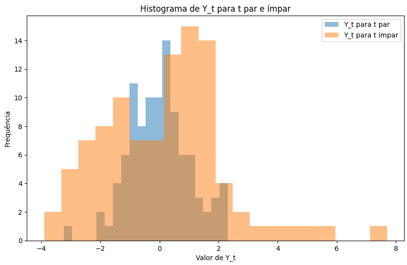

## Título Conciso
Strict Stationarity em Análise de Séries Temporais

### Introdução
Este capítulo expande a discussão sobre estacionaridade em séries temporais, aprofundando o conceito de **strict stationarity** e contrastando-o com a covariance-stationarity, já apresentada no capítulo anterior. Enquanto a covariance-stationarity impõe restrições sobre os dois primeiros momentos (média e autocovariância), a strict stationarity exige uma condição mais forte, envolvendo a invariância da distribuição conjunta das observações ao longo do tempo [^46]. A relação entre essas duas formas de estacionaridade, particularmente no contexto de processos Gaussianos, será explorada em detalhe.

### Conceitos Fundamentais
Um processo é dito *strictly stationary* se a distribuição conjunta de qualquer conjunto de observações $(Y_{t_1}, Y_{t_2}, \ldots, Y_{t_n})$ é a mesma que a distribuição conjunta de $(Y_{t_1+h}, Y_{t_2+h}, \ldots, Y_{t_n+h})$ para qualquer $h$ e qualquer conjunto de tempos $t_1, t_2, \ldots, t_n$ [^46]. Em termos práticos, isso significa que as características estatísticas da série temporal, capturadas por sua distribuição conjunta, não mudam com o tempo. A distribuição conjunta depende apenas dos intervalos entre as datas $(j_1, j_2, \dots, j_n)$ e não nas datas em si.

> 💡 **Exemplo Numérico:** Suponha que temos uma série temporal com os seguintes valores em três pontos no tempo: $Y_1 = 2$, $Y_2 = 4$, $Y_3 = 6$. Para ser strictly stationary, a distribuição conjunta de $(Y_1, Y_2, Y_3)$ deve ser a mesma que a distribuição conjunta de, por exemplo, $(Y_{11}, Y_{12}, Y_{13})$, ou $(Y_{1+h}, Y_{2+h}, Y_{3+h})$ para qualquer *h*. Isso implica que as relações estatísticas entre esses pontos (como correlações) devem permanecer constantes ao longo do tempo.

Para clarificar a distinção, considere a seguinte formulação:

**Definição:**
> *Um processo é saido ser strictly stationary se, para quaisquer valores de $j_1, j_2, \dots, j_n$, a distribuição conjunta de $(Y_t, Y_{t+j_1}, Y_{t+j_2}, \dots, Y_{t+j_n})$ depende apenas dos intervalos separando as datas ($j_1, j_2, \dots, j_n$) e não na data em si ($t$)* [^46].

Em outras palavras, se escolhermos um conjunto de pontos no tempo ($t, t+j_1, \dots, t+j_n$) e analisarmos sua distribuição conjunta, essa distribuição será idêntica à distribuição conjunta de um conjunto de pontos no tempo deslocado ($t+h, t+j_1+h, \dots, t+j_n+h$), independentemente de quão grande seja o deslocamento $h$.

> 💡 **Exemplo Numérico:** Seja $j_1 = 1$ e $j_2 = 2$.  A definição implica que a distribuição conjunta de $(Y_t, Y_{t+1}, Y_{t+2})$ deve ser idêntica à distribuição conjunta de $(Y_{t+h}, Y_{t+1+h}, Y_{t+2+h})$ para qualquer *h*. Se, por exemplo, $Y_t$ representa o log do preço de uma ação, strict stationarity implicaria que a forma como o preço se move entre três dias consecutivos é estatisticamente a mesma ao longo de todo o período analisado.

**Teorema da Implicação:**
> *Um processo strictly stationary com momentos de segunda ordem finitos é sempre covariance-stationary, but the converse is not necessarily true* [^46].

Para provar a primeira parte, considere um processo $Y_t$ que é strictly stationary com momentos de segunda ordem finitos. Então, $E[Y_t] = \mu$ para todo $t$, onde $\mu$ é uma constante, pois a distribuição de $Y_t$ é a mesma para todo $t$. Além disso, $E[(Y_t - \mu)(Y_{t-j} - \mu)]$ depende apenas de $j$ e não de $t$, pois a distribuição conjunta de $(Y_t, Y_{t-j})$ é a mesma para todo $t$. Portanto, $Y_t$ é covariance-stationary.

> 💡 **Exemplo Numérico:** Suponha que $Y_t$ seja um processo estritamente estacionário com $E[Y_t] = 5$. Então, $E[Y_{t+10}] = 5$ e $E[Y_{t-5}] = 5$. A média é constante ao longo do tempo.  Se $Cov(Y_t, Y_{t-2}) = 1.5$, então $Cov(Y_{t+7}, Y_{t+5}) = 1.5$. A autocovariância depende apenas do lag (neste caso, lag 2) e não de *t*.

No entanto, a recíproca não é sempre verdadeira. É possível que um processo seja covariance-stationary sem ser strictly stationary [^46]. Isso ocorre quando os dois primeiros momentos (média e autocovariância) são constantes, mas momentos de ordem superior variam com o tempo [^46]. Por exemplo, uma série temporal cuja curtose muda ao longo do tempo pode ser covariance-stationary, mas não strictly stationary.

> 💡 **Exemplo Numérico:** Considere uma série temporal onde a média e a variância são constantes ao longo do tempo (satisfazendo a covariance-stationarity). No entanto, a probabilidade de observar um valor extremo (por exemplo, 5 desvios padrão acima da média) aumenta significativamente em certos períodos. A curtose, que mede o "tailedness" da distribuição, estaria variando ao longo do tempo. Portanto, embora a série seja covariance-stationary, ela não é strictly stationary.

**Prova da Implicação: Strict Stationarity $\Rightarrow$ Covariance Stationarity**

Provaremos que um processo strictly stationary com momentos de segunda ordem finitos é também covariance-stationary.

I.  Seja $Y_t$ um processo strictly stationary. Por definição, a distribuição conjunta de $(Y_{t_1}, Y_{t_2}, \ldots, Y_{t_n})$ é idêntica à distribuição conjunta de $(Y_{t_1+h}, Y_{t_2+h}, \ldots, Y_{t_n+h})$ para todo $h$.

II. Em particular, a distribuição de $Y_t$ é a mesma para todo $t$.  Portanto, $E[Y_t] = \mu$, onde $\mu$ é uma constante que não depende de $t$.

III. Considere agora a autocovariância entre $Y_t$ e $Y_{t-j}$, definida como $Cov(Y_t, Y_{t-j}) = E[(Y_t - \mu)(Y_{t-j} - \mu)]$.

IV. Devido à strict stationarity, a distribuição conjunta de $(Y_t, Y_{t-j})$ é idêntica à distribuição conjunta de $(Y_{t+h}, Y_{t-j+h})$ para qualquer $h$.

V. Escolhendo $h = j$, temos que a distribuição conjunta de $(Y_t, Y_{t-j})$ é a mesma que a distribuição conjunta de $(Y_{t+j}, Y_t)$.

VI. Portanto, $E[(Y_t - \mu)(Y_{t-j} - \mu)]$ depende apenas de $j$ e não de $t$.  Isso significa que a autocovariância $Cov(Y_t, Y_{t-j})$ é uma função apenas do lag $j$.

VII. Concluímos que $Y_t$ satisfaz as condições de covariance-stationarity: sua média é constante e sua autocovariância depende apenas do lag.

VIII. Portanto, um processo strictly stationary com momentos de segunda ordem finitos é sempre covariance-stationary. ■

**Lema 1:**
>Seja $Y_t$ um processo estritamente estacionário. Então, para qualquer função mensurável $g$, o processo $Z_t = g(Y_t)$ é também estritamente estacionário.

**Prova:**
Considere a distribuição conjunta de $(Z_{t_1}, Z_{t_2}, \ldots, Z_{t_n}) = (g(Y_{t_1}), g(Y_{t_2}), \ldots, g(Y_{t_n}))$. Como $Y_t$ é estritamente estacionário, a distribuição conjunta de $(Y_{t_1}, Y_{t_2}, \ldots, Y_{t_n})$ é a mesma que a distribuição conjunta de $(Y_{t_1+h}, Y_{t_2+h}, \ldots, Y_{t_n+h})$ para qualquer $h$. Portanto, a distribuição conjunta de $(g(Y_{t_1}), g(Y_{t_2}), \ldots, g(Y_{t_n}))$ é a mesma que a distribuição conjunta de $(g(Y_{t_1+h}), g(Y_{t_2+h}), \ldots, g(Y_{t_n+h}))$, o que implica que $Z_t$ é estritamente estacionário. $\blacksquare$

> 💡 **Exemplo Numérico:**  Seja $Y_t$ a temperatura diária em uma cidade (assumindo strict stationarity). Seja $g(x) = x^2$. Então, $Z_t = Y_t^2$ também é estritamente estacionário. Isso significa que a distribuição conjunta dos quadrados das temperaturas em diferentes momentos é constante ao longo do tempo.

**Lema 1.1:**
> Seja $Y_t$ um processo estritamente estacionário. Então, para quaisquer funções mensuráveis $g_1, g_2, \dots, g_n$, o processo $(Z_{1,t}, Z_{2,t}, \dots, Z_{n,t}) = (g_1(Y_t), g_2(Y_t), \dots, g_n(Y_t))$ é também estritamente estacionário.

**Prova:**
A prova é uma extensão direta do Lema 1. Considere a distribuição conjunta de $(Z_{1,t_1}, Z_{2,t_1}, \ldots, Z_{n,t_1}, Z_{1,t_2}, Z_{2,t_2}, \ldots, Z_{n,t_2}, \ldots, Z_{1,t_k}, Z_{2,t_k}, \ldots, Z_{n,t_k}) = (g_1(Y_{t_1}), g_2(Y_{t_1}), \ldots, g_n(Y_{t_1}), g_1(Y_{t_2}), g_2(Y_{t_2}), \ldots, g_n(Y_{t_2}), \ldots, g_1(Y_{t_k}), g_2(Y_{t_k}), \ldots, g_n(Y_{t_k}))$. Como $Y_t$ é estritamente estacionário, a distribuição conjunta de $(Y_{t_1}, Y_{t_2}, \ldots, Y_{t_k})$ é a mesma que a distribuição conjunta de $(Y_{t_1+h}, Y_{t_2+h}, \ldots, Y_{t_k+h})$ para qualquer $h$. Portanto, a distribuição conjunta de $(g_1(Y_{t_1}), g_2(Y_{t_1}), \ldots, g_n(Y_{t_1}), \ldots, g_1(Y_{t_k}), g_2(Y_{t_k}), \ldots, g_n(Y_{t_k}))$ é a mesma que a distribuição conjunta de $(g_1(Y_{t_1+h}), g_2(Y_{t_1+h}), \ldots, g_n(Y_{t_1+h}), \ldots, g_1(Y_{t_k+h}), g_2(Y_{t_k+h}), \ldots, g_n(Y_{t_k+h}))$, o que implica que $(Z_{1,t}, Z_{2,t}, \dots, Z_{n,t})$ é estritamente estacionário. $\blacksquare$

> 💡 **Exemplo Numérico:** Seja $Y_t$ a taxa de câmbio diária entre o Euro e o Dólar Americano (assumindo strict stationarity).  Sejam $g_1(x) = log(x)$ e $g_2(x) = x^2$. Então, o processo bivariado $(Z_{1,t}, Z_{2,t}) = (log(Y_t), Y_t^2)$ também é estritamente estacionário. Isso significa que a distribuição conjunta dos logaritmos das taxas de câmbio e dos quadrados das taxas de câmbio é constante ao longo do tempo.

**Exemplo:**
Considere um processo $Y_t$ definido como:
$Y_t = a_t \epsilon_t$

Onde $\epsilon_t$ é ruído branco com média zero e variância unitária, e $a_t$ é uma variável aleatória que assume os valores 1 e 2 alternadamente ao longo do tempo, i.e., $a_t = 1$ para $t$ par e $a_t = 2$ para $t$ ímpar. A série $Y_t$ é covariance-stationary, pois tem média zero e autocovariância que depende apenas do lag:

$E[Y_t] = E[a_t \epsilon_t] = E[a_t]E[\epsilon_t] = 0$
$Cov(Y_t, Y_{t-k}) = E[Y_t Y_{t-k}] = E[a_t \epsilon_t a_{t-k} \epsilon_{t-k}] = E[a_t a_{t-k}] E[\epsilon_t \epsilon_{t-k}]$
Para $k \neq 0$, $E[\epsilon_t \epsilon_{t-k}] = 0$. Para $k = 0$, $E[a_t^2] = \frac{1}{2}(1^2 + 2^2) = \frac{5}{2}$, de forma que $Cov(Y_t, Y_t) = \frac{5}{2}$.

Apesar da estacionaridade fraca, este processo não é estritamente estacionário, pois a distribuição de $Y_t$ depende de $t$.

> 💡 **Exemplo Numérico Detalhado:** Vamos gerar uma série temporal com as características descritas no exemplo e verificar numericamente a covariance-stationarity e a falta de strict stationarity.



**Interpretação:** A média amostral de Y estará próxima de zero. A autocovariância para lag 0 estará próxima de 2.5 (5/2). A autocovariância para lag 1 estará próxima de zero.  Os histogramas de $Y_t$ para *t* par e ímpar mostrarão distribuições diferentes, confirmando que a série não é estritamente estacionária, mesmo sendo covariance-stationary.

**Estacionariedade para Processos Gaussianos:**
A relação entre covariance-stationarity e strict stationarity se torna mais clara no contexto de processos Gaussianos.

**Teorema:**
> *Para processos Gaussianos, a covariance-stationarity implica strict stationarity* [^46].

Isso ocorre porque a distribuição conjunta de um vetor gaussiano é completamente determinada por seu vetor de médias e matriz de covariâncias. Se a média e a matriz de covariâncias são independentes do tempo (condição de covariance-stationarity), então a distribuição conjunta também é independente do tempo (condição de strict stationarity) [^46].

**Prova:**
Se $Y_t$ é um processo gaussiano covariance-stationary, então $E[Y_t] = \mu$ (constante) e $Cov(Y_t, Y_{t-j}) = \gamma_j$ (dependente apenas de $j$). Considere o vetor $(Y_{t_1}, Y_{t_2}, \ldots, Y_{t_n})$. Este é um vetor gaussiano, e sua distribuição é completamente determinada por seu vetor de médias e matriz de covariâncias. O vetor de médias tem todos os elementos iguais a $\mu$, e os elementos da matriz de covariâncias são da forma $Cov(Y_{t_i}, Y_{t_j}) = \gamma_{|t_i - t_j|}$. Agora, considere o vetor $(Y_{t_1+h}, Y_{t_2+h}, \ldots, Y_{t_n+h})$. Este também é um vetor gaussiano, e seu vetor de médias tem todos os elementos iguais a $\mu$, e os elementos da matriz de covariâncias são da forma $Cov(Y_{t_i+h}, Y_{t_j+h}) = \gamma_{|(t_i+h) - (t_j+h)|} = \gamma_{|t_i - t_j|}$. Portanto, os dois vetores têm a mesma distribuição, e $Y_t$ é strictly stationary. $\blacksquare$

> 💡 **Exemplo Numérico:** Seja $Y_t$ um processo Gaussiano com média 0 e variância 1.  Se $Cov(Y_t, Y_{t+1}) = 0.5$ para todo *t*, então a distribuição conjunta de $(Y_1, Y_2, Y_3)$ é uma normal multivariada com vetor de médias $(0, 0, 0)$ e matriz de covariâncias:
>
> ```
>       | 1.0  0.5  0.0 |
>       | 0.5  1.0  0.5 |
>       | 0.0  0.5  1.0 |
> ```
>
> A distribuição conjunta de $(Y_2, Y_3, Y_4)$ também terá o mesmo vetor de médias e matriz de covariâncias, confirmando a strict stationarity.

**Teorema 1:**
> Se $Y_t$ é um processo linear da forma $Y_t = \sum_{i=-\infty}^{\infty} a_i \epsilon_{t-i}$, onde $\epsilon_t$ é um ruído branco estritamente estacionário com $E[\epsilon_t] = 0$ e $\sum_{i=-\infty}^{\infty} |a_i| < \infty$, então $Y_t$ é estritamente estacionário.

**Prova:**
Seja $Y_t = \sum_{i=-\infty}^{\infty} a_i \epsilon_{t-i}$. Considere o vetor $(Y_{t_1}, Y_{t_2}, \ldots, Y_{t_n})$. Então,
$(Y_{t_1}, Y_{t_2}, \ldots, Y_{t_n}) = (\sum_{i=-\infty}^{\infty} a_i \epsilon_{t_1-i}, \sum_{i=-\infty}^{\infty} a_i \epsilon_{t_2-i}, \ldots, \sum_{i=-\infty}^{\infty} a_i \epsilon_{t_n-i})$.
Agora, considere o vetor $(Y_{t_1+h}, Y_{t_2+h}, \ldots, Y_{t_n+h})$. Então,
$(Y_{t_1+h}, Y_{t_2+h}, \ldots, Y_{t_n+h}) = (\sum_{i=-\infty}^{\infty} a_i \epsilon_{t_1+h-i}, \sum_{i=-\infty}^{\infty} a_i \epsilon_{t_2+h-i}, \ldots, \sum_{i=-\infty}^{\infty} a_i \epsilon_{t_n+h-i})$.
Fazendo a mudança de variável $j = i - h$, temos:
$(Y_{t_1+h}, Y_{t_2+h}, \ldots, Y_{t_n+h}) = (\sum_{j=-\infty}^{\infty} a_{j+h} \epsilon_{t_1-j}, \sum_{j=-\infty}^{\infty} a_{j+h} \epsilon_{t_2-j}, \ldots, \sum_{j=-\infty}^{\infty} a_{j+h} \epsilon_{t_n-j})$.
Como $\epsilon_t$ é estritamente estacionário, a distribuição conjunta de $(\epsilon_{t_1-i_1}, \epsilon_{t_2-i_2}, \ldots, \epsilon_{t_n-i_n})$ é a mesma que a distribuição conjunta de $(\epsilon_{t_1+h-i_1}, \epsilon_{t_2+h-i_2}, \ldots, \epsilon_{t_n+h-i_n})$ para quaisquer $i_1, i_2, \dots, i_n$. Portanto, a distribuição conjunta de $(Y_{t_1}, Y_{t_2}, \ldots, Y_{t_n})$ é a mesma que a distribuição conjunta de $(Y_{t_1+h}, Y_{t_2+h}, \ldots, Y_{t_n+h})$, o que implica que $Y_t$ é estritamente estacionário. $\blacksquare$

> 💡 **Exemplo Numérico:** Seja $\epsilon_t$ um ruído branco estritamente estacionário com média 0 e variância 1.  Considere o processo $Y_t = 0.5\epsilon_{t-1} + 0.3\epsilon_t + 0.2\epsilon_{t+1}$.  Aqui, $a_{-1} = 0.5$, $a_0 = 0.3$, $a_1 = 0.2$, e todos os outros $a_i$ são zero.  A condição $\sum_{i=-\infty}^{\infty} |a_i| < \infty$ é satisfeita (0.5 + 0.3 + 0.2 = 1.0).  Portanto, pelo Teorema 1, $Y_t$ é estritamente estacionário.

**Teorema 2:**
> Seja $Y_t$ um processo estritamente estacionário com média zero e função de autocovariância $\gamma(k)$. Se $\sum_{k=-\infty}^{\infty} |\gamma(k)| < \infty$, então a média amostral $\bar{Y} = \frac{1}{T} \sum_{t=1}^{T} Y_t$ converge em média quadrática para zero, i.e., $E[(\bar{Y} - 0)^2] \rightarrow 0$ quando $T \rightarrow \infty$.

**Prova:**
Primeiramente, calculamos o valor esperado de $\bar{Y}$:
$E[\bar{Y}] = E[\frac{1}{T} \sum_{t=1}^{T} Y_t] = \frac{1}{T} \sum_{t=1}^{T} E[Y_t] = \frac{1}{T} \sum_{t=1}^{T} 0 = 0$.
Agora, calculamos o segundo momento de $\bar{Y}$:
$E[\bar{Y}^2] = E[(\frac{1}{T} \sum_{t=1}^{T} Y_t)^2] = \frac{1}{T^2} E[\sum_{t=1}^{T} \sum_{s=1}^{T} Y_t Y_s] = \frac{1}{T^2} \sum_{t=1}^{T} \sum_{s=1}^{T} E[Y_t Y_s] = \frac{1}{T^2} \sum_{t=1}^{T} \sum_{s=1}^{T} \gamma(t-s)$.
Fazendo a mudança de variável $k = t-s$, temos:
$E[\bar{Y}^2] = \frac{1}{T^2} \sum_{t=1}^{T} \sum_{k=t-T}^{t-1} \gamma(k)$.
Podemos reescrever a soma dupla como:
$E[\bar{Y}^2] = \frac{1}{T^2} \sum_{k=-(T-1)}^{T-1} (T - |k|) \gamma(k) = \frac{1}{T} \sum_{k=-(T-1)}^{T-1} (1 - \frac{|k|}{T}) \gamma(k)$.
Como $\sum_{k=-\infty}^{\infty} |\gamma(k)| < \infty$, podemos aplicar o teorema da convergência dominada:
$\lim_{T \rightarrow \infty} E[\bar{Y}^2] = \lim_{T \rightarrow \infty} \frac{1}{T} \sum_{k=-(T-1)}^{T-1} (1 - \frac{|k|}{T}) \gamma(k) = 0$.
Portanto, a média amostral converge em média quadrática para zero. $\blacksquare$

> 💡 **Exemplo Numérico:** Suponha que $Y_t$ seja um processo estritamente estacionário com média zero e função de autocovariância $\gamma(k) = 0.8^{|k|}$.  Então, $\sum_{k=-\infty}^{\infty} |\gamma(k)| = \sum_{k=-\infty}^{\infty} 0.8^{|k|} = \frac{1 + 0.8}{1 - 0.8} = 9 < \infty$.  Portanto, a média amostral $\bar{Y}$ converge em média quadrática para zero.  Isso significa que, à medida que o tamanho da amostra *T* aumenta, a variância da média amostral diminui e se aproxima de zero, indicando que $\bar{Y}$ se torna uma estimativa cada vez mais precisa da verdadeira média (que é zero).

### Conclusão
A strict stationarity é uma condição mais forte do que a covariance-stationarity, exigindo que a distribuição conjunta das observações seja invariante ao longo do tempo [^46]. Embora um processo strictly stationary com momentos de segunda ordem finitos seja sempre covariance-stationary, o inverso não é necessariamente verdadeiro. No entanto, para processos Gaussianos, a covariance-stationarity é equivalente à strict stationarity. A compreensão da diferença entre essas duas formas de estacionaridade é crucial para a modelagem e análise de séries temporais.

### Referências
[^46]: Pág. 46, Chapter 3, Stationary ARMA Processes
## Modelos de Séries Temporais

### Modelos AR (Autorregressivos)

Os modelos autorregressivos (AR) são um tipo de modelo de série temporal que utiliza os valores passados da série para prever seus valores futuros. A ordem $p$ de um modelo AR, denotada como AR($p$), indica quantos valores passados são usados na previsão. A equação geral para um modelo AR($p$) é:

$$X_t = c + \sum_{i=1}^{p} \phi_i X_{t-i} + \epsilon_t$$

onde:
*   $X_t$ é o valor da série no tempo $t$.
*   $c$ é uma constante.
*   $\phi_i$ são os coeficientes do modelo.
*   $\epsilon_t$ é o ruído branco no tempo $t$.

Para garantir a estacionariedade de um modelo AR($p$), as raízes do polinômio característico associado devem estar fora do círculo unitário. O polinômio característico é dado por:

$$1 - \sum_{i=1}^{p} \phi_i z^i = 0$$

onde $z$ representa as raízes do polinômio.

### Modelos MA (Médias Móveis)

Os modelos de médias móveis (MA) são outro tipo de modelo de série temporal que utiliza os erros passados (ruído branco) para prever os valores futuros da série. A ordem $q$ de um modelo MA, denotada como MA($q$), indica quantos erros passados são usados na previsão. A equação geral para um modelo MA($q$) é:

$$X_t = \mu + \sum_{i=1}^{q} \theta_i \epsilon_{t-i} + \epsilon_t$$

onde:
*   $X_t$ é o valor da série no tempo $t$.
*   $\mu$ é a média da série.
*   $\theta_i$ são os coeficientes do modelo.
*   $\epsilon_t$ é o ruído branco no tempo $t$.

Os modelos MA são sempre estacionários, independentemente dos valores dos coeficientes $\theta_i$. No entanto, para garantir a invertibilidade, as raízes do polinômio característico associado devem estar fora do círculo unitário. O polinômio característico para um modelo MA($q$) é dado por:

$$1 + \sum_{i=1}^{q} \theta_i z^i = 0$$

### Modelos ARMA (Autorregressivos de Médias Móveis)

Os modelos ARMA combinam as características dos modelos AR e MA. Um modelo ARMA($p, q$) utiliza $p$ valores passados da série e $q$ erros passados para prever os valores futuros da série. A equação geral para um modelo ARMA($p, q$) é:

$$X_t = c + \sum_{i=1}^{p} \phi_i X_{t-i} + \sum_{i=1}^{q} \theta_i \epsilon_{t-i} + \epsilon_t$$

onde:

*   $X_t$ é o valor da série no tempo $t$.
*   $c$ é uma constante.
*   $\phi_i$ são os coeficientes autorregressivos.
*   $\theta_i$ são os coeficientes de médias móveis.
*   $\epsilon_t$ é o ruído branco no tempo $t$.

Para que um modelo ARMA($p, q$) seja estacionário, as raízes do polinômio autorregressivo devem estar fora do círculo unitário. Para a invertibilidade, as raízes do polinômio de médias móveis também devem estar fora do círculo unitário.

### Modelos ARIMA (Autorregressivos Integrados de Médias Móveis)

Os modelos ARIMA são uma extensão dos modelos ARMA que incluem um componente de integração ($I$). Um modelo ARIMA($p, d, q$) envolve $p$ termos autorregressivos, $d$ diferenças para tornar a série estacionária e $q$ termos de médias móveis. A diferenciação é uma técnica utilizada para remover a não estacionariedade em uma série temporal, calculando a diferença entre valores consecutivos.

Seja $Y_t$ a série temporal diferenciada $d$ vezes. Então, $Y_t$ pode ser modelada usando um modelo ARMA($p, q$):

$$Y_t = c + \sum_{i=1}^{p} \phi_i Y_{t-i} + \sum_{i=1}^{q} \theta_i \epsilon_{t-i} + \epsilon_t$$

E $X_t$ é a série original, então:

$$Y_t = (1 - B)^d X_t$$

Onde $B$ é o operador de retrocesso, tal que $BX_t = X_{t-1}$.
<!-- END -->