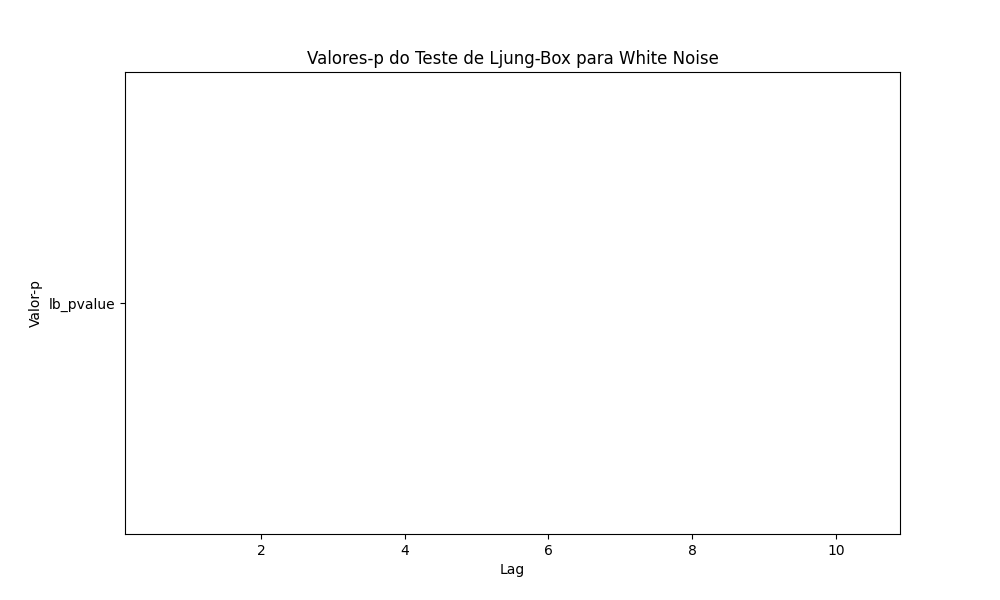

## White Noise Independente: Uma Condição Mais Forte

### Introdução

Em continuidade ao estudo do **white noise** [^47], este capítulo aprofunda-se na condição de independência estatística, que representa uma restrição mais forte do que a simples não correlação. Examinaremos as implicações dessa condição adicional e como ela diferencia o **white noise independente** do **white noise** padrão.

### Conceitos Fundamentais

Como vimos anteriormente, um processo de **white noise** {εₜ} satisfaz as seguintes propriedades [^47]:

1.  $E(\varepsilon_t) = 0$
2.  $E(\varepsilon_t^2) = \sigma^2$
3.  $E(\varepsilon_t \varepsilon_\tau) = 0 \quad \text{para } t \neq \tau$

A condição de **white noise independente** exige uma propriedade ainda mais forte: que εₜ e εₜ sejam estatisticamente independentes para todo $t \neq \tau$ [^48]. Em outras palavras, o conhecimento do valor de εₜ não fornece informação *alguma* sobre a distribuição de εₜ, independentemente de qual seja τ.

**Definição Formal:** Um processo {εₜ} é **white noise independente** se, para quaisquer $t_1, t_2, \ldots, t_n$ distintos, as variáveis aleatórias $\varepsilon_{t_1}, \varepsilon_{t_2}, \ldots, \varepsilon_{t_n}$ são estatisticamente independentes.

> 💡 **Exemplo Numérico:** Considere um processo onde $\varepsilon_1 = 2$, $\varepsilon_2 = -1$, e $\varepsilon_3 = 0$. Se este processo for white noise independente, então o valor de $\varepsilon_1$ (que é 2) não fornece nenhuma informação sobre a probabilidade de $\varepsilon_2$ ser qualquer valor, como -1, 0, ou qualquer outro número. Formalmente, $P(\varepsilon_2 = x | \varepsilon_1 = 2) = P(\varepsilon_2 = x)$ para qualquer valor $x$.

**Implicações da Independência:**

A independência estatística implica não correlação, mas o inverso não é necessariamente verdadeiro [^48]. Para ilustrar essa diferença crucial, considere o seguinte exemplo:

**Exemplo (Não Correlação vs. Independência):**

Suponha que εₜ siga uma distribuição tal que:

$$
\varepsilon_t = \begin{cases}
    +1 & \text{com probabilidade } 1/2 \\
    -1 & \text{com probabilidade } 1/2
\end{cases}
$$

Se definirmos $\varepsilon_\tau = \varepsilon_t$  para $\tau \neq t$ então  $E[\varepsilon_t \varepsilon_\tau] = E[\varepsilon_t^2] = 1$, o que claramente viola a condição de não correlação e, portanto, não é white noise.

Agora, considere um processo {εₜ} definido como se segue: ε₁ é gerado como acima. Para t > 1,

$$
\varepsilon_t = \begin{cases}
    \varepsilon_{t-1} & \text{com probabilidade } 1/2 \\
    -\varepsilon_{t-1} & \text{com probabilidade } 1/2
\end{cases}
$$

Neste caso, $E[\varepsilon_t] = 0$ e $E[\varepsilon_t \varepsilon_\tau] = 0$ para $t \neq \tau$, satisfazendo as condições de white noise não correlacionado. No entanto, εₜ é claramente dependente de εₜ₋₁, pois sua distribuição é completamente determinada por εₜ₋₁. Este processo é white noise, mas *não* é white noise independente.

*Prova da Não Correlação:*

Para provar que $E[\varepsilon_t \varepsilon_\tau] = 0$ para $t \neq \tau$ nesse exemplo específico, considere:

I. Sem perda de generalidade, assuma $t > \tau$. Então $\varepsilon_t = \pm \varepsilon_{t-1}$.

II. Podemos escrever: $E[\varepsilon_t \varepsilon_\tau] = E[E[\varepsilon_t \varepsilon_\tau | \varepsilon_{t-1}, ..., \varepsilon_\tau]]$

III. Calculando a expectativa condicional:
$E[\varepsilon_t \varepsilon_\tau | \varepsilon_{t-1}, ..., \varepsilon_\tau] = \varepsilon_\tau E[\varepsilon_t | \varepsilon_{t-1}, ..., \varepsilon_\tau] = \varepsilon_\tau \cdot 0 = 0$, uma vez que $E[\varepsilon_t | \varepsilon_{t-1}] = 0$ devido às probabilidades iguais de $\varepsilon_t$ ser $\varepsilon_{t-1}$ ou $-\varepsilon_{t-1}$.

IV. Portanto, $E[\varepsilon_t \varepsilon_\tau] = E[0] = 0$. $\blacksquare$

Este exemplo demonstra que a não correlação é uma condição *necessária* para independência, mas *não suficiente*.

> 💡 **Exemplo Numérico (Simulação):** Vamos simular o processo descrito acima por 100 períodos e verificar a não correlação amostral.

```python
import numpy as np
import matplotlib.pyplot as plt

np.random.seed(42)  # Para reprodutibilidade
n = 100
epsilon = np.zeros(n)
epsilon[0] = np.random.choice([-1, 1])
for t in range(1, n):
    epsilon[t] = epsilon[t-1] * np.random.choice([-1, 1])

# Calcular a autocorrelação amostral
def autocorr(x, lag):
    if lag >= len(x):
        return 0  # Ou tratar de outra forma
    return np.corrcoef(x[:-lag], x[lag:])[0, 1]

lags = range(1, 10)
autocorrelations = [autocorr(epsilon, lag) for lag in lags]

plt.figure(figsize=(10, 6))
plt.stem(lags, autocorrelations, use_line_collection=True)
plt.title("Autocorrelação Amostral do White Noise Não Independente")
plt.xlabel("Lag")
plt.ylabel("Autocorrelação")
plt.grid(True)
plt.show()

# Imprimir as autocorrelações para ver os valores
print("Autocorrelações:", autocorrelations)
```

Este código simula o processo e calcula as autocorrelações amostrais.  As autocorrelações devem estar próximas de zero, confirmando a não correlação amostral, embora o processo não seja independente. Observe que em simulações com um número finito de amostras, você não terá exatamente zero autocorrelação, mas valores próximos.

**Lema 1:** *Se um processo {εₜ} é white noise independente e $g$ e $h$ são funções mensuráveis, então $g(\varepsilon_t)$ e $h(\varepsilon_\tau)$ são não correlacionadas para $t \neq \tau$ se $E[g(\varepsilon_t)] < \infty$ e $E[h(\varepsilon_\tau)] < \infty$ e $E[g(\varepsilon_t)]=0$ ou $E[h(\varepsilon_\tau)]=0$.*

*Prova:* Sem perda de generalidade, suponha que $E[g(\varepsilon_t)] = 0$. Pela independência de $\varepsilon_t$ e $\varepsilon_\tau$ para $t \neq \tau$, temos que $g(\varepsilon_t)$ e $h(\varepsilon_\tau)$ também são independentes. Portanto, $E[g(\varepsilon_t)h(\varepsilon_\tau)] = E[g(\varepsilon_t)]E[h(\varepsilon_\tau)] = 0 \cdot E[h(\varepsilon_\tau)] = 0$. Logo, $g(\varepsilon_t)$ e $h(\varepsilon_\tau)$ são não correlacionadas. $\blacksquare$

> 💡 **Exemplo Numérico (Lema 1):** Seja  εₜ um white noise independente com média zero e variância 1. Defina $g(\varepsilon_t) = \varepsilon_t^3$ e $h(\varepsilon_\tau) = \varepsilon_\tau$. Então $E[g(\varepsilon_t)] = E[\varepsilon_t^3] = 0$ (pois a distribuição é simétrica em torno de zero). Pelo Lema 1, $g(\varepsilon_t)$ e $h(\varepsilon_\tau)$ são não correlacionadas para $t \neq \tau$. Isso significa que $E[\varepsilon_t^3 \varepsilon_\tau] = 0$.

**Gaussian White Noise Independente:**

Um caso particular importante é o **Gaussian white noise independente**, onde cada εₜ segue uma distribuição normal com média zero e variância σ², e todas as variáveis são independentes [^48]:

$$\varepsilon_t \sim N(0, \sigma^2) \quad \text{e são independentes}$$

Neste caso, a independência estatística é equivalente à não correlação, pois a distribuição normal é completamente caracterizada por seus dois primeiros momentos (média e variância).

Para demonstrar formalmente essa equivalência, apresentamos a seguinte prova:

*Prova da Equivalência entre Não Correlação e Independência para Gaussian White Noise:*

I. Seja {εₜ} um processo Gaussiano com $E[\varepsilon_t] = 0$ e $E[\varepsilon_t \varepsilon_\tau] = 0$ para $t \neq \tau$.

II. Como {εₜ} é um processo gaussiano, a distribuição conjunta de qualquer conjunto finito de variáveis $\varepsilon_{t_1}, \varepsilon_{t_2}, ..., \varepsilon_{t_n}$ é uma distribuição normal multivariada.

III. A matriz de covariância dessa distribuição normal multivariada é diagonal, pois $E[\varepsilon_t \varepsilon_\tau] = 0$ para $t \neq \tau$.

IV. Para uma distribuição normal multivariada, uma matriz de covariância diagonal implica que as variáveis são independentes.

V. Portanto, $\varepsilon_{t_1}, \varepsilon_{t_2}, ..., \varepsilon_{t_n}$ são independentes. Como isso vale para qualquer conjunto finito de variáveis, {εₜ} é um white noise independente. $\blacksquare$

> 💡 **Exemplo Numérico (Gaussian White Noise):** Suponha que εₜ ∼ N(0, 4), ou seja, média 0 e variância 4. Simulando alguns valores:


Cada ponto no gráfico é independente dos outros e segue uma distribuição normal com média 0 e desvio padrão 2. A não correlação entre os pontos é garantida pela independência na geração dos números aleatórios.

**Teorema 1:** *Se {εₜ} é Gaussian white noise independente, então qualquer transformação linear de {εₜ} também é um processo gaussiano.*

*Prova:* Seja $Y_t = \sum_{i=0}^{p} a_i \varepsilon_{t-i}$ uma transformação linear de {εₜ}, onde $a_i$ são constantes. Como {εₜ} é um processo gaussiano independente, cada $\varepsilon_{t-i}$ é normalmente distribuída. Uma soma ponderada de variáveis gaussianas independentes é também uma variável gaussiana. Portanto, $Y_t$ é gaussiano. Além disso, qualquer conjunto finito de variáveis $Y_{t_1}, Y_{t_2}, ..., Y_{t_n}$ é uma transformação linear de um conjunto de variáveis gaussianas independentes, e portanto é um vetor gaussiano. Logo, {Yₜ} é um processo gaussiano. $\blacksquare$

> 💡 **Exemplo Numérico (Teorema 1):** Seja εₜ ∼ N(0, 1) um Gaussian white noise independente. Defina $Y_t = 0.5\varepsilon_t + 0.3\varepsilon_{t-1} + 0.2\varepsilon_{t-2}$. Então, pelo Teorema 1, $Y_t$ também é um processo gaussiano. Podemos calcular a média e variância de $Y_t$:

> $E[Y_t] = 0.5E[\varepsilon_t] + 0.3E[\varepsilon_{t-1}] + 0.2E[\varepsilon_{t-2}] = 0$
>
> $Var(Y_t) = (0.5)^2Var(\varepsilon_t) + (0.3)^2Var(\varepsilon_{t-1}) + (0.2)^2Var(\varepsilon_{t-2}) = 0.25 + 0.09 + 0.04 = 0.38$
>
> Portanto, $Y_t \sim N(0, 0.38)$.

**Relevância Teórica:**

A condição de independência é crucial em certas provas e derivações teóricas. Por exemplo, em alguns teoremas de convergência assintótica, a independência entre os termos do processo simplifica significativamente a análise.

**Observação:** Se um processo é linear e gaussiano, a não correlação implica independência. No entanto, essa equivalência *não* se mantém para processos não lineares ou não gaussianos.

Para complementar essa observação, podemos apresentar uma condição sob a qual a não correlação *implica* independência para processos lineares.

**Teorema 1.1:** Seja $\{X_t\}$ um processo linear definido por $X_t = \sum_{i=-\infty}^{\infty} \psi_i \varepsilon_{t-i}$, onde $\{\varepsilon_t\}$ é um processo gaussiano com média zero e covariância $\gamma_{t,s} = \sigma^2 \delta_{t,s}$ (onde $\delta_{t,s}$ é a função delta de Kronecker, igual a 1 se $t=s$ e 0 caso contrário), e $\sum_{i=-\infty}^{\infty} |\psi_i| < \infty$.  Então, $\{X_t\}$ é um processo gaussiano, e a não correlação de $\{\varepsilon_t\}$ implica a independência de $\{\varepsilon_t\}$.

*Prova:* Como $\{X_t\}$ é uma combinação linear de variáveis gaussianas, ele próprio é um processo gaussiano. A não correlação de $\{\varepsilon_t\}$ implica que $\gamma_{t,s} = 0$ para $t \neq s$. Para processos gaussianos, covariância zero implica independência. Portanto, $\{\varepsilon_t\}$ é um processo gaussiano independente.  $\blacksquare$

**Implicações Práticas:**

Na prática, distinguir entre white noise não correlacionado e white noise independente pode ser desafiador. Testes estatísticos para independência são geralmente mais complexos e menos poderosos do que testes para não correlação (como o teste de Ljung-Box).

> 💡 **Exemplo Numérico (Teste de Ljung-Box):** Vamos usar o teste de Ljung-Box para testar a não correlação em um processo de white noise.



Se os valores-p forem consistentemente altos (acima de um nível de significância α, como 0.05), não rejeitamos a hipótese nula de que os dados são independentes e identicamente distribuídos (IID). No entanto, isso não prova a independência, apenas que não encontramos evidências de autocorrelação.

Em muitas aplicações, a condição de não correlação é suficiente para garantir a validade dos resultados. No entanto, em situações onde a modelagem da dependência não linear é importante, é crucial considerar a possibilidade de que o processo não seja white noise independente.

**Corolário 1:** Seja {εₜ} um white noise independente com média zero e variância σ². Se $g_1, g_2, ..., g_n$ são funções mensuráveis tais que $E[g_i(\varepsilon_{t_i})^2] < \infty$ para todo $i$, e $t_1, t_2, ..., t_n$ são distintos, então as variáveis aleatórias $g_1(\varepsilon_{t_1}), g_2(\varepsilon_{t_2}), ..., g_n(\varepsilon_{t_n})$ são independentes.

*Prova:* Este resultado segue diretamente da definição de white noise independente. Como as variáveis $\varepsilon_{t_1}, \varepsilon_{t_2}, \ldots, \varepsilon_{t_n}$ são independentes, qualquer função mensurável dessas variáveis também será independente, desde que os momentos de segunda ordem existam. $\blacksquare$

### Conclusão

O **white noise independente** representa uma condição mais forte do que a mera não correlação. Embora a não correlação seja suficiente em muitas aplicações práticas, a independência estatística é crucial para certas derivações teóricas e modelagens de dependência não linear. Compreender a distinção entre essas condições é fundamental para uma análise rigorosa de séries temporais.
<!-- END -->