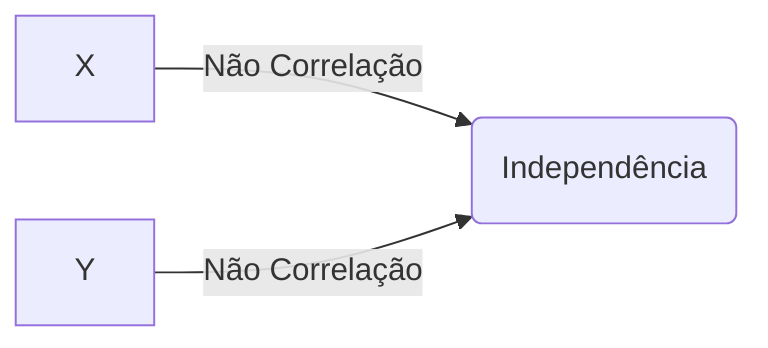
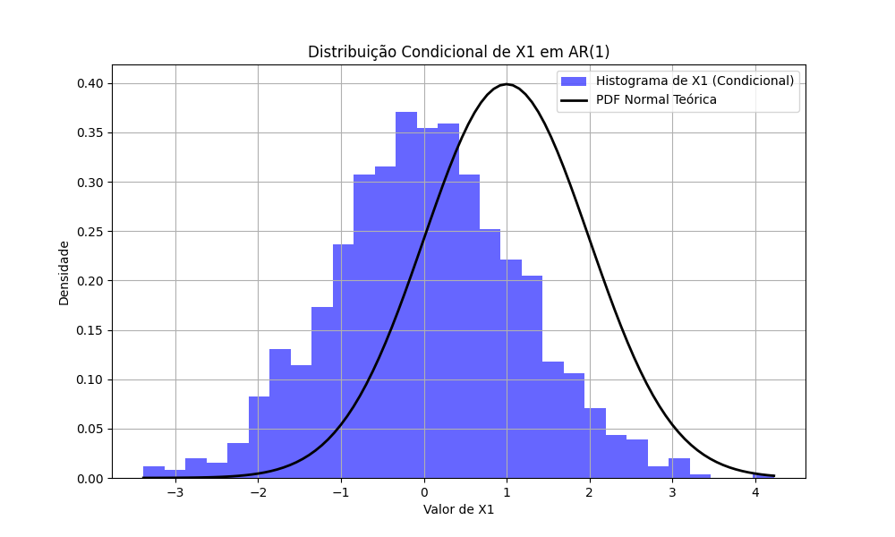

## White Noise Gaussiano: Normalidade e suas Implicações

### Introdução

Em continuidade à discussão sobre **white noise** [^47] e **white noise independente** [^49], este capítulo foca no **white noise gaussiano**. Exploraremos como a imposição da distribuição normal aos elementos do white noise simplifica a análise e quais propriedades emergem dessa condição adicional.

### Conceitos Fundamentais

Como estabelecido anteriormente, um processo de **white noise** {εₜ} possui as seguintes propriedades [^47]:

1.  $E(\varepsilon_t) = 0$
2.  $E(\varepsilon_t^2) = \sigma^2$
3.  $E(\varepsilon_t \varepsilon_\tau) = 0 \quad \text{para } t \neq \tau$

O **white noise gaussiano** é um caso especial onde, além dessas propriedades, assumimos que cada εₜ segue uma distribuição normal (gaussiana) com média zero e variância σ² [^48]:

$$ \varepsilon_t \sim N(0, \sigma^2) $$

Isto significa que a função densidade de probabilidade (PDF) de cada εₜ é dada por:

$$
f(\varepsilon_t) = \frac{1}{\sqrt{2\pi\sigma^2}} \exp\left(-\frac{\varepsilon_t^2}{2\sigma^2}\right)
$$

> 💡 **Exemplo Numérico:** Se εₜ é um white noise gaussiano com σ² = 4, então a probabilidade de observar εₜ = 1 é dada por:

```python
import numpy as np
import scipy.stats as stats

sigma = 2  # Desvio padrão, raiz quadrada da variância
x = 1      # Valor a ser avaliado

probabilidade = stats.norm.pdf(x, 0, sigma)
print(f"Probabilidade de observar εt = 1: {probabilidade:.4f}")
```

**Propriedades Adicionais do White Noise Gaussiano:**

1.  **Independência e Não Correlação Equivalentes:** Para processos gaussianos, a não correlação implica independência [^49]. Portanto, um white noise gaussiano é sempre um white noise independente.

    *Prova (Revisão):* Vimos na seção anterior que se {εₜ} é um processo gaussiano com $E[\varepsilon_t] = 0$ e $E[\varepsilon_t \varepsilon_\tau] = 0$ para $t \neq \tau$, então a distribuição conjunta de qualquer conjunto finito de variáveis $\varepsilon_{t_1}, \varepsilon_{t_2}, ..., \varepsilon_{t_n}$ é uma distribuição normal multivariada. Uma matriz de covariância diagonal (implicada pela não correlação) implica independência para uma distribuição normal multivariada. Portanto, {εₜ} é um white noise independente [^49].

    *Prova Detalhada:*
    Para provar que não correlação implica independência para variáveis Gaussianas, precisamos mostrar que a função de densidade de probabilidade conjunta (PDF) pode ser fatorada no produto das PDFs marginais.

    I. Seja $X$ e $Y$ duas variáveis aleatórias Gaussianas com média zero. A função de densidade de probabilidade conjunta é dada por:

    $$ f_{X,Y}(x,y) = \frac{1}{2\pi\sigma_X\sigma_Y\sqrt{1-\rho^2}} \exp\left(-\frac{1}{2(1-\rho^2)}\left[\frac{x^2}{\sigma_X^2} - \frac{2\rho xy}{\sigma_X\sigma_Y} + \frac{y^2}{\sigma_Y^2}\right]\right) $$

    onde $\rho$ é o coeficiente de correlação entre $X$ e $Y$, $\sigma_X$ e $\sigma_Y$ são os desvios padrões de $X$ e $Y$, respectivamente.

    II. Se $X$ e $Y$ são não correlacionadas, então $\rho = 0$. Substituindo $\rho = 0$ na PDF conjunta, obtemos:

    $$ f_{X,Y}(x,y) = \frac{1}{2\pi\sigma_X\sigma_Y} \exp\left(-\frac{1}{2}\left[\frac{x^2}{\sigma_X^2} + \frac{y^2}{\sigma_Y^2}\right]\right) $$

    III. Podemos reescrever a expressão acima como o produto de duas PDFs Gaussianas:

    $$ f_{X,Y}(x,y) = \frac{1}{\sqrt{2\pi\sigma_X^2}} \exp\left(-\frac{x^2}{2\sigma_X^2}\right) \cdot \frac{1}{\sqrt{2\pi\sigma_Y^2}} \exp\left(-\frac{y^2}{2\sigma_Y^2}\right) $$

    IV. Reconhecemos cada termo como as PDFs marginais de $X$ e $Y$:

    $$ f_{X,Y}(x,y) = f_X(x) \cdot f_Y(y) $$

    V. Como a PDF conjunta é o produto das PDFs marginais, $X$ e $Y$ são independentes. Portanto, para variáveis aleatórias Gaussianas, não correlação implica independência. $\blacksquare$

    > 💡 **Exemplo Numérico:** Considere duas variáveis aleatórias Gaussianas, X e Y, ambas com média 0 e desvio padrão 1. Se a covariância entre X e Y é 0, então X e Y são independentes. Podemos verificar isso gerando amostras aleatórias e calculando a correlação:

```python
import numpy as np

np.random.seed(42)
n = 1000
X = np.random.normal(0, 1, n)
Y = np.random.normal(0, 1, n)

correlation = np.corrcoef(X, Y)[0, 1]
print(f"Correlação entre X e Y: {correlation:.4f}")

# Diagrama Mermaid mostrando a independência
print("""

""")
```

2.  **Transformações Lineares Preservam a Gaussianidade:** Uma transformação linear de um white noise gaussiano resulta em outro processo gaussiano [^49].  Este resultado é crucial para a análise de modelos ARMA, onde o processo é expresso como uma combinação linear de white noise gaussiano.

    *Prova (Revisão):* Vimos anteriormente que se {εₜ} é Gaussian white noise independente, então qualquer transformação linear de {εₜ} também é um processo gaussiano [^49].

    *Prova Detalhada:*
    Para provar que transformações lineares preservam a Gaussianidade, podemos usar a propriedade de que combinações lineares de variáveis aleatórias Gaussianas são também Gaussianas.

    I. Seja $X_1, X_2, ..., X_n$ variáveis aleatórias Gaussianas independentes com médias $\mu_i$ e variâncias $\sigma_i^2$, ou seja, $X_i \sim N(\mu_i, \sigma_i^2)$ para $i = 1, 2, ..., n$.

    II. Considere uma transformação linear dessas variáveis:

    $$ Y = a_1X_1 + a_2X_2 + \ldots + a_nX_n + b $$

    onde $a_1, a_2, ..., a_n$ e $b$ são constantes.

    III. A média de $Y$ é dada por:

    $$ E[Y] = E[a_1X_1 + a_2X_2 + \ldots + a_nX_n + b] = a_1\mu_1 + a_2\mu_2 + \ldots + a_n\mu_n + b $$

    IV. A variância de $Y$ é dada por:

    $$ Var[Y] = Var[a_1X_1 + a_2X_2 + \ldots + a_nX_n + b] = a_1^2\sigma_1^2 + a_2^2\sigma_2^2 + \ldots + a_n^2\sigma_n^2 $$

    pois as variáveis $X_i$ são independentes.

    V. Como $Y$ é uma combinação linear de variáveis aleatórias Gaussianas independentes, $Y$ também segue uma distribuição normal:

    $$ Y \sim N(E[Y], Var[Y]) = N\left(\sum_{i=1}^{n} a_i\mu_i + b, \sum_{i=1}^{n} a_i^2\sigma_i^2\right) $$

    VI. Portanto, qualquer transformação linear de variáveis aleatórias Gaussianas resulta em outra variável aleatória Gaussiana. $\blacksquare$

    > 💡 **Exemplo Numérico:** Seja εₜ um white noise gaussiano com média 0 e variância 1. Considere a transformação linear $X_t = 2\varepsilon_t + 3$. Então, $X_t$ também é uma variável gaussiana com média $2*0 + 3 = 3$ e variância $2^2 * 1 = 4$. Podemos verificar isso simulando os dados:


3.  **Distribuição Conjunta:** A distribuição conjunta de um conjunto de variáveis {εₜ₁, εₜ₂, ..., εₜₙ} de um white noise gaussiano é uma distribuição normal multivariada com média zero e matriz de covariância diagonal, onde os elementos diagonais são todos iguais a σ².

    $$ f(\varepsilon_{t_1}, \varepsilon_{t_2}, ..., \varepsilon_{t_n}) = \prod_{i=1}^{n} \frac{1}{\sqrt{2\pi\sigma^2}} \exp\left(-\frac{\varepsilon_{t_i}^2}{2\sigma^2}\right) $$

    > 💡 **Exemplo Numérico:** Suponha que temos três variáveis de white noise gaussiano independente: ε₁, ε₂, e ε₃, todas com média zero e variância 1. A distribuição conjunta desses três pontos é uma distribuição normal multivariada tridimensional com média zero e matriz de covariância identidade. A densidade da probabilidade conjunta em, por exemplo, (1, -1, 0.5), é dada pelo produto das densidades das probabilidades marginais.

    **Lema 1:** Seja {εₜ} um white noise gaussiano. Então, para qualquer conjunto de índices distintos $t_1, t_2, ..., t_n$, as variáveis aleatórias $\varepsilon_{t_1}, \varepsilon_{t_2}, ..., \varepsilon_{t_n}$ são independentes.

    *Prova:* Pela definição de white noise gaussiano, cada $\varepsilon_t$ é normalmente distribuído com média 0 e variância $\sigma^2$. Além disso, para $t \neq \tau$, $E[\varepsilon_t \varepsilon_\tau] = 0$. Como {εₜ} é gaussiano, a não correlação implica independência. Portanto, $\varepsilon_{t_1}, \varepsilon_{t_2}, ..., \varepsilon_{t_n}$ são independentes. $\blacksquare$

    > 💡 **Exemplo Numérico:** Seja ε₁, ε₂, ε₃ um white noise gaussiano com σ² = 1. Calcule a probabilidade conjunta de observar ε₁ = 0.5, ε₂ = -0.2, ε₃ = 1.0.
```python
import numpy as np
import scipy.stats as stats

sigma = 1
e1 = 0.5
e2 = -0.2
e3 = 1.0

prob_e1 = stats.norm.pdf(e1, 0, sigma)
prob_e2 = stats.norm.pdf(e2, 0, sigma)
prob_e3 = stats.norm.pdf(e3, 0, sigma)

prob_conjunta = prob_e1 * prob_e2 * prob_e3

print(f"Probabilidade conjunta: {prob_conjunta:.4f}")
```

**Importância do White Noise Gaussiano:**

1.  **Simplificação da Análise:** A suposição de gaussianidade simplifica significativamente a análise de muitos modelos de séries temporais. Por exemplo, em modelos lineares, a distribuição gaussiana dos resíduos permite o uso de testes estatísticos bem conhecidos e a derivação de propriedades assintóticas.

    > 💡 **Exemplo Numérico:** Em um modelo de regressão linear, se assumirmos que os resíduos são white noise gaussiano, podemos usar um teste t para determinar a significância estatística dos coeficientes.

2.  **Justificativa para Métodos de Estimação:** A suposição de gaussianidade muitas vezes justifica o uso de métodos de estimação como a máxima verossimilhança (Maximum Likelihood Estimation - MLE). Para um white noise gaussiano, a função de verossimilhança tem uma forma analítica simples, facilitando a otimização.

    Para ilustrar, considere um amostra de tamanho $n$ de um white noise gaussiano {εₜ}. A função de verossimilhança é dada por:

    $$
    L(\sigma^2; \varepsilon_1, ..., \varepsilon_n) = \prod_{t=1}^{n} \frac{1}{\sqrt{2\pi\sigma^2}} \exp\left(-\frac{\varepsilon_t^2}{2\sigma^2}\right)
    $$

    O log-verossimilhança é:

    $$
    \log L(\sigma^2; \varepsilon_1, ..., \varepsilon_n) = -\frac{n}{2} \log(2\pi) - \frac{n}{2} \log(\sigma^2) - \frac{1}{2\sigma^2} \sum_{t=1}^{n} \varepsilon_t^2
    $$

    Maximizar o log-verossimilhança em relação a $\sigma^2$ nos dá o estimador de máxima verossimilhança:

    $$
    \hat{\sigma}^2_{MLE} = \frac{1}{n} \sum_{t=1}^{n} \varepsilon_t^2
    $$

    *Prova Detalhada:*
    Para derivar o estimador de máxima verossimilhança (MLE) para $\sigma^2$, seguimos estes passos:

    I. A função de log-verossimilhança é dada por:
    $$
    \log L(\sigma^2; \varepsilon_1, ..., \varepsilon_n) = -\frac{n}{2} \log(2\pi) - \frac{n}{2} \log(\sigma^2) - \frac{1}{2\sigma^2} \sum_{t=1}^{n} \varepsilon_t^2
    $$

    II. Para encontrar o estimador de máxima verossimilhança, derivamos a função de log-verossimilhança em relação a $\sigma^2$ e igualamos a zero:
    $$
    \frac{\partial \log L}{\partial \sigma^2} = -\frac{n}{2\sigma^2} + \frac{1}{2(\sigma^2)^2} \sum_{t=1}^{n} \varepsilon_t^2
    $$

    III. Igualamos a derivada a zero e resolvemos para $\sigma^2$:
    $$
    -\frac{n}{2\sigma^2} + \frac{1}{2(\sigma^2)^2} \sum_{t=1}^{n} \varepsilon_t^2 = 0
    $$
    $$
    \frac{1}{2(\sigma^2)^2} \sum_{t=1}^{n} \varepsilon_t^2 = \frac{n}{2\sigma^2}
    $$
    $$
    \sum_{t=1}^{n} \varepsilon_t^2 = n\sigma^2
    $$

    IV. Resolvemos para $\hat{\sigma}^2_{MLE}$:
    $$
    \hat{\sigma}^2_{MLE} = \frac{1}{n} \sum_{t=1}^{n} \varepsilon_t^2
    $$

    V. Portanto, o estimador de máxima verossimilhança para a variância $\sigma^2$ é a média amostral dos quadrados dos erros. $\blacksquare$

    > 💡 **Exemplo Numérico:** Suponha que temos uma amostra de 10 valores de um white noise gaussiano: ε = [0.2, -0.5, 1.1, -0.8, 0.6, -0.3, 0.9, -0.1, 0.4, -0.7]. Calcule o estimador de máxima verossimilhança para σ².

```python
import numpy as np

epsilon = np.array([0.2, -0.5, 1.1, -0.8, 0.6, -0.3, 0.9, -0.1, 0.4, -0.7])
n = len(epsilon)

sigma_squared_mle = np.sum(epsilon**2) / n

print(f"Estimador de máxima verossimilhança para σ²: {sigma_squared_mle:.4f}")
```

3.  **Base para Simulação:** A facilidade de gerar números aleatórios a partir de uma distribuição normal torna o white noise gaussiano uma ferramenta fundamental para simular dados de séries temporais e avaliar o desempenho de diferentes métodos de análise.

    > 💡 **Exemplo Numérico (Simulação):** Podemos gerar uma série de white noise gaussiano no Python como segue:

```python
import numpy as np

np.random.seed(42)  # Para reprodutibilidade
n = 100
sigma = 2
epsilon = np.random.normal(0, sigma, n)

print("Primeiros 10 valores do White Noise Gaussiano:", epsilon[:10])
```

Isto cria um array NumPy `epsilon` contendo 100 valores aleatórios amostrados de uma distribuição normal com média 0 e desvio padrão 2.

**Teorema 2:** Seja {Xₜ} um processo ARMA(p,q) dado por:

$$
X_t = c + \sum_{i=1}^{p} \phi_i X_{t-i} + \varepsilon_t + \sum_{j=1}^{q} \theta_j \varepsilon_{t-j}
$$

onde {εₜ} é um white noise gaussiano. Então, condicionado aos valores iniciais $X_1, ..., X_p$, a distribuição condicional de $X_t$ é normal.

*Prova (Esboço):* Dado que {εₜ} é white noise gaussiano, cada εₜ é normalmente distribuído e independente dos outros. Para $t > p$, $X_t$ é uma combinação linear de variáveis normais (as inovações εₜ) e dos valores passados $X_{t-1}, ..., X_{t-p}$. Dado $X_{t-1}, ..., X_{t-p}$, $X_t$ é uma combinação linear de variáveis normais, e portanto é normalmente distribuído.

*Prova Detalhada:*

I. Processo ARMA(p,q)
O processo ARMA(p,q) é definido como:
$$X_t = c + \sum_{i=1}^{p} \phi_i X_{t-i} + \varepsilon_t + \sum_{j=1}^{q} \theta_j \varepsilon_{t-j}$$
onde {εₜ} é white noise gaussiano.

II. A Expressão Condicional
Dado $X_{t-1}, ..., X_{t-p}$ e assumindo $t > max(p, q)$, a expressão se torna:
$$X_t = c + \sum_{i=1}^{p} \phi_i X_{t-i} + \varepsilon_t + \sum_{j=1}^{q} \theta_j \varepsilon_{t-j}$$

III. A Linearidade e a Distribuição Normal
Como {εₜ} é white noise gaussiano, cada εₜ é normalmente distribuído.  Sob a premissa de termos condicionado em valores iniciais $X_{t-1}, ..., X_{t-p}$ então $X_t$ é expresso como uma combinação linear de variáveis normais (os $\varepsilon_{t-j}$) e constantes ($c$ e os $\phi_i X_{t-i}$), e portanto $X_t$ é normalmente distribuído.

IV. Formalização da Distribuição Normal Condicional
A distribuição condicional de $X_t$, dados $X_{t-1}, ..., X_{t-p}$, é normal:
$$X_t | X_{t-1}, ..., X_{t-p} \sim N(\mu_t, \sigma_t^2)$$
onde $\mu_t = c + \sum_{i=1}^{p} \phi_i X_{t-i} + \sum_{j=1}^{q} \theta_j E[\varepsilon_{t-j}]$ e $\sigma_t^2 = Var[\varepsilon_t] = \sigma^2$
V. Conclusão
Assim, para o processo ARMA(p,q), a distribuição condicional de $X_t$, dados os valores anteriores, segue uma distribuição normal. $\blacksquare$

    > 💡 **Exemplo Numérico:** Considere um processo AR(1): $X_t = 0.5X_{t-1} + \varepsilon_t$, onde εₜ é white noise gaussiano com média 0 e variância 1. Se $X_0 = 2$, então a distribuição condicional de $X_1$ é normal com média $0.5 * 2 = 1$ e variância 1. Podemos simular e verificar:



**Teorema 2.1:** Se {Xₜ} é um processo ARMA(p,q) causal com {εₜ} sendo um white noise gaussiano com variância $\sigma^2$, então o processo {Xₜ} é estritamente estacionário.

*Prova (Esboço):* Um processo ARMA(p,q) causal pode ser escrito como uma combinação linear infinita de white noise gaussiano. Como o white noise gaussiano é estritamente estacionário e combinações lineares de processos estritamente estacionários são estritamente estacionárias, o resultado segue.

*Prova Detalhada:*

I. Representação Causal
Um processo ARMA(p,q) causal pode ser expresso como:
$$X_t = \sum_{j=0}^{\infty} \psi_j \varepsilon_{t-j}$$
onde os coeficientes $\psi_j$ satisfazem $\sum_{j=0}^{\infty} |\psi_j| < \infty$. Esta representação existe porque o processo é causal.

II. Estacionaridade Estrita do White Noise Gaussiano
O white noise gaussiano {εₜ} é estritamente estacionário, pois sua distribuição é invariante ao tempo (i.e., $\varepsilon_t$ tem a mesma distribuição para todo $t$).

III. Combinação Linear e Estacionaridade Estrita
Como {Xₜ} é uma combinação linear de um processo estritamente estacionário (white noise gaussiano), {Xₜ} também é estritamente estacionário. Isso decorre do fato de que a distribuição de qualquer conjunto finito de variáveis $X_{t_1}, X_{t_2}, ..., X_{t_n}$ é a mesma que a distribuição de $X_{t_1+h}, X_{t_2+h}, ..., X_{t_n+h}$ para qualquer $h$, pois elas são ambas determinadas pela distribuição do white noise gaussiano, que é invariante ao tempo.

IV. Conclusão
Portanto, se {Xₜ} é um processo ARMA(p,q) causal com {εₜ} sendo um white noise gaussiano, então {Xₜ} é estritamente estacionário. $\blacksquare$

**Limitações:**

É importante notar que a suposição de gaussianidade pode não ser apropriada para todas as séries temporais. Em algumas situações, outras distribuições (como distribuições t de Student ou distribuições mistas) podem fornecer um ajuste melhor aos dados.  A escolha da distribuição apropriada deve ser baseada na análise dos dados e no conhecimento do processo gerador de dados.

### Conclusão

O **white noise gaussiano** é um conceito fundamental na análise de séries temporais, combinando as propriedades de white noise com a conveniência analítica da distribuição normal. A suposição de gaussianidade simplifica a análise, justifica métodos de estimação comuns e facilita a simulação de dados. No entanto, é crucial reconhecer as limitações dessa suposição e considerar distribuições alternativas quando apropriado.
<!-- END -->