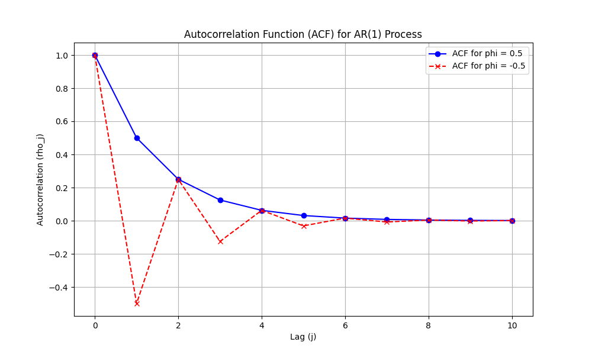

## Análise Detalhada de Processos AR(1) Estacionários

### Introdução
Este capítulo aprofunda a análise de **processos autorregressivos de primeira ordem (AR(1))** que são estacionários, ou seja, satisfazem a condição $|\phi| < 1$. Baseando-se na definição geral de processos AR(*p*) apresentada anteriormente [^58], exploraremos em detalhes as propriedades estatísticas de um processo AR(1) estacionário, incluindo sua média, variância, autocovariância e função de autocorrelação. Também examinaremos como a estacionariedade influencia essas propriedades e como elas se manifestam na função de autocorrelação.

### Processo AR(1) Estacionário: Definição e Condição de Estacionariedade

Um processo AR(1) é definido pela seguinte equação [^53]:

$$Y_t = c + \phi Y_{t-1} + \varepsilon_t$$

onde:
*   $Y_t$ é o valor da série temporal no tempo *t*.
*   $c$ é uma constante.
*   $\phi$ é o coeficiente autorregressivo de primeira ordem.
*   $\varepsilon_t$ é um termo de ruído branco com média zero e variância $\sigma^2$ [^47, 48].

A condição de estacionariedade para um processo AR(1) é $|\phi| < 1$ [^53]. Esta condição garante que as propriedades estatísticas do processo não variem ao longo do tempo e que o processo não "explode" para valores infinitos. Se $|\phi| \ge 1$, o processo não é estacionário, e as fórmulas que derivaremos abaixo não serão válidas [^54].

> 💡 **Exemplo Numérico:** Considere $\phi = 0.8$. Como $|0.8| < 1$, o processo é estacionário. Se $\phi = 1.2$, como $|1.2| > 1$, o processo não é estacionário.

### Média de um Processo AR(1) Estacionário

Para um processo AR(1) estacionário, a média incondicional $\mu = E[Y_t]$ é dada por [^53]:

$$\mu = \frac{c}{1 - \phi}$$

*Prova:* Assumindo estacionariedade, a média $\mu$ é constante ao longo do tempo, ou seja, $E[Y_t] = E[Y_{t-1}] = \mu$. Tomando o valor esperado de ambos os lados da equação do processo AR(1):

$$E[Y_t] = E[c + \phi Y_{t-1} + \varepsilon_t]$$

I. Usando a linearidade da esperança e o fato de que $E[\varepsilon_t] = 0$, temos:

$$\mu = c + \phi \mu$$

II. Resolvendo para $\mu$:

$$\mu - \phi \mu = c$$
$$\mu (1 - \phi) = c$$
$$\mu = \frac{c}{1 - \phi}$$

A condição $|\phi| < 1$ garante que o denominador $(1 - \phi)$ não seja zero. $\blacksquare$

> 💡 **Exemplo Numérico:** Se $c = 5$ e $\phi = 0.5$, então a média é $\mu = \frac{5}{1 - 0.5} = \frac{5}{0.5} = 10$. Se $c = -2$ e $\phi = -0.3$, então a média é $\mu = \frac{-2}{1 - (-0.3)} = \frac{-2}{1.3} \approx -1.54$.

### Variância de um Processo AR(1) Estacionário

A variância de um processo AR(1) estacionário, denotada por $\gamma_0 = Var(Y_t) = E[(Y_t - \mu)^2]$, é dada por [^53]:

$$\gamma_0 = \frac{\sigma^2}{1 - \phi^2}$$

*Prova:* Para derivar a variância, primeiro reescrevemos o processo AR(1) em termos de desvios da média:

$$Y_t - \mu = \phi (Y_{t-1} - \mu) + \varepsilon_t$$

I. Elevando ambos os lados ao quadrado e tomando a esperança:

$$E[(Y_t - \mu)^2] = E[(\phi (Y_{t-1} - \mu) + \varepsilon_t)^2]$$

II. Usando a linearidade da esperança e expandindo o quadrado:

$$E[(Y_t - \mu)^2] = \phi^2 E[(Y_{t-1} - \mu)^2] + 2\phi E[(Y_{t-1} - \mu)\varepsilon_t] + E[\varepsilon_t^2]$$

III. Como $\varepsilon_t$ é ruído branco e independente de $Y_{t-1}$, o termo $E[(Y_{t-1} - \mu)\varepsilon_t] = 0$. Além disso, $E[(Y_t - \mu)^2] = E[(Y_{t-1} - \mu)^2] = \gamma_0$ devido à estacionariedade, e $E[\varepsilon_t^2] = \sigma^2$. Portanto:

$$\gamma_0 = \phi^2 \gamma_0 + \sigma^2$$

IV. Resolvendo para $\gamma_0$:

$$\gamma_0 - \phi^2 \gamma_0 = \sigma^2$$
$$\gamma_0 (1 - \phi^2) = \sigma^2$$
$$\gamma_0 = \frac{\sigma^2}{1 - \phi^2}$$

A condição $|\phi| < 1$ garante que o denominador $(1 - \phi^2)$ seja positivo e que a variância seja finita. $\blacksquare$

> 💡 **Exemplo Numérico:** Se $\sigma^2 = 2$ e $\phi = 0.7$, então a variância é $\gamma_0 = \frac{2}{1 - (0.7)^2} = \frac{2}{1 - 0.49} = \frac{2}{0.51} \approx 3.92$. Se $\sigma^2 = 1$ e $\phi = -0.4$, então a variância é $\gamma_0 = \frac{1}{1 - (-0.4)^2} = \frac{1}{1 - 0.16} = \frac{1}{0.84} \approx 1.19$.

**Observação:** Uma maneira alternativa de expressar a variância é utilizando o operador de retrocesso (backshift operator) *B*, onde $BY_t = Y_{t-1}$. Podemos reescrever a equação do processo AR(1) como $(1 - \phi B)Y_t = c + \varepsilon_t$. Se o processo é estacionário, então o operador $(1 - \phi B)$ é invertível e podemos expressar $Y_t$ como uma soma infinita de choques passados. Esta representação é útil para derivar propriedades do processo.

### Autocovariância de um Processo AR(1) Estacionário

A *j*-ésima autocovariância de um processo AR(1) estacionário, denotada por $\gamma_j = E[(Y_t - \mu)(Y_{t-j} - \mu)]$, é dada por [^53]:

$$\gamma_j = \frac{\phi^j}{1 - \phi^2} \sigma^2 = \phi^j \gamma_0$$

*Prova:* Para derivar a autocovariância, multiplicamos ambos os lados da equação de desvio da média por $(Y_{t-j} - \mu)$ e tomamos a esperança:

$$E[(Y_t - \mu)(Y_{t-j} - \mu)] = E[(\phi (Y_{t-1} - \mu) + \varepsilon_t)(Y_{t-j} - \mu)]$$

I. Usando a linearidade da esperança e expandindo:

$$E[(Y_t - \mu)(Y_{t-j} - \mu)] = \phi E[(Y_{t-1} - \mu)(Y_{t-j} - \mu)] + E[\varepsilon_t(Y_{t-j} - \mu)]$$

II. Para $j > 0$, o termo $E[\varepsilon_t(Y_{t-j} - \mu)] = 0$ porque $\varepsilon_t$ é independente de $Y_{t-j}$. Portanto:

$$\gamma_j = \phi \gamma_{j-1}$$

III. Aplicando esta recursão repetidamente, obtemos:

$$\gamma_j = \phi \gamma_{j-1} = \phi^2 \gamma_{j-2} = \ldots = \phi^j \gamma_0$$

IV. Substituindo $\gamma_0 = \frac{\sigma^2}{1 - \phi^2}$, temos:

$$\gamma_j = \frac{\phi^j}{1 - \phi^2} \sigma^2 = \phi^j \gamma_0$$

Esta fórmula mostra que a autocovariância decai geometricamente com o aumento do lag *j*. A condição $|\phi| < 1$ garante que o decaimento seja para zero à medida que *j* aumenta. $\blacksquare$

> 💡 **Exemplo Numérico:** Seja $\sigma^2 = 1$, $\phi = 0.6$. Então $\gamma_0 = \frac{1}{1 - 0.6^2} = \frac{1}{0.64} = 1.5625$.
>
> $\gamma_1 = \phi \gamma_0 = 0.6 * 1.5625 = 0.9375$
>
> $\gamma_2 = \phi^2 \gamma_0 = 0.6^2 * 1.5625 = 0.5625$
>
> $\gamma_3 = \phi^3 \gamma_0 = 0.6^3 * 1.5625 = 0.3375$
>
> E assim por diante. Note que as autocovariâncias decaem geometricamente.

**Teorema 1** [Yule-Walker Equations for AR(1) Process]
As equações de Yule-Walker para um processo AR(1) estacionário relacionam as autocorrelações do processo com os coeficientes autorregressivos. Para um processo AR(1), a equação de Yule-Walker é dada por:

$$\rho_1 = \phi$$

*Prova:* Dividindo a equação $\gamma_j = \phi \gamma_{j-1}$ por $\gamma_0$, obtemos:

$$\frac{\gamma_j}{\gamma_0} = \phi \frac{\gamma_{j-1}}{\gamma_0}$$

I. Por definição, $\rho_j = \frac{\gamma_j}{\gamma_0}$.  Portanto:

$$\rho_j = \phi \rho_{j-1}$$

II. Para *j* = 1, temos:

$$\rho_1 = \phi \rho_0$$

III. Como $\rho_0 = 1$, segue que:

$$\rho_1 = \phi$$

Este resultado é fundamental porque permite estimar o coeficiente $\phi$ diretamente da primeira autocorrelação amostral da série temporal. $\blacksquare$

> 💡 **Exemplo Numérico:** Se a primeira autocorrelação amostral $\rho_1$ de uma série temporal é 0.75, então, de acordo com as equações de Yule-Walker, uma estimativa para $\phi$ seria 0.75.

### Função de Autocorrelação (ACF) de um Processo AR(1) Estacionário

A função de autocorrelação (ACF) de um processo AR(1) estacionário, denotada por $\rho_j$, é definida como a autocovariância dividida pela variância [^49]:

$$\rho_j = \frac{\gamma_j}{\gamma_0} = \phi^j$$

Esta fórmula mostra que a ACF de um processo AR(1) estacionário decai geometricamente com o aumento do lag *j*. O sinal de $\phi$ determina se o decaimento é positivo (se $\phi > 0$) ou alternado (se $\phi < 0$).

> 💡 **Exemplo Numérico:** Se $\phi = 0.5$, a ACF é $\rho_j = (0.5)^j$, que decai para zero à medida que *j* aumenta. Se $\phi = -0.5$, a ACF é $\rho_j = (-0.5)^j$, que alterna em sinal e decai para zero à medida que *j* aumenta.

**Corolário 1.1** [ACF for negative lags]
Para um processo AR(1) estacionário, a função de autocorrelação é simétrica, ou seja, $\rho_j = \rho_{-j}$.

*Prova:* Por definição, $\rho_j = \frac{\gamma_j}{\gamma_0}$, onde $\gamma_j = E[(Y_t - \mu)(Y_{t-j} - \mu)]$.

I. Também, $\gamma_{-j} = E[(Y_t - \mu)(Y_{t+j} - \mu)] = E[(Y_{t-j} - \mu)(Y_t - \mu)] = \gamma_j$ devido à estacionariedade.

II. Portanto, $\rho_{-j} = \frac{\gamma_{-j}}{\gamma_0} = \frac{\gamma_j}{\gamma_0} = \rho_j$.

III. Assim, $\rho_j = \rho_{-j}$. $\blacksquare$

> 💡 **Exemplo Numérico:** Se $\phi = 0.3$, então $\rho_2 = (0.3)^2 = 0.09$ e $\rho_{-2} = (0.3)^{-2} = (1/0.3)^2$ não faz sentido. Mas como $\rho_j = \phi^j$, então $\rho_{-2}$ is not correct. $\rho_{-j} = \rho_{j}$ so $\rho_{-2} = (0.3)^2 = 0.09$.

### Implicações da Estacionariedade na Autocorrelação

A condição de estacionariedade $|\phi| < 1$ tem implicações diretas na forma da função de autocorrelação [^53]:

1.  **Decaimento Geométrico:** A ACF decai geometricamente para zero à medida que o lag *j* aumenta. Isso significa que a dependência entre observações diminui à medida que a distância no tempo aumenta.

2.  **Convergência para Zero:** Como $|\phi| < 1$, $\lim_{j \to \infty} \rho_j = \lim_{j \to \infty} \phi^j = 0$. Isso significa que observações distantes no tempo são assintoticamente não correlacionadas.

3.  **Absoluta Somabilidade:** A condição de estacionariedade também implica que a ACF é absolutamente somável, ou seja, $\sum_{j=-\infty}^{\infty} |\rho_j| < \infty$ [^52]. Isso garante que o processo seja "ergódico para a média", o que significa que a média amostral converge para a média populacional à medida que o tamanho da amostra aumenta.

> 💡 **Exemplo Numérico:** Se $\phi = 0.8$, a ACF decai mais lentamente do que se $\phi = 0.2$. Isso implica que as observações passadas têm uma influência maior no valor atual da série temporal quando $\phi$ é maior.

**Teorema 2** [Invertibility of AR(1) process]
Um processo AR(1) estacionário é sempre invertível.

*Prova:* Um processo AR(1) é dito invertível se ele pode ser expresso como uma representação MA($\infty$). A condição para invertibilidade é que as raízes do polinômio autorregressivo estejam fora do círculo unitário.

I. No caso de um AR(1), o polinômio autorregressivo é $(1 - \phi B)$, onde *B* é o operador de retrocesso.

II. A raiz deste polinômio é dada por $B = \frac{1}{\phi}$.

III. Para que o processo seja invertível, devemos ter $|B| > 1$, o que implica $|\frac{1}{\phi}| > 1$, ou equivalentemente, $|\phi| < 1$.

IV. Esta é exatamente a condição de estacionariedade para o processo AR(1). Portanto, um processo AR(1) estacionário é sempre invertível. $\blacksquare$

> 💡 **Exemplo Numérico:** Se $\phi = 0.6$, então the root of the autoregressive polynomial is $1/0.6 \approx 1.67$, which is outside the unit circle ($|1.67| > 1$). Portanto, o processo é invertível.

### Conclusão

O processo AR(1) estacionário serve como um bloco de construção fundamental na análise de séries temporais. Suas propriedades estatísticas, incluindo a média, variância, autocovariância e função de autocorrelação, são completamente determinadas pelo coeficiente autorregressivo $\phi$ e pela variância do ruído branco $\sigma^2$. A condição de estacionariedade $|\phi| < 1$ é crucial para garantir que o processo seja bem comportado e que suas propriedades estatísticas sejam consistentes ao longo do tempo. A forma geométrica da função de autocorrelação fornece informações valiosas sobre a dependência temporal das observações e é uma ferramenta essencial para modelar e prever séries temporais.

### Referências
[^47]: Página 47.
[^48]: Página 48.
[^49]: Página 49.
[^52]: Página 52.
[^53]: Página 53.
[^54]: Página 54.
[^58]: Página 58.
<!-- END -->