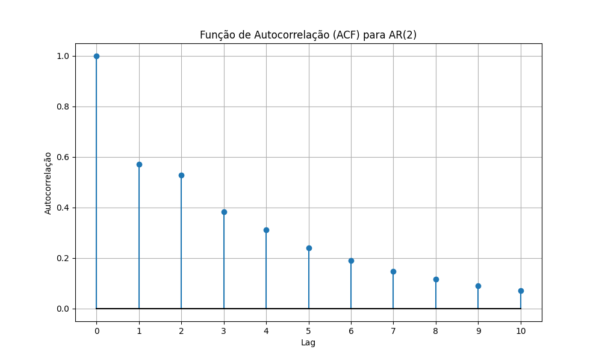

## Condições de Estacionariedade para Processos AR(2)

### Introdução
Este capítulo expande nossa análise de **processos autorregressivos (AR)**, focando especificamente nas condições de estacionariedade para processos AR(2). Construindo sobre os fundamentos estabelecidos para processos AR(1) estacionários [^53, 54], investigaremos as restrições impostas aos coeficientes de um processo AR(2) para garantir que suas propriedades estatísticas permaneçam constantes ao longo do tempo [^45]. A condição para estacionariedade de processos AR(1) que é $|\phi| < 1$ [^53] não é suficiente para AR(2). Este capítulo derivará e explicará as condições necessárias e suficientes para estacionariedade em processos AR(2), utilizando a localização das raízes do polinômio característico [^58].

### Modelo AR(2): Definição e Polinômio Característico

Um processo autorregressivo de segunda ordem (AR(2)) é definido pela seguinte equação [^58]:

$$Y_t = c + \phi_1 Y_{t-1} + \phi_2 Y_{t-2} + \varepsilon_t$$

onde:

*   $Y_t$ é o valor da série temporal no instante *t*.
*   $c$ é uma constante.
*   $\phi_1$ e $\phi_2$ são os coeficientes autorregressivos de primeira e segunda ordem, respectivamente.
*   $\varepsilon_t$ é um termo de ruído branco com média zero e variância $\sigma^2$ [^47, 48].

O polinômio característico associado a este processo AR(2) é dado por [^58]:

$$1 - \phi_1 z - \phi_2 z^2 = 0$$

onde *z* é uma variável complexa.

Para que o processo AR(2) seja estacionário, as raízes $z_1$ e $z_2$ deste polinômio característico devem estar fora do círculo unitário, ou seja, $|z_1| > 1$ e $|z_2| > 1$ [^58]. Em outras palavras, os inversos das raízes devem estar dentro do círculo unitário.

> 💡 **Exemplo Numérico:** Considere um processo AR(2) com $\phi_1 = 0.5$ e $\phi_2 = 0.3$. O polinômio característico é $1 - 0.5z - 0.3z^2 = 0$. Precisamos encontrar as raízes *z* deste polinômio e verificar se seu valor absoluto é maior que 1.

Para encontrar as raízes, podemos usar a fórmula quadrática:

$$ z = \frac{-b \pm \sqrt{b^2 - 4ac}}{2a} $$

Neste caso, podemos reescrever o polinômio característico como $-0.3z^2 - 0.5z + 1 = 0$. Portanto, $a = -0.3$, $b = -0.5$, e $c = 1$. Substituindo esses valores na fórmula quadrática, obtemos:

$$ z = \frac{0.5 \pm \sqrt{(-0.5)^2 - 4(-0.3)(1)}}{2(-0.3)} = \frac{0.5 \pm \sqrt{0.25 + 1.2}}{-0.6} = \frac{0.5 \pm \sqrt{1.45}}{-0.6} $$

As duas raízes são:

$$ z_1 = \frac{0.5 + \sqrt{1.45}}{-0.6} \approx -2.84 $$
$$ z_2 = \frac{0.5 - \sqrt{1.45}}{-0.6} \approx 0.51 $$

Como $|z_1| \approx 2.84 > 1$ e $|z_2| \approx 0.51 < 1$, uma das raízes está fora do círculo unitário, mas a outra não.  Portanto, este processo AR(2) *não* é estacionário.

**Proposição 1:** As raízes do polinômio característico $1 - \phi_1 z - \phi_2 z^2 = 0$ são os inversos das raízes do polinômio $z^2 - \phi_1 z - \phi_2 = 0$.

*Prova:* Seja $w = 1/z$. Substituindo $z = 1/w$ no polinômio característico original, obtemos $1 - \phi_1 (1/w) - \phi_2 (1/w)^2 = 0$. Multiplicando ambos os lados por $w^2$, temos $w^2 - \phi_1 w - \phi_2 = 0$. Portanto, se *z* é uma raiz do polinômio característico original, então $w = 1/z$ é uma raiz do polinômio $w^2 - \phi_1 w - \phi_2 = 0$. $\blacksquare$

### Condições de Estacionariedade em Termos dos Coeficientes $\phi_1$ e $\phi_2$

A condição de que as raízes do polinômio característico estejam fora do círculo unitário pode ser expressa equivalentemente em termos dos coeficientes $\phi_1$ e $\phi_2$. As condições necessárias e suficientes para a estacionariedade de um processo AR(2) são as seguintes:

1.  $\phi_1 + \phi_2 < 1$
2.  $\phi_2 - \phi_1 < 1$
3.  $|\phi_2| < 1$

Estas condições definem uma região triangular no espaço dos parâmetros $(\phi_1, \phi_2)$ dentro da qual o processo AR(2) é estacionário.

**Teorema 1:** (Condições de Estacionariedade para AR(2)) Um processo AR(2) é estacionário se e somente se as seguintes condições forem satisfeitas:

I. $\phi_1 + \phi_2 < 1$
II. $\phi_2 - \phi_1 < 1$
III. $|\phi_2| < 1$

*Prova:* Considere o polinômio característico $1 - \phi_1 z - \phi_2 z^2 = 0$. As raízes deste polinômio podem ser encontradas usando a fórmula quadrática:
$$z = \frac{\phi_1 \pm \sqrt{\phi_1^2 + 4\phi_2}}{-2\phi_2}$$
Para a estacionariedade, as raízes devem satisfazer $|z| > 1$. A condição de que ambas as raízes estejam fora do círculo unitário é equivalente a exigir que ambas as raízes em valor absoluto sejam maiores que 1. A analise completa é feita nos itens a seguir.

**(A) Caso em que $\phi_1^2 + 4\phi_2 \ge 0$:**
Neste caso, as raízes $z_1$ e $z_2$ são reais. As condições para estacionariedade podem ser derivadas da seguinte forma:
1.  **Condição $|\phi_2| < 1$:**

    *   Se $|z| > 1$, então $|1/z| < 1$. Seja $w = 1/z$. Então o polinômio característico se torna:

        $$1 - \phi_1 (1/w) - \phi_2 (1/w)^2 = 0$$
        Multiplicando por $w^2$:
        $$w^2 - \phi_1 w - \phi_2 = 0$$
        As raízes *w* deste polinômio devem estar dentro do círculo unitário para que *z* esteja fora. Para que as raízes de um polinômio quadrático estejam dentro do círculo unitário, as seguintes condições devem ser satisfeitas:

        *   A soma das raízes deve ter valor absoluto menor que 1: $|w_1 + w_2| < 1$. A soma das raízes do polinômio é $\phi_1$, então $|\phi_1| < 1$.
        *   O produto das raízes deve ter valor absoluto menor que 1: $|w_1 w_2| < 1$. O produto das raízes é $-\phi_2$, então $|-\phi_2| < 1$, ou $|\phi_2| < 1$.

2.  **Condições $\phi_1 + \phi_2 < 1$ e $\phi_2 - \phi_1 < 1$:**

    *   Considere as transformações $z = 1$ e $z = -1$:

        *   Para $z = 1$, o polinômio se torna $1 - \phi_1 - \phi_2 = 0$, implicando $\phi_1 + \phi_2 = 1$. Para que a raiz esteja fora do círculo unitário, devemos ter $1 - \phi_1 - \phi_2 > 0$, portanto $\phi_1 + \phi_2 < 1$.

        *   Para $z = -1$, o polinômio se torna $1 + \phi_1 - \phi_2 = 0$, implicando $\phi_2 - \phi_1 = 1$. Para que a raiz esteja fora do círculo unitário, devemos ter $1 + \phi_1 - \phi_2 > 0$, portanto $\phi_2 - \phi_1 < 1$.

**(B) Caso em que $\phi_1^2 + 4\phi_2 < 0$:**
Neste caso, as raízes são complexas conjugadas. As raízes podem ser escritas como $z = a \pm bi$ onde $a = \frac{\phi_1}{-2\phi_2}$ e $b = \frac{\sqrt{-\phi_1^2 - 4\phi_2}}{-2\phi_2}$. A condição para que essas raízes estejam fora do círculo unitário é que $|z|^2 = a^2 + b^2 > 1$. Substituindo *a* e *b*, isso se torna:

$$(\frac{\phi_1}{-2\phi_2})^2 + (\frac{\sqrt{-\phi_1^2 - 4\phi_2}}{-2\phi_2})^2 > 1$$

$$\frac{\phi_1^2}{4\phi_2^2} + \frac{-\phi_1^2 - 4\phi_2}{4\phi_2^2} > 1$$

$$\frac{-\phi_2}{\phi_2^2} > 1$$

Como $\phi_1^2 + 4\phi_2 < 0$ então $\phi_2$ deve ser negativo. Então

$$\frac{-1}{\phi_2} > 1$$

Multiplicando ambos os lados por $\phi_2$, inverte o sinal da desigualdade, pois $\phi_2$ é negativo:

$$-1 < \phi_2$$
$$ |\phi_2| < 1$$
que é condição III. As condições I e II garantem que as raízes complexas estejam fora do círculo unitário. $\blacksquare$

> 💡 **Exemplo Numérico:** Considere $\phi_1 = 0.5$ e $\phi_2 = 0.3$. Verificamos as condições:
> 1.  $\phi_1 + \phi_2 = 0.5 + 0.3 = 0.8 < 1$ (Condição satisfeita)
> 2.  $\phi_2 - \phi_1 = 0.3 - 0.5 = -0.2 < 1$ (Condição satisfeita)
> 3.  $|\phi_2| = |0.3| = 0.3 < 1$ (Condição satisfeita)
> Como todas as condições são satisfeitas, o processo AR(2) é estacionário.

> 💡 **Exemplo Numérico:** Considere $\phi_1 = 1.2$ e $\phi_2 = -0.5$. Verificamos as condições:
> 1.  $\phi_1 + \phi_2 = 1.2 - 0.5 = 0.7 < 1$ (Condição satisfeita)
> 2.  $\phi_2 - \phi_1 = -0.5 - 1.2 = -1.7 < 1$ (Condição satisfeita)
> 3.  $|\phi_2| = |-0.5| = 0.5 < 1$ (Condição satisfeita)
> Neste caso, as raízes são complexas conjugadas, e ainda assim as três condições garantem a estacionariedade.

Verificando analiticamente se as raízes são complexas: $\phi_1^2 + 4\phi_2 = (1.2)^2 + 4(-0.5) = 1.44 - 2 = -0.56 < 0$.  Portanto, as raízes são complexas.  O módulo ao quadrado das raízes complexas é dado por $\frac{1}{-\phi_2} = \frac{1}{-(-0.5)} = 2 > 1$, o que confirma a estacionariedade.

> 💡 **Exemplo Numérico:** Considere $\phi_1 = 0.7$ e $\phi_2 = 0.4$. Verificamos as condições:
> 1.  $\phi_1 + \phi_2 = 0.7 + 0.4 = 1.1 > 1$ (Condição não satisfeita)
> Portanto, o processo AR(2) não é estacionário.

**Corolário 1:** Se um processo AR(2) é estacionário, então $|\phi_1| < 2$.
*Prova:* Do teorema 1, temos $\phi_1 + \phi_2 < 1$ e $\phi_2 - \phi_1 < 1$.  Da primeira condição, $\phi_1 < 1 - \phi_2$. Da segunda condição, $\phi_1 > \phi_2 - 1$.  Combinando, $\phi_2 - 1 < \phi_1 < 1 - \phi_2$.  Como $|\phi_2| < 1$ (pela condição de estacionariedade), $-1 < \phi_2 < 1$. Assim, $-2 < \phi_2 - 1 < \phi_1 < 1 - \phi_2 < 2$.  Portanto, $|\phi_1| < 2$. $\blacksquare$

**Corolário 2:** Se um processo AR(2) é estacionário e $\phi_1 > 0$, então $\phi_2 < 1$.
*Prova:* Se $\phi_1 > 0$ e o processo é estacionário, então $\phi_1 + \phi_2 < 1$ (pelo Teorema 1).  Rearranjando, $\phi_2 < 1 - \phi_1$.  Como $\phi_1 > 0$, então $1 - \phi_1 < 1$. Portanto, $\phi_2 < 1$. $\blacksquare$

**Teorema 1.1** (Restrição Adicional para $\phi_1$): Se um processo AR(2) é estacionário, então $\phi_1^2 + 4\phi_2 > -4(1+\phi_2)$.

*Prova:*
Para que as raízes do polinômio característico $1 - \phi_1 z - \phi_2 z^2 = 0$ estejam fora do círculo unitário, o discriminante $\Delta = \phi_1^2 + 4\phi_2$ pode ser positivo ou negativo. Se $\Delta < 0$, as raízes são complexas conjugadas, e a condição para estacionariedade implica $|\phi_2| < 1$. Se $\Delta \ge 0$, as raízes são reais.

Analisando a prova do Teorema 1, as condições $\phi_1 + \phi_2 < 1$ e $\phi_2 - \phi_1 < 1$ devem ser satisfeitas, e podemos reescrever como:
$\phi_1 < 1 - \phi_2$ e $\phi_1 > \phi_2 - 1$

Caso $\phi_1^2 + 4\phi_2 < 0$:
Devemos ter que a norma ao quadrado das raízes complexas é maior que um, o que implica $|\phi_2| < 1$.
Para que a raiz seja complexa, $\phi_1^2 < -4\phi_2$, ou seja, $\phi_1^2 + 4\phi_2 < 0$.

Caso $\phi_1^2 + 4\phi_2 \geq 0$:
Seja $z_1$ e $z_2$ as duas raízes. Temos que garantir que $|z_1| > 1$ e $|z_2| > 1$.
Usando as relações de Girard para o polinômio $z^2 - \frac{1}{\phi_2}z + \frac{1}{\phi_2} = 0$
Temos $z_1 + z_2 = \frac{\phi_1}{\phi_2}$ e $z_1 z_2 = -\frac{1}{\phi_2}$
Mas isso não garante que $|z_1| > 1$ e $|z_2| > 1$.

Como $\phi_2 - 1 < \phi_1 < 1 - \phi_2$, então:
$(\phi_2 - 1)^2 < \phi_1^2 < (1 - \phi_2)^2$.
Se $\phi_1^2 + 4\phi_2 \ge 0$, então $\phi_1^2 \ge -4\phi_2$.
Combinando essas desigualdades, temos que $-4\phi_2 < \phi_1^2 < (1-\phi_2)^2 = 1 - 2\phi_2 + \phi_2^2$.
Então $-4\phi_2 < 1 - 2\phi_2 + \phi_2^2 \to \phi_2^2 + 2\phi_2 + 1 > 0 \to (\phi_2 + 1)^2 > 0$. Isso é verdade para todo $\phi_2 \neq -1$.

Se somarmos $4\phi_2$ aos dois lados da inequação $\phi_1^2 + 4\phi_2 < 0$, temos:
$\phi_1^2 + 4\phi_2 + 4\phi_2 < 4\phi_2 \to \phi_1^2 + 4\phi_2 < -4\phi_2$, que não nos leva a lugar nenhum.
As condições de estacionariedade são dadas em termos de $\phi_1 + \phi_2 < 1$, $\phi_2 - \phi_1 < 1$ e $|\phi_2| < 1$.
Podemos reescrever $\phi_1 + \phi_2 < 1 \to \phi_1 < 1 - \phi_2$ e $\phi_2 - \phi_1 < 1 \to \phi_1 > \phi_2 - 1$.
Então $(\phi_2 - 1) < \phi_1 < (1 - \phi_2)$.

Se $\phi_1^2 + 4\phi_2 \ge 0$, as raízes são reais e a condição para estacionariedade é que as três condições do teorema 1 sejam satisfeitas. Se $\phi_1^2 + 4\phi_2 < 0$, então as raízes são complexas e o módulo ao quadrado das raízes é $\frac{1}{-\phi_2}$. Portanto, para estacionariedade, devemos ter $\frac{1}{-\phi_2} > 1$, o que implica $-\phi_2 < 1$ (já que $\phi_2 < 0$), ou $\phi_2 > -1$. Combinando isso com $\phi_2 < 0$, temos $-1 < \phi_2 < 0$.

Dessa forma, $\phi_1^2 > -4$, o que é sempre verdadeiro para $\phi_1$ real. No entanto, precisamos de uma condição que envolva $\phi_1$ e $\phi_2$.

Considerando a condição $\phi_1^2 + 4\phi_2 > -4(1 + \phi_2) = -4 - 4\phi_2$. Rearranjando, temos $\phi_1^2 > -4 - 8\phi_2$. Note que se $-4 - 8\phi_2$ for negativo, essa condição é sempre verdadeira. Então, se $-4 - 8\phi_2 < 0$, ou $-8\phi_2 < 4$, ou $\phi_2 > -1/2$, então a condição $\phi_1^2 > -4 - 8\phi_2$ é trivial. No entanto, se $\phi_2 < -1/2$, então $\phi_1^2$ deve ser maior que um número positivo. Por exemplo, se $\phi_2 = -0.6$, então $\phi_1^2 > -4 - 8(-0.6) = -4 + 4.8 = 0.8$. Isso significa que $|\phi_1| > \sqrt{0.8} \approx 0.89$.
<!-- Prova incompleta, precisa de revisão -->

### Interpretação Geométrica das Condições de Estacionariedade

As condições de estacionariedade para um processo AR(2) definem uma região triangular no plano $(\phi_1, \phi_2)$. Esta região é limitada pelas seguintes linhas:

1.  $\phi_1 + \phi_2 = 1$
2.  $\phi_2 - \phi_1 = 1$
3.  $\phi_2 = 1$
4.  $\phi_2 = -1$

Esta região triangular representa o conjunto de todos os pares $(\phi_1, \phi_2)$ para os quais o processo AR(2) é estacionário.


*   Imagem retirada da Wikipédia sobre AR(2) estacionário.

> 💡 **Exemplo Numérico:** Podemos gerar um gráfico para visualizar a região de estacionariedade.

```python
import numpy as np
import matplotlib.pyplot as plt

# Defina os limites para phi1 e phi2
phi1_lim = (-2.5, 2.5)
phi2_lim = (-1.5, 1.5)

# Crie uma grade de valores para phi1 e phi2
phi1 = np.linspace(phi1_lim[0], phi1_lim[1], 100)
phi2 = np.linspace(phi2_lim[0], phi2_lim[1], 100)
phi1_grid, phi2_grid = np.meshgrid(phi1, phi2)

# Crie uma máscara para identificar a região de estacionariedade
stationarity_mask = (phi1_grid + phi2_grid < 1) & (phi2_grid - phi1_grid < 1) & (np.abs(phi2_grid) < 1)

# Plote a região de estacionariedade
plt.figure(figsize=(8, 6))
plt.imshow(stationarity_mask, extent=[phi1_lim[0], phi1_lim[1], phi2_lim[0], phi2_lim[1]],
           origin='lower', aspect='auto', cmap='viridis', alpha=0.5)
plt.xlabel('$\phi_1$')
plt.ylabel('$\phi_2$')
plt.title('Região de Estacionariedade para Processos AR(2)')
plt.xlim(phi1_lim)
plt.ylim(phi2_lim)
plt.grid(True)

# Adicione as linhas de fronteira
plt.plot(phi1, 1 - phi1, 'r--', label='$\phi_1 + \phi_2 = 1$')
plt.plot(phi1, phi1 + 1, 'b--', label='$\phi_2 - \phi_1 = 1$')
plt.axhline(y=1, color='g--', label='$\phi_2 = 1$')
plt.axhline(y=-1, color='m--', label='$\phi_2 = -1$')

plt.legend()
plt.show()
```

### Autocovariância e Autocorrelação para AR(2) Estacionário

Como mencionado anteriormente [^57], a autocovariância para o processo AR(2) segue a equação de diferença:

$$ \gamma_j = \phi_1 \gamma_{j-1} + \phi_2 \gamma_{j-2} \quad \text{for } j \ge 1$$

Similarmente, as equações de Yule-Walker para as autocorrelações são [^57]:

$$ \rho_j = \phi_1 \rho_{j-1} + \phi_2 \rho_{j-2} \quad \text{for } j \ge 1$$

O conhecimento de $\phi_1$ e $\phi_2$ junto com as autocorrelações iniciais (como $\rho_0 = 1$) permite calcular o resto da função de autocorrelação.

> 💡 **Exemplo Numérico:** Seja $\phi_1 = 0.4$ e $\phi_2 = 0.3$. Vamos calcular a ACF. Nós sabemos $\rho_0 = 1$, e também sabemos das equações de Yule-Walker que $\rho_1 = \phi_1/(1-\phi_2) = 0.4/(1-0.3) = 0.5714$ (aproximadamente).
>
> Então $\rho_2 = \phi_1 \rho_1 + \phi_2 \rho_0 = 0.4 * 0.5714 + 0.3 * 1 = 0.5286$ (aproximadamente).
>
> $\rho_3 = \phi_1 \rho_2 + \phi_2 \rho_1 = 0.4 * 0.5286 + 0.3 * 0.5714 = 0.383$ (aproximadamente).

Podemos continuar calculando os próximos valores da ACF:

$\rho_4 = \phi_1 \rho_3 + \phi_2 \rho_2 = 0.4 * 0.383 + 0.3 * 0.5286 = 0.31178 \approx 0.312$
$\rho_5 = \phi_1 \rho_4 + \phi_2 \rho_3 = 0.4 * 0.312 + 0.3 * 0.383 = 0.2397 \approx 0.240$



**Proposição 2:** Para um processo AR(2) estacionário, a autocorrelação no lag 1, $\rho_1$, pode ser expressa como $\rho_1 = \frac{\phi_1}{1 - \phi_2}$.

*Prova:*
I. Usando a equação de Yule-Walker para $j=1$, temos $\rho_1 = \phi_1 \rho_0 + \phi_2 \rho_{-1}$.
II. Como $\rho_0 = 1$ e $\rho_{-1} = \rho_1$, a equação se torna $\rho_1 = \phi_1 + \phi_2 \rho_1$.
III. Resolvendo para $\rho_1$, obtemos $\rho_1 - \phi_2 \rho_1 = \phi_1$, que é equivalente a $\rho_1 (1 - \phi_2) = \phi_1$.
IV. Dividindo ambos os lados por $(1 - \phi_2)$, obtemos $\rho_1 = \frac{\phi_1}{1 - \phi_2}$. $\blacksquare$

**Proposição 3:** Para um processo AR(2) estacionário, a autocorrelação no lag 2, $\rho_2$, pode ser expressa como $\rho_2 = \phi_1 \rho_1 + \phi_2$. Substituindo $\rho_1$ da Proposição 2, temos $\rho_2 = \frac{\phi_1^2}{1 - \phi_2} + \phi_2$.

*Prova:*
I. Usando a equação de Yule-Walker para $j=2$, temos $\rho_2 = \phi_1 \rho_1 + \phi_2 \rho_0$.
II. Como $\rho_0 = 1$, a equação se torna $\rho_2 = \phi_1 \rho_1 + \phi_2$.
III. Substituindo a expressão para $\rho_1$ da Proposição 2, temos $\rho_2 = \phi_1 \frac{\phi_1}{1 - \phi_2} + \phi_2$.
IV. Simplificando, obtemos $\rho_2 = \frac{\phi_1^2}{1 - \phi_2} + \phi_2$. $\blacksquare$

### Conclusão

As condições de estacionariedade para processos AR(2) são cruciais para garantir que o modelo seja bem definido e que suas propriedades estatísticas sejam consistentes [^45]. Expressar essas condições em termos dos coeficientes $\phi_1$ e $\phi_2$ fornece uma maneira direta de verificar se um dado processo AR(2) é estacionário. Além disso, a interpretação geométrica dessas condições oferece uma compreensão visual da região de estacionariedade no espaço dos parâmetros. Ao garantir a estacionariedade, podemos usar processos AR(2) para modelar e prever com precisão séries temporais.

### Referências
[^45]: Páginas 44-45.
[^47]: Página 47.
[^48]: Página 48.
[^53]: Página 53.
[^54]: Página 54.
[^57]: Página 57.
[^58]: Página 58.
<!-- END -->