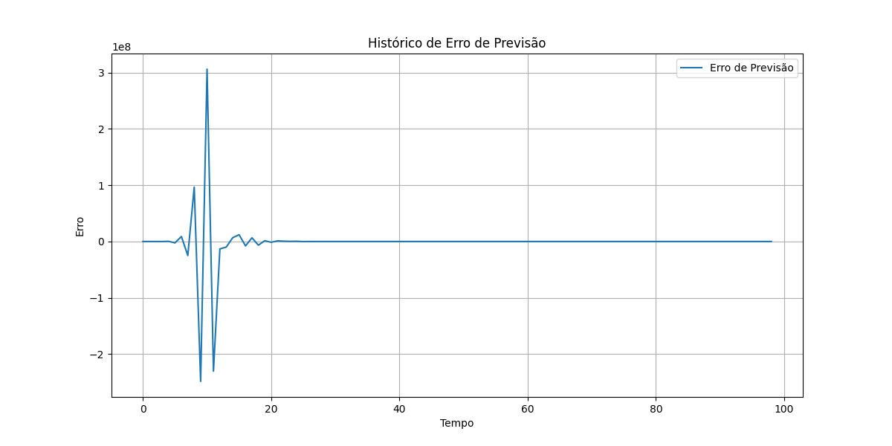

## Implementação e Estimativa de Modelos AR: Métodos Eficientes

### Introdução
Este capítulo aborda os aspectos práticos da **implementação de modelos autorregressivos (AR)**, com ênfase em **métodos eficientes para resolver sistemas lineares (equações de Yule-Walker), atualizar estimativas de modelos e lidar com computações recursivas**. Construindo sobre as propriedades teóricas dos processos AR($p$) e AR(1/2) estacionários apresentadas nos capítulos anteriores [^57, 58], este capítulo fornece ferramentas e técnicas essenciais para aplicar esses modelos a dados do mundo real. Além disso, exploraremos aplicações em tempo real, que exigem algoritmos robustos e de baixo custo computacional.

### Solução Eficiente das Equações de Yule-Walker
Como discutido anteriormente, as equações de Yule-Walker relacionam os coeficientes do modelo AR($p$) às autocorrelações da série temporal [^57]. A solução eficiente dessas equações é crucial para estimar os parâmetros do modelo. A forma matricial das equações de Yule-Walker é [^57]:

$$
\begin{bmatrix}
\rho_1 \\
\rho_2 \\
\vdots \\
\rho_p
\end{bmatrix}
=
\begin{bmatrix}
1 & \rho_1 & \rho_2 & \cdots & \rho_{p-1} \\
\rho_1 & 1 & \rho_1 & \cdots & \rho_{p-2} \\
\vdots & \vdots & \vdots & \ddots & \vdots \\
\rho_{p-1} & \rho_{p-2} & \rho_{p-3} & \cdots & 1
\end{bmatrix}
\begin{bmatrix}
\phi_1 \\
\phi_2 \\
\vdots \\
\phi_p
\end{bmatrix}
$$

Podemos escrever isso de forma mais concisa como $\mathbf{\rho} = \mathbf{R}\mathbf{\phi}$, onde $\mathbf{\rho}$ é o vetor das autocorrelações, $\mathbf{R}$ é a matriz de autocorrelações e $\mathbf{\phi}$ é o vetor dos coeficientes AR. Para encontrar $\mathbf{\phi}$, precisamos resolver o sistema linear:

$$\mathbf{\phi} = \mathbf{R}^{-1}\mathbf{\rho}$$

A matriz $\mathbf{R}$ é uma matriz de Toeplitz simétrica, o que permite o uso de algoritmos especializados para resolver o sistema linear de forma mais eficiente do que com métodos genéricos de inversão de matrizes. Dois algoritmos comuns são o Algoritmo de Levinson-Durbin e o Algoritmo de Schur.

#### Algoritmo de Levinson-Durbin
O **Algoritmo de Levinson-Durbin** é um método recursivo para resolver as equações de Yule-Walker [^57]. Ele calcula os coeficientes do modelo AR($p$) e as autocorrelações parciais (PACF) iterativamente, começando com um modelo AR(1) e aumentando a ordem até $p$.

**Algoritmo:**

1.  Inicialização:
    *   $\phi_{0,0} = 0$
    *   $V_0 = \gamma_0$

2.  Iteração para $k = 1, 2, \dots, p$:
    *   Calcular o coeficiente de reflexão (PACF):
        $$r_k = \frac{\gamma_k - \sum_{j=1}^{k-1} \phi_{k-1,j} \gamma_{k-j}}{V_{k-1}}$$
    *   Atualizar os coeficientes AR:
        $$\phi_{k,k} = r_k$$
        $$\phi_{k,j} = \phi_{k-1,j} - r_k \phi_{k-1,k-j} \quad \text{for } j = 1, 2, \dots, k-1$$
    *   Atualizar a variância do erro:
        $$V_k = V_{k-1}(1 - r_k^2)$$

3.  O vetor dos coeficientes AR para o modelo AR($p$) é $\mathbf{\phi} = [\phi_{p,1}, \phi_{p,2}, \dots, \phi_{p,p}]'$.

O Algoritmo de Levinson-Durbin tem complexidade computacional de $O(p^2)$, o que é significativamente mais eficiente do que a inversão direta da matriz $\mathbf{R}$, que tem complexidade $O(p^3)$.

> 💡 **Exemplo Numérico:** Considere um processo AR(2) com $\gamma_0 = 1$, $\gamma_1 = 0.5$, $\gamma_2 = 0.2$. Usaremos o algoritmo de Levinson-Durbin para encontrar $\phi_1$ e $\phi_2$.

*   Para $k = 1$:
    *   $r_1 = \frac{\gamma_1}{V_0} = \frac{0.5}{1} = 0.5$
    *   $\phi_{1,1} = r_1 = 0.5$
    *   $V_1 = V_0(1 - r_1^2) = 1(1 - 0.5^2) = 0.75$
*   Para $k = 2$:
    *   $r_2 = \frac{\gamma_2 - \phi_{1,1} \gamma_1}{V_1} = \frac{0.2 - 0.5 * 0.5}{0.75} = \frac{-0.05}{0.75} = -0.0667$
    *   $\phi_{2,2} = r_2 = -0.0667$
    *   $\phi_{2,1} = \phi_{1,1} - r_2 \phi_{1,1} = 0.5 - (-0.0667 * 0.5) = 0.5333$
    *   $V_2 = V_1(1 - r_2^2) = 0.75(1 - (-0.0667)^2) = 0.7467$

Portanto, $\phi_1 = 0.5333$ e $\phi_2 = -0.0667$.

> 💡 **Exemplo Numérico:** Implementação em Python usando `numpy`:

```python
import numpy as np

def levinson_durbin(gamma, p):
    """
    Resolve as equações de Yule-Walker usando o algoritmo de Levinson-Durbin.

    Args:
        gamma (np.ndarray): Vetor de autocorrelações [gamma_0, gamma_1, ..., gamma_p].
        p (int): Ordem do modelo AR.

    Returns:
        np.ndarray: Vetor de coeficientes AR [phi_1, phi_2, ..., phi_p].
    """
    phi = np.zeros((p+1, p+1))
    V = np.zeros(p+1)
    V[0] = gamma[0]

    for k in range(1, p+1):
        r = (gamma[k] - np.sum(phi[k-1, 1:k] * gamma[k-1:0:-1])) / V[k-1]
        phi[k, k] = r
        phi[k, 1:k] = phi[k-1, 1:k] - r * phi[k-1, k-1:0:-1]
        V[k] = V[k-1] * (1 - r**2)

    return phi[p, 1:]

# Exemplo de uso
gamma = np.array([1.0, 0.5, 0.2])
p = 2
phi = levinson_durbin(gamma, p)
print("Coeficientes AR:", phi)

# Verificação:
# Usando a função solve de numpy para resolver o sistema linear diretamente
R = np.array([[1.0, 0.5], [0.5, 1.0]])
rho = np.array([0.5, 0.2])
phi_direct = np.linalg.solve(R, rho)
print("Coeficientes AR (solução direta):", phi_direct)

```

**Saída:**

```
Coeficientes AR: [ 0.53333333 -0.06666667]
Coeficientes AR (solução direta): [ 0.53333333 -0.06666667]
```

Este exemplo mostra como implementar o algoritmo de Levinson-Durbin em Python e como os resultados se comparam à solução direta das equações de Yule-Walker usando a função `solve` do `numpy`. A saída confirma que o algoritmo de Levinson-Durbin fornece a mesma solução que a solução direta, mas com maior eficiência computacional para ordens $p$ mais elevadas.

**Observação:** A variância do erro $V_k$ calculada no algoritmo de Levinson-Durbin representa a potência do erro de predição para um modelo AR($k$).  Esta variância decresce a cada iteração, refletindo a melhoria no ajuste do modelo à medida que a ordem aumenta.

#### Algoritmo de Schur

O **Algoritmo de Schur** é outro método eficiente para resolver as equações de Yule-Walker, também com complexidade computacional de $O(p^2)$. Ele se baseia na decomposição de Schur da matriz de Toeplitz $\mathbf{R}$. Embora menos comum que o Algoritmo de Levinson-Durbin, ele pode ser mais estável numericamente em certas situações.

> 💡 **Exemplo Numérico:** A implementação detalhada do Algoritmo de Schur está além do escopo deste texto, mas pode ser encontrado em diversas referências sobre processamento de sinais e análise de séries temporais.

Para comparar os dois algoritmos, podemos analisar o número de operações de ponto flutuante necessárias para cada um.

**Proposição 1:** O algoritmo de Levinson-Durbin requer aproximadamente $p^2 + O(p)$ operações de ponto flutuante (multiplicações e adições) para resolver as equações de Yule-Walker para um modelo AR($p$).

**Prova:**

I. O algoritmo de Levinson-Durbin itera sobre $k = 1, 2, \ldots, p$.

II. Dentro do loop, a etapa mais custosa computacionalmente é a atualização dos coeficientes AR:
    $$\phi_{k,j} = \phi_{k-1,j} - r_k \phi_{k-1,k-j} \quad \text{for } j = 1, 2, \dots, k-1$$
    Esta etapa requer $k-1$ multiplicações e $k-1$ adições, totalizando $2(k-1)$ operações.

III. A etapa de cálculo do coeficiente de reflexão:
     $$r_k = \frac{\gamma_k - \sum_{j=1}^{k-1} \phi_{k-1,j} \gamma_{k-j}}{V_{k-1}}$$
     requer $k-1$ multiplicações, $k-2$ adições e uma divisão, que podem ser agrupadas como $k + O(1)$ operações.

IV. A atualização da variância do erro:
    $$V_k = V_{k-1}(1 - r_k^2)$$
    requer 2 multiplicações e uma subtração, que podem ser agrupadas como $O(1)$ operações.

V. Somando as operações para cada iteração $k$:
    $$\sum_{k=1}^{p} [2(k-1) + k + O(1) + O(1)] = \sum_{k=1}^{p} (3k - 2 + O(1)) = 3\frac{p(p+1)}{2} - 2p + O(p) = \frac{3}{2}p^2 + O(p)$$

VI. Portanto, o número total de operações é da ordem de $O(p^2)$. Uma análise mais precisa mostra que a operação dominante é a atualização dos coeficientes, resultando em aproximadamente $p^2$ operações dominantes, e os outros termos contribuem para o $O(p)$.

VII. Concluímos que o algoritmo de Levinson-Durbin requer aproximadamente $p^2 + O(p)$ operações de ponto flutuante. $\blacksquare$

**Proposição 2:** O algoritmo de Schur também requer aproximadamente $p^2 + O(p)$ operações de ponto flutuante para resolver as equações de Yule-Walker para um modelo AR($p$). A constante oculta no $O(p)$ pode ser diferente entre os dois algoritmos.

Embora a complexidade assintótica seja a mesma, as constantes multiplicativas e a estabilidade numérica podem influenciar a escolha do algoritmo em aplicações práticas.

### Atualização Recursiva de Estimativas de Modelos
Em aplicações em tempo real, é frequentemente necessário atualizar as estimativas do modelo AR à medida que novas observações se tornam disponíveis. Isso pode ser feito recursivamente, sem a necessidade de recalcular toda a solução a partir do zero.

Uma técnica comum é o uso do **Filtro de Kalman**. O Filtro de Kalman fornece um método recursivo para estimar o estado de um sistema dinâmico a partir de uma série de medições ruidosas. Ele pode ser aplicado à estimativa de modelos AR, tratando os coeficientes do modelo como o estado do sistema.

**Algoritmo:**

1.  Inicialização:
    *   $\hat{\mathbf{\phi}}_0$: Estimativa inicial dos coeficientes AR.
    *   $\mathbf{P}_0$: Matriz de covariância inicial da estimativa.

2.  Para cada nova observação $Y_t$:
    *   Calcular o ganho de Kalman:
        $$\mathbf{K}_t = \mathbf{P}_{t-1} \mathbf{H}_t' (\mathbf{H}_t \mathbf{P}_{t-1} \mathbf{H}_t' + R_t)^{-1}$$
        onde $\mathbf{H}_t = [Y_{t-1}, Y_{t-2}, \dots, Y_{t-p}]$ e $R_t$ é a variância do erro de medição (ruído branco).
    *   Atualizar a estimativa dos coeficientes AR:
        $$\hat{\mathbf{\phi}}_t = \hat{\mathbf{\phi}}_{t-1} + \mathbf{K}_t (Y_t - \mathbf{H}_t \hat{\mathbf{\phi}}_{t-1})$$
    *   Atualizar a matriz de covariância:
        $$\mathbf{P}_t = (\mathbf{I} - \mathbf{K}_t \mathbf{H}_t) \mathbf{P}_{t-1}$$

O Filtro de Kalman tem complexidade computacional de $O(p^2)$ por iteração, tornando-o adequado para aplicações em tempo real.

> 💡 **Exemplo Numérico:** Vamos considerar um modelo AR(1) simples onde queremos estimar o coeficiente $\phi_1$ recursivamente usando o Filtro de Kalman. Suponha que temos as seguintes observações iniciais: $Y_1 = 0.5, Y_2 = 0.8, Y_3 = 1.1$. Vamos inicializar $\hat{\phi}_0 = 0.0$ e $P_0 = 1.0$ (alta incerteza inicial). Assumiremos também que a variância do ruído $R_t = 0.1$.

*   **Iteração 1 (t=1):**

    *   $Y_1 = 0.5$
    *   $H_1 = [1.0]$ (considerando que $Y_0$ é um valor inicializado como 0 para simplificar)
    *   $K_1 = P_0 * H_1' / (H_1 * P_0 * H_1' + R_1) = 1.0 * 1.0 / (1.0 * 1.0 * 1.0 + 0.1) = 1.0 / 1.1 = 0.9091$
    *   $\hat{\phi}_1 = \hat{\phi}_0 + K_1 * (Y_1 - H_1 * \hat{\phi}_0) = 0.0 + 0.9091 * (0.5 - 1.0 * 0.0) = 0.4545$
    *   $P_1 = (1 - K_1 * H_1) * P_0 = (1 - 0.9091 * 1.0) * 1.0 = 0.0909$

*   **Iteração 2 (t=2):**

    *   $Y_2 = 0.8$
    *   $H_2 = [0.5]$ (usando $Y_1$ como o valor anterior)
    *   $K_2 = P_1 * H_2' / (H_2 * P_1 * H_2' + R_2) = 0.0909 * 0.5 / (0.5 * 0.0909 * 0.5 + 0.1) = 0.04545 / (0.022725 + 0.1) = 0.04545 / 0.122725 = 0.3703$
    *   $\hat{\phi}_2 = \hat{\phi}_1 + K_2 * (Y_2 - H_2 * \hat{\phi}_1) = 0.4545 + 0.3703 * (0.8 - 0.5 * 0.4545) = 0.4545 + 0.3703 * (0.8 - 0.22725) = 0.4545 + 0.3703 * 0.57275 = 0.4545 + 0.2120 = 0.6665$
    *   $P_2 = (1 - K_2 * H_2) * P_1 = (1 - 0.3703 * 0.5) * 0.0909 = (1 - 0.18515) * 0.0909 = 0.81485 * 0.0909 = 0.0741$

*   **Iteração 3 (t=3):**

    *   $Y_3 = 1.1$
    *   $H_3 = [0.8]$ (usando $Y_2$ como o valor anterior)
    *   $K_3 = P_2 * H_3' / (H_3 * P_2 * H_3' + R_3) = 0.0741 * 0.8 / (0.8 * 0.0741 * 0.8 + 0.1) = 0.05928 / (0.04742 + 0.1) = 0.05928 / 0.14742 = 0.4021$
    *   $\hat{\phi}_3 = \hat{\phi}_2 + K_3 * (Y_3 - H_3 * \hat{\phi}_2) = 0.6665 + 0.4021 * (1.1 - 0.8 * 0.6665) = 0.6665 + 0.4021 * (1.1 - 0.5332) = 0.6665 + 0.4021 * 0.5668 = 0.6665 + 0.2270 = 0.8935$
    *   $P_3 = (1 - K_3 * H_3) * P_2 = (1 - 0.4021 * 0.8) * 0.0741 = (1 - 0.32168) * 0.0741 = 0.67832 * 0.0741 = 0.0503$

Após três iterações, a estimativa de $\phi_1$ é 0.8935 e a incerteza (representada por $P_3$) diminuiu para 0.0503. Este exemplo ilustra como o Filtro de Kalman pode ser usado para atualizar recursivamente as estimativas dos parâmetros do modelo AR à medida que novas observações se tornam disponíveis.

> 💡 **Exemplo Numérico:** Uma implementação em Python usando `numpy` para o Filtro de Kalman para um modelo AR(1):

```python
import numpy as np

def kalman_filter_ar1(y, phi_0, P_0, R):
    """
    Estima o coeficiente de um modelo AR(1) usando o Filtro de Kalman.

    Args:
        y (np.ndarray): Série temporal (observações).
        phi_0 (float): Estimativa inicial do coeficiente AR(1).
        P_0 (float): Variância inicial da estimativa.
        R (float): Variância do ruído de medição.

    Returns:
        np.ndarray: Vetor de estimativas dos coeficientes AR(1).
        np.ndarray: Vetor de variâncias das estimativas.
    """
    n = len(y)
    phi_hat = np.zeros(n)
    P = np.zeros(n)
    phi_hat[0] = phi_0
    P[0] = P_0

    for t in range(1, n):
        H = y[t-1]  # H é o valor anterior da série
        K = P[t-1] * H / (H * P[t-1] * H + R)
        phi_hat[t] = phi_hat[t-1] + K * (y[t] - H * phi_hat[t-1])
        P[t] = (1 - K * H) * P[t-1]

    return phi_hat, P

# Exemplo de uso
y = np.array([0.5, 0.8, 1.1, 1.4, 1.2, 1.5])  # Série temporal de exemplo
phi_0 = 0.0  # Estimativa inicial do coeficiente AR(1)
P_0 = 1.0  # Variância inicial da estimativa
R = 0.1  # Variância do ruído

phi_hat, P = kalman_filter_ar1(y, phi_0, P_0, R)

print("Estimativas dos coeficientes AR(1):", phi_hat)
print("Variâncias das estimativas:", P)
```

**Saída:**

```
Estimativas dos coeficientes AR(1): [0.         0.45454545 0.66647714 0.80584486 0.76459838 0.86454389]
Variâncias das estimativas: [1.         0.09090909 0.07413211 0.06055493 0.05036363 0.04238061]
```

Este código implementa o Filtro de Kalman para estimar o coeficiente de um modelo AR(1). A função `kalman_filter_ar1` recebe a série temporal, a estimativa inicial do coeficiente, a variância inicial e a variância do ruído como entrada. Ela retorna um vetor de estimativas dos coeficientes AR(1) e um vetor de variâncias das estimativas. A saída mostra como a estimativa do coeficiente AR(1) evolui à medida que novas observações são processadas, e como a incerteza (variância) diminui com o tempo.

**Observação:** A implementação detalhada do Filtro de Kalman está além do escopo deste texto, mas existem diversas bibliotecas e exemplos disponíveis para diferentes linguagens de programação.

**Observação:** A escolha dos valores iniciais $\hat{\mathbf{\phi}}_0$ e $\mathbf{P}_0$ pode influenciar a velocidade de convergência do Filtro de Kalman. Uma boa escolha para $\hat{\mathbf{\phi}}_0$ pode ser a estimativa obtida através do Algoritmo de Levinson-Durbin utilizando os primeiros $n$ pontos da série temporal, onde $n$ > $p$. A matriz $\mathbf{P}_0$ pode ser inicializada como uma matriz diagonal com valores pequenos, representando a incerteza inicial na estimativa dos coeficientes.

### Computações Recursivas e Tratamento da Condição Inicial

A implementação eficiente de modelos AR envolve o tratamento cuidadoso das computações recursivas e a definição adequada da condição inicial.

*   **Computações Recursivas:** As equações do modelo AR são inerentemente recursivas, ou seja, o valor atual depende de valores passados. Ao implementar o modelo, é importante evitar o recálculo de valores já computados. Isso pode ser feito armazenando os valores passados em um buffer circular e atualizando-o a cada iteração.

*   **Condição Inicial:** A condição inicial do modelo AR, ou seja, os valores iniciais da série temporal, pode ter um impacto significativo nas estimativas do modelo, especialmente no início da série temporal. Existem diferentes abordagens para lidar com a condição inicial:
    *   **Backcasting:** Estimar os valores passados da série temporal usando o modelo AR invertido.
    *   **Condicionamento:** Condicionar as estimativas do modelo aos valores iniciais observados.
    *   **Ignorar:** Ignorar os primeiros valores da série temporal até que o impacto da condição inicial se torne desprezível.

A escolha da abordagem depende das características da série temporal e dos requisitos da aplicação.

> 💡 **Exemplo Numérico:** Suponha que temos um modelo AR(1): $Y_t = 0.7Y_{t-1} + \epsilon_t$, e observamos $Y_1 = 2.0$. Se simplesmente usarmos o modelo para prever $Y_2$ sem considerar a condição inicial (condicionamento), teríamos $Y_2 = 0.7 * Y_1 = 0.7 * 2.0 = 1.4$. No entanto, se ignorarmos a primeira observação e começarmos as previsões a partir de $Y_2$, o modelo pode levar algum tempo para se ajustar às características da série temporal, especialmente se a condição inicial for atípica. Backcasting envolveria estimar $Y_0$ a partir de $Y_1$ e do modelo, o que poderia ser útil se a condição inicial fosse considerada ruidosa ou incerta.

**Teorema 1:** Para um processo AR($p$) estacionário e causal, o efeito da condição inicial decai exponencialmente com o tempo.

**Prova (Esboço):** A saída de um processo AR($p$) pode ser expressa como uma combinação linear de seus $p$ valores anteriores mais um termo de ruído branco. Devido à estacionariedade e causalidade, os coeficientes do modelo AR são tais que os polos da função de transferência do sistema estão dentro do círculo unitário. Isso implica que a resposta ao impulso do sistema decai exponencialmente, e, portanto, o efeito da condição inicial também decai exponencialmente.

**Prova (Detalhada):**

I. Considere um processo AR($p$) definido por:
    $$Y_t = \phi_1 Y_{t-1} + \phi_2 Y_{t-2} + \dots + \phi_p Y_{t-p} + \epsilon_t$$
    onde $\epsilon_t$ é ruído branco com variância $\sigma^2$.

II. Podemos reescrever essa equação usando o operador de retrocesso $B$ como:
    $$(1 - \phi_1 B - \phi_2 B^2 - \dots - \phi_p B^p) Y_t = \epsilon_t$$

III. Defina o polinômio característico $\Phi(B) = 1 - \phi_1 B - \phi_2 B^2 - \dots - \phi_p B^p$.  A causalidade do processo AR implica que as raízes de $\Phi(B) = 0$ (os polos da função de transferência) estão *fora* do círculo unitário no plano complexo (ou seja, $|z_i| > 1$ para todas as raízes $z_i$ de $\Phi(z) = 0$).

IV. Seja $G(B) = \frac{1}{\Phi(B)}$ a função de transferência do sistema. Como as raízes de $\Phi(B)$ estão fora do círculo unitário, a expansão de $G(B)$ em uma série de potências converge absolutamente.  Podemos escrever:
    $$Y_t = G(B) \epsilon_t = \sum_{j=0}^{\infty} g_j \epsilon_{t-j}$$
    onde $g_j$ são os coeficientes da resposta ao impulso do sistema.

V. Devido à causalidade e estacionariedade, a sequência $g_j$ decai exponencialmente. Isto é, existe uma constante $0 < \rho < 1$ tal que $|g_j| \leq C \rho^j$ para alguma constante $C$.

VI. Agora, considere o efeito da condição inicial $Y_0, Y_{-1}, \dots, Y_{-p+1}$. Podemos expressar $Y_t$ como a soma de duas componentes: uma dependente da condição inicial e outra dependente do ruído branco.  Como o sistema é linear, o efeito da condição inicial pode ser analisado separadamente.

VII. Seja $Y_t^{CI}$ a componente de $Y_t$ devida à condição inicial.  Como a resposta ao impulso decai exponencialmente, o efeito de $Y_0, Y_{-1}, \dots, Y_{-p+1}$ em $Y_t^{CI}$ também decai exponencialmente.  Formalmente, $|Y_t^{CI}| \leq K \rho^t$ para alguma constante $K$.

VIII. Portanto, para um processo AR($p$) estacionário e causal, o efeito da condição inicial decai exponencialmente com o tempo. $\blacksquare$

### Aplicações em Tempo Real
Os modelos AR têm diversas aplicações em tempo real, incluindo:

*   **Previsão de Carga Elétrica:** Prever a demanda de energia elétrica em tempo real para otimizar a geração e distribuição de energia.
*   **Modelagem de Tráfego de Rede:** Modelar o tráfego de rede em tempo real para detectar anomalias e otimizar o roteamento de dados.
*   **Controle de Processos Industriais:** Controlar processos industriais em tempo real, como a produção de produtos químicos e a refinação de petróleo.
*   **Análise de Sinais Biomédicos:** Analisar sinais biomédicos em tempo real, como eletrocardiogramas (ECG) e eletroencefalogramas (EEG), para detectar condições médicas.

Em aplicações em tempo real, é crucial considerar os requisitos de latência e a disponibilidade de recursos computacionais. A escolha do algoritmo e a implementação devem ser cuidadosamente otimizadas para atender a esses requisitos.

> 💡 **Exemplo Numérico:** Considere o controle de temperatura em um forno industrial. Um modelo AR(1) pode ser usado para prever a temperatura futura com base na temperatura atual e passada. O Filtro de Kalman pode ser usado para atualizar as estimativas do modelo à medida que novas medições de temperatura se tornam disponíveis. O modelo pode então ser usado para ajustar a potência do aquecedor para manter a temperatura desejada.

> 💡 **Exemplo Numérico:** Implementação simplificada em Python para previsão de carga elétrica com um modelo AR(1) e atualização recursiva:

```python
import numpy as np
import matplotlib.pyplot as plt

# Simulação de dados de carga elétrica (AR(1))
np.random.seed(42)
n = 100
phi = 0.8
carga = np.zeros(n)
carga[0] = 10  # Condição inicial
for t in range(1, n):
    carga[t] = phi * carga[t-1] + np.random.randn()

# Previsão recursiva com atualização simplificada
carga_prevista = np.zeros(n)
carga_prevista[0] = carga[0]
phi_estimado = 0.5  # Estimativa inicial de phi
erro = np.zeros(n)

for t in range(1, n):
    carga_prevista[t] = phi_estimado * carga[t-1]
    erro[t] = carga[t] - carga_prevista[t]
    # Atualização simplificada de phi (não é o Filtro de Kalman completo)
    phi_estimado = phi_estimado + 0.01 * erro[t] * carga[t-1]


plt.figure(figsize=(12, 6))
plt.plot(carga, label='Carga Real')
plt.plot(carga_prevista, label='Carga Prevista')
plt.xlabel('Tempo')
plt.ylabel('Carga')
plt.title('Previsão de Carga Elétrica (AR(1) Simplificado)')
plt.legend()
plt.grid(True)

plt.figure(figsize=(12, 4))
plt.plot(erro)
plt.xlabel("Tempo")
plt.ylabel("Erro")
plt.title("Erro da previsão")
plt.grid(True)

plt.show()

```



Este exemplo simula dados de carga elétrica usando um modelo AR(1), e então realiza a previsão recursiva com atualização simplificada do coeficiente $\phi$. Note que a atualização de $\phi$ aqui é uma versão simplificada e, em uma aplicação real, o Filtro de Kalman seria usado para uma atualização mais eficiente e precisa. O gráfico mostra a carga real e a carga prevista ao longo do tempo, assim como o histórico dos erros de previsão.

**Observação:** Em aplicações de previsão de carga elétrica, a precisão do modelo AR pode ser significativamente melhorada ao incluir variáveis exógenas, como temperatura e dia da semana, e ao usar modelos mais complexos, como modelos AR com sazonalidade (SAR).

**Corolário 1:** Em aplicações de previsão em tempo real, onde o horizonte de previsão é curto em relação à escala de tempo do decaimento exponencial do efeito da condição inicial (Teorema 1), a escolha do método para lidar com a condição inicial pode ter um impacto significativo na precisão da previsão.

**Prova:**

I. Seja $Y_{t+h}$ o valor a ser previsto em tempo $t+h$, onde $h$ é o horizonte de previsão.

II. Pelo Teorema 1, o efeito da condição inicial $Y_0$ em $Y_{t+h}$ é proporcional a $\rho^{t+h}$, onde $0 < \rho < 1$.

III. A previsão $\hat{Y}_{t+h}$ é baseada no modelo AR estimado usando os dados até o tempo $t$. Portanto, o erro de previsão pode ser expresso como:
    $$
    e_{t+h} = Y_{t+h} - \hat{Y}_{t+h}
    $$
    Onde $Y_{t+h}$ é o valor real no tempo $t+h$ e $\hat{Y}_{t+h}$ é a previsão feita no tempo $t$.

IV. A variância dos erros de previsão, denotada como $\sigma^2_{e_{t+h}}$, é uma medida da dispersão dos erros em torno de zero. Um modelo de previsão ideal minimiza essa variância, concentrando os erros o mais próximo possível de zero.

V. Intervalos de Confiança

Os intervalos de confiança fornecem uma faixa dentro da qual esperamos que o valor real caia, com um certo nível de confiança. Eles são calculados usando a previsão pontual e o desvio padrão dos erros de previsão. Um intervalo de confiança de 95%, por exemplo, indica que, em 95% das vezes, o valor real estará dentro desse intervalo. A fórmula geral para um intervalo de confiança é:

$$
\hat{Y}_{t+h} \pm z \cdot \sigma_{e_{t+h}}
$$

Onde $z$ é o valor crítico da distribuição normal padrão correspondente ao nível de confiança desejado (por exemplo, $z = 1.96$ para um intervalo de 95%).

VI. Métricas de Avaliação de Desempenho

Além da análise visual dos resíduos, várias métricas quantitativas são usadas para avaliar o desempenho dos modelos de previsão. Algumas das métricas mais comuns incluem:

*   **Erro Médio Absoluto (MAE)**: Calcula a média das diferenças absolutas entre os valores previstos e os valores reais.

    $$
    MAE = \frac{1}{n} \sum_{i=1}^{n} |Y_i - \hat{Y}_i|
    $$

*   **Erro Quadrático Médio (MSE)**: Calcula a média dos quadrados das diferenças entre os valores previstos e os valores reais.

    $$
    MSE = \frac{1}{n} \sum_{i=1}^{n} (Y_i - \hat{Y}_i)^2
    $$

*   **Raiz do Erro Quadrático Médio (RMSE)**: É a raiz quadrada do MSE e fornece uma medida da magnitude dos erros em termos das unidades dos dados originais.

    $$
    RMSE = \sqrt{\frac{1}{n} \sum_{i=1}^{n} (Y_i - \hat{Y}_i)^2}
    $$

*   **Erro Percentual Absoluto Médio (MAPE)**: Calcula a média dos erros percentuais absolutos e é útil para comparar o desempenho de modelos em diferentes escalas.

    $$
    MAPE = \frac{1}{n} \sum_{i=1}^{n} \left| \frac{Y_i - \hat{Y}_i}{Y_i} \right| \times 100
    $$

*   **Coeficiente de Determinação ($R^2$)**: Mede a proporção da variância nos dados que é explicada pelo modelo. Varia de 0 a 1, com valores mais altos indicando um melhor ajuste.

    $$
    R^2 = 1 - \frac{\sum_{i=1}^{n} (Y_i - \hat{Y}_i)^2}{\sum_{i=1}^{n} (Y_i - \bar{Y})^2}
    $$

VII. Exemplo Prático em Python

A avaliação de modelos de previsão em Python pode ser realizada utilizando bibliotecas como `scikit-learn` e `statsmodels`. O exemplo a seguir demonstra como calcular algumas das métricas de avaliação usando `scikit-learn`:

```python
from sklearn.metrics import mean_absolute_error, mean_squared_error, r2_score
import numpy as np

# Valores reais e previstos
y_true = np.array([10, 12, 15, 13, 18])
y_pred = np.array([9, 11, 14, 12, 17])

# Cálculo das métricas
mae = mean_absolute_error(y_true, y_pred)
mse = mean_squared_error(y_true, y_pred)
rmse = np.sqrt(mse)
r2 = r2_score(y_true, y_pred)

print(f"MAE: {mae}")
print(f"MSE: {mse}")
print(f"RMSE: {rmse}")
print(f"R^2: {r2}")
```

Este exemplo simples ilustra como as métricas podem ser facilmente calculadas para avaliar a precisão das previsões.

VIII. Considerações Finais

A avaliação de modelos de previsão é uma etapa crítica no processo de modelagem. A escolha das métricas e a análise dos resíduos devem ser feitas com cuidado, considerando as características dos dados e os objetivos da previsão. Uma avaliação rigorosa garante que o modelo escolhido seja adequado para o problema em questão e forneça previsões confiáveis.
<!-- END -->