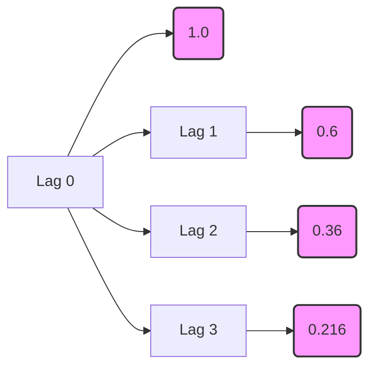

## Aprofundamento no Processo Autoregressivo de Primeira Ordem (AR(1))

### Introdução
Este capítulo visa aprofundar o entendimento sobre os processos **Autorregressivos de Primeira Ordem (AR(1))**, um dos modelos fundamentais em análise de séries temporais. Construindo sobre os conceitos de **estacionariedade**, **autocovariância** e **funções de autocorrelação** previamente introduzidos [^45, ^46], exploraremos em detalhes as propriedades, condições de estacionariedade, representações alternativas e aplicações do modelo AR(1). O objetivo é fornecer uma base teórica sólida para acadêmicos com conhecimento avançado em matemática e estatística, permitindo uma análise crítica e aplicação eficaz desses modelos em contextos complexos.

### Conceitos Fundamentais

O modelo **AR(1)** é definido pela seguinte equação [^53]:

$$ Y_t = c + \phi Y_{t-1} + \epsilon_t $$

onde:
*   $Y_t$ representa o valor da série temporal no instante *t*.
*   *c* é uma constante.
*   $\phi$ é o *coeficiente autoregressivo* de primeira ordem.
*   $\epsilon_t$ é um termo de *ruído branco* com média zero e variância constante $\sigma^2$ [^47]. Especificamente, $E(\epsilon_t) = 0$ [^47] e $E(\epsilon_t \epsilon_\tau) = 0$ para $t \neq \tau$ [^48].

Este modelo expressa que o valor atual da série temporal é uma função linear do seu valor anterior, acrescido de um choque aleatório. Essa dependência linear de um período anterior torna o modelo **AR(1)** o bloco de construção essencial para modelos mais complexos de séries temporais.

> 💡 **Exemplo Numérico:**
> Suponha que temos uma série temporal representando o preço de uma ação. Podemos modelar o preço diário da ação usando um modelo AR(1):
> $$Y_t = 0.1 + 0.8Y_{t-1} + \epsilon_t$$
> Aqui, $c = 0.1$ (uma constante), $\phi = 0.8$ (o coeficiente autoregressivo), e $\epsilon_t$ é o ruído branco com $\sigma^2 = 0.05$. Se $Y_{t-1} = 10$, então
> $$Y_t = 0.1 + 0.8(10) + \epsilon_t = 8.1 + \epsilon_t$$
> Se $\epsilon_t$ é um valor aleatório sorteado de uma distribuição normal com média zero e variância 0.05 (por exemplo, $\epsilon_t = 0.2$), então $Y_t = 8.3$. Isso significa que o preço da ação no dia *t* é influenciado pelo preço do dia anterior (com peso 0.8) mais uma pequena perturbação aleatória.

#### Condições de Estacionariedade
Uma propriedade crucial para a aplicabilidade do modelo **AR(1)** é a **estacionariedade**. Conforme mencionado anteriormente [^45], um processo é *covariance-stationary* se sua média e autocovariâncias não dependem do tempo *t*. No contexto do modelo AR(1), a estacionariedade é garantida se [^53]:

$$ |\phi| < 1 $$

Esta condição assegura que o impacto de choques passados diminua exponencialmente ao longo do tempo, evitando que a série temporal divirja. Quando $|\phi| \geq 1$, o processo torna-se não estacionário, e a variância tende ao infinito, invalidando a aplicação direta do modelo AR(1) [^53].

> 💡 **Exemplo Numérico:**
> Se $\phi = 0.5$, a condição de estacionariedade é satisfeita, pois $|0.5| < 1$. Se $\phi = 1.2$, a condição não é satisfeita, e o processo AR(1) é não estacionário. Visualmente, uma série temporal com $\phi = 0.5$ exibirá flutuações em torno de uma média constante, enquanto uma série com $\phi = 1.2$ mostrará uma tendência crescente ou decrescente sem retornar a um nível médio.

**Proposição 1** A condição de estacionariedade $|\phi|<1$ implica que o processo AR(1) é *ergódico para a média*.

*Demonstração:*
Para um processo ser ergódico para a média, a média amostral deve convergir para a média populacional à medida que o tamanho da amostra aumenta. Dado que o processo AR(1) é estacionário quando $|\phi|<1$, sua média e variância são constantes ao longo do tempo. A média amostral é dada por $\bar{Y} = \frac{1}{T}\sum_{t=1}^{T} Y_t$. Sob estacionariedade e a existência de momentos de ordem superior finitos (que decorrem das propriedades do ruído branco $\epsilon_t$ e da condição $|\phi|<1$), a Lei Forte dos Grandes Números implica que $\bar{Y}$ converge para $E[Y_t] = \mu = \frac{c}{1-\phi}$ quando $T \to \infty$. Portanto, o processo AR(1) é ergódico para a média quando $|\phi|<1$.

Para entender o porquê da condição $|\phi| < 1$ ser necessária para a estacionariedade, podemos reescrever o processo **AR(1)** utilizando substituições sucessivas:

$Y_t = c + \phi Y_{t-1} + \epsilon_t$
$Y_t = c + \phi(c + \phi Y_{t-2} + \epsilon_{t-1}) + \epsilon_t = c + c\phi + \phi^2 Y_{t-2} + \phi \epsilon_{t-1} + \epsilon_t$
$Y_t = c + c\phi + c\phi^2 + \phi^3 Y_{t-3} + \phi^2 \epsilon_{t-2} + \phi \epsilon_{t-1} + \epsilon_t$

Continuando este processo iterativamente:

$Y_t = \epsilon_t + \phi \epsilon_{t-1} + \phi^2 \epsilon_{t-2} + \phi^3 \epsilon_{t-3} + \dots + c(1 + \phi + \phi^2 + \phi^3 + \dots)$

Se $|\phi| < 1$, a soma geométrica $1 + \phi + \phi^2 + \phi^3 + \dots$ converge para $\frac{1}{1 - \phi}$, e a equação pode ser reescrita como:

$$Y_t = \sum_{i=0}^{\infty} \phi^i \epsilon_{t-i} + \frac{c}{1 - \phi}$$

Esta representação demonstra que $Y_t$ é uma soma ponderada de choques de ruído branco passados ($\epsilon_{t-i}$), e o processo é estacionário. Se $|\phi| \geq 1$, a soma geométrica diverge, e o processo não é estacionário [^53].

**Lema 1** Se $|\phi| < 1$, a representação $Y_t = \sum_{i=0}^{\infty} \phi^i \epsilon_{t-i} + \frac{c}{1 - \phi}$ é convergente em média quadrática.

*Demonstração:*
Seja $S_n = \sum_{i=0}^{n} \phi^i \epsilon_{t-i}$. Devemos mostrar que $S_n$ converge para algum limite $S$ em média quadrática, isto é, $E[(S_n - S)^2] \to 0$ quando $n \to \infty$.
Considere $E[(S_n - S_m)^2]$ para $n > m$. Então,
$E[(S_n - S_m)^2] = E[(\sum_{i=m+1}^{n} \phi^i \epsilon_{t-i})^2] = \sum_{i=m+1}^{n} \phi^{2i} E[\epsilon_{t-i}^2] = \sigma^2 \sum_{i=m+1}^{n} \phi^{2i}$.
Como $|\phi| < 1$, a série $\sum_{i=0}^{\infty} \phi^{2i}$ converge para $\frac{1}{1 - \phi^2}$. Portanto, $\sum_{i=m+1}^{n} \phi^{2i} \to 0$ quando $m, n \to \infty$. Isso implica que $E[(S_n - S_m)^2] \to 0$ quando $m, n \to \infty$. Assim, a sequência $S_n$ é Cauchy em média quadrática e, portanto, converge em média quadrática para algum limite $S$.

#### Média e Variância
Sob a condição de estacionariedade, a **média** do processo AR(1) é dada por [^53]:

$$ \mu = E[Y_t] = \frac{c}{1 - \phi} $$

A **variância** do processo AR(1) é [^53]:

$$ \gamma_0 = Var[Y_t] = \frac{\sigma^2}{1 - \phi^2} $$

Essas expressões fornecem informações cruciais sobre o comportamento da série temporal.

> 💡 **Exemplo Numérico:**
> Considere o modelo AR(1) com $c = 2$, $\phi = 0.7$ e $\sigma^2 = 4$.
> A média é:
> $$\mu = \frac{2}{1 - 0.7} = \frac{2}{0.3} \approx 6.67$$
> A variância é:
> $$\gamma_0 = \frac{4}{1 - (0.7)^2} = \frac{4}{1 - 0.49} = \frac{4}{0.51} \approx 7.84$$
> Isso significa que, em média, a série temporal tem um valor de 6.67 e a dispersão dos valores em torno dessa média é de aproximadamente 7.84.

**Prova da Variância:**
A prova é dada a partir da equação:
$ Y_t - \mu = \phi(Y_{t-1} - \mu) + \epsilon_t $

I. Elevar ao quadrado ambos os lados:
$ (Y_t - \mu)^2 = (\phi(Y_{t-1} - \mu) + \epsilon_t)^2 $
$ (Y_t - \mu)^2 = \phi^2(Y_{t-1} - \mu)^2 + 2\phi(Y_{t-1} - \mu)\epsilon_t + \epsilon_t^2 $

II. Aplicar o operador de esperança em ambos os lados:
$ E[(Y_t - \mu)^2] = E[\phi^2(Y_{t-1} - \mu)^2 + 2\phi(Y_{t-1} - \mu)\epsilon_t + \epsilon_t^2] $

III. Usar a propriedade de estacionariedade $E[(Y_t - \mu)^2] = E[(Y_{t-1} - \mu)^2] = \gamma_0$, e a independência de $\epsilon_t$ e $Y_{t-1}$, tal que $E[2\phi(Y_{t-1} - \mu)\epsilon_t] = 0$:
$ \gamma_0 = \phi^2\gamma_0 + \sigma^2 $

IV. Resolver para $\gamma_0$:
$ \gamma_0 - \phi^2\gamma_0 = \sigma^2 $
$ \gamma_0(1 - \phi^2) = \sigma^2 $
$ \gamma_0 = \frac{\sigma^2}{1 - \phi^2} $ ■

#### Função de Autocorrelação (ACF)
A **função de autocorrelação (ACF)** descreve a correlação entre os valores da série temporal em diferentes pontos no tempo. Para o processo AR(1), a autocovariância no lag *j* é dada por [^53]:

$$ \gamma_j = E[(Y_t - \mu)(Y_{t-j} - \mu)] = \frac{\phi^j}{1 - \phi^2} \sigma^2 $$

A função de autocorrelação (ACF) é então calculada como [^49]:

$$ \rho_j = \frac{\gamma_j}{\gamma_0} = \phi^j $$

Essa função demonstra um decaimento exponencial das autocorrelações à medida que o lag *j* aumenta, característico dos processos AR(1) [^54].

> 💡 **Exemplo Numérico:**
> Se $\phi = 0.6$, a ACF para os primeiros lags é:
> *   $\rho_0 = (0.6)^0 = 1$
> *   $\rho_1 = (0.6)^1 = 0.6$
> *   $\rho_2 = (0.6)^2 = 0.36$
> *   $\rho_3 = (0.6)^3 = 0.216$
> A ACF decai exponencialmente. Isso indica que a correlação entre os valores da série temporal diminui à medida que o lag aumenta.

**Teorema 1** (Yule-Walker Equations for AR(1)) As equações de Yule-Walker para um processo AR(1) fornecem uma relação entre os coeficientes do modelo e as autocorrelações.

*Demonstração:*
Multiplicando ambos os lados da equação $Y_t = c + \phi Y_{t-1} + \epsilon_t$ por $Y_{t-j} - \mu$ e tomando a esperança, obtemos:

$E[(Y_t - \mu)(Y_{t-j} - \mu)] = E[(c - \mu + \phi (Y_{t-1} - \mu) + \epsilon_t)(Y_{t-j} - \mu)]$

Para $j = 1$:
$\gamma_1 = \phi \gamma_0$
$\rho_1 = \frac{\gamma_1}{\gamma_0} = \phi$

Para $j > 1$:
$\gamma_j = \phi \gamma_{j-1}$
$\rho_j = \phi \rho_{j-1}$

Estas são as equações de Yule-Walker para o processo AR(1). Elas relacionam diretamente o coeficiente autoregressivo $\phi$ com as autocorrelações da série temporal.

#### Representação como um Processo de Média Móvel de Ordem Infinita (MA($\infty$))
Um processo AR(1) estacionário pode ser expresso como um processo de **Média Móvel de Ordem Infinita (MA($\infty$))** [^53]:

$$ Y_t = \mu + \sum_{i=0}^{\infty} \phi^i \epsilon_{t-i} $$

Essa representação revela que o valor atual da série temporal é uma combinação linear ponderada de todos os choques passados, com pesos que decaem exponencialmente.

> 💡 **Exemplo Numérico:**
> Usando $\phi = 0.4$, e supondo $\mu = 5$, a representação MA($\infty$) seria:
> $$Y_t = 5 + \epsilon_t + 0.4\epsilon_{t-1} + 0.16\epsilon_{t-2} + 0.064\epsilon_{t-3} + ...$$
> Isso mostra que $Y_t$ é influenciado por todos os choques passados, mas o impacto de choques mais antigos diminui rapidamente.

**Corolário 1.1** A representação MA($\infty$) é útil para calcular a resposta a um choque unitário no processo AR(1). Um choque unitário em $\epsilon_{t-i}$ tem um impacto de $\phi^i$ em $Y_t$.

#### Relação com Equações de Diferença de Primeira Ordem

O modelo AR(1) pode ser visto como uma equação de diferença de primeira ordem [^53]. A análise de equações de diferença fornece insights sobre a estabilidade e o comportamento do modelo. Em particular, a condição $|\phi| < 1$ garante a estabilidade da solução da equação de diferença, correspondendo à estacionariedade do processo AR(1) [^53].

#### Autocovariância e Autocorrelação do Processo AR(1)

A autocovariância no lag *j* é dada por [^53]:

$$ \gamma_j = E[(Y_t - \mu)(Y_{t-j} - \mu)] = \phi^j \gamma_0 = \phi^j \frac{\sigma^2}{1 - \phi^2} $$

Dividindo a autocovariância pela variância, obtemos a função de autocorrelação (ACF) [^54]:

$$ \rho_j = \frac{\gamma_j}{\gamma_0} = \phi^j $$

Isso demonstra que a ACF de um processo AR(1) decai exponencialmente com o aumento do lag *j*.

#### Derivação Alternativa para os Momentos do Processo AR(1)

Podemos obter a média e variância do processo AR(1) diretamente da equação do processo, assumindo estacionariedade [^54]. Tomando a esperança de ambos os lados da equação $Y_t = c + \phi Y_{t-1} + \epsilon_t$, temos [^54]:

$$ E[Y_t] = E[c + \phi Y_{t-1} + \epsilon_t] $$
$$ \mu = c + \phi \mu + 0 $$
$$ \mu = \frac{c}{1 - \phi} $$

Para encontrar a variância, subtraímos a média de ambos os lados da equação do processo [^54]:

$$ Y_t - \mu = \phi(Y_{t-1} - \mu) + \epsilon_t $$

Elevando ao quadrado ambos os lados e tomando a esperança [^54]:

$$ E[(Y_t - \mu)^2] = E[(\phi(Y_{t-1} - \mu) + \epsilon_t)^2] $$
$$ \gamma_0 = \phi^2 \gamma_0 + \sigma^2 $$
$$ \gamma_0 = \frac{\sigma^2}{1 - \phi^2} $$

#### Interpretação da Função de Autocorrelação (ACF)

A forma da ACF ($\rho_j = \phi^j$) fornece informações sobre a natureza da dependência temporal no processo AR(1) [^54].
*   Se $0 < \phi < 1$, a ACF decai exponencialmente para zero à medida que *j* aumenta, indicando uma dependência positiva e decrescente dos valores passados [^54].
*   Se $-1 < \phi < 0$, a ACF alterna em sinal e decai exponencialmente em magnitude, indicando uma dependência negativa e decrescente dos valores passados [^54].
*   Se $\phi = 0$, a ACF é zero para todos os lags diferentes de zero, indicando que o processo é um ruído branco [^53].

> 💡 **Exemplo Numérico:**
> Para $\phi = 0.8$ (positivo): A ACF decai gradualmente de 1 para 0.8, 0.64, 0.512...
> Para $\phi = -0.5$ (negativo): A ACF alterna em sinal: 1, -0.5, 0.25, -0.125...
> Para $\phi = 0$: A ACF é 1 no lag 0 e 0 para todos os outros lags.
> Esses diferentes valores de $\phi$ geram padrões distintos na ACF, permitindo identificar o tipo de dependência temporal presente na série.

**Teorema 2** (Função de Autocorrelação Parcial - PACF) Para um processo AR(1), a função de autocorrelação parcial (PACF) é diferente de zero apenas no lag 1.

*Demonstração:*
A PACF mede a correlação entre $Y_t$ e $Y_{t-j}$ após remover a influência dos lags intermediários $Y_{t-1}, Y_{t-2}, \dots, Y_{t-j+1}$. Para um processo AR(1), a dependência de $Y_t$ em relação ao seu passado é totalmente capturada por $Y_{t-1}$. Portanto, a correlação parcial entre $Y_t$ e $Y_{t-j}$ para $j > 1$, condicionada aos valores intermediários, é zero. Formalmente, $\alpha_{11} = \phi$ (onde $\alpha_{11}$ é o primeiro coeficiente de autocorrelação parcial) e $\alpha_{jj} = 0$ para $j > 1$. Isso significa que, após remover a influência de $Y_{t-1}$, não há correlação adicional entre $Y_t$ e $Y_{t-j}$ para $j > 1$.

> 💡 **Exemplo Numérico:**
> Se temos uma série temporal gerada por um processo AR(1) com $\phi = 0.7$, a PACF terá um valor de 0.7 no lag 1 e será aproximadamente zero para todos os outros lags. Isso contrasta com a ACF, que decai exponencialmente. A PACF é uma ferramenta importante para identificar a ordem de um modelo AR.

**Proposição 2** (Invertibilidade) Um processo AR(1) estacionário é sempre invertível.

*Demonstração:*
A invertibilidade de um processo AR(1) significa que ele pode ser representado como um processo MA($\infty$) com coeficientes que decaem para zero à medida que o lag aumenta. Já mostramos que um processo AR(1) estacionário ($|\phi| < 1$) tem a representação MA($\infty$) dada por $Y_t = \mu + \sum_{i=0}^{\infty} \phi^i \epsilon_{t-i}$. Os coeficientes nesta representação são $\phi^i$, que decaem exponencialmente para zero à medida que $i$ aumenta, devido à condição $|\phi| < 1$. Portanto, um processo AR(1) estacionário é sempre invertível.

### Conclusão
O processo **AR(1)** representa um modelo fundamental na análise de séries temporais, capturando a dependência linear de primeira ordem entre valores sucessivos. A condição de estacionariedade $|\phi| < 1$ é crucial para garantir a estabilidade e interpretabilidade do modelo. A representação como um processo **MA($\infty$)** oferece uma perspectiva alternativa sobre a estrutura de dependência temporal. O entendimento profundo das propriedades e características do modelo AR(1) fornece uma base sólida para a análise e modelagem de séries temporais mais complexas.

### Referências
[^45]: Imagine a battery of I such computers generating sequences...
[^46]: Note that [3.1.10] has the form of a covariance between two variables X and Y...
[^47]: The basic building block for all the processes considered in this chapter is a sequence...
[^48]: E(εtετ) = 0 for t≠ τ.
[^49]: The jth autocorrelation of a covariance-stationary process (denoted pj) is defined as its jth autocovariance divided by the variance...
[^53]: A first-order autoregression, denoted AR(1), satisfies the following difference equation...
[^54]: It follows from [3.4.4] and [3.4.5] that the autocorrelation function...
<!-- END -->