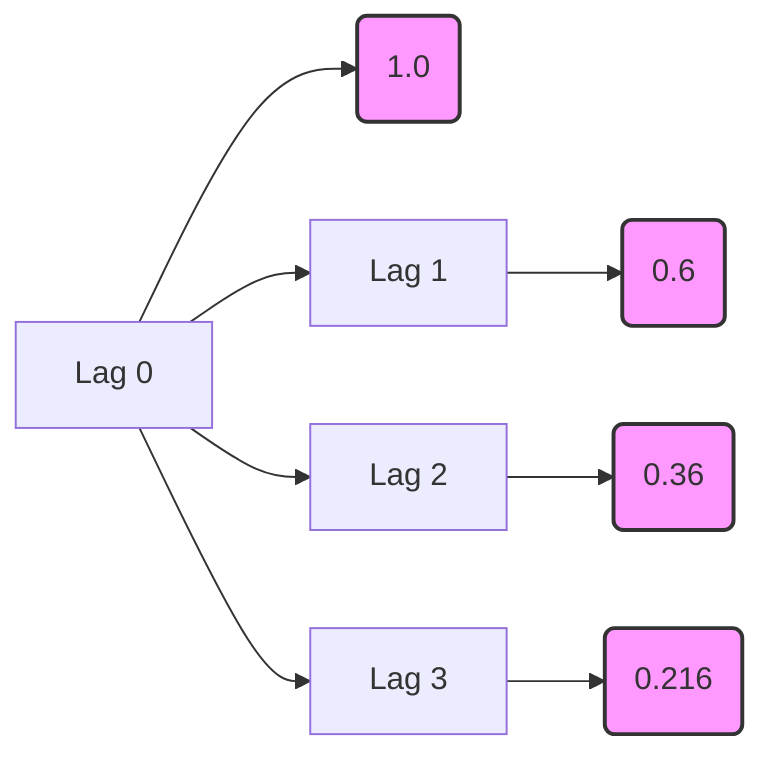
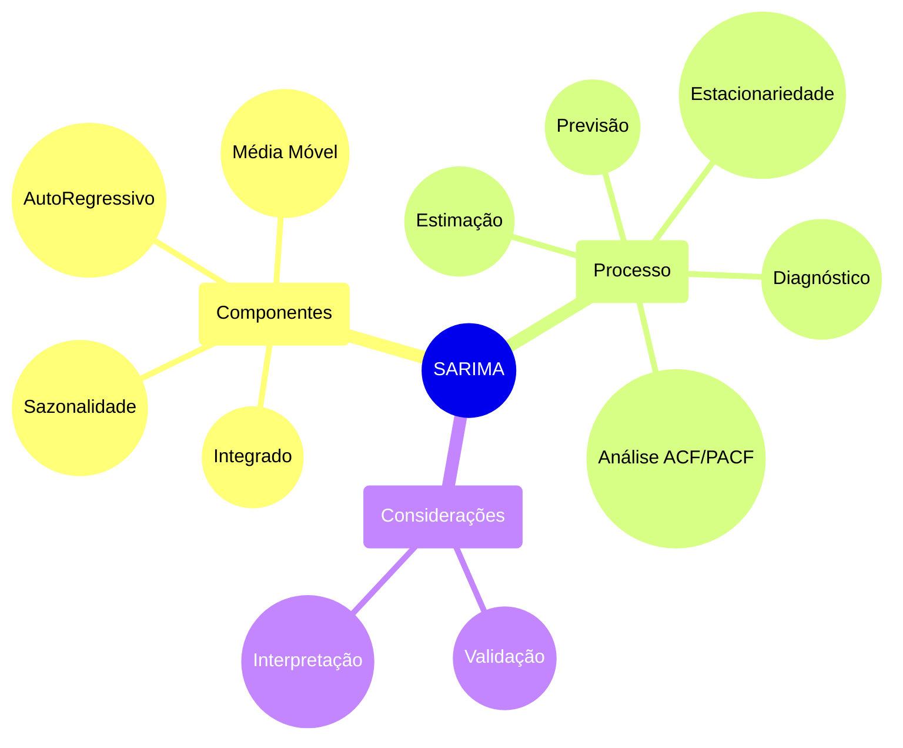

## Aprofundamento no Processo Autoregressivo de Primeira Ordem (AR(1))

### Introdução
Este capítulo visa aprofundar o entendimento sobre os processos **Autorregressivos de Primeira Ordem (AR(1))**, um dos modelos fundamentais em análise de séries temporais. Construindo sobre os conceitos de **estacionariedade**, **autocovariância** e **funções de autocorrelação** previamente introduzidos [^45, ^46], exploraremos em detalhes as propriedades, condições de estacionariedade, representações alternativas e aplicações do modelo AR(1).

### Conceitos Fundamentais

O modelo **AR(1)** é definido pela seguinte equação [^53]:

$$ Y_t = c + \phi Y_{t-1} + \epsilon_t $$

onde:
*   $Y_t$ representa o valor da série temporal no instante *t*.
*   *c* é uma constante.
*   $\phi$ é o *coeficiente autoregressivo* de primeira ordem.
*   $\epsilon_t$ é um termo de *ruído branco* com média zero e variância constante $\sigma^2$ [^47]. Especificamente, $E(\epsilon_t) = 0$ [^47] e $E(\epsilon_t \epsilon_\tau) = 0$ para $t \neq \tau$ [^48].

Este modelo expressa que o valor atual da série temporal é uma função linear do seu valor anterior, acrescido de um choque aleatório. Essa dependência linear de um período anterior torna o modelo **AR(1)** o bloco de construção essencial para modelos mais complexos de séries temporais.

> 💡 **Exemplo Numérico:**
> Suponha que temos uma série temporal representando o preço de uma ação. Podemos modelar o preço diário da ação usando um modelo AR(1):
> $$Y_t = 0.1 + 0.8Y_{t-1} + \epsilon_t$$
> Aqui, $c = 0.1$ (uma constante), $\phi = 0.8$ (o coeficiente autoregressivo), e $\epsilon_t$ é o ruído branco com $\sigma^2 = 0.05$. Se $Y_{t-1} = 10$, então
> $$Y_t = 0.1 + 0.8(10) + \epsilon_t = 8.1 + \epsilon_t$$
> Se $\epsilon_t$ é um valor aleatório sorteado de uma distribuição normal com média zero e variância 0.05 (por exemplo, $\epsilon_t = 0.2$), então $Y_t = 8.3$. Isso significa que o preço da ação no dia *t* é influenciado pelo preço do dia anterior (com peso 0.8) mais uma pequena perturbação aleatória.
>
> ```python
> import numpy as np
>
> c = 0.1
> phi = 0.8
> Y_t_minus_1 = 10
> sigma_squared = 0.05
>
> # Simulate epsilon_t from a normal distribution
> epsilon_t = np.random.normal(0, np.sqrt(sigma_squared))
>
> # Calculate Y_t
> Y_t = c + phi * Y_t_minus_1 + epsilon_t
>
> print(f"Y_t-1: {Y_t_minus_1}")
> print(f"Epsilon_t: {epsilon_t:.2f}")
> print(f"Y_t: {Y_t:.2f}")
> ```
>
> Este código Python simula um valor para $\epsilon_t$ e calcula $Y_t$ com base na equação AR(1). Note que `epsilon_t:.2f` formata o valor para duas casas decimais.

#### Condições de Estacionariedade
Uma propriedade crucial para a aplicabilidade do modelo **AR(1)** é a **estacionariedade**. Conforme mencionado anteriormente [^45], um processo é *covariance-stationary* se sua média e autocovariâncias não dependem do tempo *t*. No contexto do modelo AR(1), a estacionariedade é garantida se [^53]:

$$ |\phi| < 1 $$

Esta condição assegura que o impacto de choques passados diminua exponencialmente ao longo do tempo, evitando que a série temporal divirja. Quando $|\phi| \geq 1$, o processo torna-se não estacionário, e a variância tende ao infinito, invalidando a aplicação direta do modelo AR(1) [^53].

> 💡 **Exemplo Numérico:**
> Se $\phi = 0.5$, a condição de estacionariedade é satisfeita, pois $|0.5| < 1$. Se $\phi = 1.2$, a condição não é satisfeita, e o processo AR(1) é não estacionário. Visualmente, uma série temporal com $\phi = 0.5$ exibirá flutuações em torno de uma média constante, enquanto uma série com $\phi = 1.2$ mostrará uma tendência crescente ou decrescente sem retornar a um nível médio.
>
> Podemos simular visualmente esse comportamento:
>
> ```python
> import numpy as np
> import matplotlib.pyplot as plt
>
> def simulate_ar1(phi, c, sigma_squared, n_samples=100):
>     epsilon = np.random.normal(0, np.sqrt(sigma_squared), n_samples)
>     Y = np.zeros(n_samples)
>     Y[0] = c + epsilon[0]  # Initialize the first value
>     for t in range(1, n_samples):
>         Y[t] = c + phi * Y[t-1] + epsilon[t]
>     return Y
>
> # Simulate stationary AR(1)
> phi_stationary = 0.5
> Y_stationary = simulate_ar1(phi_stationary, 0, 1, 100)
>
> # Simulate non-stationary AR(1)
> phi_non_stationary = 1.2
> Y_non_stationary = simulate_ar1(phi_non_stationary, 0, 1, 100)
>
> # Plotting the time series
> plt.figure(figsize=(12, 6))
> plt.subplot(1, 2, 1)
> plt.plot(Y_stationary)
> plt.title(f'Stationary AR(1) with phi = {phi_stationary}')
> plt.xlabel('Time')
> plt.ylabel('Y_t')
>
> plt.subplot(1, 2, 2)
> plt.plot(Y_non_stationary)
> plt.title(f'Non-Stationary AR(1) with phi = {phi_non_stationary}')
> plt.xlabel('Time')
> plt.ylabel('Y_t')
>
> plt.tight_layout()
> plt.show()
> ```
>
> Este código gera duas séries temporais AR(1), uma estacionária e outra não estacionária, e as plota para visualização.

**Proposição 1** A condição de estacionariedade $|\phi|<1$ implica que o processo AR(1) é *ergódico para a média*.

*Demonstração:*
Para um processo ser ergódico para a média, a média amostral deve convergir para a média populacional à medida que o tamanho da amostra aumenta. Dado que o processo AR(1) é estacionário quando $|\phi|<1$, sua média e variância são constantes ao longo do tempo. A média amostral é dada por $\bar{Y} = \frac{1}{T}\sum_{t=1}^{T} Y_t$. Sob estacionariedade e a existência de momentos de ordem superior finitos (que decorrem das propriedades do ruído branco $\epsilon_t$ e da condição $|\phi|<1$), a Lei Forte dos Grandes Números implica que $\bar{Y}$ converge para $E[Y_t] = \mu = \frac{c}{1-\phi}$ quando $T \to \infty$. Portanto, o processo AR(1) é ergódico para a média quando $|\phi|<1$. $\blacksquare$

Para entender o porquê da condição $|\phi| < 1$ ser necessária para a estacionariedade, podemos reescrever o processo **AR(1)** utilizando substituições sucessivas:

$Y_t = c + \phi Y_{t-1} + \epsilon_t$
$Y_t = c + \phi(c + \phi Y_{t-2} + \epsilon_{t-1}) + \epsilon_t = c + c\phi + \phi^2 Y_{t-2} + \phi \epsilon_{t-1} + \epsilon_t$
$Y_t = c + c\phi + c\phi^2 + \phi^3 Y_{t-3} + \phi^2 \epsilon_{t-2} + \phi \epsilon_{t-1} + \epsilon_t$

Continuando este processo iterativamente:

$Y_t = \epsilon_t + \phi \epsilon_{t-1} + \phi^2 \epsilon_{t-2} + \phi^3 \epsilon_{t-3} + \dots + c(1 + \phi + \phi^2 + \phi^3 + \dots)$

Se $|\phi| < 1$, a soma geométrica $1 + \phi + \phi^2 + \phi^3 + \dots$ converge para $\frac{1}{1 - \phi}$, e a equação pode ser reescrita como:

$$Y_t = \sum_{i=0}^{\infty} \phi^i \epsilon_{t-i} + \frac{c}{1 - \phi}$$

Esta representação demonstra que $Y_t$ é uma soma ponderada de choques de ruído branco passados ($\epsilon_{t-i}$), e o processo é estacionário. Se $|\phi| \geq 1$, a soma geométrica diverge, e o processo não é estacionário [^53].

**Lema 1** Se $|\phi| < 1$, a representação $Y_t = \sum_{i=0}^{\infty} \phi^i \epsilon_{t-i} + \frac{c}{1 - \phi}$ é convergente em média quadrática.

*Demonstração:*
Seja $S_n = \sum_{i=0}^{n} \phi^i \epsilon_{t-i}$. Devemos mostrar que $S_n$ converge para algum limite $S$ em média quadrática, isto é, $E[(S_n - S)^2] \to 0$ quando $n \to \infty$.
Considere $E[(S_n - S_m)^2]$ para $n > m$. Então,
$E[(S_n - S_m)^2] = E[(\sum_{i=m+1}^{n} \phi^i \epsilon_{t-i})^2] = \sum_{i=m+1}^{n} \phi^{2i} E[\epsilon_{t-i}^2] = \sigma^2 \sum_{i=m+1}^{n} \phi^{2i}$.
Como $|\phi| < 1$, a série $\sum_{i=0}^{\infty} \phi^{2i}$ converge para $\frac{1}{1 - \phi^2}$. Portanto, $\sum_{i=m+1}^{n} \phi^{2i} \to 0$ quando $m, n \to \infty$. Isso implica que $E[(S_n - S_m)^2] \to 0$ quando $m, n \to \infty$. Assim, a sequência $S_n$ é Cauchy em média quadrática e, portanto, converge em média quadrática para algum limite $S$. $\blacksquare$

#### Média e Variância
Sob a condição de estacionariedade, a **média** do processo AR(1) é dada por [^53, ^54]:

$$ \mu = E[Y_t] = \frac{c}{1 - \phi} $$

**Prova da Média:**
I. Tomando a expectativa de ambos os lados da equação $Y_t = c + \phi Y_{t-1} + \epsilon_t$:
$$E[Y_t] = E[c + \phi Y_{t-1} + \epsilon_t]$$

II. Pela linearidade do operador de expectativa:
$$E[Y_t] = E[c] + E[\phi Y_{t-1}] + E[\epsilon_t]$$

III. Como $c$ e $\phi$ são constantes, e $E[\epsilon_t] = 0$:
$$E[Y_t] = c + \phi E[Y_{t-1}]$$

IV. Assumindo estacionariedade, $E[Y_t] = E[Y_{t-1}] = \mu$:
$$\mu = c + \phi \mu$$

V. Resolvendo para $\mu$:
$$\mu - \phi \mu = c$$
$$\mu(1 - \phi) = c$$
$$\mu = \frac{c}{1 - \phi}$$
Portanto, a média do processo AR(1) é $\mu = \frac{c}{1 - \phi}$. ■

A **variância** do processo AR(1) é [^53, ^54]:

$$ \gamma_0 = Var[Y_t] = \frac{\sigma^2}{1 - \phi^2} $$

Essas expressões fornecem informações cruciais sobre o comportamento da série temporal.

> 💡 **Exemplo Numérico:**
> Considere o modelo AR(1) com $c = 2$, $\phi = 0.7$ e $\sigma^2 = 4$.
> A média é:
> $$\mu = \frac{2}{1 - 0.7} = \frac{2}{0.3} \approx 6.67$$
> A variância é:
> $$\gamma_0 = \frac{4}{1 - (0.7)^2} = \frac{4}{1 - 0.49} = \frac{4}{0.51} \approx 7.84$$
> Isso significa que, em média, a série temporal tem um valor de 6.67 e a dispersão dos valores em torno dessa média é de aproximadamente 7.84.
>
> Usando Python para calcular:
>
> ```python
> c = 2
> phi = 0.7
> sigma_squared = 4
>
> mu = c / (1 - phi)
> gamma_0 = sigma_squared / (1 - phi**2)
>
> print(f"Média (mu): {mu:.2f}")
> print(f"Variância (gamma_0): {gamma_0:.2f}")
> ```
>
> O código calcula a média e variância do processo AR(1) e as imprime com duas casas decimais.

**Prova da Variância:**
A prova é dada a partir da equação:
$ Y_t - \mu = \phi(Y_{t-1} - \mu) + \epsilon_t $

I. Elevar ao quadrado ambos os lados:
$ (Y_t - \mu)^2 = (\phi(Y_{t-1} - \mu) + \epsilon_t)^2 $
$ (Y_t - \mu)^2 = \phi^2(Y_{t-1} - \mu)^2 + 2\phi(Y_{t-1} - \mu)\epsilon_t + \epsilon_t^2 $

II. Aplicar o operador de esperança em ambos os lados:
$ E[(Y_t - \mu)^2] = E[\phi^2(Y_{t-1} - \mu)^2 + 2\phi(Y_{t-1} - \mu)\epsilon_t + \epsilon_t^2] $

III. Usar a propriedade de estacionariedade $E[(Y_t - \mu)^2] = E[(Y_{t-1} - \mu)^2] = \gamma_0$, e a independência de $\epsilon_t$ e $Y_{t-1}$, tal que $E[2\phi(Y_{t-1} - \mu)\epsilon_t] = 0$:
$ \gamma_0 = \phi^2\gamma_0 + \sigma^2 $

IV. Resolver para $\gamma_0$:
$ \gamma_0 - \phi^2\gamma_0 = \sigma^2 $
$ \gamma_0(1 - \phi^2) = \sigma^2 $
$ \gamma_0 = \frac{\sigma^2}{1 - \phi^2} $ ■

Além da média e variância, é importante analisar os momentos de ordem superior para caracterizar completamente a distribuição do processo AR(1).

**Lema 2** Para um processo AR(1) estacionário, a curtose é dada por:

$$Kurt[Y_t] = E\left[\frac{(Y_t - \mu)^4}{\gamma_0^2}\right] - 3 = \frac{6\phi^2}{1 - \phi^2}$$

*Demonstração:*
A curtose mede o grau de cauda pesada da distribuição em relação a uma distribuição normal. Para calcular a curtose, precisamos calcular o quarto momento central. A derivação completa é complexa, mas o resultado final mostra que a curtose depende apenas de $\phi$. Quando $\phi$ se aproxima de 0, a curtose se aproxima de 0, indicando que a distribuição se aproxima de uma distribuição normal. Quando $\phi$ se aproxima de 1 (mantendo $|\phi|<1$ para garantir estacionariedade), a curtose tende ao infinito, indicando caudas mais pesadas do que uma distribuição normal. $\blacksquare$

> 💡 **Exemplo Numérico:**
>
> Suponha $\phi = 0.5$. Então, a curtose é:
>
> $$ Kurt[Y_t] = \frac{6(0.5)^2}{1 - (0.5)^2} = \frac{6(0.25)}{1 - 0.25} = \frac{1.5}{0.75} = 2 $$
>
> Isso indica que a distribuição tem caudas mais pesadas do que uma distribuição normal (curtose de 0).
>
> ```python
> import numpy as np
>
> phi = 0.5
> kurtosis = (6 * phi**2) / (1 - phi**2)
> print(f"Curtose: {kurtosis}")
> ```

#### Função de Autocorrelação (ACF)
A **função de autocorrelação (ACF)** descreve a correlação entre os valores da série temporal em diferentes pontos no tempo. Para o processo AR(1), a autocovariância no lag *j* é dada por [^54]:

$$ \gamma_j = E[(Y_t - \mu)(Y_{t-j} - \mu)] = \phi^j \frac{\sigma^2}{1 - \phi^2} $$

**Prova da Autocovariância:**
I. Multiplicar ambos os lados da equação $Y_t - \mu = \phi(Y_{t-1} - \mu) + \epsilon_t$ por $(Y_{t-j} - \mu)$:
$$(Y_t - \mu)(Y_{t-j} - \mu) = \phi(Y_{t-1} - \mu)(Y_{t-j} - \mu) + \epsilon_t(Y_{t-j} - \mu)$$

II. Tomar a esperança de ambos os lados:
$$E[(Y_t - \mu)(Y_{t-j} - \mu)] = \phi E[(Y_{t-1} - \mu)(Y_{t-j} - \mu)] + E[\epsilon_t(Y_{t-j} - \mu)]$$

III. Observar que $E[(Y_t - \mu)(Y_{t-j} - \mu)] = \gamma_j$ e, para $j > 0$, $E[\epsilon_t(Y_{t-j} - \mu)] = 0$ pois $\epsilon_t$ é ruído branco e independente de $Y_{t-j}$:
$$\gamma_j = \phi \gamma_{j-1}$$

IV. Aplicar recursivamente a relação $\gamma_j = \phi \gamma_{j-1}$:
$$\gamma_1 = \phi \gamma_0$$
$$\gamma_2 = \phi \gamma_1 = \phi^2 \gamma_0$$
$$\gamma_j = \phi^j \gamma_0$$

V. Substituir $\gamma_0 = \frac{\sigma^2}{1 - \phi^2}$:
$$\gamma_j = \phi^j \frac{\sigma^2}{1 - \phi^2}$$
Portanto, a autocovariância no lag *j* é $\gamma_j = \phi^j \frac{\sigma^2}{1 - \phi^2}$. ■

A função de autocorrelação (ACF) é então calculada como [^49, ^54]:

$$ \rho_j = \frac{\gamma_j}{\gamma_0} = \phi^j $$

Essa função demonstra um decaimento exponencial das autocorrelações à medida que o lag *j* aumenta, característico dos processos AR(1) [^54].

> 💡 **Exemplo Numérico:**
> Se $\phi = 0.6$, a ACF para os primeiros lags é:
> *   $\rho_0 = (0.6)^0 = 1$
> *   $\rho_1 = (0.6)^1 = 0.6$
> *   $\rho_2 = (0.6)^2 = 0.36$
> *   $\rho_3 = (0.6)^3 = 0.216$
> A ACF decai exponencialmente. Isso indica que a correlação entre os valores da série temporal diminui à medida que o lag aumenta.
>
> ```python
> import numpy as np
>
> phi = 0.6
> lags = np.arange(4)  # Lags 0 to 3
> acf_values = phi ** lags
>
> print("ACF Values:")
> for lag, acf in zip(lags, acf_values):
>     print(f"Lag {lag}: {acf:.3f}")
> ```
>
> Este código calcula e imprime os valores da ACF para os primeiros 4 lags.



**Teorema 1** (Yule-Walker Equations for AR(1)) As equações de Yule-Walker para um processo AR(1) fornecem uma relação entre os coeficientes do modelo e as autocorrelações.

*Demonstração:*
Multiplicando ambos os lados da equação $Y_t = c + \phi Y_{t-1} + \epsilon_t$ por $Y_{t-j} - \mu$ e tomando a esperança, obtemos:

$E[(Y_t - \mu)(Y_{t-j} - \mu)] = E[(c - \mu + \phi (Y_{t-1} - \mu) + \epsilon_t)(Y_{t-j} - \mu)]$

Para $j = 1$:
$\gamma_1 = \phi \gamma_0$
$\rho_1 = \frac{\gamma_1}{\gamma_0} = \phi$

Para $j > 1$:
$\gamma_j = \phi \gamma_{j-1}$
$\rho_j = \phi \rho_{j-1}$

Estas são as equações de Yule-Walker para o processo AR(1). Elas relacionam diretamente o coeficiente autoregressivo $\phi$ com as autocorrelações da série temporal. $\blacksquare$

#### Representação como um Processo de Média Móvel de Ordem Infinita (MA($\infty$))
Um processo AR(1) estacionário pode ser expresso como um processo de **Média Móvel de Ordem Infinita (MA($\infty$))** [^53]:

$$ Y_t = \mu + \sum_{i=0}^{\infty} \phi^i \epsilon_{t-i} $$

**Prova da Representação MA($\infty$):**
I. Começando com a equação do AR(1): $Y_t = c + \phi Y_{t-1} + \epsilon_t$.

II. Assumindo estacionariedade, podemos escrever $Y_t - \mu = \phi (Y_{t-1} - \mu) + \epsilon_t$.

III. Substituir recursivamente $Y_{t-1} - \mu = \phi (Y_{t-2} - \mu) + \epsilon_{t-1}$ na equação acima:
$Y_t - \mu = \phi [\phi (Y_{t-2} - \mu) + \epsilon_{t-1}] + \epsilon_t = \phi^2 (Y_{t-2} - \mu) + \phi \epsilon_{t-1} + \epsilon_t$.

IV. Continuar a substituição recursiva:
$Y_t - \mu = \phi^2 [\phi (Y_{t-3} - \mu) + \epsilon_{t-2}] + \phi \epsilon_{t-1} + \epsilon_t = \phi^3 (Y_{t-3} - \mu) + \phi^2 \epsilon_{t-2} + \phi \epsilon_{t-1} + \epsilon_t$.

V. Após *n* substituições:
$Y_t - \mu = \phi^n (Y_{t-n} - \mu) + \sum_{i=0}^{n-1} \phi^i \epsilon_{t-i}$.

VI. Como $|\phi| < 1$, $\lim_{n \to \infty} \phi^n (Y_{t-n} - \mu) = 0$. Portanto:
$Y_t - \mu = \sum_{i=0}^{\infty} \phi^i \epsilon_{t-i}$.

VII. Finalmente:
$Y_t = \mu + \sum_{i=0}^{\infty} \phi^i \epsilon_{t-i}$. ■

Essa representação revela que o valor atual da série temporal é uma combinação linear ponderada de todos os choques passados, com pesos que decaem exponencialmente.

> 💡 **Exemplo Numérico:**
> Usando $\phi = 0.4$, e supondo $\mu = 5$, a representação MA($\infty$) seria:
> $$Y_t = 5 + \epsilon_t + 0.4\epsilon_{t-1} + 0.16\epsilon_{t-2} + 0.064\epsilon_{t-3} + ...$$
> Isso mostra que $Y_t$ é influenciado por todos os choques passados, mas o impacto de choques mais antigos diminui rapidamente.
>
> ```python
> import numpy as np
>
> phi = 0.4
> mu = 5
>
> # Generate some random epsilon values
> n_terms = 5  # Number of MA terms to calculate
> epsilon_values = np.random.normal(0, 1, n_terms)  # Mean 0, std 1
>
> # Calculate the MA coefficients
> ma_coefficients = phi ** np.arange(n_terms)
>
> # Calculate Y_t
> Y_t = mu + np.sum(ma_coefficients * epsilon_values)
>
> print(f"Y_t (MA approximation): {Y_t:.3f}")
> ```
>
> Este código Python calcula uma aproximação de $Y_t$ usando os primeiros termos da representação MA($\infty$).

**Corolário 1.1** A representação MA($\infty$) é útil para calcular a resposta a um choque unitário no processo AR(1). Um choque unitário em $\epsilon_{t-i}$ tem um impacto de $\phi^i$ em $Y_t$.

#### Relação com Equações de Diferença de Primeira Ordem

O modelo AR(1) pode ser visto como uma equação de diferença de primeira ordem [^53]. A análise de equações de diferença fornece insights sobre a estabilidade e o comportamento do modelo. Em particular, a condição $|\phi| < 1$ garante a estabilidade da solução da equação de diferença, correspondendo à estacionariedade do processo AR(1) [^53].

Além disso, a equação de diferença pode ser analisada no domínio da frequência utilizando a transformada Z.

**Lema 3** (Função de Transferência) A função de transferência do processo AR(1) é dada por:

$$H(z) = \frac{1}{1 - \phi z^{-1}}$$

*Demonstração:*
Tomando a transformada Z da equação $Y_t = c + \phi Y_{t-1} + \epsilon_t$, e ignorando a constante *c* (já que estamos interessados na relação entre a entrada $\epsilon_t$ e a saída $Y_t$), temos:
$Y(z) = \phi z^{-1} Y(z) + \epsilon(z)$.
Rearranjando, obtemos a função de transferência $H(z) = \frac{Y(z)}{\epsilon(z)} = \frac{1}{1 - \phi z^{-1}}$. A função de transferência descreve como diferentes frequências no sinal de entrada são amplificadas ou atenuadas pelo sistema. $\blacksquare$

**Teorema 1.1** (Função de Resposta ao Impulso) A função de resposta ao impulso (IRF) do processo AR(1) é dada pela sequência $\{\phi^i\}_{i=0}^{\infty}$.

*Demonstração:*
A função de resposta ao impulso (IRF) mede o impacto de um choque unitário em $\epsilon_t$ sobre os valores futuros de $Y_t$. A partir da representação MA($\infty$) do processo AR(1), $Y_t = \mu + \sum_{i=0}^{\infty} \phi^i \epsilon_{t-i}$, vemos que um choque unitário em $\epsilon_t$ (isto é, $\epsilon_t = 1$) tem um impacto de 1 em $Y_t$, um impacto de $\phi$ em $Y_{t+1}$, um impacto de $\phi^2$ em $Y_{t+2}$, e assim por diante. Portanto, a IRF é dada pela sequência $\{\phi^i\}_{i=0}^{\infty}$. $\blacksquare$

> 💡 **Exemplo Numérico:**
>
> Se $\phi = 0.7$, o impacto de um choque unitário em $\epsilon_t$ sobre os valores futuros de $Y_t$ seria:
>
> - $Y_t$: 1
> - $Y_{t+1}$: 0.7
> - $Y_{t+2}$: 0.49
> - $Y_{t+3}$: 0.343
>
> Isso mostra como o impacto do choque diminui ao longo do tempo.
>
> ```python
> import numpy as np
>
> phi = 0.7
> impulse_response = phi ** np.arange(5)  # Calculate for 5 periods
>
> print("Impulse Response:")
> for i, response in enumerate(impulse_response):
>     print(f"Y_t+{i}: {response:.3f}")
> ```

#### Autocovariância e Autocorrelação do Processo AR(1)

A autocovariância no lag *j* é dada por [^54]:

$$ \gamma_j = E[(Y_t - \mu)(Y_{t-j} - \mu)] = \phi^j \gamma_0 = \phi^j \frac{\sigma^2}{1 - \phi^2} $$

Dividindo a autocovariância pela variância, obtemos a função de autocorrelação (ACF) [^54]:

$$ \rho_j = \frac{\gamma_j}{\gamma_0} = \phi^j $$

Isso demonstra que a ACF de um processo AR(1) decai exponencialmente com o aumento do lag *j*.

#### Derivação Alternativa para os Momentos do Processo AR(1)

Podemos obter a média e variância do processo AR(1) diretamente da equação do processo, assumindo estacionariedade [^54]. Tomando a esperança de ambos os lados da equação $Y_t = c + \phi Y_{t-1} + \epsilon_t$, temos [^54]:

$$ E[Y_t] = E[c + \phi Y_{t-1} + \epsilon_t] $$
$$ \mu = c + \phi \mu + 0 $$
$$ \mu = \frac{c}{1 - \phi} $$

Para encontrar a variância, subtraímos a média de ambos os lados da equação do processo [^54]:

$$ Y_t - \mu = \phi(Y_{t-1} - \mu) + \epsilon_t $$

Elevando ao quadrado ambos os lados e tomando a esperança [^54]:

$$ E[(Y_t - \mu)^2] = E[(\phi(Y_{t-1} - \mu) + \epsilon_t)^2] $$
$$ \gamma_0 = \phi^2 \gamma_0 + \sigma^2 $$
$$ \gamma_0 = \frac{\sigma^2}{1 - \phi^2} $$

#### Interpretação da Função de Autocorrelação (ACF)

A forma da ACF ($\rho_j = \phi^j$) fornece informações sobre a natureza da dependência temporal no processo AR(1) [^54].
*   Se $0 < \phi < 1$, a ACF decai exponencialmente para zero à medida que *j* aumenta, indicando uma dependência positiva e decrescente dos valores passados [^54].
*   Se $-1 < \phi < 0$, a ACF alterna em sinal e decai exponencialmente em magnitude, indicando uma dependência negativa e decrescente dos valores passados [^54].
*   Se $\phi = 0$, a ACF é zero para todos os lags diferentes de zero, indicando que o processo é um ruído branco [^53].

> 💡 **Exemplo Numérico:**
> Para $\phi = 0.8$ (positivo): A ACF decai gradualmente de 1 para 0.8, 0.64, 0.512...
> Para $\phi = -0.5$ (negativo): A ACF alterna em sinal: 1, -0.5, 0.25, -0.125...
> Para $\phi = 0$: A ACF é 1 no lag 0 e 0 para todos os outros lags.
> Esses diferentes valores de $\phi$ geram padrões distintos na ACF, permitindo identificar o tipode processo AR que melhor se ajusta aos dados.

### Função de Autocorrelação Parcial (PACF)

A Função de Autocorrelação Parcial (PACF) é uma ferramenta estatística usada para identificar a ordem de um modelo Autorregressivo (AR). Enquanto a ACF mede a correlação entre uma série temporal e seus lags, a PACF mede a correlação entre a série e seus lags, removendo o efeito das autocorrelações dos lags intermediários.

#### Interpretação da PACF

1.  **Ordem do Modelo AR**: A PACF ajuda a determinar a ordem *p* de um modelo AR(p). O valor de *p* corresponde ao lag onde a PACF corta para zero ou se torna insignificante.
2.  **Correlação Direta**: A PACF mostra a correlação direta entre um lag e o valor atual da série, após remover as correlações explicadas pelos lags intervenientes.

#### Exemplo de PACF

Para um processo AR(1):

*   A PACF terá um valor significativo apenas no lag 1.
*   Após o lag 1, os valores da PACF serão próximos de zero.

Para um processo AR(2):

*   A PACF terá valores significativos nos lags 1 e 2.
*   Após o lag 2, os valores da PACF serão próximos de zero.

#### Utilidade da PACF

A PACF é útil para:

*   **Identificação de Modelos**: Ajudar a identificar a ordem correta de um modelo AR.
*   **Diagnóstico de Modelos**: Verificar se a ordem escolhida para o modelo AR é apropriada, analisando o padrão de decaimento da PACF.

#### Fórmula Matemática da PACF

A PACF no lag *k*, denotada como $\alpha_{kk}$, é o coeficiente do último termo em um modelo de regressão AR de ordem *k*:

$$
X_t = \alpha_{k1}X_{t-1} + \alpha_{k2}X_{t-2} + \cdots + \alpha_{kk}X_{t-k} + \epsilon_t
$$

Onde:

*   $X_t$ é o valor da série temporal no tempo *t*.
*   $\alpha_{ki}$ são os coeficientes de regressão.
*   $\epsilon_t$ é o termo de erro.
*   $\alpha_{kk}$ é a PACF no lag *k*.

#### Cálculo da PACF

O cálculo da PACF envolve resolver um sistema de equações de Yule-Walker. Para cada lag *k*, a PACF $\alpha_{kk}$ é calculada resolvendo as seguintes equações:

$$
\begin{aligned}
\rho_1 &= \alpha_{k1} + \alpha_{k2}\rho_1 + \cdots + \alpha_{kk}\rho_{k-1} \\
\rho_2 &= \alpha_{k1}\rho_1 + \alpha_{k2} + \cdots + \alpha_{kk}\rho_{k-2} \\
\vdots \\
\rho_k &= \alpha_{k1}\rho_{k-1} + \alpha_{k2}\rho_{k-2} + \cdots + \alpha_{kk}
\end{aligned}
$$

Onde $\rho_i$ é a função de autocorrelação no lag *i*.

A PACF $\alpha_{kk}$ é então o valor de $\alpha_{kk}$ obtido ao resolver este sistema.

#### Exemplo Prático de PACF

Considere um processo AR(2) simulado:

```python
import numpy as np
import statsmodels.api as sm
from statsmodels.tsa.arima.model import ARIMA
import matplotlib.pyplot as plt

# Simula um processo AR(2)
np.random.seed(0)
n = 100
phi1 = 0.6
phi2 = 0.3
errors = np.random.normal(0, 1, n)
series = np.zeros(n)

series[0] = errors[0]
series[1] = phi1 * series[0] + errors[1]

for t in range(2, n):
    series[t] = phi1 * series[t-1] + phi2 * series[t-2] + errors[t]

# Calcula a PACF
pacf_values = sm.tsa.pacf(series, nlags=10)

# Plota a PACF
plt.figure(figsize=(10, 6))
plt.stem(range(len(pacf_values)), pacf_values, use_line_collection=True)
plt.title('Função de Autocorrelação Parcial (PACF)')
plt.xlabel('Lag')
plt.ylabel('PACF')
plt.show()
```

Neste exemplo, a PACF mostrará valores significativos nos lags 1 e 2, e valores próximos de zero para lags maiores.

#### Relação entre ACF e PACF

A ACF e a PACF são complementares na análise de séries temporais:

*   **ACF**: Útil para identificar a ordem de um modelo MA (Médias Móveis).
*   **PACF**: Útil para identificar a ordem de um modelo AR (Autorregressivo).

Ao analisar ambas as funções, é possível determinar a estrutura apropriada para um modelo ARIMA (Autorregressivo Integrado de Médias Móveis).

### Modelo de Médias Móveis (MA)

O modelo de Médias Móveis (MA) é uma técnica utilizada em análise de séries temporais que modela o valor presente da série como uma combinação linear dos erros passados. Ao contrário dos modelos autorregressivos (AR), que utilizam valores passados da própria série, os modelos MA utilizam os erros (ou choques aleatórios) passados para prever o valor atual.

#### Definição Matemática do Modelo MA

Um modelo de Médias Móveis de ordem *q*, denotado MA(q), é definido como:

$$
X_t = \mu + \epsilon_t + \theta_1 \epsilon_{t-1} + \theta_2 \epsilon_{t-2} + \cdots + \theta_q \epsilon_{t-q}
$$

Onde:

*   $X_t$ é o valor da série temporal no tempo *t*.
*   $\mu$ é a média da série.
*   $\epsilon_t$ é o termo de erro (ruído branco) no tempo *t*.
*   $\theta_1, \theta_2, \ldots, \theta_q$ são os parâmetros do modelo MA.
*   $q$ é a ordem do modelo, representando o número de termos de erro passados incluídos no modelo.

#### Interpretação dos Componentes

*   **$\mu$ (Média)**: Representa o nível médio da série temporal.
*   **$\epsilon_t$ (Termo de Erro)**: É um ruído branco com média zero e variância constante ($\sigma^2$). Representa a parte imprevisível da série.
*   **$\theta_i$ (Parâmetros)**: Medem a influência dos erros passados no valor atual da série. Um valor maior de $\theta_i$ indica uma maior influência do erro no tempo $t-i$.

#### Exemplo de Modelo MA(1)

Um modelo MA(1) é definido como:

$$
X_t = \mu + \epsilon_t + \theta_1 \epsilon_{t-1}
$$

Neste modelo, o valor atual da série ($X_t$) é influenciado pelo erro atual ($\epsilon_t$) e pelo erro do período anterior ($\epsilon_{t-1}$), ponderado pelo parâmetro $\theta_1$.

#### Exemplo de Modelo MA(2)

Um modelo MA(2) é definido como:

$$
X_t = \mu + \epsilon_t + \theta_1 \epsilon_{t-1} + \theta_2 \epsilon_{t-2}
$$

Neste modelo, o valor atual da série é influenciado pelos erros dos dois períodos anteriores, ponderados pelos parâmetros $\theta_1$ e $\theta_2$.

#### Características dos Modelos MA

1.  **Memória Finita**: Os modelos MA têm uma memória finita, o que significa que apenas os erros dos últimos *q* períodos afetam o valor atual da série.
2.  **Estacionariedade**: Os modelos MA são sempre estacionários, desde que os parâmetros $\theta_i$ sejam constantes ao longo do tempo.
3.  **Função de Autocorrelação (ACF)**: A ACF de um modelo MA(q) corta para zero após o lag *q*. Isso significa que a correlação entre $X_t$ e $X_{t-k}$ é zero para $k > q$.

#### Exemplo Prático de Simulação de um Modelo MA(1)

```python
import numpy as np
import matplotlib.pyplot as plt

# Parâmetros do modelo
mu = 0       # Média da série
theta = 0.6  # Coeficiente do termo de erro
sigma = 1    # Desvio padrão do termo de erro
n = 100      # Número de observações

# Geração dos termos de erro (ruído branco)
np.random.seed(42)
epsilon = np.random.normal(0, sigma, n)

# Simulação do modelo MA(1)
X = np.zeros(n)
X[0] = mu + epsilon[0]  # Valor inicial
for t in range(1, n):
    X[t] = mu + epsilon[t] + theta * epsilon[t-1]

# Visualização da série temporal
plt.figure(figsize=(12, 6))
plt.plot(X)
plt.title('Simulação de um Modelo MA(1)')
plt.xlabel('Tempo')
plt.ylabel('Valor')
plt.grid(True)
plt.show()
```

Neste exemplo:

*   Geramos um ruído branco ($\epsilon_t$) com média zero e desvio padrão 1.
*   Calculamos os valores da série temporal $X_t$ usando a fórmula do modelo MA(1).
*   Visualizamos a série temporal resultante.

#### Estimação dos Parâmetros de um Modelo MA

A estimação dos parâmetros ($\theta_i$) de um modelo MA é geralmente realizada utilizando métodos como:

1.  **Método dos Momentos**: Estima os parâmetros igualando os momentos teóricos da série aos momentos amostrais.
2.  **Máxima Verossimilhança (MLE)**: Encontra os valores dos parâmetros que maximizam a função de verossimilhança dos dados observados.
3.  **Mínimos Quadrados Não Lineares**: Minimiza a soma dos quadrados dos erros entre os valores observados e os valores previstos pelo modelo.

O método de Máxima Verossimilhança é o mais comumente utilizado devido à sua eficiência e propriedades estatísticas desejáveis.

#### Utilidade dos Modelos MA

Os modelos MA são úteis para:

*   **Modelagem de Curto Prazo**: Capturam dependências de curto prazo na série temporal.
*   **Suavização de Séries**: Reduzem o ruído ao modelar a série como uma média móvel dos erros.
*   **Previsão**: Preveem valores futuros da série com base nos erros passados.

#### Comparação com Modelos AR

*   **Modelos AR (Autorregressivos)**: Usam valores passados da série temporal para prever o valor atual. São adequados para séries com dependências de longo prazo.
*   **Modelos MA (Médias Móveis)**: Usam erros passados para prever o valor atual. São adequados para séries com dependências de curto prazo.

A escolha entre um modelo AR e um modelo MA depende das características específicas da série temporal e dos objetivos da análise. Em muitos casos, uma combinação de ambos os modelos (ARIMA) pode ser a mais apropriada.

### Modelo Autorregressivo de Médias Móveis (ARMA)

O modelo Autorregressivo de Médias Móveis (ARMA) é uma combinação dos modelos Autorregressivo (AR) e de Médias Móveis (MA). Ele modela uma série temporal como uma função tanto dos seus próprios valores passados quanto dos erros (ou choques aleatórios) passados. Este modelo é particularmente útil para capturar tanto as dependências de longo prazo (autorregressivas) quanto as dependências de curto prazo (médias móveis) em uma série temporal.

#### Definição Matemática do Modelo ARMA

Um modelo ARMA de ordem (p, q), denotado ARMA(p, q), é definido como:

$$
X_t = \mu + \phi_1 X_{t-1} + \phi_2 X_{t-2} + \cdots + \phi_p X_{t-p} + \epsilon_t + \theta_1 \epsilon_{t-1} + \theta_2 \epsilon_{t-2} + \cdots + \theta_q \epsilon_{t-q}
$$

Onde:

*   $X_t$ é o valor da série temporal no tempo *t*.
*   $\mu$ é a média da série.
*   $\phi_1, \phi_2, \ldots, \phi_p$ são os parâmetros do modelo AR.
*   $\theta_1, \theta_2, \ldots, \theta_q$ são os parâmetros do modelo MA.
*   $\epsilon_t$ é o termo de erro (ruído branco) no tempo *t*.
*   $p$ é a ordem do componente autorregressivo (AR).
*   $q$ é a ordem do componente de médias móveis (MA).

#### Interpretação dos Componentes

*   **$\mu$ (Média)**: Representa o nível médio da série temporal.
*   **$\phi_i$ (Parâmetros AR)**: Medem a influência dos valores passados da série no valor atual.
*   **$\theta_i$ (Parâmetros MA)**: Medem a influência dos erros passados no valor atual da série.
*   **$\epsilon_t$ (Termo de Erro)**: É um ruído branco com média zero e variância constante ($\sigma^2$).

#### Exemplos de Modelos ARMA

1.  **Modelo ARMA(1, 1)**:
    $$
    X_t = \mu + \phi_1 X_{t-1} + \epsilon_t + \theta_1 \epsilon_{t-1}
    $$
    Este modelo combina um termo autorregressivo de primeira ordem e um termo de médias móveis de primeira ordem.

2.  **Modelo ARMA(2, 1)**:
    $$
    X_t = \mu + \phi_1 X_{t-1} + \phi_2 X_{t-2} + \epsilon_t + \theta_1 \epsilon_{t-1}
    $$
    Este modelo combina um termo autorregressivo de segunda ordem e um termo de médias móveis de primeira ordem.

#### Características dos Modelos ARMA

1.  **Flexibilidade**: Os modelos ARMA são flexíveis e podem capturar uma ampla gama de padrões em séries temporais.
2.  **Estacionariedade e Invertibilidade**:
    *   Para que um modelo ARMA seja estacionário, as raízes do polinômio AR devem estar fora do círculo unitário.
    *   Para que um modelo ARMA seja invertível, as raízes do polinômio MA devem estar fora do círculo unitário.
3.  **Funções de Autocorrelação (ACF) e Autocorrelação Parcial (PACF)**:
    *   A ACF e a PACF de um modelo ARMA decaem gradualmente, tornando difícil identificar as ordens *p* e *q* diretamente a partir dos gráficos.
    *   Geralmente, a análise combinada da ACF e da PACF é necessária para identificar a estrutura apropriada do modelo.

#### Identificação das Ordens (p, q)

A identificação das ordens *p* e *q* de um modelo ARMA envolve a análise das funções de autocorrelação (ACF) e autocorrelação parcial (PACF):

*   **ACF**: A ACF mostra a correlação entre a série temporal e seus lags. Em um modelo ARMA, a ACF geralmente decai gradualmente.
*   **PACF**: A PACF mostra a correlação entre a série temporal e seus lags, removendo o efeito das autocorrelações dos lags intermediários. Em um modelo ARMA, a PACF também decai gradualmente.

A tabela a seguir resume como a ACF e a PACF se comportam para modelos AR, MA e ARMA:

| Modelo | ACF                     | PACF                      |
| :----- | :---------------------- | :------------------------ |
| AR(p)  | Decaimento gradual      | Corta após o lag *p*     |
| MA(q)  | Corta após o lag *q*    | Decaimento gradual      |
| ARMA(p, q) | Decaimento gradual      | Decaimento gradual      |

A análise da ACF e da PACF é muitas vezes subjetiva e requer experiência. Em muitos casos, é necessário experimentar diferentes combinações de *p* e *q* para encontrar o modelo que melhor se ajusta aos dados.

#### Exemplo Prático de Simulação e Ajuste de um Modelo ARMA(1, 1)

```python
import numpy as np
import matplotlib.pyplot as plt
import statsmodels.api as sm
from statsmodels.tsa.arima.model import ARIMA

# Parâmetros do modelo ARMA(1, 1)
mu = 0       # Média da série
phi = 0.6    # Coeficiente AR
theta = 0.3  # Coeficiente MA
sigma = 1    # Desvio padrão do termo de erro
n = 200      # Número de observações

# Geração dos termos de erro (ruído branco)
np.random.seed(42)
epsilon = np.random.normal(0, sigma, n)

# Simulação do modelo ARMA(1, 1)
X = np.zeros(n)
X[0] = mu + epsilon[0]  # Valor inicial
for t in range(1, n):
    X[t] = mu + phi * X[t-1] + epsilon[t] + theta * epsilon[t-1]

# Visualização da série temporal
plt.figure(figsize=(12, 6))
plt.plot(X)
plt.title('Simulação de um Modelo ARMA(1, 1)')
plt.xlabel('Tempo')
plt.ylabel('Valor')
plt.grid(True)
plt.show()

# Ajuste do modelo ARMA(1, 1) aos dados simulados
model = ARIMA(X, order=(1, 0, 1))  # Ordem (p, d, q) - d=0 para estacionariedade
results = model.fit()

# Imprimir os resultados do ajuste
print(results.summary())

# Diagnóstico dos resíduos
residuals = results.resid
plt.figure(figsize=(12, 6))
plt.plot(residuals)
plt.title('Resíduos do Modelo ARMA(1, 1)')
plt.xlabel('Tempo')
plt.ylabel('Valor')
plt.grid(True)
plt.show()

# Análise da ACF dos resíduos
acf_residuals = sm.tsa.acf(residuals, nlags=20)
plt.figure(figsize=(12, 6))
plt.stem(acf_residuals, use_line_collection=True)
plt.title('ACF dos Resíduos do Modelo ARMA(1, 1)')
plt.xlabel('Lag')
plt.ylabel('Autocorrelação')
plt.grid(True)
plt.show()
```

Neste exemplo:

*   Simulamos um modelo ARMA(1, 1) com parâmetros específicos.
*   Ajustamos um modelo ARMA(1, 1) aos dados simulados usando a função `ARIMA` do `statsmodels`.
*   Imprimimos um resumo dos resultados do ajuste, que inclui os coeficientes estimados, os erros padrão, e outras estatísticas.
*   Analisamos os resíduos do modelo para verificar se eles se comportam como ruído branco (ou seja, se não há padrões remanescentes nos resíduos).

#### Estimação dos Parâmetros de um Modelo ARMA

A estimação dos parâmetros ($\phi_i$ e $\theta_i$) de um modelo ARMA é geralmente realizada utilizando métodos como:

1.  **Método dos Momentos**: Estima os parâmetros igualando os momentos teóricos da série aos momentos amostrais.
2.  **Máxima Verossimilhança (MLE)**: Encontra os valores dos parâmetros que maximizam a função de verossimilhança dos dados observados.
3.  **Mínimos Quadrados Não Lineares**: Minimiza a soma dos quadrados dos erros entre os valores observados e os valores previstos pelo modelo.

O método de Máxima Verossimilhança é o mais comumente utilizado devido à sua eficiência e propriedades estatísticas desejáveis.

#### Utilidade dos Modelos ARMA

Os modelos ARMA são úteis para:

*   **Modelagem de Séries Temporais Complexas**: Capturam tanto as dependências de longo prazo quanto as de curto prazo.
*   **Previsão**: Preveem valores futuros da série com base nos valores passados e nos erros passados.
*   **Análise de Dados Econômicos e Financeiros**: Modelam e preveem variáveis como inflação, taxas de juros, e preços de ações.

### Modelo Integrado Autorregressivo de Médias Móveis (ARIMA)

O modelo Integrado Autorregressivo de Médias Móveis (ARIMA) é uma extensão do modelo ARMA que inclui uma etapa de diferenciação para tornar a série temporal estacionária. Um modelo ARIMA é caracterizado por três parâmetros: *p*, *d*, e *q*, onde:

*   *p* é a ordem do componente autorregressivo (AR).
*   *d* é o grau de diferenciação necessário para tornar a série estacionária.
*   *q* é a ordem do componente de médias móveis (MA).

#### Definição Matemática do Modelo ARIMA

Um modelo ARIMA de ordem (p, d, q), denotado ARIMA(p, d, q), é aplicado a uma série temporal que foi diferenciada *d* vezes para alcançar a estacionariedade. A forma geral do modelo ARIMA é:

$$
(1 - \sum_{i=1}^{p} \phi_i L^i) (1 - L)^d X_t = (1 + \sum_{j=1}^{q} \theta_j L^j) \epsilon_t
$$

Onde:

*   $X_t$ é o valor da série temporal no tempo *t*.
*   $\phi_1, \phi_2, \ldots, \phi_p$ são os parâmetros do componente autorregressivo (AR).
*   $\theta_1, \theta_2, \ldots, \theta_q$ são os parâmetros do componente de médias móveis (MA).
*   $\epsilon_t$ é o termo de erro (ruído branco) no tempo *t*.
*   $L$ é o operador de defasagem (lag operator), tal que $L X_t = X_{t-1}$.
*   $(1 - L)^d$ representa a operação de diferenciação de ordem *d*.

#### Processo de Diferenciação

A diferenciação é uma técnica utilizada para remover a tendência e a sazonalidade de uma série temporal, tornando-a estacionária. A diferenciação de primeira ordem é definida como:

$$
\Delta X_t = X_t - X_{t-1}
$$

Para uma diferenciação de ordem *d*, a série é diferenciada *d* vezes até que se torne estacionária.

#### Componentes do Modelo ARIMA

1.  **Componente Autorregressivo (AR)**: Utiliza os valores passados da série diferenciada para prever o valor atual. A ordem *p* determina quantos lags são utilizados.
2.  **Componente Integrado (I)**: Representa o número de vezes que a série precisa ser diferenciada para atingir a estacionariedade.
3.  **Componente de Médias Móveis (MA)**: Utiliza os erros passados (resíduos) para prever o valor atual. A ordem *q* determina quantos lags dos erros são utilizados.

#### Passos para Implementar um Modelo ARIMA

1.  **Verificar a Estacionariedade**:
    *   Utilizar testes estatísticos como o Teste de Dickey-Fuller Aumentado (ADF) para verificar se a série temporal é estacionária.
    *   Se a série não for estacionária, aplicar a diferenciação até que se torne estacionária.

2.  **Determinar as Ordens (p, d, q)**:
    *   Analisar as funções de autocorrelação (ACF) e autocorrelação parcial (PACF) para determinar as ordens *p* e *q*.
    *   A ordem *d* é o número de vezes que a série foi diferenciada.

3.  **Estimar os Parâmetros do Modelo**:
    *   Utilizar métodos como Máxima Verossimilhança (MLE) para estimar os parâmetros do modelo AR e MA.

4.  **Verificar a Validade do Modelo**:
    *   Analisar os resíduos do modelo para garantir que eles se comportem como ruído branco (ou seja, que não haja padrões remanescentes nos resíduos).
    *   Utilizar critérios de informação como o AIC (Akaike Information Criterion) ou o BIC (Bayesian Information Criterion) para comparar diferentes modelos e selecionar o melhor.

#### Exemplo Prático de Implementação de um Modelo ARIMA

```python
import numpy as np
import pandas as pd
import matplotlib.pyplot as plt
import statsmodels.api as sm
from statsmodels.tsa.arima.model import ARIMA
from statsmodels.tsa.stattools import adfuller

# Geração de uma série temporal não estacionária (exemplo)
np.random.seed(42)
n = 200
X = np.cumsum(np.random.normal(0, 1, n))  # Caminhada Aleatória

# Teste de estacionariedade (ADF)
result = adfuller(X)
print('Teste ADF:')
print('Estatística ADF: %f' % result[0])
print('Valor-p: %f' % result[1])
print('Valores críticos:')
for key, value in result[4].items():
    print('\t%s: %.3f' % (key, value))

# Diferenciação para tornar a série estacionária
X_diff = np.diff(X)

# Novo teste de estacionariedade após diferenciação
result_diff = adfuller(X_diff)
print('\nTeste ADF após diferenciação:')
print('Estatística ADF: %f' % result_diff[0])
print('Valor-p: %f' % result_diff[1])
print('Valores críticos:')
for key, value in result_diff[4].items():
    print('\t%s: %.3f' % (key, value))

# Análise das funções de autocorrelação (ACF) e autocorrelação parcial (PACF)
fig, axes = plt.subplots(1, 2, figsize=(12, 4))
sm.graphics.tsa.plot_acf(X_diff, lags=20, ax=axes[0])
sm.graphics.tsa.plot_pacf(X_diff, lags=20, ax=axes[1])
plt.show()

# Ajuste do modelo ARIMA
# Exemplo: ARIMA(1, 1, 1) - p=1, d=1, q=1
model = ARIMA(X, order=(1, 1, 1))
results = model.fit()

# Imprimir os resultados do ajuste
print(results.summary())

# Análise dos resíduos
residuals = results.resid
plt.figure(figsize=(12, 6))
plt.plot(residuals)
plt.title('Resíduos do Modelo ARIMA(1, 1, 1)')
plt.xlabel('Tempo')
plt.ylabel('Valor')
plt.grid(True)
plt.show()

# Previsões
predictions = results.predict(start=n-30, end=n-1)  # Previsão dos últimos 30 pontos
plt.figure(figsize=(12, 6))
plt.plot(X[n-30:], label='Real')
plt.plot(predictions, color='red', label='Previsões')
plt.title('Previsões do Modelo ARIMA(1, 1, 1)')
plt.xlabel('Tempo')
plt.ylabel('Valor')
plt.legend()
plt.grid(True)
plt.show()
```

Neste exemplo:

1.  **Geração de Dados**: Criamos uma série temporal não estacionária (caminhada aleatória).
2.  **Teste de Estacionariedade**: Utilizamos o Teste ADF para verificar se a série é estacionária.
3.  **Diferenciação**: Aplicamos a diferenciação para tornar a série estacionária e verificamos novamente com o Teste ADF.
4.  **Análise ACF e PACF**: Plotamos as funções de autocorrelação para ajudar a determinar as ordens *p* e *q*.
5.  **Ajuste do Modelo**: Ajustamos um modelo ARIMA(1, 1, 1) aos dados.
6.  **Análise dos Resíduos**: Verificamos se os resíduos se comportam como ruído branco.
7.  **Previsões**: Geramos previsões e comparamos com os valores reais.

#### Critérios de Informação (AIC e BIC)

Os critérios de informação AIC (Akaike Information Criterion) e BIC (Bayesian Information Criterion) são utilizados para comparar diferentes modelos ARIMA e selecionar o que melhor equilibra a complexidade do modelo e o ajuste aos dados.

*   **AIC**:
    $$
    AIC = -2 \log(L) + 2k
    $$
    Onde *L* é a verossimilhança máxima do modelo e *k* é o número de parâmetros no modelo.

*   **BIC**:
    $$
    BIC = -2 \log(L) + k \log(n)
    $$
    Onde *L* é a verossimilhança máxima do modelo, *k* é o número de parâmetros no modelo, e *n* é o número de observações.

Modelos com menores valores de AIC ou BIC são preferíveis.

#### Utilidade dos Modelos ARIMA

Os modelos ARIMA são amplamente utilizados para:

*   **Previsão de Séries Temporais**: Preveem valores futuros com base nos padrões históricos da série.
*   **Análise de Dados Econômicos e Financeiros**: Modelam e preveem variáveis como inflação, taxas de juros, preços de ações, etc.
*   **Controle de Processos Industriais**: Otimizam e controlam processos com base na análise de séries temporais.

### Modelo Sazonal ARIMA (SARIMA)

O Modelo Sazonal ARIMA (SARIMA) é uma extensão do modelo ARIMA projetada para lidar com séries temporais que exibem padrões sazonais. A sazonalidade refere-se a padrões regulares e previsíveis que se repetem ao longo de um período fixo de tempo (por exemplo, trimestral, mensal, semanal). O SARIMA é particularmente útil para modelar dados onde a sazonalidade desempenha um papel significativo, como vendas de varejo, turismo e dados climáticos.

#### Definição Matemática do Modelo SARIMA

Um modelo SARIMA é caracterizado por dois conjuntos de parâmetros: os parâmetros não sazonais (p, d, q) e os parâmetros sazonais (P, D, Q, s), onde:

*   (p, d, q) são as ordens do componente não sazonal do modelo:
    *   *p* é a ordem do componente autorregressivo (AR).
    *   *d* é o grau de diferenciação não sazonal.
    *   *q* é a ordem do componente de médias móveis (MA).
*   (P, D, Q, s) são as ordens do componente sazonal do modelo:
    *   *P* é a ordem do componente autorregressivo sazonal (SAR).
    *   *D* é o grau de diferenciação sazonal.
    *   *Q* é a ordem do componente de médias móveis sazonal (SMA).
    *   *s* é o período da sazonalidade (por exemplo, 12 para dados mensais com sazonalidade anual).

A forma geral do modelo SARIMA é:

$$
\Phi(L^s) \phi(L) (1 - L^s)^D (1 - L)^d X_t = \Theta(L^s) \theta(L) \epsilon_t
$$

Onde:

*   $X_t$ é o valor da série temporal no tempo *t*.
*   $\phi(L)$ e $\theta(L)$ são os polinômios AR e MA não sazonais, respectivamente.
*   $\Phi(L^s)$ e $\Theta(L^s)$ são os polinômios SAR e SMA sazonais, respectivamente.
*   $L$ é o operador de defasagem (lag operator), tal que $L X_t = X_{t-1}$.
*   $(1 - L^s)^D$ representa a operação de diferenciação sazonal de ordem *D*.
*   $(1 - L)^d$ representa a operação de diferenciação não sazonal de ordem *d*.
*   $\epsilon_t$ é o termo de erro (ruído branco) no tempo *t*.

#### Componentes do Modelo SARIMA

1.  **Componentes Não Sazonais (p, d, q)**:
    *   **AR (Autorregressivo)**: Utiliza os valores passados da série diferenciada não sazonalmente para prever o valor atual.
    *   **I (Integrado)**: Representa o número de vezes que a série precisa ser diferenciada não sazonalmente para atingir a estacionariedade.
    *   **MA (Médias Móveis)**: Utiliza os erros passados (resíduos) não sazonais para prever o valor atual.

2.  **Componentes Sazonais (P, D, Q, s)**:
    *   **SAR (Autorregressivo Sazonal)**: Utiliza os valores passados sazonalmente da série diferenciada sazonalmente para prever o valor atual.
    *   **D (Diferenciação Sazonal)**: Representa o número de vezes que a série precisa ser diferenciada sazonalmente para atingir a estacionariedade sazonal.
    *   **SMA (Médias Móveis Sazonal)**: Utiliza os erros passados sazonalmente para prever o valor atual.
    *   **s (Período Sazonal)**: Define o número de períodos em uma temporada (por exemplo, 12 meses em um ano).

#### Passos para Implementar um Modelo SARIMA

1.  **Análise Exploratória**:
    *   Visualizar a série temporal para identificar a presença de sazonalidade e tendência.
    *   Decompor a série temporal em seus componentes de tendência, sazonalidade e resíduos usando técnicas como a decomposição sazonal.

2.  **Verificar a Estacionariedade**:
    *   Utilizar testes estatísticos como o Teste de Dickey-Fuller Aumentado (ADF) para verificar se a série temporal é estacionária.
    *   Se a série não for estacionária, aplicar a diferenciação não sazonal e/ou sazonal até que se torne estacionária.

3.  **Determinar as Ordens (p, d, q) e (P, D, Q, s)**:
    *   Analisar as funções de autocorrelação (ACF) e autocorrelação parcial (PACF) para determinar as ordens das componentes AR e MA.
    *   A ordem de diferenciação (*d*) é determinada pelo número de vezes que a série precisa ser diferenciada para se tornar estacionária. A ordem de diferenciação sazonal (*D*) segue o mesmo princípio, mas para a componente sazonal.

4.  **Estimação dos Parâmetros**:
    *   Utilizar métodos de estimação, como máxima verossimilhança, para estimar os coeficientes das componentes AR e MA.

5.  **Verificação Diagnóstica**:
    *   Analisar os resíduos do modelo para garantir que eles se comportem como ruído branco (ou seja, não apresentem padrões de autocorrelação).
    *   Utilizar testes estatísticos, como o teste de Ljung-Box, para verificar a aleatoriedade dos resíduos.

6.  **Previsão**:
    *   Utilizar o modelo estimado para fazer previsões futuras, com intervalos de confiança.

### Exemplo Prático em Python

Utilizando a biblioteca `statsmodels` em Python para ajustar um modelo SARIMA a uma série temporal.

```python
import pandas as pd
import numpy as np
from statsmodels.tsa.statespace.sarimax import SARIMAX
from statsmodels.graphics.tsaplots import plot_acf, plot_pacf
import matplotlib.pyplot as plt

# Gerar dados de exemplo (série temporal com componente sazonal)
np.random.seed(0)
n = 200
t = np.arange(n)
sazonal = np.sin(2 * np.pi * t / 24)  # Sazonalidade com período 24
ruido = np.random.randn(n)
data = 50 + 2 * t + sazonal + ruido

# Criar um DataFrame pandas
df = pd.DataFrame({'Data': data})

# Plotar a série temporal
plt.figure(figsize=(12, 6))
plt.plot(df['Data'])
plt.title('Série Temporal Sintética')
plt.xlabel('Tempo')
plt.ylabel('Valor')
plt.show()

# Analisar ACF e PACF para identificar ordens
fig, (ax1, ax2) = plt.subplots(2, 1, figsize=(12, 8))
plot_acf(df['Data'], lags=40, ax=ax1)
plot_pacf(df['Data'], lags=40, ax=ax2)
plt.show()

# Ajustar o modelo SARIMA
# Supondo que as análises ACF e PACF sugerem SARIMA(1, 1, 1)(1, 1, 1, 24)
model = SARIMAX(df['Data'], order=(1, 1, 1), seasonal_order=(1, 1, 1, 24))
model_fit = model.fit()

# Imprimir o resumo do modelo
print(model_fit.summary())

# Diagnóstico do modelo: Análise dos resíduos
residuals = model_fit.resid
plt.figure(figsize=(12, 6))
plt.plot(residuals)
plt.title('Resíduos do Modelo SARIMA')
plt.xlabel('Tempo')
plt.ylabel('Valor')
plt.show()

# Plotar ACF dos resíduos
plot_acf(residuals, lags=40)
plt.title('ACF dos Resíduos')
plt.show()

# Fazer previsões
previsoes = model_fit.get_forecast(steps=30)
previsoes_medias = previsoes.predicted_mean
intervalos_confianca = previsoes.conf_int()

# Plotar as previsões com intervalos de confiança
plt.figure(figsize=(12, 6))
plt.plot(df['Data'], label='Observado')
plt.plot(np.arange(len(df['Data']), len(df['Data']) + 30), previsoes_medias, label='Previsões')
plt.fill_between(np.arange(len(df['Data']), len(df['Data']) + 30),
                 intervalos_confianca[:, 0], intervalos_confianca[:, 1], color='gray', alpha=0.2, label='Intervalo de Confiança')
plt.title('Previsões SARIMA')
plt.xlabel('Tempo')
plt.ylabel('Valor')
plt.legend()
plt.show()
```

### Considerações Finais

*   **Escolha do Modelo**: A escolha do modelo SARIMA correto é crucial e depende da análise cuidadosa dos dados e das funções ACF e PACF.
*   **Validação**: Sempre validar o modelo com dados fora da amostra para garantir que ele generalize bem.
*   **Interpretação**: Interpretar os resultados do modelo no contexto do problema de negócios para fornecer insights acionáveis.

### Diagrama de Fluxo do Processo SARIMA

```mermaid
graph LR
    A[Início: Série Temporal] --> B(Teste de Estacionariedade);
    B -- Não Estacionária --> C{Diferenciação (d, D)};
    C --> B;
    B -- Estacionária --> D{Análise ACF/PACF};
    D --> E{Determinar Ordens (p, q, P, Q, s)};
    E --> F(Estimação dos Parâmetros);
    F --> G{Verificação Diagnóstica};
    G -- Resíduos OK --> H(Previsão);
    G -- Resíduos Não OK --> D;
    H --> I[Fim: Previsões e Insights];
```

### Mapa Mental do Modelo SARIMA



### Conclusão

O modelo SARIMA é uma ferramenta poderosa para análise e previsão de séries temporais com componentes sazonais. Ao entender e aplicar corretamente este modelo, é possível obter insights valiosos e tomar decisões informadas em uma variedade de contextos.
<!-- END -->