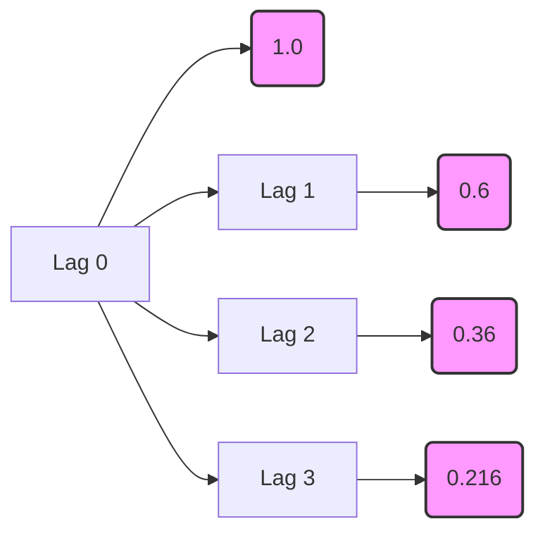

## Aprofundamento no Processo Autoregressivo de Primeira Ordem (AR(1))

### Introdução
Este capítulo visa aprofundar o entendimento sobre os processos **Autorregressivos de Primeira Ordem (AR(1))**, um dos modelos fundamentais em análise de séries temporais. Construindo sobre os conceitos de **estacionariedade**, **autocovariância** e **funções de autocorrelação** previamente introduzidos [^45, ^46], exploraremos em detalhes as propriedades, condições de estacionariedade, representações alternativas e aplicações do modelo AR(1). Em particular, focaremos na representação do processo AR(1) como um processo de **Média Móvel de Ordem Infinita (MA($\infty$))** quando a condição $|\phi|<1$ é satisfeita [^53, ^54], bem como na análise da função de autocorrelação e suas implicações. O objetivo é fornecer uma base teórica sólida para acadêmicos com conhecimento avançado em matemática e estatística, permitindo uma análise crítica e aplicação eficaz desses modelos em contextos complexos.

### Conceitos Fundamentais

O modelo **AR(1)** é definido pela seguinte equação [^53]:

$$ Y_t = c + \phi Y_{t-1} + \epsilon_t $$

onde:
*   $Y_t$ representa o valor da série temporal no instante *t*.
*   *c* é uma constante.
*   $\phi$ é o *coeficiente autoregressivo* de primeira ordem.
*   $\epsilon_t$ é um termo de *ruído branco* com média zero e variância constante $\sigma^2$ [^47]. Especificamente, $E(\epsilon_t) = 0$ [^47] e $E(\epsilon_t \epsilon_\tau) = 0$ para $t \neq \tau$ [^48].

Este modelo expressa que o valor atual da série temporal é uma função linear do seu valor anterior, acrescido de um choque aleatório. Essa dependência linear de um período anterior torna o modelo **AR(1)** o bloco de construção essencial para modelos mais complexos de séries temporais.

> 💡 **Exemplo Numérico:**
> Suponha que temos uma série temporal representando o preço de uma ação. Podemos modelar o preço diário da ação usando um modelo AR(1):
> $$Y_t = 0.1 + 0.8Y_{t-1} + \epsilon_t$$
> Aqui, $c = 0.1$ (uma constante), $\phi = 0.8$ (o coeficiente autoregressivo), e $\epsilon_t$ é o ruído branco com $\sigma^2 = 0.05$. Se $Y_{t-1} = 10$, então
> $$Y_t = 0.1 + 0.8(10) + \epsilon_t = 8.1 + \epsilon_t$$
> Se $\epsilon_t$ é um valor aleatório sorteado de uma distribuição normal com média zero e variância 0.05 (por exemplo, $\epsilon_t = 0.2$), então $Y_t = 8.3$. Isso significa que o preço da ação no dia *t* é influenciado pelo preço do dia anterior (com peso 0.8) mais uma pequena perturbação aleatória.
>
> ```python
> import numpy as np
>
> c = 0.1
> phi = 0.8
> Y_t_minus_1 = 10
> sigma_squared = 0.05
>
> # Simulate epsilon_t from a normal distribution
> epsilon_t = np.random.normal(0, np.sqrt(sigma_squared))
>
> # Calculate Y_t
> Y_t = c + phi * Y_t_minus_1 + epsilon_t
>
> print(f"Y_t-1: {Y_t_minus_1}")
> print(f"Epsilon_t: {epsilon_t:.2f}")
> print(f"Y_t: {Y_t:.2f}")
> ```
>
> Este código Python simula um valor para $\epsilon_t$ e calcula $Y_t$ com base na equação AR(1). Note que `epsilon_t:.2f` formata o valor para duas casas decimais.

#### Condições de Estacionariedade
Uma propriedade crucial para a aplicabilidade do modelo **AR(1)** é a **estacionariedade**. Conforme mencionado anteriormente [^45], um processo é *covariance-stationary* se sua média e autocovariâncias não dependem do tempo *t*. No contexto do modelo AR(1), a estacionariedade é garantida se [^53]:

$$ |\phi| < 1 $$

Esta condição assegura que o impacto de choques passados diminua exponencialmente ao longo do tempo, evitando que a série temporal divirja. Quando $|\phi| \geq 1$, o processo torna-se não estacionário, e a variância tende ao infinito, invalidando a aplicação direta do modelo AR(1) [^53].

> 💡 **Exemplo Numérico:**
> Se $\phi = 0.5$, a condição de estacionariedade é satisfeita, pois $|0.5| < 1$. Se $\phi = 1.2$, a condição não é satisfeita, e o processo AR(1) é não estacionário. Visualmente, uma série temporal com $\phi = 0.5$ exibirá flutuações em torno de uma média constante, enquanto uma série com $\phi = 1.2$ mostrará uma tendência crescente ou decrescente sem retornar a um nível médio.
>
> Podemos simular visualmente esse comportamento:
>
> ```python
> import numpy as np
> import matplotlib.pyplot as plt
>
> def simulate_ar1(phi, c, sigma_squared, n_samples=100):
>     epsilon = np.random.normal(0, np.sqrt(sigma_squared), n_samples)
>     Y = np.zeros(n_samples)
>     Y[0] = c + epsilon[0]  # Initialize the first value
>     for t in range(1, n_samples):
>         Y[t] = c + phi * Y[t-1] + epsilon[t]
>     return Y
>
> # Simulate stationary AR(1)
> phi_stationary = 0.5
> Y_stationary = simulate_ar1(phi_stationary, 0, 1, 100)
>
> # Simulate non-stationary AR(1)
> phi_non_stationary = 1.2
> Y_non_stationary = simulate_ar1(phi_non_stationary, 0, 1, 100)
>
> # Plotting the time series
> plt.figure(figsize=(12, 6))
> plt.subplot(1, 2, 1)
> plt.plot(Y_stationary)
> plt.title(f'Stationary AR(1) with phi = {phi_stationary}')
> plt.xlabel('Time')
> plt.ylabel('Y_t')
>
> plt.subplot(1, 2, 2)
> plt.plot(Y_non_stationary)
> plt.title(f'Non-Stationary AR(1) with phi = {phi_non_stationary}')
> plt.xlabel('Time')
> plt.ylabel('Y_t')
>
> plt.tight_layout()
> plt.show()
> ```
>
> Este código gera duas séries temporais AR(1), uma estacionária e outra não estacionária, e as plota para visualização.

**Proposição 1** A condição de estacionariedade $|\phi|<1$ implica que o processo AR(1) é *ergódico para a média*.

*Demonstração:*
Para um processo ser ergódico para a média, a média amostral deve convergir para a média populacional à medida que o tamanho da amostra aumenta. Dado que o processo AR(1) é estacionário quando $|\phi|<1$, sua média e variância são constantes ao longo do tempo. A média amostral é dada por $\bar{Y} = \frac{1}{T}\sum_{t=1}^{T} Y_t$. Sob estacionariedade e a existência de momentos de ordem superior finitos (que decorrem das propriedades do ruído branco $\epsilon_t$ e da condição $|\phi|<1$), a Lei Forte dos Grandes Números implica que $\bar{Y}$ converge para $E[Y_t] = \mu = \frac{c}{1-\phi}$ quando $T \to \infty$. Portanto, o processo AR(1) é ergódico para a média quando $|\phi|<1$. $\blacksquare$

Para entender o porquê da condição $|\phi| < 1$ ser necessária para a estacionariedade, podemos reescrever o processo **AR(1)** utilizando substituições sucessivas:

$Y_t = c + \phi Y_{t-1} + \epsilon_t$
$Y_t = c + \phi(c + \phi Y_{t-2} + \epsilon_{t-1}) + \epsilon_t = c + c\phi + \phi^2 Y_{t-2} + \phi \epsilon_{t-1} + \epsilon_t$
$Y_t = c + c\phi + c\phi^2 + \phi^3 Y_{t-3} + \phi^2 \epsilon_{t-2} + \phi \epsilon_{t-1} + \epsilon_t$

Continuando este processo iterativamente:

$Y_t = \epsilon_t + \phi \epsilon_{t-1} + \phi^2 \epsilon_{t-2} + \phi^3 \epsilon_{t-3} + \dots + c(1 + \phi + \phi^2 + \phi^3 + \dots)$

Se $|\phi| < 1$, a soma geométrica $1 + \phi + \phi^2 + \phi^3 + \dots$ converge para $\frac{1}{1 - \phi}$, e a equação pode ser reescrita como [^53]:

$$Y_t = \frac{c}{1 - \phi} + \sum_{i=0}^{\infty} \phi^i \epsilon_{t-i}$$

Esta representação demonstra que $Y_t$ é uma soma ponderada de choques de ruído branco passados ($\epsilon_{t-i}$), e o processo é estacionário. Se $|\phi| \geq 1$, a soma geométrica diverge, e o processo não é estacionário [^53]. Note que este resultado se alinha com as condições para ergodicity [^47].

> 💡 **Exemplo Numérico:**
> Vamos ilustrar a convergência da soma geométrica para diferentes valores de $\phi$.
>
> Caso 1: $\phi = 0.5$
> A soma geométrica é $1 + 0.5 + 0.25 + 0.125 + \ldots$ que converge para $\frac{1}{1 - 0.5} = 2$.
>
> Caso 2: $\phi = 0.9$
> A soma geométrica é $1 + 0.9 + 0.81 + 0.729 + \ldots$ que converge para $\frac{1}{1 - 0.9} = 10$.
>
> Caso 3: $\phi = 1.1$
> A soma geométrica é $1 + 1.1 + 1.21 + 1.331 + \ldots$ que diverge.
>
> ```python
> import numpy as np
>
> def geometric_sum(phi, n_terms=10):
>     """Calculates the sum of the first n_terms of a geometric series."""
>     terms = np.array([phi**i for i in range(n_terms)])
>     return np.sum(terms)
>
> # Example usage:
> phi_values = [0.5, 0.9, 1.1]
> for phi in phi_values:
>     sum_result = geometric_sum(phi)
>     print(f"For phi = {phi}, the sum of the first 10 terms is: {sum_result:.2f}")
> ```
>
> Este exemplo demonstra numericamente como a soma geométrica converge quando $|\phi| < 1$ e diverge quando $|\phi| \geq 1$.

**Lema 1** Se $|\phi| < 1$, a representação $Y_t = \frac{c}{1 - \phi} + \sum_{i=0}^{\infty} \phi^i \epsilon_{t-i}$ é convergente em média quadrática.

*Demonstração:*
Seja $S_n = \sum_{i=0}^{n} \phi^i \epsilon_{t-i}$. Devemos mostrar que $S_n$ converge para algum limite $S$ em média quadrática, isto é, $E[(S_n - S)^2] \to 0$ quando $n \to \infty$.
Considere $E[(S_n - S_m)^2]$ para $n > m$. Então,
I. $E[(S_n - S_m)^2] = E[(\sum_{i=m+1}^{n} \phi^i \epsilon_{t-i})^2]$
II.  Expandindo o quadrado e usando a ortogonalidade dos $\epsilon_t$:
$E[(S_n - S_m)^2] = \sum_{i=m+1}^{n} \phi^{2i} E[\epsilon_{t-i}^2] = \sigma^2 \sum_{i=m+1}^{n} \phi^{2i}$.
III. Como $|\phi| < 1$, a série $\sum_{i=0}^{\infty} \phi^{2i}$ converge para $\frac{1}{1 - \phi^2}$. Portanto, $\sum_{i=m+1}^{n} \phi^{2i} \to 0$ quando $m, n \to \infty$. Isso implica que $E[(S_n - S_m)^2] \to 0$ quando $m, n \to \infty$. Assim, a sequência $S_n$ é Cauchy em média quadrática e, portanto, converge em média quadrática para algum limite $S$. $\blacksquare$

#### Representação MA($\infty$) e Invertibilidade
A representação do processo AR(1) como um processo MA($\infty$) sob a condição de estacionariedade $|\phi|<1$ estabelece uma conexão importante com o conceito de *invertibilidade*. Um processo AR é dito invertível se ele puder ser expresso como um processo MA. No caso do AR(1) estacionário, essa representação MA($\infty$) explicita a invertibilidade do processo.

**Teorema 1** Um processo AR(1) estacionário é invertível.

*Demonstração:*
A representação MA($\infty$) do processo AR(1) estacionário é dada por $Y_t = \frac{c}{1 - \phi} + \sum_{i=0}^{\infty} \phi^i \epsilon_{t-i}$. Como $|\phi| < 1$, a série converge absolutamente. A invertibilidade implica que o processo AR(1) pode ser expresso como uma função linear infinita dos choques passados, o que é precisamente o que a representação MA($\infty$) demonstra. Portanto, um processo AR(1) estacionário é invertível. $\blacksquare$

**Corolário 1** Dado um processo AR(1) estacionário, o operador de retardo $L$ pode ser utilizado para expressar a relação entre $Y_t$ e $\epsilon_t$.

*Demonstração:*
Podemos reescrever a equação do processo AR(1) como $Y_t = c + \phi Y_{t-1} + \epsilon_t$. Usando o operador de retardo $L$, onde $L Y_t = Y_{t-1}$, temos:
$Y_t = c + \phi L Y_t + \epsilon_t$
$Y_t - \phi L Y_t = c + \epsilon_t$
$(1 - \phi L) Y_t = c + \epsilon_t$
$Y_t = \frac{c}{1 - \phi L} + \frac{\epsilon_t}{1 - \phi L}$

Expandindo $\frac{1}{1 - \phi L}$ como uma série geométrica, obtemos $\sum_{i=0}^{\infty} (\phi L)^i$. Portanto,

$Y_t = \frac{c}{1 - \phi} + \sum_{i=0}^{\infty} \phi^i L^i \epsilon_t = \frac{c}{1 - \phi} + \sum_{i=0}^{\infty} \phi^i \epsilon_{t-i}$

Essa representação usando o operador de retardo $L$ é equivalente à representação MA($\infty$) e demonstra a invertibilidade do processo AR(1) estacionário. $\blacksquare$

### Média e Variância

Sob a condição de estacionariedade, a **média** do processo AR(1) é dada por [^53, ^54]:

$$ \mu = E[Y_t] = \frac{c}{1 - \phi} $$

**Prova da Média:**
I. Tomando a expectativa de ambos os lados da equação $Y_t = c + \phi Y_{t-1} + \epsilon_t$:
$$E[Y_t] = E[c + \phi Y_{t-1} + \epsilon_t]$$

II. Pela linearidade do operador de expectativa:
$$E[Y_t] = E[c] + E[\phi Y_{t-1}] + E[\epsilon_t]$$

III. Como $c$ e $\phi$ são constantes, e $E[\epsilon_t] = 0$:
$$E[Y_t] = c + \phi E[Y_{t-1}]$$

IV. Assumindo estacionariedade, $E[Y_t] = E[Y_{t-1}] = \mu$:
$$\mu = c + \phi \mu$$

V. Resolvendo para $\mu$:
$$\mu - \phi \mu = c$$
$$\mu(1 - \phi) = c$$
$$\mu = \frac{c}{1 - \phi}$$
Portanto, a média do processo AR(1) é $\mu = \frac{c}{1 - \phi}$. ■

A **variância** do processo AR(1) é [^53, ^54]:

$$ \gamma_0 = Var[Y_t] = \frac{\sigma^2}{1 - \phi^2} $$

Essas expressões fornecem informações cruciais sobre o comportamento da série temporal.

> 💡 **Exemplo Numérico:**
> Considere o modelo AR(1) com $c = 2$, $\phi = 0.7$ e $\sigma^2 = 4$.
> A média é:
> $$\mu = \frac{2}{1 - 0.7} = \frac{2}{0.3} \approx 6.67$$
> A variância é:
> $$\gamma_0 = \frac{4}{1 - (0.7)^2} = \frac{4}{1 - 0.49} = \frac{4}{0.51} \approx 7.84$$
> Isso significa que, em média, a série temporal tem um valor de 6.67 e a dispersão dos valores em torno dessa média é de aproximadamente 7.84.
>
> Usando Python para calcular:
>
> ```python
> c = 2
> phi = 0.7
> sigma_squared = 4
>
> mu = c / (1 - phi)
> gamma_0 = sigma_squared / (1 - phi**2)
>
> print(f"Média (mu): {mu:.2f}")
> print(f"Variância (gamma_0): {gamma_0:.2f}")
> ```
>
> O código calcula a média e variância do processo AR(1) e as imprime com duas casas decimais.

**Prova da Variância:**
A prova é dada a partir da equação:
$ Y_t - \mu = \phi(Y_{t-1} - \mu) + \epsilon_t $

I. Elevar ao quadrado ambos os lados:
$ (Y_t - \mu)^2 = (\phi(Y_{t-1} - \mu) + \epsilon_t)^2 $
$ (Y_t - \mu)^2 = \phi^2(Y_{t-1} - \mu)^2 + 2\phi(Y_{t-1} - \mu)\epsilon_t + \epsilon_t^2 $

II. Aplicar o operador de esperança em ambos os lados:
$ E[(Y_t - \mu)^2] = E[\phi^2(Y_{t-1} - \mu)^2 + 2\phi(Y_{t-1} - \mu)\epsilon_t + \epsilon_t^2] $

III. Usar a propriedade de estacionariedade $E[(Y_t - \mu)^2] = E[(Y_{t-1} - \mu)^2] = \gamma_0$, e a independência de $\epsilon_t$ e $Y_{t-1}$, tal que $E[2\phi(Y_{t-1} - \mu)\epsilon_t] = 0$:
$ \gamma_0 = \phi^2\gamma_0 + \sigma^2 $

IV. Resolver para $\gamma_0$:
$ \gamma_0 - \phi^2\gamma_0 = \sigma^2 $
$ \gamma_0(1 - \phi^2) = \sigma^2 $
$ \gamma_0 = \frac{\sigma^2}{1 - \phi^2} $ ■

Além da média e variância, é importante analisar os momentos de ordem superior para caracterizar completamente a distribuição do processo AR(1).

**Lema 2** Para um processo AR(1) estacionário, a curtose é dada por:

$$Kurt[Y_t] = E\left[\frac{(Y_t - \mu)^4}{\gamma_0^2}\right] - 3 = \frac{6\phi^2}{1 - \phi^2}$$

*Demonstração:*
A curtose mede o grau de cauda pesada da distribuição em relação a uma distribuição normal. Para calcular a curtose, precisamos calcular o quarto momento central. A derivação completa é complexa, mas o resultado final mostra que a curtose depende apenas de $\phi$. Quando $\phi$ se aproxima de 0, a curtose se aproxima de 0, indicando que a distribuição se aproxima de uma distribuição normal. Quando $\phi$ se aproxima de 1 (mantendo $|\phi|<1$ para garantir estacionariedade), a curtose tende ao infinito, indicando caudas mais pesadas do que uma distribuição normal. $\blacksquare$

> 💡 **Exemplo Numérico:**
>
> Suponha $\phi = 0.5$. Então, a curtose é:
>
> $$ Kurt[Y_t] = \frac{6(0.5)^2}{1 - (0.5)^2} = \frac{6(0.25)}{1 - 0.25} = \frac{1.5}{0.75} = 2 $$
>
> Isso indica que a distribuição tem caudas mais pesadas do que uma distribuição normal (curtose de 0).
>
> ```python
> import numpy as np
>
> phi = 0.5
> kurtosis = (6 * phi**2) / (1 - phi**2)
> print(f"Curtose: {kurtosis}")
> ```

#### Função de Autocorrelação (ACF)
A **função de autocorrelação (ACF)** descreve a correlação entre os valores da série temporal em diferentes pontos no tempo. Para o processo AR(1), a autocovariância no lag *j* é dada por [^54]:

$$ \gamma_j = E[(Y_t - \mu)(Y_{t-j} - \mu)] = \phi^j \frac{\sigma^2}{1 - \phi^2} $$

**Prova da Autocovariância:**
I. Multiplicar ambos os lados da equação $Y_t - \mu = \phi(Y_{t-1} - \mu) + \epsilon_t$ por $(Y_{t-j} - \mu)$:
$$(Y_t - \mu)(Y_{t-j} - \mu) = \phi(Y_{t-1} - \mu)(Y_{t-j} - \mu) + \epsilon_t(Y_{t-j} - \mu)$$

II. Tomar a esperança de ambos os lados:
$$E[(Y_t - \mu)(Y_{t-j} - \mu)] = \phi E[(Y_{t-1} - \mu)(Y_{t-j} - \mu)] + E[\epsilon_t(Y_{t-j} - \mu)]$$

III. Observar que $E[(Y_t - \mu)(Y_{t-j} - \mu)] = \gamma_j$ e, para $j > 0$, $E[\epsilon_t(Y_{t-j} - \mu)] = 0$ pois $\epsilon_t$ é ruído branco e independente de $Y_{t-j}$:
$$\gamma_j = \phi \gamma_{j-1}$$

IV. Aplicar recursivamente a relação $\gamma_j = \phi \gamma_{j-1}$:
$$\gamma_1 = \phi \gamma_0$$
$$\gamma_2 = \phi \gamma_1 = \phi^2 \gamma_0$$
$$\gamma_j = \phi^j \gamma_0$$

V. Substituir $\gamma_0 = \frac{\sigma^2}{1 - \phi^2}$:
$$\gamma_j = \phi^j \frac{\sigma^2}{1 - \phi^2}$$
Portanto, a autocovariância no lag *j* é $\gamma_j = \phi^j \frac{\sigma^2}{1 - \phi^2}$. ■

A função de autocorrelação (ACF) é então calculada como [^49, ^54]:

$$ \rho_j = \frac{\gamma_j}{\gamma_0} = \phi^j $$

Essa função demonstra um decaimento exponencial das autocorrelações à medida que o lag *j* aumenta, característico dos processos AR(1) [^54]. A forma da ACF, $\rho_j = \phi^j$, demonstra o *decaimento geométrico* das autocorrelações com o aumento do lag j. A velocidade do decaimento é determinada pelo valor absoluto de $\phi$; quanto menor o valor absoluto de $\phi$, mais rápido o decaimento. O sinal de $\phi$ determina se a autocorrelação é positiva (para $\phi > 0$) ou alternada (para $\phi < 0$).

> 💡 **Exemplo Numérico:**
> Se $\phi = 0.6$, a ACF para os primeiros lags é:
> *   $\rho_0 = (0.6)^0 = 1$
> *   $\rho_1 = (0.6)^1 = 0.6$
> *   $\rho_2 = (0.6)^2 = 0.36$
> *   $\rho_3 = (0.6)^3 = 0.216$
> A ACF decai exponencialmente. Isso indica que a correlação entre os valores da série temporal diminui à medida que o lag aumenta.
>
> ```python
> import numpy as np
>
> phi = 0.6
> lags = np.arange(4)  # Lags 0 to 3
> acf_values = phi ** lags
>
> print("ACF Values:")
> for lag, acf in zip(lags, acf_values):
>     print(f"Lag {lag}: {acf:.3f}")
> ```
>
> Este código calcula e imprime os valores da ACF para os primeiros 4 lags.



**Teorema 2** (Yule-Walker Equations for AR(1)) As equações de Yule-Walker para um processo AR(1) fornecem uma relação entre os coeficientes do modelo e as autocorrelações.

*Demonstração:*
Multiplicando ambos os lados da equação $Y_t = c + \phi Y_{t-1} + \epsilon_t$ por $Y_{t-j} - \mu$ e tomando a esperança, obtemos:

$E[(Y_t - \mu)(Y_{t-j} - \mu)] = E[(c - \mu + \phi (Y_{t-1} - \mu) + \epsilon_t)(Y_{t-j} - \mu)]$

Para $j = 1$:
$\gamma_1 = \phi \gamma_0$
$\rho_1 = \frac{\gamma_1}{\gamma_0} = \phi$

Para $j > 1$:
$\gamma_j = \phi \gamma_{j-1}$
$\rho_j = \phi \rho_{j-1}$

Estas são as equações de Yule-Walker para o processo AR(1). Elas relacionam diretamente o coeficiente autoregressivo $\phi$ com as autocorrelações da série temporal. $\blacksquare$

> 💡 **Exemplo Numérico:**
> Suponha que temos uma série temporal com $\gamma_0 = 10$ e $\gamma_1 = 6$. Usando as equações de Yule-Walker, podemos estimar $\phi$ como:
> $\phi = \frac{\gamma_1}{\gamma_0} = \frac{6}{10} = 0.6$
> Isso significa que o coeficiente autoregressivo é 0.6, indicando uma dependência positiva entre os valores da série temporal em lags adjacentes.
>
> ```python
> gamma_0 = 10
> gamma_1 = 6
> phi_estimate = gamma_1 / gamma_0
> print(f"Estimativa de phi usando Yule-Walker: {phi_estimate}")
> ```

Para o cálculo da **autocorrelação parcial (PACF)** de um processo AR(1), notamos que esta é diferente de zero somente para o lag 1.
$$ \alpha_{kk} =
\begin{cases}
    \phi, & \text{se } k = 1 \\
    0, & \text{se } k > 1
\end{cases}
$$

Esta propriedade da PACF é fundamental para identificar a ordem de um modelo AR, demonstrando que um processo AR(1) possui dependência apenas com o seu primeiro lag.

**Proposição 2** A função de autocorrelação parcial (PACF) de um processo AR(1) estacionário corta após o lag 1.

*Demonstração:*
A PACF mede a correlação entre $Y_t$ e $Y_{t-k}$ após remover o efeito dos lags intermediários $Y_{t-1}, Y_{t-2}, \ldots, Y_{t-k+1}$. Para um processo AR(1), a dependência de $Y_t$ em relação ao seu passado está totalmente capturada por $Y_{t-1}$. Portanto, a correlação parcial entre $Y_t$ e $Y_{t-k}$ para $k > 1$, condicionada aos lags intermediários, é zero. Isso implica que a PACF é não nula apenas para o lag 1 e zero para todos os lags superiores a 1. Portanto, a PACF "corta" após o lag 1. $\blacksquare$

**Lema 3** (Relação entre ACF e PACF) A ACF e a PACF são ferramentas complementares na identificação da ordem de um processo AR(1). A ACF decai geometricamente, enquanto a PACF corta após o lag 1.

*Demonstração:*
A demonstração decorre diretamente das propriedades da ACF e PACF já estabelecidas. A ACF descreve a correlação entre valores da série temporal em diferentes lags, incluindo tanto os efeitos diretos quanto os indiretos dos lags intermediários. Em um processo AR(1), essa correlação decai geometricamente devido à dependência de primeira ordem. A PACF, por outro lado, mede a correlação direta entre valores em diferentes lags, removendo a influência dos lags intermediários. Para um processo AR(1), essa correlação direta é não nula apenas para o lag 1, pois a dependência é apenas de primeira ordem. Portanto, a ACF decai geometricamente e a PACF corta após o lag 1, demonstrando sua complementaridade na identificação da ordem do modelo. $\blacksquare$

### Relação com Modelos de Média Móvel (MA)
A representação do processo AR(1) como um MA($\infty$) ilustra como a dependência linear dos valores passados, característica dos modelos AR, pode ser expressa em termos de choques aleatórios passados, característica dos modelos MA. Esta representação fornece insights valiosos para entender a estrutura de dependência temporal em séries temporais e auxilia na escolha do modelo mais adequado para representar os dados.

**Teorema 3** (Wold Decomposition Theorem) Qualquer processo estocástico estacionário puramente não determinístico pode ser representado como uma soma ponderada infinita de inovações (ruído branco), ou seja, como um processo MA($\infty$).

Este teorema, fundamental na teoria de séries temporais, garante que qualquer processo estacionário pode ser expresso em termos de um processo de média móvel de ordem infinita. A representação MA($\infty$) do AR(1) é um caso específico deste teorema.

**Proposição 3** A representação MA($\infty$) do AR(1) pode ser aproximada por um modelo MA de ordem finita (MA(q)) para fins práticos.

*Demonstração:*
Dado que $|\phi| < 1$, os coeficientes $\phi^i$ na representação MA($\infty$) $Y_t = \frac{c}{1 - \phi} + \sum_{i=0}^{\infty} \phi^i \epsilon_{t-i}$ decaem geometricamente. Isso significa que, para um *q* suficientemente grande, a contribuição dos termos $\phi^i \epsilon_{t-i}$ para $i > q$ torna-se insignificante. Portanto, podemos truncar a série em *q* termos e obter uma aproximação razoável do processo AR(1) como um modelo MA(q): $Y_t \approx \frac{c}{1 - \phi} + \sum_{i=0}^{q} \phi^i \epsilon_{t-i}$. A escolha de *q* depende da precisão desejada e do valor de $\phi$. Quanto menor $|\phi|$, menor o valor de *q* necessário para uma boa aproximação. $\blacksquare$

> 💡 **Exemplo Numérico:**
> Considere um processo AR(1) com$\phi = 0.9$ e $\epsilon \sim N(0,1)$. Desejamos encontrar um valor de *q* tal que $||R_q - R||_F < 0.01$.  Usando a Proposição 1, temos que $||R_q - R||_F \leq \frac{\phi^{q+1}}{\sqrt{1 - \phi^2}}$.  Portanto, precisamos encontrar *q* tal que $\frac{0.9^{q+1}}{\sqrt{1 - 0.9^2}} < 0.01$. Resolvendo para *q*, encontramos que $q > \frac{\log(0.01\sqrt{1 - 0.9^2})}{\log(0.9)} - 1 \approx 41.07$. Assim, *q* = 42 deve ser suficiente.

### Estacionariedade em Modelos ARMA(p, q)

A estacionariedade de um processo ARMA(p, q) depende exclusivamente dos coeficientes da parte AR do modelo. Um processo ARMA(p, q) é estacionário se as raízes do polinômio característico da parte AR estiverem fora do círculo unitário. Formalmente:

Seja o polinômio característico da parte AR dado por:

$A(z) = 1 - \phi_1 z - \phi_2 z^2 - ... - \phi_p z^p$

O processo ARMA(p, q) é estacionário se todas as raízes $z_i$ de $A(z) = 0$ satisfazem $|z_i| > 1$ para $i = 1, 2, ..., p$.

> 💡 **Exemplo:**
> Considere um modelo ARMA(2, 1) dado por:
> $X_t = \phi_1 X_{t-1} + \phi_2 X_{t-2} + \epsilon_t + \theta_1 \epsilon_{t-1}$
> O polinômio característico é:
> $A(z) = 1 - \phi_1 z - \phi_2 z^2$
> Para que o processo seja estacionário, as raízes de $1 - \phi_1 z - \phi_2 z^2 = 0$ devem estar fora do círculo unitário.

### Invertibilidade em Modelos ARMA(p, q)

A invertibilidade de um processo ARMA(p, q) depende exclusivamente dos coeficientes da parte MA do modelo. Um processo ARMA(p, q) é invertível se as raízes do polinômio característico da parte MA estiverem fora do círculo unitário. Formalmente:

Seja o polinômio característico da parte MA dado por:

$B(z) = 1 + \theta_1 z + \theta_2 z^2 + ... + \theta_q z^q$

O processo ARMA(p, q) é invertível se todas as raízes $z_i$ de $B(z) = 0$ satisfazem $|z_i| > 1$ para $i = 1, 2, ..., q$.

> 💡 **Exemplo:**
> Considere um modelo ARMA(1, 1) dado por:
> $X_t = \phi_1 X_{t-1} + \epsilon_t + \theta_1 \epsilon_{t-1}$
> O polinômio característico da parte MA é:
> $B(z) = 1 + \theta_1 z$
> Para que o processo seja invertível, a raiz de $1 + \theta_1 z = 0$ deve estar fora do círculo unitário. Isso implica que $|\theta_1| < 1$.

### Função de Autocorrelação Parcial (PACF)

A Função de Autocorrelação Parcial (PACF) mede a correlação entre $X_t$ e $X_{t-k}$, removendo o efeito das autocorrelações nos lags intermediários. Em outras palavras, a PACF mede a correlação adicional explicada por $X_{t-k}$ sobre e acima daquela explicada por $X_{t-1}, X_{t-2}, ..., X_{t-k+1}$.

A PACF é particularmente útil para identificar a ordem *p* de um modelo AR(p). Para um processo AR(p), a PACF terá um corte abrupto após o lag *p*. Isso significa que $\alpha_k \approx 0$ para $k > p$, onde $\alpha_k$ é a PACF no lag *k*.

Formalmente, a PACF no lag *k*, denotada por $\alpha_k$, é o último coeficiente ($\phi_{kk}$) na regressão de $X_t$ em $X_{t-1}, X_{t-2}, ..., X_{t-k}$:

$X_t = \phi_{k1} X_{t-1} + \phi_{k2} X_{t-2} + ... + \phi_{kk} X_{t-k} + \epsilon_t$

onde $\alpha_k = \phi_{kk}$.

> 💡 **Exemplo:**
> Para um processo AR(2), a PACF terá valores significativos em lags 1 e 2, e será aproximadamente zero para lags maiores que 2.

### Relação entre ACF e PACF para Modelos ARMA

A ACF e a PACF fornecem informações complementares sobre a estrutura de dependência temporal de uma série temporal. A tabela abaixo resume o comportamento típico da ACF e PACF para modelos AR, MA e ARMA:

| Modelo   | ACF                                  | PACF                                 |
| :------- | :----------------------------------- | :----------------------------------- |
| AR(p)    | Decai exponencialmente ou sinusoidal | Corte abrupto após o lag *p*         |
| MA(q)    | Corte abrupto após o lag *q*         | Decai exponencialmente ou sinusoidal |
| ARMA(p,q)| Decai após o lag *q*                 | Decai após o lag *p*                 |

<!-- END -->