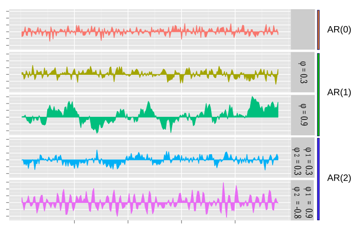
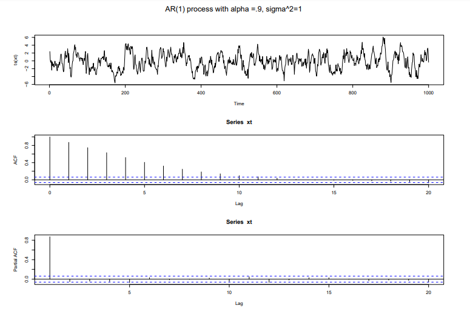
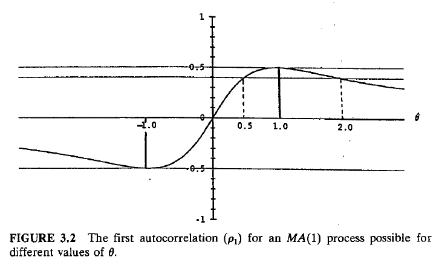
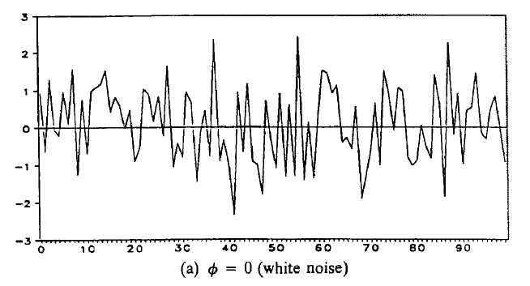
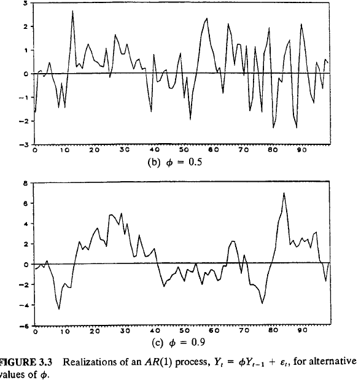
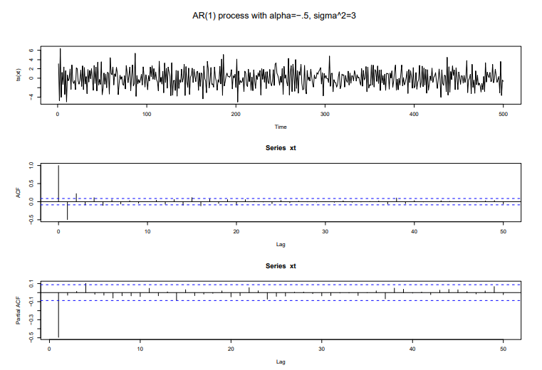
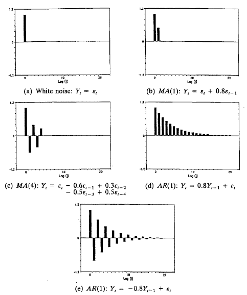
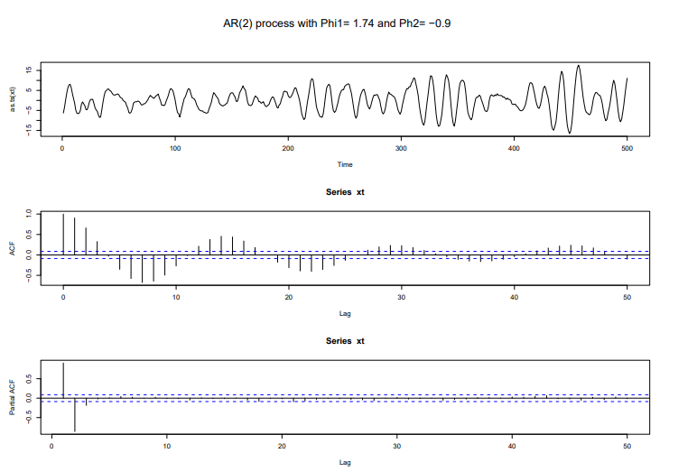

## Figure1

A imagem mostra cinco séries temporais simuladas, cada uma representando um processo autoregressivo (AR) diferente. As séries são exibidas em painéis separados verticalmente. A primeira série é rotulada como "AR", sem parâmetros especificados. A segunda série é rotulada como "AR" com \( \varphi = 0.3 \). A terceira série é rotulada como "AR" com \( \varphi = 0.9 \). A quarta série é rotulada como "AR" com \( \varphi_1 = 0.3 \) e \( \varphi_2 = 0.3 \). A quinta série é rotulada como "AR" com \( \varphi_1 = 0.9 \) e \( \varphi_2 = -0.8 \).

## Figure2

A imagem exibe três gráficos relacionados a um processo AR(1) com alpha = 0.9 e sigma^2 = 1. O primeiro gráfico mostra a série temporal xt, exibindo um padrão de oscilações irregulares ao longo do tempo. Os dois gráficos subsequentes apresentam as funções de autocorrelação (ACF) e autocorrelação parcial (PACF) da série xt, respectivamente, com picos significativos nos primeiros lags, indicando a dependência temporal do processo AR(1).

## Figure3

A imagem é um gráfico que representa a primeira autocorrelação (ρ₁) para um processo MA(1) em função de diferentes valores de θ. O eixo horizontal representa θ, enquanto o eixo vertical representa o valor da autocorrelação, variando de -1 a 1. A curva mostra como ρ₁ varia com θ, atingindo um valor máximo e tendendo a zero para valores extremos de θ. Linhas horizontais indicam valores de autocorrelação ρ em 0 e 0.5 e linhas verticais tracejadas indicam que para cada valor de ρ existem dois valores de θ possiveis.

## Figure4

O gráfico representa uma realização de um processo de ruído branco com \(\phi = 0\), conforme mencionado na legenda. Este processo é caracterizado por não ter autocorrelação, o que se manifesta visualmente na ausência de padrões ou tendências aparentes na série temporal. A imagem, mencionada no contexto das páginas 44-47 do documento, ilustra um dos blocos de construção básicos para modelos de séries temporais discutidos no Capítulo 3, onde a ausência de dependência temporal é um aspecto chave.

## Figure5

A imagem mostra dois gráficos de séries temporais simuladas, representando realizações de um processo AR(1) (Autorregressivo de primeira ordem) com diferentes valores do parâmetro φ. O gráfico superior (b) exibe uma série com φ = 0.5, apresentando flutuações mais rápidas em torno da linha zero. O gráfico inferior (c) ilustra um processo com φ = 0.9, onde as flutuações são mais lentas e as observações tendem a permanecer acima ou abaixo da média por períodos mais longos, conforme discutido nas seções 3.4 e 3.4.1.

## Figure6

A imagem mostra três gráficos relacionados a um processo AR(1) (Autoregressivo de ordem 1) com parâmetros alpha = -0.5 e sigma^2 = 3. O primeiro gráfico exibe a série temporal do processo AR(1), mostrando os valores da série (ts(xt)) ao longo do tempo. O segundo gráfico representa a Função de Autocorrelação (ACF) da série, indicando a correlação entre os valores da série em diferentes lags. O terceiro gráfico mostra a Função de Autocorrelação Parcial (Partial ACF), que mede a correlação entre os valores da série em um determinado lag, removendo a influência dos lags intermediários. A imagem pode ser encontrada no Capítulo 3, que trata de Processos ARMA Estacionários.

## Figure7

A imagem apresenta cinco gráficos de autocorrelação distintos, cada um representando um processo de série temporal diferente. O gráfico (a) ilustra o ruído branco, onde a autocorrelação é significativa apenas no lag zero. Os gráficos (b) e (c) mostram processos de média móvel (MA), enquanto os gráficos (d) e (e) exibem processos autorregressivos (AR), com diferentes padrões de decaimento e oscilação na autocorrelação, conforme suas respectivas equações. Esses gráficos auxiliam na identificação visual de modelos de séries temporais e são referenciados no Capítulo 3 do documento.

## Figure8

A imagem mostra três gráficos relacionados a um processo AR(2) (Auto-Regressivo de ordem 2). O primeiro gráfico exibe a série temporal do processo AR(2) com coeficientes Phi1 = 1.74 e Phi2 = -0.9, mostrando as oscilações da série ao longo do tempo. Os dois gráficos inferiores exibem as funções de autocorrelação (ACF) e autocorrelação parcial (PACF) da série temporal 'xt', usadas para identificar a ordem do processo ARMA. As linhas tracejadas horizontais em ambos os gráficos ACF e PACF indicam os limites de confiança para determinar quais lags são estatisticamente significativos.
