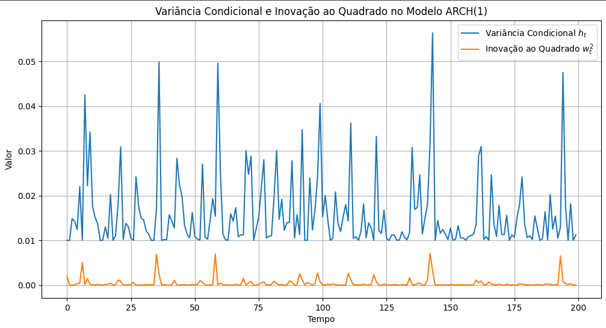

## Representação Alternativa e Inovações em Modelos ARCH(m)

### Introdução

Este capítulo explora uma representação alternativa para o modelo **ARCH(m)** (Autoregressive Conditional Heteroskedasticity de ordem *m*) [^1], que oferece uma perspectiva valiosa sobre a estrutura e as propriedades do processo. Focaremos na decomposição do termo de erro $u_t$ em termos de uma variância condicional $h_t$ e uma sequência i.i.d. (independent and identically distributed) $v_t$ com média zero e variância unitária. Além disso, examinaremos a inovação $w_t$ na representação AR(m) para $u_t^2$ e suas propriedades.

### Representação Alternativa do Modelo ARCH(m)

Uma representação alternativa para o processo ARCH(m) é dada por [^1]:

$$
u_t = \sqrt{h_t} \cdot v_t
$$

onde [^1]:

*   $u_t$ é o termo de erro no tempo $t$.
*   $h_t$ é a variância condicional no tempo $t$.
*   $v_t$ é uma sequência i.i.d. com média zero e variância unitária, ou seja, $E(v_t) = 0$ e $E(v_t^2) = 1$ [^1].

A variância condicional $h_t$ é modelada como [^1]:

$$
h_t = \zeta + \alpha_1 u_{t-1}^2 + \alpha_2 u_{t-2}^2 + \dots + \alpha_m u_{t-m}^2
$$

onde [^1]:

*   $\zeta$ é uma constante.
*   $\alpha_j$ são os coeficientes autorregressivos para $j = 1, 2, \dots, m$.

Esta representação [^1] decompõe o termo de erro $u_t$ em dois componentes: a raiz quadrada da variância condicional ($ \sqrt{h_t} $), que captura a escala da volatilidade, e a sequência i.i.d. $v_t$, que representa os choques aleatórios normalizados.

> 💡 **Exemplo Numérico:** Considere uma série temporal de retornos financeiros modelada por um ARCH(2). Os parâmetros são estimados como $\zeta = 0.0001$, $\alpha_1 = 0.3$, e $\alpha_2 = 0.2$. No tempo $t-1$, $u_{t-1} = 0.01$ (1%) e no tempo $t-2$, $u_{t-2} = -0.005$ (-0.5%). A variância condicional no tempo $t$ é:
>
> $h_t = 0.0001 + 0.3 \times (0.01)^2 + 0.2 \times (-0.005)^2 = 0.0001 + 0.00003 + 0.000005 = 0.000135$
>
> Agora, suponha que $v_t = -0.8$. Então, $u_t = \sqrt{0.000135} \times (-0.8) \approx -0.0011$, o que representa um choque negativo de -0.11%. Este exemplo ilustra como os retornos passados afetam a volatilidade atual e, consequentemente, o valor do erro no tempo $t$.
>
> ```python
> import numpy as np
>
> # Parâmetros do modelo ARCH(2)
> zeta = 0.0001
> alpha1 = 0.3
> alpha2 = 0.2
>
> # Valores
> u_tm1 = 0.01
> u_tm2 = -0.005
> v_t = -0.8
>
> # Calculando h_t
> h_t = zeta + alpha1 * u_tm1**2 + alpha2 * u_tm2**2
>
> # Calculando u_t
> u_t = np.sqrt(h_t) * v_t
>
> print(f"Valor de h_t: {h_t}")
> print(f"Valor de u_t: {u_t}")
> ```

Sob esta especificação, a projeção linear de $u_t^2$ nos valores passados é também a esperança condicional [^1]:

$$
E(u_t^2 | u_{t-1}, u_{t-2}, \dots) = E((\sqrt{h_t} \cdot v_t)^2 | u_{t-1}, u_{t-2}, \dots) = E(h_t \cdot v_t^2 | u_{t-1}, u_{t-2}, \dots) = h_t E(v_t^2 | u_{t-1}, u_{t-2}, \dots) = h_t \cdot 1 = h_t
$$

já que $v_t$ é i.i.d. e $E(v_t^2) = 1$.

> 💡 **Exemplo Numérico:** Considere um modelo ARCH(1) com $\zeta = 0.01$ e $\alpha_1 = 0.6$. Suponha que $u_{t-1} = 0.2$. Então:
>
> $h_t = 0.01 + 0.6 \times (0.2)^2 = 0.01 + 0.6 \times 0.04 = 0.034$
>
> Se $v_t = 1.5$, então $u_t = \sqrt{0.034} \times 1.5 \approx 0.175$.
>
> ```python
> import numpy as np
>
> # Parâmetros do modelo ARCH(1)
> zeta = 0.01
> alpha1 = 0.6
>
> # Valores
> u_tm1 = 0.2
> v_t = 1.5
>
> # Calculando h_t
> h_t = zeta + alpha1 * u_tm1**2
>
> # Calculando u_t
> u_t = np.sqrt(h_t) * v_t
>
> print(f"Valor de h_t: {h_t}")
> print(f"Valor de u_t: {u_t}")
> ```

A especificação do modelo ARCH(m) como $u_t = \sqrt{h_t} v_t$ permite derivar propriedades importantes sobre o processo e facilita a análise e estimação dos parâmetros do modelo.

**Proposição 1.** *Sob a representação alternativa do modelo ARCH(m), a esperança incondicional de $u_t$ é zero, ou seja, $E(u_t) = 0$.*

*Prova:*
Como $u_t = \sqrt{h_t} v_t$, temos que $E(u_t) = E(\sqrt{h_t} v_t)$. Pela lei das expectativas iteradas, $E(u_t) = E(E(\sqrt{h_t} v_t | u_{t-1}, u_{t-2}, \dots))$. Como $h_t$ é função de $u_{t-1}, u_{t-2}, \dots$ e $v_t$ é independente de $u_{t-1}, u_{t-2}, \dots$, temos $E(\sqrt{h_t} v_t | u_{t-1}, u_{t-2}, \dots) = \sqrt{h_t} E(v_t | u_{t-1}, u_{t-2}, \dots) = \sqrt{h_t} E(v_t) = \sqrt{h_t} \cdot 0 = 0$. Portanto, $E(u_t) = E(0) = 0$. $\blacksquare$

*Prova detalhada da Proposição 1:*
I. Iniciamos com a definição de $u_t$ no modelo ARCH(m):
   $$u_t = \sqrt{h_t} v_t$$

II. Tomamos a esperança condicional de $u_t$ dado as informações até $t-1$, denotadas por $\mathcal{F}_{t-1}$:
    $$E(u_t | \mathcal{F}_{t-1}) = E(\sqrt{h_t} v_t | \mathcal{F}_{t-1})$$

III. Como $h_t$ é função de $u_{t-1}, u_{t-2}, \dots$, é conhecido dado $\mathcal{F}_{t-1}$. Além disso, $v_t$ é independente de $\mathcal{F}_{t-1}$ por definição:
     $$E(\sqrt{h_t} v_t | \mathcal{F}_{t-1}) = \sqrt{h_t} E(v_t | \mathcal{F}_{t-1}) = \sqrt{h_t} E(v_t)$$

IV. Dado que $E(v_t) = 0$ (por definição de $v_t$), temos:
    $$\sqrt{h_t} E(v_t) = \sqrt{h_t} \cdot 0 = 0$$

V. Portanto, $E(u_t | \mathcal{F}_{t-1}) = 0$.

VI. Agora, tomamos a esperança incondicional de $u_t$:
     $$E(u_t) = E(E(u_t | \mathcal{F}_{t-1})) = E(0) = 0$$

Assim, provamos que a esperança incondicional de $u_t$ é zero. $\blacksquare$

### Inovação na Representação AR(m)

A representação AR(m) para $u_t^2$ é dada por:

$$
u_t^2 = \zeta + \alpha_1 u_{t-1}^2 + \alpha_2 u_{t-2}^2 + \dots + \alpha_m u_{t-m}^2 + w_t
$$

A inovação $w_t$ nesta representação pode ser expressa em termos de $h_t$ e $v_t$ como [^1]:

$$
w_t = h_t (v_t^2 - 1)
$$

*Prova da Derivação de $w_t$:*
I.  Começamos com a representação alternativa $u_t = \sqrt{h_t} v_t$. Elevando ao quadrado, temos $u_t^2 = h_t v_t^2$.

II. Expressamos $h_t$ em termos dos valores passados de $u^2$:
    $$h_t = \zeta + \alpha_1 u_{t-1}^2 + \alpha_2 u_{t-2}^2 + \dots + \alpha_m u_{t-m}^2$$

III. Substituímos $h_t$ na equação para $u_t^2$:
     $$u_t^2 = (\zeta + \alpha_1 u_{t-1}^2 + \alpha_2 u_{t-2}^2 + \dots + \alpha_m u_{t-m}^2) v_t^2$$

IV. Queremos expressar isso na forma $u_t^2 = \zeta + \alpha_1 u_{t-1}^2 + \alpha_2 u_{t-2}^2 + \dots + \alpha_m u_{t-m}^2 + w_t$, então reescrevemos a equação:
    $$u_t^2 = \zeta + \alpha_1 u_{t-1}^2 + \alpha_2 u_{t-2}^2 + \dots + \alpha_m u_{t-m}^2 + (\zeta v_t^2 - \zeta) + (\alpha_1 u_{t-1}^2 v_t^2 - \alpha_1 u_{t-1}^2) + \dots + (\alpha_m u_{t-m}^2 v_t^2 - \alpha_m u_{t-m}^2)$$
    $$u_t^2 = \zeta + \alpha_1 u_{t-1}^2 + \alpha_2 u_{t-2}^2 + \dots + \alpha_m u_{t-m}^2 + \zeta(v_t^2 - 1) + \alpha_1 u_{t-1}^2 (v_t^2 - 1) + \dots + \alpha_m u_{t-m}^2 (v_t^2 - 1)$$
    $$u_t^2 = \zeta + \alpha_1 u_{t-1}^2 + \alpha_2 u_{t-2}^2 + \dots + \alpha_m u_{t-m}^2 + (v_t^2 - 1)(\zeta + \alpha_1 u_{t-1}^2 + \alpha_2 u_{t-2}^2 + \dots + \alpha_m u_{t-m}^2) $$
   $$u_t^2 = \zeta + \alpha_1 u_{t-1}^2 + \alpha_2 u_{t-2}^2 + \dots + \alpha_m u_{t-m}^2 + (v_t^2 - 1)h_t$$

V. Portanto, $w_t = h_t (v_t^2 - 1)$. $\blacksquare$

O valor esperado de $w_t$ é:

$$
E(w_t) = E[h_t (v_t^2 - 1)] = E(h_t) E(v_t^2 - 1) = E(h_t) (E(v_t^2) - 1) = E(h_t) (1 - 1) = 0
$$

Isso confirma que $w_t$ tem média zero.

A variância de $w_t$ é dada por [^1]:

$$
E(w_t^2) = E[h_t^2 (v_t^2 - 1)^2] = E(h_t^2) E[(v_t^2 - 1)^2] = E(h_t^2) E[v_t^4 - 2v_t^2 + 1] = E(h_t^2) (E(v_t^4) - 2E(v_t^2) + 1) = E(h_t^2) (E(v_t^4) - 1)
$$

Se definirmos $\lambda^2 = E(w_t^2)$, então $\lambda^2 = E(h_t^2)(E(v_t^4)-1)$ [^1]. Note que $\lambda^2$ reflete o quarto momento de $u_t$.

> 💡 **Exemplo Numérico:** Suponha que $h_t = 0.034$ e $v_t$ segue uma distribuição normal padrão (N(0,1)). Então, $E(v_t^4) = 3$ (para a distribuição normal padrão). Assim,
>
> $E(w_t^2) = E(h_t^2)(E(v_t^4)-1) = (0.034)^2 * (3 - 1) = 0.001156 * 2 = 0.002312$.
>
>  ```python
> import numpy as np
>
> # Valores
> h_t = 0.034
>
> # E(v_t^4) para uma distribuição normal padrão
> E_v_t_4 = 3
>
> # Calculando E(w_t^2)
> E_w_t_2 = h_t**2 * (E_v_t_4 - 1)
>
> print(f"Valor de E(w_t^2): {E_w_t_2}")
> ```
>
> Este resultado mostra que a variância da inovação $w_t$ depende tanto da variância condicional $h_t$ quanto da distribuição de $v_t$. No caso de uma distribuição normal, $E(v_t^4) = 3$, resultando em uma variância maior para $w_t$ em comparação com uma distribuição com menor curtose.

**Proposição 2.** *A covariância entre $w_t$ e $u_{t-k}^2$ é zero para $k > 0$.*

*Prova:*
$Cov(w_t, u_{t-k}^2) = E(w_t u_{t-k}^2) - E(w_t)E(u_{t-k}^2)$. Já sabemos que $E(w_t) = 0$, então $Cov(w_t, u_{t-k}^2) = E(w_t u_{t-k}^2)$.
Substituindo $w_t = h_t(v_t^2 - 1)$, temos $Cov(w_t, u_{t-k}^2) = E(h_t (v_t^2 - 1) u_{t-k}^2)$.
Usando a lei das expectativas iteradas, $Cov(w_t, u_{t-k}^2) = E(E(h_t (v_t^2 - 1) u_{t-k}^2 | u_{t-1}, u_{t-2}, \dots))$.
Dado $u_{t-1}, u_{t-2}, \dots$, $h_t$ e $u_{t-k}^2$ são conhecidos, e $v_t$ é independente deles.
Portanto, $E(h_t (v_t^2 - 1) u_{t-k}^2 | u_{t-1}, u_{t-2}, \dots) = h_t u_{t-k}^2 E(v_t^2 - 1 | u_{t-1}, u_{t-2}, \dots) = h_t u_{t-k}^2 E(v_t^2 - 1) = h_t u_{t-k}^2 (E(v_t^2) - 1) = h_t u_{t-k}^2 (1 - 1) = 0$.
Assim, $Cov(w_t, u_{t-k}^2) = E(0) = 0$. $\blacksquare$

*Prova detalhada da Proposição 2:*

I. Começamos com a definição de covariância:
   $$Cov(w_t, u_{t-k}^2) = E[w_t u_{t-k}^2] - E[w_t]E[u_{t-k}^2]$$

II. Sabemos que $E[w_t] = 0$, então a equação simplifica para:
    $$Cov(w_t, u_{t-k}^2) = E[w_t u_{t-k}^2]$$

III. Substituímos $w_t$ por sua expressão em termos de $h_t$ e $v_t$:
     $$Cov(w_t, u_{t-k}^2) = E[h_t (v_t^2 - 1) u_{t-k}^2]$$

IV. Aplicamos a lei das expectativas iteradas, condicionando na informação disponível no tempo $t-1$ e tempos anteriores, denotada por $\mathcal{F}_{t-1}$:
    $$Cov(w_t, u_{t-k}^2) = E[E[h_t (v_t^2 - 1) u_{t-k}^2 | \mathcal{F}_{t-1}]]$$

V. Dado $\mathcal{F}_{t-1}$, $h_t$ é uma função de $u_{t-1}, u_{t-2}, ...$ e $u_{t-k}^2$ também pertence a $\mathcal{F}_{t-1}$ (já que $k > 0$). Além disso, $v_t$ é independente de $\mathcal{F}_{t-1}$. Portanto,
   $$E[h_t (v_t^2 - 1) u_{t-k}^2 | \mathcal{F}_{t-1}] = h_t u_{t-k}^2 E[(v_t^2 - 1) | \mathcal{F}_{t-1}] = h_t u_{t-k}^2 E[v_t^2 - 1]$$

VI. Como $E[v_t^2] = 1$, temos:
    $$h_t u_{t-k}^2 E[v_t^2 - 1] = h_t u_{t-k}^2 (1 - 1) = 0$$

VII. Substituindo de volta na equação para a covariância:
     $$Cov(w_t, u_{t-k}^2) = E[0] = 0$$

Portanto, a covariância entre $w_t$ e $u_{t-k}^2$ é zero para $k > 0$. $\blacksquare$

### Análise da Inovação

A análise da inovação $w_t$ é fundamental para entender a estrutura do modelo ARCH(m). Note que, embora a sequência $v_t$ seja i.i.d., a inovação $w_t$ não é i.i.d. porque sua variância condicional muda ao longo do tempo, dependendo de $h_t$. Especificamente, embora a variância incondicional de $w_t$ seja constante (e igual a $\lambda^2$), sua variância condicional muda ao longo do tempo. Este é um reflexo da heteroskedasticidade presente no modelo ARCH(m).

> 💡 **Exemplo Numérico:** Para visualizar como a variância condicional de $w_t$ muda ao longo do tempo, considere simular um modelo ARCH(1) com $\zeta = 0.0001$ e $\alpha_1 = 0.4$. Simulamos 200 valores de $u_t$ e calculamos $h_t$ e $w_t$. O gráfico de $h_t$ e $w_t^2$ mostrará a variabilidade ao longo do tempo, refletindo a heteroskedasticidade.
>
> 
> 
> A plotagem demonstrará visualmente como a variância condicional ($h_t$) e a inovação ao quadrado ($w_t^2$) variam ao longo do tempo, exibindo os efeitos da heteroskedasticidade condicional inerente ao modelo ARCH. Note que, embora $v_t$ seja i.i.d., $w_t$ não é, devido à sua dependência de $h_t$.

### Conclusão

A representação alternativa $u_t = \sqrt{h_t} v_t$ oferece uma forma clara de decompor o termo de erro em um componente de escala (volatilidade) e um componente de choque normalizado. Sob esta especificação, a projeção linear torna-se também a esperança condicional. A análise da inovação $w_t$ na representação AR(m) revela que, embora a variância incondicional de $w_t$ seja constante, a variância condicional muda ao longo do tempo, refletindo a heteroskedasticidade do modelo ARCH(m) [^1].

### Referências

[^1]: Capítulo 21 do texto fornecido.
<!-- END -->