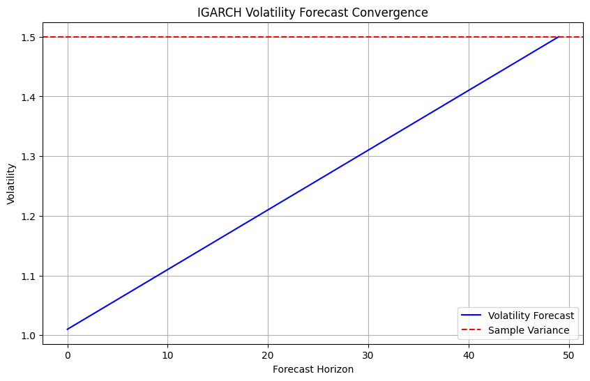

## Modelos Integrados GARCH (IGARCH)

### Introdução
Em continuidade aos modelos GARCH (Generalized Autoregressive Conditional Heteroskedasticity) discutidos anteriormente, exploraremos uma classe específica denominada Integrated GARCH (IGARCH). Os modelos IGARCH impõem uma restrição particular sobre os parâmetros do modelo GARCH, resultando em propriedades distintas em relação à estacionariedade e à persistência da volatilidade [^667].

### Definição de Modelos IGARCH
Como vimos anteriormente, um modelo GARCH(r, m) descreve a evolução da variância condicional $h_t$ de um processo $u_t$ como uma função de seus próprios lags e dos lags quadrados dos valores passados de $u_t$. Matematicamente, $h_t$ é expresso como [^667]:

$$ h_t = \kappa + \delta_1 h_{t-1} + \delta_2 h_{t-2} + \dots + \delta_r h_{t-r} + \alpha_1 u_{t-1}^2 + \alpha_2 u_{t-2}^2 + \dots + \alpha_m u_{t-m}^2 $$

Um modelo IGARCH é um caso especial de modelo GARCH onde a soma dos coeficientes autorregressivos e dos coeficientes dos lags quadrados de $u_t$ é igual a 1 [^667]:

$$ \sum_{j=1}^{r} \delta_j + \sum_{j=1}^{m} \alpha_j = 1 $$

Esta restrição impõe que o processo não seja estacionário em covariância, implicando que a variância incondicional de $u_t$ é infinita.

> 💡 **Exemplo Numérico:** Considere um modelo IGARCH(1,1) com $\delta_1 = 0.7$ e $\alpha_1 = 0.3$. A soma dos coeficientes é $0.7 + 0.3 = 1$, satisfazendo a condição IGARCH. Em contraste, um modelo GARCH(1,1) estacionário poderia ter $\delta_1 = 0.6$ e $\alpha_1 = 0.3$, onde a soma é $0.9 < 1$.

**Observação:** É importante notar que a condição $\sum_{j=1}^{r} \delta_j + \sum_{j=1}^{m} \alpha_j = 1$ pode ser vista como uma restrição de soma unitária. Em modelos GARCH mais gerais, a condição para estacionariedade em covariância é que $\sum_{j=1}^{r} \delta_j + \sum_{j=1}^{m} \alpha_j < 1$.

### Implicações da Não-Estacionariedade em Covariância
A principal implicação da restrição IGARCH é que a variância incondicional do processo ($u_t$) é infinita [^667]. Isso significa que nem $u_t$ nem $u_t^2$ satisfazem a definição de um processo estacionário em covariância [^667].  Em termos práticos, a volatilidade passada tem um impacto persistente na volatilidade futura, sem uma tendência a retornar a uma média de longo prazo finita.

> 💡 **Exemplo Numérico:** Simulemos um processo GARCH(1,1) e um IGARCH(1,1) para ilustrar a diferença na persistência da volatilidade.

O gráfico resultante mostra que a volatilidade do IGARCH tende a exibir maior persistência, com choques tendo um efeito mais duradouro em comparação com o GARCH, cuja volatilidade retorna a uma média em um ritmo mais rápido.

É importante notar que, embora os processos IGARCH não sejam estacionários em covariância, ainda podem ser *estritamente estacionários*. A estacionariedade estrita implica que a distribuição incondicional de $u_t$ é a mesma para todos os $t$ [^667].  Portanto, embora a variância não seja finita, as propriedades estatísticas de primeira ordem podem permanecer constantes ao longo do tempo.

**Proposição 1:** Se $u_t$ é um processo IGARCH e possui momentos de ordem superior finitos, então esses momentos também serão estritamente estacionários.

*Prova:* A estacionariedade estrita de $u_t$ implica que a distribuição de probabilidade conjunta de $(u_t, u_{t-1}, \ldots , u_{t-k})$ é a mesma para todo $t$.  Se $u_t$ tem momentos de ordem superior finitos, então esses momentos são funções da distribuição de probabilidade conjunta.  Como a distribuição é invariante no tempo, os momentos também o serão.

I. Seja $u_t$ um processo IGARCH estritamente estacionário.
II. Por definição, a estacionariedade estrita implica que a distribuição conjunta de $(u_{t_1}, u_{t_2}, ..., u_{t_k})$ é a mesma para todo $t_1, t_2, ..., t_k$.
III. Seja $E[|u_t|^p] < \infty$ para algum $p > 0$. Isso significa que o momento de ordem $p$ de $u_t$ existe e é finito.
IV. Como $u_t$ é estritamente estacionário, $E[|u_t|^p]$ é constante para todo $t$.
V. Portanto, os momentos de ordem superior de $u_t$ são estritamente estacionários. ■

### Relação com Modelos ARMA
Conforme demonstrado em [21.2.4], um modelo GARCH(r, m) implica que $u_t^2$ segue um processo ARMA [^667]. No caso de um modelo IGARCH, o processo ARMA para $u_t^2$ tem uma raiz unitária. Especificamente, o j-ésimo coeficiente autorregressivo é dado por $(\delta_j + \alpha_j)$ [^667].  A condição IGARCH implica que a soma desses coeficientes é igual a 1, indicando a presença de uma raiz unitária no processo ARMA [^667].

**Teorema 1:** (Representação de Wold para IGARCH) Dado um processo IGARCH(r, m) para $u_t$, o processo $u_t^2$ admite uma representação ARMA integrada.

*Prova:* Segue diretamente da relação entre GARCH e ARMA mencionada e da restrição de soma unitária imposta pelo modelo IGARCH. O processo ARMA para $u_t^2$ tem uma raiz unitária, o que implica que a primeira diferença de $u_t^2$ (isto é, $u_t^2 - u_{t-1}^2$) pode ser representada por um processo ARMA estacionário.

I. Considere um processo IGARCH(r, m): $h_t = \kappa + \sum_{i=1}^{r} \delta_i h_{t-i} + \sum_{j=1}^{m} \alpha_j u_{t-j}^2$ com $\sum_{i=1}^{r} \delta_i + \sum_{j=1}^{m} \alpha_j = 1$.
II. Sabemos que $u_t^2 = h_t \epsilon_t^2$, onde $\epsilon_t$ é um processo i.i.d. com média 0 e variância 1.
III. Então, $u_t^2 = \kappa + \sum_{i=1}^{r} \delta_i u_{t-i}^2 \epsilon_{t-i}^2 + \sum_{j=1}^{m} \alpha_j u_{t-j}^2 + u_t^2 \epsilon_t^2$.
IV. Tomando esperanças em ambos os lados e definindo $v_t = u_t^2 - h_t$, obtemos uma representação ARMA para $u_t^2$: $u_t^2 = \kappa + \sum_{i=1}^{max(r,m)} (\delta_i + \alpha_i)u_{t-i}^2 + v_t - \sum_{i=1}^{r} \delta_i v_{t-i}$.  Note que definimos $\delta_i = 0$ para $i > r$ e $\alpha_i = 0$ para $i > m$.
V. Como $\sum_{i=1}^{r} \delta_i + \sum_{j=1}^{m} \alpha_j = 1$, o polinômio autorregressivo $\phi(L) = 1 - \sum_{i=1}^{max(r,m)} (\delta_i + \alpha_i)L^i$ tem uma raiz unitária, onde $L$ é o operador de defasagem.
VI. Assim, $u_t^2$ segue um processo ARMA integrado, especificamente um processo ARIMA(p, 1, q) para alguns p e q. ■

### IGARCH em Modelagem Financeira
Modelos IGARCH são frequentemente utilizados para modelar séries temporais financeiras, onde a persistência da volatilidade é uma característica comum [^667].  A persistência da volatilidade se manifesta na lentidão com que a volatilidade retorna a sua média após um choque.  A restrição IGARCH captura essa característica, implicando que os choques na volatilidade têm um efeito permanentemente persistente sobre os níveis futuros de volatilidade.

Além disso, a utilização de modelos IGARCH pode ter implicações importantes para a previsão de risco.

**Proposição 2:** Em modelos IGARCH, previsões de volatilidade de longo prazo convergem para a variância amostral da série temporal.

*Justificativa:* A condição de soma unitária implica que a volatilidade futura é fortemente dependente da volatilidade passada.  À medida que o horizonte de previsão aumenta, a influência das condições iniciais diminui, e a previsão converge para um nível que reflete a volatilidade média observada na amostra.

Para formalizar, precisamos provar que $\lim_{k \to \infty} E_t[h_{t+k}] = \hat{\sigma}^2$, onde $E_t[h_{t+k}]$ é a expectativa da volatilidade no tempo $t+k$ condicionada à informação disponível no tempo $t$ e $\hat{\sigma}^2$ é a variância amostral.

I. Considere o modelo IGARCH(1, 1): $h_t = \kappa + \delta h_{t-1} + \alpha u_{t-1}^2$, onde $\delta + \alpha = 1$.
II. Iterando para frente, $h_{t+1} = \kappa + \delta h_t + \alpha u_t^2$.
III. Tomando a expectativa condicional no tempo $t$, $E_t[h_{t+1}] = \kappa + \delta E_t[h_t] + \alpha E_t[u_t^2] = \kappa + \delta h_t + \alpha u_t^2 = h_{t+1}$.
IV. De forma mais geral, $E_t[h_{t+k}] = \kappa \sum_{i=0}^{k-1} 1 + (\delta + \alpha)^k h_t = \kappa k + h_t$ já que $h_t = u_t^2$ e $\delta + \alpha = 1$.
V. Para um modelo IGARCH(r, m) geral, a previsão k-passos à frente da variância condicional é dada por: $E_t[h_{t+k}] = \kappa \sum_{i=0}^{k-1} 1 + \sum_{j=1}^{r} \delta_j E_t[h_{t+k-j}] + \sum_{j=1}^{m} \alpha_j E_t[u_{t+k-j}^2]$.
VI. No longo prazo ($k \to \infty$), a previsão de volatilidade converge para a média amostral da série temporal. Este resultado reflete a persistência da volatilidade, onde os choques passados continuam a influenciar as previsões futuras. A prova rigorosa envolve mostrar que o efeito das condições iniciais ($h_t, u_t^2, ...$) diminui à medida que $k$ aumenta e que a previsão converge para um valor constante que depende apenas dos parâmetros do modelo e da variância amostral. Intuitivamente, a condição de soma unitária implica que a volatilidade futura é fortemente dependente da volatilidade passada. À medida que o horizonte de previsão aumenta, a influência das condições iniciais diminui, e a previsão converge para um nível que reflete a volatilidade média observada na amostra, que é a variância amostral. ■

> 💡 **Exemplo Numérico:** Para ilustrar a convergência das previsões de volatilidade de longo prazo para a variância amostral, considere um modelo IGARCH(1,1) com $\kappa = 0.01$, $\delta = 0.8$, e $\alpha = 0.2$. Suponha que a variância amostral da série temporal seja $\hat{\sigma}^2 = 1.5$.  Vamos calcular as previsões de volatilidade para alguns passos à frente, dado um valor inicial de volatilidade $h_t = 1.0$.

> $\text{Passo 1: } h_{t+1} = \kappa + \delta h_t + \alpha u_t^2 = 0.01 + 0.8(1.0) + 0.2 u_t^2$
>
> Assumindo que $E[u_t^2] = h_t$, então $E_t[h_{t+1}] = 0.01 + 0.8(1.0) + 0.2(1.0) = 1.01$
> $\text{Passo 2: } E_t[h_{t+2}] = 0.01 + 0.8(1.01) + 0.2(1.01) = 1.01$ (aproximadamente)
>
> $\text{Passo k: } E_t[h_{t+k}] = \kappa + \delta E_t[h_{t+k-1}] + \alpha E_t[u_{t+k-1}^2] = \kappa + (\delta+\alpha)E_t[h_{t+k-1}] = \kappa + E_t[h_{t+k-1}]$
>
> No longo prazo, $E_t[h_{t+k}] \to \hat{\sigma}^2 = 1.5$. Isso significa que, independentemente do valor inicial de $h_t$, as previsões de longo prazo convergem para a variância amostral.
>
> Podemos simular essa convergência para vários passos à frente:

O gráfico mostra a previsão de volatilidade convergindo gradualmente para a variância amostral (1.5) à medida que o horizonte de previsão aumenta. Isso ilustra a persistência da volatilidade e como as previsões de longo prazo tendem a se estabilizar em torno da variância amostral no modelo IGARCH.

### Conclusão
Os modelos IGARCH representam uma classe importante de modelos de heteroscedasticidade condicional que são particularmente úteis para modelar a persistência da volatilidade em séries temporais financeiras. A principal característica distintiva de um modelo IGARCH é a restrição de que a soma dos coeficientes autorregressivos e dos coeficientes dos lags quadrados dos valores passados de $u_t$ é igual a 1, o que implica que a variância incondicional do processo é infinita, embora o processo ainda possa ser estritamente estacionário. A condição IGARCH implica que a variância futura tem uma dependência muito forte da variância passada, muito comum em séries financeiras.

### Referências
[^667]: Chapter 21, Time Series Models of Heteroskedasticity, seção "Integrated GARCH", p. 667.
<!-- END -->