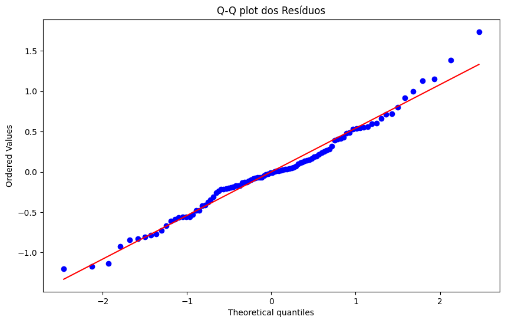

## Estimação de Modelos EGARCH via Máxima Verossimilhança

### Introdução
Este capítulo detalha o processo de estimação de modelos EGARCH por meio do método de Máxima Verossimilhança (MLE), com ênfase na especificação da densidade para a inovação $v_t$ [^660]. Particularmente, exploraremos o uso da distribuição generalizada de erro (GED) normalizada, uma escolha flexível que acomoda diferentes graus de caudas pesadas nos resíduos [^668]. A seguir, apresentaremos a função de log-verossimilhança e discutiremos aspectos práticos da maximização.

### Conceitos Fundamentais
Como discutido anteriormente, os modelos EGARCH, modelam o logaritmo da variância condicional, permitindo a captura de efeitos assimétricos e garantindo a positividade da variância condicional [^668]. A estimação dos parâmetros do modelo EGARCH, tipicamente, é realizada através do método de Máxima Verossimilhança (MLE) [^660].

O método de Máxima Verossimilhança envolve a maximização da função de verossimilhança (ou, equivalentemente, a função de log-verossimilhança) em relação aos parâmetros do modelo. Para construir a função de verossimilhança, é necessário especificar a distribuição condicional da variável de interesse (no nosso caso, a série temporal $y_t$) dado o histórico passado e a variância condicional $h_t$ [^660].

Em geral, assumimos que a distribuição condicional de $y_t$ dado o histórico passado é da forma:

$$
y_t | \mathcal{F}_{t-1} \sim f(y_t | h_t, \theta)
$$

Onde:

*   $\mathcal{F}_{t-1}$ representa o conjunto de informações disponíveis até o tempo $t-1$.
*   $h_t$ é a variância condicional no tempo $t$, modelada pelo EGARCH.
*   $\theta$ representa o vetor de parâmetros do modelo.

A função de verossimilhança é então dada pelo produto das densidades condicionais:

$$
L(\theta | y_1, \dots, y_T) = \prod_{t=1}^T f(y_t | h_t, \theta)
$$

E a função de log-verossimilhança é:

$$
\mathcal{L}(\theta | y_1, \dots, y_T) = \sum_{t=1}^T \log f(y_t | h_t, \theta)
$$

Para maximizar a função de log-verossimilhança, é necessário especificar uma forma funcional para a densidade condicional $f(y_t | h_t, \theta)$. Uma escolha comum é assumir que a inovação $v_t$ (onde $y_t = \sqrt{h_t} v_t$) segue uma distribuição Normal padrão [^660]. No entanto, como discutido anteriormente, séries temporais financeiras frequentemente exibem caudas mais pesadas do que as permitidas pela distribuição Normal. Para acomodar este comportamento, é comum especificar uma distribuição com caudas mais pesadas para $v_t$, como a distribuição *t* de Student generalizada [^662] ou a distribuição de erro generalizada (GED) [^668].

> 💡 **Exemplo Numérico:** Suponha que temos uma série temporal de 1000 retornos diários de um índice de ações. Assumimos que o modelo correto é um EGARCH(1,1) e que os retornos, condicional à informação passada, são normalmente distribuídos. Então, para cada dia $t$, calculamos a variância condicional $h_t$ baseada no modelo EGARCH(1,1) e os parâmetros atuais. A função de log-verossimilhança para o dia $t$ é então $\log f(y_t | h_t, \theta) = -\frac{1}{2} \log(2\pi h_t) - \frac{y_t^2}{2h_t}$. Somamos estes valores de todos os 1000 dias para obter a função de log-verossimilhança total que será maximizada.

Antes de prosseguirmos para a Distribuição de Erro Generalizada (GED), convém estabelecer um resultado geral sobre a consistência do estimador de máxima verossimilhança.

**Teorema 1** (Consistência do Estimador de Máxima Verossimilhança):
Sob certas condições de regularidade, o estimador de máxima verossimilhança $\hat{\theta}$ converge em probabilidade para o verdadeiro valor do parâmetro $\theta_0$ quando o tamanho da amostra $T$ tende ao infinito, ou seja, $\hat{\theta} \xrightarrow{p} \theta_0$ quando $T \rightarrow \infty$.

*Condições de Regularidade:* As condições de regularidade tipicamente incluem a identificabilidade do modelo, a diferenciabilidade da função de log-verossimilhança e a existência de momentos finitos. A verificação dessas condições é fundamental para garantir a validade assintótica da inferência baseada em MLE.

> 💡 **Exemplo Numérico:** Considere uma simulação simples onde geramos dados de um modelo EGARCH(1,1) com parâmetros conhecidos. Repetimos o processo de estimação MLE com diferentes tamanhos de amostra (e.g., T = 100, 500, 1000). Observaremos que, à medida que T aumenta, as estimativas dos parâmetros do modelo convergem para os verdadeiros valores utilizados na simulação. Isso ilustra a consistência do estimador MLE.

### Distribuição de Erro Generalizada (GED)
A distribuição de erro generalizada (GED), também conhecida como distribuição de potência exponencial, é uma família de distribuições de probabilidade simétricas que inclui a distribuição Normal (Gaussiana) e a distribuição de Laplace como casos especiais. A GED é caracterizada por um parâmetro de forma, $\nu$, que controla a espessura das caudas [^668].

A função densidade de probabilidade (pdf) da GED é dada por [^668]:

$$
f(v_t) = \frac{\nu \exp[-(1/2) |v_t/\lambda|^\nu]}{\lambda 2^{1+1/\nu} \Gamma(1/\nu)}
$$

Onde:

*   $\Gamma(\cdot)$ é a função gama.
*   $\nu > 0$ é o parâmetro de forma (tail-thickness parameter).
*   $\lambda = \left[ \frac{2^{-2/\nu} \Gamma(1/\nu)}{\Gamma(3/\nu)} \right]^{1/2}$ é um fator de escala que garante que a distribuição tenha variância unitária.

#### Propriedades da GED
*   **Cauda Pesada:** O parâmetro $\nu$ controla a espessura das caudas da distribuição. Para $\nu < 2$, a GED tem caudas mais pesadas do que a distribuição Normal. Para $\nu > 2$, a GED tem caudas mais finas do que a distribuição Normal. Quando $\nu = 2$, a GED se torna a distribuição Normal.
*   **Normalização:** O fator de escala $\lambda$ garante que a distribuição tenha variância unitária, o que é importante para a estimação do modelo EGARCH.
*   **Simetria:** A GED é uma distribuição simétrica em torno de zero.

> 💡 **Exemplo Numérico:** Se $\nu = 1$, a GED torna-se a distribuição de Laplace, que tem caudas mais pesadas que a Normal. Se $\nu = 2$, a GED é a distribuição Normal. Se $\nu = 3$, a GED tem caudas mais leves que a Normal. O parâmetro $\lambda$ ajusta-se para garantir que a variância seja sempre 1. Por exemplo, se $\nu=1$, $\lambda = 1/\sqrt{2}$. Se $\nu=2$, $\lambda = 1$.

Para aplicar a GED no contexto da estimação do modelo EGARCH, é necessário garantir que a distribuição tenha média zero e variância unitária. A normalização garante a variância unitária, e a simetria garante a média zero.

**Proposição 1** (Momentos da GED):
A distribuição GED com parâmetro de forma $\nu$ tem média zero e variância unitária. Além disso, seus momentos de ordem superior podem ser expressos em termos da função Gama. Em particular, a curtose da GED é dada por:

$$
Kurtosis = \frac{\Gamma(5/\nu)\Gamma(1/\nu)}{\Gamma(3/\nu)^2} - 3
$$

*Demonstração:*
A demonstração envolve o cálculo dos momentos usando a integral da função densidade da GED. A média é trivialmente zero devido à simetria. A variância é imposta como unitária pela escolha do fator de escala $\lambda$. O cálculo da curtose envolve a avaliação da integral $\int_{-\infty}^{\infty} v^4 f(v) dv$, que pode ser expressa em termos de funções Gama.

> 💡 **Exemplo Numérico:** Se $\nu = 4$, então a curtose da GED é calculada como $Kurtosis = \frac{\Gamma(5/4)\Gamma(1/4)}{\Gamma(3/4)^2} - 3 \approx -0.417$. Este valor indica que a GED com $\nu = 4$ é platicúrtica (caudas mais leves) em relação à distribuição Normal (curtose = 0). Se $\nu = 1.5$, então $Kurtosis = \frac{\Gamma(5/1.5)\Gamma(1/1.5)}{\Gamma(3/1.5)^2} - 3 \approx 3.35$. Este valor indica que a GED com $\nu = 1.5$ é leptocúrtica (caudas mais pesadas) em relação à distribuição Normal.

#### Função de Log-Verossimilhança com GED
Se assumirmos que a inovação $v_t$ segue uma distribuição GED, a função de log-verossimilhança condicional é dada por:

$$
\mathcal{L}(\theta | y_1, \dots, y_T) = \sum_{t=1}^T \log \left[ \frac{\nu \exp[-(1/2) |v_t/\lambda|^\nu]}{\lambda 2^{1+1/\nu} \Gamma(1/\nu)} \right]
$$

Simplificando a expressão, obtemos:

$$
\mathcal{L}(\theta | y_1, \dots, y_T) = \sum_{t=1}^T \left[ \log \nu - \frac{1}{2} \left| \frac{y_t}{\lambda \sqrt{h_t}} \right|^\nu - \log \lambda - \log 2 - \frac{1}{\nu} \log 2 - \log \Gamma \left( \frac{1}{\nu} \right) \right]
$$

Onde $v_t = \frac{y_t}{\sqrt{h_t}}$, e $h_t$ é determinado pela equação do modelo EGARCH. O vetor de parâmetros $\theta$ inclui os parâmetros do modelo EGARCH ($\kappa$, $\beta_i$, $\alpha_j$, $\theta$) e o parâmetro de forma da GED ($\nu$).

> 💡 **Exemplo Numérico:** Suponha que $y_t = 0.01$, $h_t = 0.0004$ (variância condicional), $\nu = 1.5$ e os parâmetros do EGARCH já estão estimados. Primeiro, calculamos $v_t = \frac{0.01}{\sqrt{0.0004}} = 0.5$. Então, $\lambda = \left[ \frac{2^{-2/1.5} \Gamma(1/1.5)}{\Gamma(3/1.5)} \right]^{1/2} \approx 0.75$. A contribuição de este ponto de dado para a função de log-verossimilhança é:
>
> $\log(1.5) - \frac{1}{2} \left| \frac{0.01}{0.75 \sqrt{0.0004}} \right|^{1.5} - \log(0.75) - \log(2) - \frac{1}{1.5} \log(2) - \log \Gamma \left( \frac{1}{1.5} \right) \approx -2.34$
>
> Este valor é calculado para cada observação na série temporal e, em seguida, somado para obter a função de log-verossimilhança total.

Para fins de inferência, é útil obter as condições de primeira ordem da função de log-verossimilhança.

**Proposição 2** (Condições de Primeira Ordem):
As condições de primeira ordem para a maximização da função de log-verossimilhança com GED são obtidas derivando $\mathcal{L}(\theta | y_1, \dots, y_T)$ em relação a cada parâmetro em $\theta$ e igualando a zero.  Essas condições definem as equações que devem ser satisfeitas no ponto de máximo.

*Observação:*
A obtenção das condições de primeira ordem é um passo crucial na estimação via MLE. Em geral, as equações resultantes não têm solução analítica, o que justifica o uso de métodos numéricos de otimização.

> 💡 **Exemplo Numérico:** Para encontrar as condições de primeira ordem, precisamos calcular as derivadas parciais de $\mathcal{L}$ em relação a cada parâmetro do EGARCH (e.g., $\kappa$, $\beta_1$, $\alpha_1$, $\theta$) e em relação ao parâmetro de forma da GED, $\nu$. Por exemplo, a derivada de $\mathcal{L}$ em relação a $\nu$ é:
>
> $\frac{\partial \mathcal{L}}{\partial \nu} = \sum_{t=1}^T \left[ \frac{1}{\nu} + \frac{1}{2} \left| \frac{y_t}{\lambda \sqrt{h_t}} \right|^\nu \log \left| \frac{y_t}{\lambda \sqrt{h_t}} \right| - \frac{\lambda'}{\lambda} - \frac{1}{\nu^2} \log 2 + \frac{1}{\nu^2} \Psi\left(\frac{1}{\nu}\right) \right]$,
>
> onde $\Psi(\cdot)$ é a função digamma (derivada logarítmica da função gama). Igualamos esta derivada a zero e resolvemos numericamente para $\nu$. Procedimentos semelhantes são feitos para os outros parâmetros.

#### Maximização da Função de Log-Verossimilhança
A estimação dos parâmetros do modelo EGARCH com GED envolve a maximização da função de log-verossimilhança $\mathcal{L}(\theta | y_1, \dots, y_T)$ em relação ao vetor de parâmetros $\theta$. Esta maximização geralmente é realizada usando algoritmos de otimização numérica [^661], tais como:

*   **BFGS (Broyden–Fletcher–Goldfarb–Shanno):** Um algoritmo de otimização quase-Newton que aproxima a matriz Hessiana para encontrar a direção de busca.
*   **Nelder-Mead:** Um método simplex que não requer o cálculo de derivadas e é adequado para funções não suaves.
*   **Algoritmos de Gradiente:** Algoritmos que usam o gradiente da função de log-verossimilhança para encontrar o ponto de máximo.

É importante notar que a escolha do algoritmo de otimização pode afetar significativamente a eficiência e a precisão da estimação. Além disso, é crucial verificar se a solução encontrada pelo algoritmo de otimização corresponde a um máximo global e não a um máximo local.

**Lema 1** (Convergência dos Algoritmos de Otimização): A convergência de algoritmos de otimização numérica depende da suavidade da função objetivo (neste caso, a função de log-verossimilhança) e da escolha dos parâmetros do algoritmo. Algoritmos como BFGS exibem convergência superlinear sob condições de suavidade e convexidade local.

> 💡 **Exemplo Numérico:** Suponha que, após 100 iterações do algoritmo BFGS, a diferença entre a função de log-verossimilhança na iteração atual e na iteração anterior é menor que $10^{-6}$. Isto pode ser usado como um critério de convergência. No entanto, é importante verificar se a Hessiana da função de log-verossimilhança é definida negativa no ponto de convergência para garantir que encontramos um máximo local (ou global) e não um ponto de sela.

Para a estimação do modelo EGARCH com GED, podemos usar o seguinte procedimento:

1.  Especificar o modelo EGARCH(r, m) e a distribuição GED para a inovação $v_t$.
2.  Construir a função de log-verossimilhança $\mathcal{L}(\theta | y_1, \dots, y_T)$.
3.  Escolher um algoritmo de otimização numérica e fornecer chutes iniciais para os parâmetros.
4.  Maximizar a função de log-verossimilhança em relação aos parâmetros $\theta$ usando o algoritmo de otimização escolhido.
5.  Verificar a convergência do algoritmo e a validade da solução encontrada.
6.  Realizar testes de diagnóstico para verificar a adequação do modelo.

> 💡 **Exemplo Numérico:** Suponha que temos uma série temporal de retornos de ações e queremos estimar um modelo EGARCH(1,1) com distribuição GED. Podemos implementar o seguinte código em Python usando a biblioteca `scipy.optimize` para a otimização numérica:

Este código ilustra como a função de log-verossimilhança com GED é construída e otimizada para obter as estimativas dos parâmetros. A função `scipy.special.gamma` é usada para calcular a função gama.

### Aspectos Práticos da Maximização
A maximização da função de log-verossimilhança em modelos EGARCH pode ser um processo computacionalmente intensivo e desafiador [^661]. Aqui estão alguns aspectos práticos a serem considerados:

*   **Chutes Iniciais:** A escolha dos chutes iniciais para os parâmetros pode afetar significativamente a convergência do algoritmo de otimização. É recomendável experimentar diferentes conjuntos de chutes iniciais para garantir que a solução encontrada corresponda a um máximo global.
*   **Algoritmo de Otimização:** Diferentes algoritmos de otimização podem ter diferentes propriedades de convergência e eficiência. É importante escolher um algoritmo adequado para o problema em questão e ajustar os parâmetros do algoritmo para obter um desempenho ideal.
*   **Restrições:** Em alguns casos, pode ser necessário impor restrições nos parâmetros para garantir que a solução encontrada seja válida. Por exemplo, podemos restringir o parâmetro $\nu$ da GED para ser maior que zero.
*   **Testes de Diagnóstico:** Após a estimação dos parâmetros, é importante realizar testes de diagnóstico para verificar a adequação do modelo. Isso pode incluir a análise dos resíduos para verificar se eles são independentes e identicamente distribuídos, e a realização de testes de especificação para verificar se o modelo captura adequadamente as características dos dados.

> 💡 **Exemplo Numérico:** Se os chutes iniciais para os parâmetros do EGARCH(1,1) forem próximos de zero (e.g., [0.001, 0.01, 0.001, 0.001, 2]), o algoritmo de otimização pode convergir para um mínimo local onde a variância condicional é quase constante. Para evitar isso, podemos usar chutes iniciais baseados em estatísticas descritivas dos dados (e.g., usar a variância amostral como um chute inicial para o nível da variância condicional).

Além dos testes de diagnóstico mencionados, é crucial avaliar a significância estatística dos parâmetros estimados.

**Teorema 2** (Inferência Assintótica): Sob as condições de regularidade do Teorema 1, o estimador de máxima verossimilhança $\hat{\theta}$ é assintoticamente normal, ou seja:
$$\sqrt{T}(\hat{\theta} - \theta_0) \xrightarrow{d} N(0, I(\theta_0)^{-1})$$
onde $I(\theta_0)$ é a matriz de informação de Fisher avaliada no verdadeiro valor do parâmetro $\theta_0$.

*Demonstração:*

I. Seja $L(\theta)$ a função de verossimilhança e $\ell(\theta) = \log L(\theta)$ a função de log-verossimilhança.

II. Expanda $\frac{\partial \ell(\hat{\theta})}{\partial \theta}$ em torno do verdadeiro valor $\theta_0$ usando uma expansão de Taylor de primeira ordem:

$$\frac{\partial \ell(\hat{\theta})}{\partial \theta} = \frac{\partial \ell(\theta_0)}{\partial \theta} + \frac{\partial^2 \ell(\theta^*)}{\partial \theta \partial \theta'} (\hat{\theta} - \theta_0)$$

Onde $\theta^*$ está entre $\hat{\theta}$ e $\theta_0$.

III. Como $\hat{\theta}$ é o estimador de máxima verossimilhança, $\frac{\partial \ell(\hat{\theta})}{\partial \theta} = 0$.  Rearranjando a equação:

$$0 = \frac{\partial \ell(\theta_0)}{\partial \theta} + \frac{\partial^2 \ell(\theta^*)}{\partial \theta \partial \theta'} (\hat{\theta} - \theta_0)$$

IV. Multiplique por $\frac{1}{\sqrt{T}}$:

$$0 = \frac{1}{\sqrt{T}} \frac{\partial \ell(\theta_0)}{\partial \theta} + \frac{1}{T} \frac{\partial^2 \ell(\theta^*)}{\partial \theta \partial \theta'} \sqrt{T}(\hat{\theta} - \theta_0)$$

V. Pela Lei dos Grandes Números, $-\frac{1}{T} \frac{\partial^2 \ell(\theta^*)}{\partial \theta \partial \theta'}$ converge para a matriz de informação de Fisher $I(\theta_0)$ quando $T \to \infty$. Pelo Teorema do Limite Central, $\frac{1}{\sqrt{T}} \frac{\partial \ell(\theta_0)}{\partial \theta} \xrightarrow{d} N(0, I(\theta_0))$.

VI. Portanto,

$$0 = N(0, I(\theta_0)) - I(\theta_0) \sqrt{T}(\hat{\theta} - \theta_0)$$

VII. Rearranjando e multiplicando por $I(\theta_0)^{-1}$:

$$\sqrt{T}(\hat{\theta} - \theta_0) \xrightarrow{d} N(0, I(\theta_0)^{-1})$$

■

*Implicações:*
Este resultado permite construir intervalos de confiança assintóticos para os parâmetros e realizar testes de hipóteses sobre seus valores. A matriz de informação de Fisher pode ser estimada pela Hessiana da função de log-verossimilhança avaliada em $\hat{\theta}$.

> 💡 **Exemplo Numérico:** Suponha que estimamos um modelo EGARCH(1,1) com GED e obtemos $\hat{\theta} = [0.01, 0.9, 0.1, -0.05, 2.0]$ como estimativas dos parâmetros. Após calcular (numericamente) a matriz Hessiana da função de log-verossimilhança e invertê-la para obter uma estimativa da matriz de covariância, encontramos que o erro padrão associado à estimativa de $\beta_1$ (o coeficiente de persistência) é 0.05. Então, um intervalo de confiança de 95% para $\beta_1$ é [0.9 - 1.96*0.05, 0.9 + 1.96*0.05] = [0.802, 0.998]. Se 1 estivesse dentro deste intervalo, não poderíamos rejeitar a hipótese nula de que a série temporal é não estacionária.

### Conclusão
A estimação de modelos EGARCH via máxima verossimilhança com GED oferece uma abordagem flexível e poderosa para modelar a heteroscedasticidade condicional em séries temporais financeiras [^668]. A escolha da distribuição GED permite capturar diferentes graus de caudas pesadas nos resíduos, o que é importante para modelar as características empíricas de muitas séries temporais financeiras. No entanto, a estimação dos parâmetros requer cuidado e atenção, e é importante considerar os aspectos práticos da maximização da função de log-verossimilhança.

### Referências
[^660]: Página 660.
[^661]: Página 661.
[^662]: Página 662.
[^668]: Página 668.
<!-- END -->