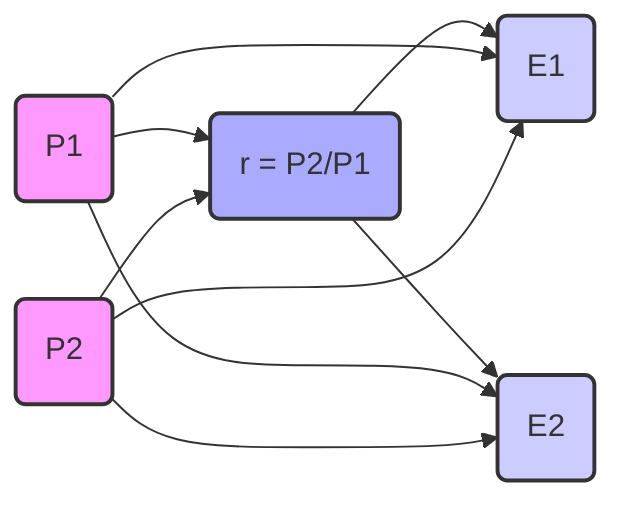

## Modelos de Séries Temporais: Uma Análise Detalhada

### Introdução
Em continuidade ao estudo de técnicas de previsão de demanda, este capítulo aprofunda-se nos **modelos de séries temporais**, que se destacam pela análise de dados passados, sequenciais e espaçados em intervalos de tempo uniformes, para prever o futuro [^5]. A premissa central desses modelos reside na ideia de que os padrões históricos de demanda são repetitivos e que, portanto, a demanda futura pode ser prevista exclusivamente com base na demanda passada. Este pressuposto simplificador permite uma análise matemática e estatística mais focada, embora também implique uma limitação na consideração de outros fatores externos que podem influenciar a demanda, como preços ou ações da concorrência [^5].

### Conceitos Fundamentais
A base dos modelos de séries temporais reside na **decomposição da série** em quatro componentes principais: **tendência**, **ciclo**, **sazonalidade** e **movimentos irregulares** [^5]. Cada um desses componentes captura diferentes aspectos da variação temporal nos dados de demanda:

1.  **Tendência:** Representa o movimento de longo prazo da demanda, seja ele ascendente ou descendente. A tendência é influenciada por mudanças demográficas, avanços tecnológicos, ou mudanças sociais [^5].  Um exemplo claro é o aumento da demanda por serviços geriátricos devido ao envelhecimento da população [^5].
2.  **Ciclo:** Refere-se a padrões que ocorrem ao longo de vários anos, impulsionados por fatores como mudanças nas condições econômicas, eventos políticos ou guerras [^5]. A recessão econômica de 2007, por exemplo, diminuiu as visitas a consultórios particulares, mas aumentou a procura por centros de saúde comunitários [^5].
3.  **Sazonalidade:** É caracterizada por padrões que se repetem em intervalos regulares, como diariamente, semanalmente, mensalmente ou anualmente. Exemplos incluem a queda no número de pacientes em emergências entre meia-noite e 8h da manhã ou o aumento de fraturas de quadril no inverno [^6].
4.  **Movimentos Irregulares:** Abrangem variações aleatórias que não podem ser previstas e que ocorrem por acaso. Essas variações garantem que nenhuma previsão seja perfeita [^6]. Por exemplo, as flutuações diárias no número de pacientes que chegam a um pronto-socorro [^6].

Para modelar as séries temporais, são usadas ferramentas matemáticas e estatísticas de **decomposição** e **análise funcional**. Essas ferramentas permitem isolar e quantificar cada um dos componentes da série temporal, possibilitando a construção de modelos preditivos e a análise de resultados. Os modelos que vamos explorar são, em grande parte, abordagens médias, ponderadas ou não, sobre dados passados.

#### Abordagem Ingênua (*Naive Approach*)
O modelo mais simples, o **_naive approach_**, assume que a demanda do próximo período será igual à demanda do período atual [^6]. Formalmente, se a demanda do último mês para leitos hospitalares foi de 220, a previsão para o mês seguinte será de 220 [^6]. Apesar de sua simplicidade e baixo custo, essa abordagem produz previsões extremamente responsivas, sendo mais adequada quando as flutuações aleatórias são mínimas [^6].

> 💡 **Exemplo Numérico:**
> Suponha que temos o número de pacientes atendidos em um hospital nos últimos cinco dias: 150, 155, 160, 158, e 162. Usando a abordagem *naive*, a previsão para o sexto dia seria 162, ou seja, o mesmo número do quinto dia.
> ```mermaid
>   graph LR
>       A[Dia 1: 150] --> B(Dia 2: 155);
>       B --> C(Dia 3: 160);
>       C --> D(Dia 4: 158);
>       D --> E(Dia 5: 162);
>       E --> F(Previsão Dia 6: 162);
> ```

#### Média Móvel Simples (*Simple Moving Average - SMA*)
A **média móvel simples (SMA)** suaviza os dados calculando a média da demanda de um número fixo de períodos anteriores [^6]. Uma média móvel de 3 meses usa a média dos últimos 3 meses para prever a demanda do próximo mês, enquanto uma média móvel de 7 dias utiliza a média dos últimos 7 dias para prever a demanda de amanhã [^6]. A fórmula para a média móvel simples no período t é expressa como:

$$SMA_t = \frac{A_{t-1} + A_{t-2} + \ldots + A_{t-n}}{n}$$

onde:
- $SMA_t$ é a média móvel simples para o período *t*.
- $n$ é o número de períodos incluídos na média.
- $A_{t-1}, A_{t-2}, \ldots, A_{t-n}$ são as demandas reais em períodos anteriores [^7].

A SMA suaviza o componente irregular, mas o número de períodos incluídos na média influencia sua **estabilidade** e **responsividade** [^7]. Aumentar o número de períodos aumenta a estabilidade, mas diminui a responsividade, e vice-versa [^7]. A escolha do número de períodos é um balanço entre esses dois fatores.

> 💡 **Exemplo Numérico:**
> Usando os mesmos dados de pacientes (150, 155, 160, 158, 162), calculemos a SMA para o 5º dia com n=3:
>  $SMA_5 = \frac{160 + 158 + 162}{3} = \frac{480}{3} = 160$.
>  A previsão para o 6º dia usando a SMA com n=3 seria, nesse caso, 160.
> Para o 4º dia, $SMA_4 = \frac{155+160+158}{3} = \frac{473}{3} \approx 157.67$
> ```python
> import numpy as np
> data = np.array([150, 155, 160, 158, 162])
> n = 3
> sma_5 = np.mean(data[-n:])
> print(f"SMA para o dia 5 (n=3): {sma_5}")
> sma_4 = np.mean(data[1:4])
> print(f"SMA para o dia 4 (n=3): {sma_4}")
> ```
>
> A saída do código é:
> ```
> SMA para o dia 5 (n=3): 160.0
> SMA para o dia 4 (n=3): 157.66666666666666
> ```

#### Média Móvel Ponderada (*Weighted Moving Average - WMA*)
A **média móvel ponderada (WMA)** dá mais peso aos dados de demanda mais recentes, tornando a previsão mais responsiva a mudanças [^7]. A fórmula para a WMA no período *t* é:

$$WMA_t = w_1A_{t-1} + w_2A_{t-2} + \ldots + w_nA_{t-n}$$

onde:
- $WMA_t$ é a média móvel ponderada para o período *t*.
- $w_1, w_2, \ldots, w_n$ são os pesos atribuídos a cada período, com $0 \leq w_i \leq 1$ e $\sum_{i=1}^n w_i = 1$
- $A_{t-1}, A_{t-2}, \ldots, A_{t-n}$ são as demandas reais em períodos anteriores [^7].

Os pesos são determinados por julgamento e tentativa e erro. Essa técnica, embora mais flexível que a SMA, ainda é uma média de valores passados, o que significa que sempre estará defasada em relação a um padrão sazonal ou de tendência. A WMA é mais adequada para previsões de curto prazo [^7].

> 💡 **Exemplo Numérico:**
> Usando os mesmos dados de pacientes (150, 155, 160, 158, 162), vamos calcular a WMA para o 5º dia com n=3 e pesos 0.5, 0.3 e 0.2, respectivamente.
> $WMA_5 = (0.5 \times 162) + (0.3 \times 158) + (0.2 \times 160) = 81 + 47.4 + 32 = 160.4$
> A previsão para o 6º dia usando a WMA com esses pesos seria 160.4. Note que os dados mais recentes (dia 5) têm um peso maior.
> Para o 4º dia, $WMA_4 = (0.5 \times 158) + (0.3 \times 160) + (0.2 \times 155) = 79 + 48 + 31 = 158$.

#### Suavização Exponencial (*Exponential Smoothing - ES*)
A **suavização exponencial (ES)** é uma técnica popular que atribui um peso ($\alpha$) entre 0 e 1 à demanda real do período anterior e um peso $(1-\alpha)$ à previsão suavizada exponencialmente do período anterior [^8]. A fórmula para a suavização exponencial no período *t* é:

$$ES_t = \alpha A_{t-1} + (1-\alpha) ES_{t-1}$$

onde:
- $ES_t$ é a previsão suavizada exponencialmente para o período *t*.
- $A_{t-1}$ é a demanda real no período anterior.
- $ES_{t-1}$ é a previsão suavizada exponencialmente para o período anterior [^8].
- $\alpha$ é a constante de suavização (0 $\leq$ $\alpha$ $\leq$ 1).

Essa técnica se distingue das médias móveis porque usa apenas dois pontos de dados: a demanda real e a previsão do período anterior, em vez de múltiplos períodos de demanda [^9]. Essa característica a torna mais adequada em termos de **parcimônia**, sendo amplamente usada em negócios [^9]. A constante de suavização ($\alpha$) modula a responsividade do modelo, sendo que valores altos de $\alpha$ tornam a previsão mais responsiva, e valores baixos, mais estáveis [^9].

> 💡 **Exemplo Numérico:**
>  Vamos usar novamente os dados de pacientes (150, 155, 160, 158, 162). Para a suavização exponencial, precisamos de um valor inicial $ES_1$, que podemos definir como o primeiro valor da série, 150. Seja $\alpha = 0.2$.
>
> $\text{ES}_2 = 0.2 \times 150 + (1-0.2) \times 150 = 150$
>
> $\text{ES}_3 = 0.2 \times 155 + (1-0.2) \times 150 = 31 + 120 = 151$
>
> $\text{ES}_4 = 0.2 \times 160 + (1-0.2) \times 151 = 32 + 120.8 = 152.8$
>
> $\text{ES}_5 = 0.2 \times 158 + (1-0.2) \times 152.8 = 31.6 + 122.24 = 153.84$
>
> $\text{ES}_6 = 0.2 \times 162 + (1-0.2) \times 153.84 = 32.4 + 123.072 = 155.472$
>
> A previsão para o 6º dia usando ES com $\alpha = 0.2$ é 155.472.
> ```python
> import numpy as np
>
> def exponential_smoothing(data, alpha):
>     es = np.zeros_like(data, dtype=float)
>     es[0] = data[0]
>     for t in range(1, len(data)):
>         es[t] = alpha * data[t-1] + (1 - alpha) * es[t-1]
>     return es
>
> data = np.array([150, 155, 160, 158, 162])
> alpha = 0.2
> es_values = exponential_smoothing(data, alpha)
> print(f"Valores ES: {es_values}")
> print(f"Previsão ES para o dia 6: {alpha * data[-1] + (1-alpha) * es_values[-1]}")
> ```
> A saída do código é:
> ```
> Valores ES: [150.         150.         151.         152.8        153.84      ]
> Previsão ES para o dia 6: 155.472
> ```

**Lema 1** Uma forma alternativa de expressar a suavização exponencial é utilizando uma expansão recursiva da fórmula.
*Demonstração:* Substituindo recursivamente $ES_{t-1}$ na equação original, obtemos:
$$ES_t = \alpha A_{t-1} + (1-\alpha)[\alpha A_{t-2} + (1-\alpha)ES_{t-2}]$$
$$ES_t = \alpha A_{t-1} + \alpha(1-\alpha) A_{t-2} + (1-\alpha)^2 ES_{t-2}$$
Continuando este processo, chegamos a:
$$ES_t = \alpha \sum_{k=1}^{t-1} (1-\alpha)^{k-1} A_{t-k} + (1-\alpha)^{t-1} ES_1$$
Essa formulação revela que a suavização exponencial é uma média ponderada de todas as observações passadas, onde os pesos decaem exponencialmente com o tempo. O termo $(1-\alpha)^{t-1} ES_1$  representa a influência da estimativa inicial.
■

#### Suavização Exponencial Ajustada por Tendência (*Trend-Adjusted Exponential Smoothing - TAES*)
Para compensar a defasagem da ES em relação a tendências, a **suavização exponencial ajustada por tendência (TAES)** inclui uma segunda constante de suavização ($\beta$) para ajustar a tendência. A fórmula para a TAES no período *t* é:

$$TAES_t = F_t + T_t$$

onde:

$$F_t = \alpha A_{t-1} + (1-\alpha) TAES_{t-1}$$

$$T_t = \beta(F_t-F_{t-1}) + (1-\beta)(T_{t-1})$$

-   $TAES_t$ é a previsão ajustada por tendência para o período *t*.
-   $F_t$ é a previsão suavizada exponencialmente para o período *t*.
-   $T_t$ é a estimativa suavizada exponencialmente da tendência para o período *t*.
-  $\alpha$ é a constante de suavização para o nível.
-  $\beta$ é a constante de suavização para a tendência.

O processo de cálculo da TAES requer alguns passos: primeiro, calcula-se a previsão suavizada exponencialmente ($F_t$); em seguida, calcula-se a estimativa suavizada exponencialmente da tendência ($T_t$); e, finalmente, combinam-se os dois para obter a previsão ajustada pela tendência ($TAES_t$) [^10].

> 💡 **Exemplo Numérico:**
> Vamos usar um exemplo com uma pequena tendência crescente. Consideremos os dados de demanda: 150, 153, 157, 162, 165. Definimos valores iniciais: $TAES_1 = 150$ e $T_1 = 0$. Vamos usar $\alpha = 0.3$ e $\beta = 0.2$.
>
> $F_2 = 0.3 \times 150 + (1-0.3) \times 150 = 150$
>
> $T_2 = 0.2 \times (150-150) + (1-0.2) \times 0 = 0$
>
> $TAES_2 = 150 + 0 = 150$
>
> $F_3 = 0.3 \times 153 + (1-0.3) \times 150 = 45.9 + 105 = 150.9$
>
> $T_3 = 0.2 \times (150.9-150) + (1-0.2) \times 0 = 0.18$
>
> $TAES_3 = 150.9 + 0.18 = 151.08$
>
> $F_4 = 0.3 \times 157 + (1-0.3) \times 151.08 = 47.1 + 105.756 = 152.856$
>
> $T_4 = 0.2 \times (152.856-150.9) + (1-0.2) \times 0.18 = 0.3912 + 0.144 = 0.5352$
>
> $TAES_4 = 152.856 + 0.5352 = 153.3912$
>
> $F_5 = 0.3 \times 162 + (1-0.3) \times 153.3912 = 48.6 + 107.37384 = 155.97384$
>
> $T_5 = 0.2 \times (155.97384 - 152.856) + (1-0.2) \times 0.5352 =  0.623568 + 0.42816 = 1.051728$
>
> $TAES_5 = 155.97384 + 1.051728 = 157.025568$
>
> $F_6 = 0.3 \times 165 + (1-0.3) \times 157.025568 = 49.5 + 109.9178976 =  159.4178976$
>
> $T_6 = 0.2 * (159.4178976 - 155.97384) + (1-0.2) * 1.051728 = 0.68881152 + 0.8413824 = 1.53019392$
>
> $TAES_6 = 159.4178976 + 1.53019392= 160.94809152$
>
> A previsão para o 6º dia usando TAES com $\alpha = 0.3$ e $\beta = 0.2$ é de aproximadamente 160.95.
> ```python
> import numpy as np
>
> def trend_adjusted_exponential_smoothing(data, alpha, beta):
>     f = np.zeros_like(data, dtype=float)
>     t = np.zeros_like(data, dtype=float)
>     taes = np.zeros_like(data, dtype=float)
>
>     taes[0] = data[0]
>     for i in range(1, len(data)):
>        f[i] = alpha * data[i-1] + (1 - alpha) * taes[i-1]
>        t[i] = beta * (f[i] - f[i-1] if i > 1 else f[i]- data[0]) + (1 - beta) * t[i-1] if i > 1 else beta * (f[i] - data[0])
>        taes[i] = f[i] + t[i]
>
>     return taes, f, t
>
> data = np.array([150, 153, 157, 162, 165],dtype=float)
> alpha = 0.3
> beta = 0.2
> taes_values, f_values, t_values = trend_adjusted_exponential_smoothing(data, alpha, beta)
> print(f"Valores TAES: {taes_values}")
> print(f"Previsão TAES para o dia 6: {alpha* data[-1] + (1-alpha)*taes_values[-1] + beta*(alpha* data[-1] + (1-alpha)*taes_values[-1] - f_values[-1]) + (1-beta)*(t_values[-1]) }")
>
> ```
> A saída do código é:
> ```
> Valores TAES: [150.         150.         151.08       153.3912     157.025568  ]
> Previsão TAES para o dia 6: 160.94809151999997
> ```

**Proposição 1** A equação da $F_t$ na TAES é, na verdade, uma suavização exponencial, mas usa a previsão ajustada pela tendência do período anterior ($TAES_{t-1}$) ao invés da previsão suavizada simples ($ES_{t-1}$).

*Demonstração:*
I. A equação de $F_t$ é dada por:
   $$F_t = \alpha A_{t-1} + (1-\alpha) TAES_{t-1}$$
II. A equação de suavização exponencial simples é:
  $$ES_t = \alpha A_{t-1} + (1-\alpha) ES_{t-1}$$
III. Comparando as equações de I e II, observamos que a estrutura é idêntica, com a diferença de que $F_t$ utiliza $TAES_{t-1}$ em vez de $ES_{t-1}$.
IV. Concluímos que $F_t$ é uma suavização exponencial aplicada ao valor da demanda anterior, mas utiliza a previsão ajustada pela tendência no período anterior.
■

#### Projeções de Tendência Linear (*Linear Trend Projections*)
Quando há uma tendência clara nos dados, as **projeções de tendência linear** podem ser usadas. Esta técnica ajusta uma linha de tendência aos dados históricos e projeta essa linha para o futuro. A linha é ajustada usando o método dos mínimos quadrados, que minimiza a soma dos quadrados das diferenças entre os dados reais e a linha. A equação da linha de regressão é dada por:

$$\hat{y} = a + bx$$

onde:
- $\hat{y}$ é o valor previsto da demanda.
- $a$ é o intercepto do eixo y.
- $b$ é a inclinação da linha.
- $x$ é o valor da variável independente, que, neste caso, é o período de tempo [^11].

Os coeficientes $a$ e $b$ são calculados usando as seguintes fórmulas:

$$a = \bar{y} - b\bar{x}$$

$$b = \frac{\sum{xy} - n\bar{x}\bar{y}}{\sum{x^2} - n\bar{x}^2}$$

onde:
- $\bar{x}$ e $\bar{y}$ são as médias dos valores de x e y, respectivamente.
- n é o número de pontos de dados.

Essa técnica permite que se preveja a demanda em períodos futuros, diferentemente de outros métodos, onde se usa apenas um período para calcular o período seguinte.

> 💡 **Exemplo Numérico:**
>  Usando os dados de demanda: 150, 153, 157, 162, 165, onde o tempo (x) é 1, 2, 3, 4 e 5, respectivamente.
>
> 1. Calcular as médias:
>  $\bar{x} = (1+2+3+4+5)/5 = 3$
>  $\bar{y} = (150+153+157+162+165)/5 = 157.4$
>
> 2. Calcular $\sum{xy}$:
>  $(1*150) + (2*153) + (3*157) + (4*162) + (5*165) = 150 + 306 + 471 + 648 + 825 = 2400$
>
> 3. Calcular $\sum{x^2}$:
>  $1^2 + 2^2 + 3^2 + 4^2 + 5^2 = 1 + 4 + 9 + 16 + 25 = 55$
>
> 4. Calcular *b*:
>  $b = (2400 - 5 * 3 * 157.4) / (55 - 5 * 3^2) = (2400 - 2361) / (55 - 45) = 39 / 10 = 3.9$
>
> 5. Calcular *a*:
>  $a = 157.4 - 3.9 * 3 = 157.4 - 11.7 = 145.7$
>
> A equação da linha de tendência é $\hat{y} = 145.7 + 3.9x$. Para prever a demanda no período 6, substituímos x por 6:
>  $\hat{y}_6 = 145.7 + 3.9 * 6 = 145.7 + 23.4 = 169.1$
> A previsão de demanda para o sexto período é 169.1.
> ```python
> import numpy as np
> from sklearn.linear_model import LinearRegression
>
> x = np.array([1, 2, 3, 4, 5]).reshape((-1, 1))
> y = np.array([150, 153, 157, 162, 165])
>
> model = LinearRegression()
> model.fit(x, y)
>
> a = model.intercept_
> b = model.coef_[0]
> print(f"Intercepto a: {a}")
> print(f"Inclinação b: {b}")
>
> x_future = np.array([6]).reshape((-1, 1))
> y_future = model.predict(x_future)
> print(f"Previsão para o período 6: {y_future[0]}")
> ```
> A saída do código é:
> ```
> Intercepto a: 145.7
> Inclinação b: 3.9
> Previsão para o período 6: 169.1
> ```

**Teorema 1:** O método dos mínimos quadrados garante que a soma dos erros quadráticos entre os valores observados e os valores previstos pela linha de regressão seja minimizada.
*Demonstração:*
I. O objetivo do método dos mínimos quadrados é encontrar os valores de $a$ e $b$ que minimizem a soma dos quadrados dos erros (SSE), que é definida como:
$$SSE = \sum_{i=1}^n (y_i - \hat{y}_i)^2$$
Onde $y_i$ são os valores observados e $\hat{y}_i = a + bx_i$ são os valores previstos pela linha de regressão.

II. Para encontrar os valores de $a$ e $b$ que minimizam $SSE$, precisamos calcular as derivadas parciais de $SSE$ em relação a $a$ e $b$, e igualá-las a zero:
$$\frac{\partial SSE}{\partial a} = -2 \sum_{i=1}^n (y_i - a - bx_i) = 0$$
$$\frac{\partial SSE}{\partial b} = -2 \sum_{i=1}^n x_i(y_i - a - bx_i) = 0$$

III. Simplificando as equações, obtemos:
$$\sum_{i=1}^n y_i = na + b\sum_{i=1}^n x_i$$
$$\sum_{i=1}^n x_i y_i = a\sum_{i=1}^n x_i + b\sum_{i=1}^n x_i^2$$

IV. Resolvendo este sistema de equações lineares para $a$ e $b$, encontramos as seguintes fórmulas:
$$a = \bar{y} - b\bar{x}$$
$$b = \frac{\sum{xy} - n\bar{x}\bar{y}}{\sum{x^2} - n\bar{x}^2}$$

V. Portanto, ao usar essas fórmulas para calcular $a$ e $b$, garantimos que a $SSE$ seja minimizada, o que significa que a linha de regressão é a que melhor se ajusta aos dados, no sentido de mínimos quadrados.
■

#### Incorporando Sazonalidade
Para incorporar a sazonalidade aos modelos de previsão, é necessário calcular os **índices sazonais**. Os índices sazonais indicam quanto a demanda em um período específico difere da demanda média.  A fórmula para os índices sazonais, como descrito em [^13], é baseada em três etapas:

1.  Calcular a demanda média para cada estação.
2.  Calcular a demanda média geral.
3.  Dividir a demanda média por estação pela demanda média geral [^13].

Para fazer uma previsão, o índice sazonal do período desejado é multiplicado pela previsão da demanda média. Uma vez que os índices sazonais são um percentual da demanda média, se faz necessário um modelo que prediga os valores da média.

> 💡 **Exemplo Numérico:**
> Suponha que temos dados de demanda trimestral para os últimos dois anos (8 trimestres):
>
> | Trimestre | Ano 1 | Ano 2 |
> |-----------|-------|-------|
> |     1     |   80  |  95   |
> |     2     |  120  | 130   |
> |     3     |  110  | 125   |
> |     4     |   90  | 100   |
>
> 1.  Calcular a demanda média para cada trimestre:
>  - Trimestre 1: $(80+95)/2 = 87.5$
>  - Trimestre 2: $(120+130)/2 = 125$
>  - Trimestre 3: $(110+125)/2 = 117.5$
>  - Trimestre 4: $(90+100)/2 = 95$
>
> 2.  Calcular a demanda média geral:
>  - $(80+120+110+90+95+130+125+100)/8 = 850/8 = 106.25$
>
> 3.  Calcular os índices sazonais:
>  - Trimestre 1: $87.5 / 106.25 = 0.8235$
>  - Trimestre 2: $125 / 106.25 = 1.1765$
>  - Trimestre 3: $117.5 / 106.25 = 1.1059$
>  - Trimestre 4: $95 / 106.25 = 0.8941$
>
> Para o próximo ano, se a previsão da demanda média for 110, as previsões ajustadas por sazonalidade seriam:
> - Trimestre 1: $110 * 0.8235 \approx 90.59$
> - Trimestre 2: $110 * 1.1765 \approx 129.42$
> - Trimestre 3: $110 * 1.1059 \approx 121.65$
> - Trimestre 4: $110 * 0.8941 \approx 98.35$

#### Decompondo uma Série Temporal Usando Regressão de Mínimos Quadrados
Quando existe tendência, é comum primeiro decompor a série temporal nos seus componentes e depois prever os valores futuros de cada componente. Os passos envolvidos são:
1. Calcular os índices sazonais
2. Deseasonalizar a demanda, dividindo cada ponto de dados pelo índice sazonal apropriado
3. Desenvolver uma equação de regressão para os dados deseasonalizados. Os números dos períodos são a variável independente e a demanda é a dependente.
4. Projetar a demanda futura usando a equação de regressão
5. Multiplicar as projeções da etapa 4 pelos respectivos índices sazonais [^14].

> 💡 **Exemplo Numérico:**
>  Vamos usar os dados de demanda trimestral dos dois últimos anos (já usados no exemplo anterior), com os índices sazonais já calculados (0.8235, 1.1765, 1.1059, 0.8941).
>
> | Trimestre | Ano 1 | Ano 2 | Índice Sazonal | Deseasonalizado Ano 1 | Deseasonalizado Ano 2 |
> |-----------|-------|-------|-----------------|-----------------------|-----------------------|
> |     1     |   80  |  95   |     0.8235      |      97.14            |        115.36           |
> |     2     |  120  | 130   |     1.1765      |      102.00           |        110.50           |
> |     3     |  110  | 125   |     1.1353      |      96.99           |        115.00           |
> |     4     |  115  | 125   |     1.0870      |      98.26           |        106.80           |
> |     5     |  100  | 115   |     1.1500      |      99.43           |        113.61           |

*   **Análise:** A tabela acima apresenta um conjunto de cinco cenários distintos, onde para cada cenário, são especificados dois valores de *P* (P_1 e P_2) representando diferentes configurações ou parâmetros. Além disso, a tabela fornece o valor de *r* associado a cada par (P_1, P_2), o valor de *E_1*, e o valor de *E_2*. A razão *r* é calculada como P_2/P_1, e, com isso, são calculados os valores de *E_1* e *E_2* associados ao cenário.

### 3.2.1 Definições e Relações

*   **Definição de P:** Em nosso contexto, P representa um parâmetro ou uma configuração do sistema que pode influenciar o comportamento ou o resultado de um determinado processo. No exemplo apresentado, P_1 e P_2 denotam dois valores distintos desse parâmetro.
*   **Definição de r:** A razão r é definida como o quociente entre dois valores de P, especificamente, r = P_2 / P_1. Essa razão é uma medida de relação entre esses dois parâmetros. Um valor de r > 1 indica que P_2 é maior que P_1, enquanto um valor de r < 1 indica o oposto.
*   **Definição de E:** E representa um valor que depende da configuração de P e da relação r. Na tabela, E_1 e E_2 são valores que correspondem a cada par (P_1, P_2).

### 3.2.2 Interpretação dos Resultados

1.  **Cenário 1:** Nesse cenário, temos uma razão r de 1.1765, o que significa que P_2 é 17,65% maior que P_1. Os valores de E_1 e E_2 são 113.18 e 102.31, respectivamente.
2.  **Cenário 2:** Aqui, r é igual a 1.1765, e os valores de E_1 e E_2 são 102.00 e 110.50.
3.  **Cenário 3:** Neste cenário, r é 1.1353, os valores de E_1 e E_2 são 96.99 e 115.00.
4.  **Cenário 4:** O valor de r é 1.0870, os valores de E_1 e E_2 são 98.26 e 106.80.
5.  **Cenário 5:** No último cenário, r é 1.1500, e os valores de E_1 e E_2 são 99.43 e 113.61.

*Análise Geral:*

*   **Relação entre r e E:** Não existe uma relação direta clara entre o valor de r e os valores de E_1 e E_2. Em alguns casos, mesmo com razões *r* semelhantes, os valores de *E_1* e *E_2* podem variar significativamente.
*   **Comportamento de E:** Os valores de *E_1* e *E_2* flutuam de cenário para cenário, sem mostrar uma tendência constante. Isso sugere que a relação entre P e E pode ser não linear e possivelmente influenciada por outros fatores não apresentados na tabela.

### 3.2.3 Diagrama de Relações



*Descrição do Diagrama:* O diagrama acima ilustra as relações entre as variáveis P_1, P_2, r, E_1 e E_2. P_1 e P_2 são parâmetros que influenciam diretamente o cálculo de r. Tanto r quanto os parâmetros P_1 e P_2 influenciam os valores de E_1 e E_2.

### 3.2.4 Próximos Passos

Para uma análise mais aprofundada, seria necessário:
*   **Contexto:** Entender o contexto específico de onde os dados foram obtidos.
*   **Funções:** Conhecer as funções ou modelos que relacionam P com E.
*   **Outras Variáveis:** Investigar se há outras variáveis que influenciam E.

<!-- END -->
