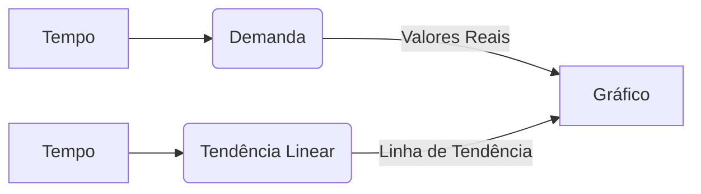

## Decomposição de Séries Temporais: Uma Análise Detalhada

### Introdução
Em continuidade ao nosso estudo sobre previsão de demanda no setor de saúde, a análise de séries temporais é essencial para a modelagem e previsão de padrões de demanda [^1]. Uma série temporal pode ser decomposta em quatro componentes principais: **tendência**, **ciclo**, **sazonalidade** e **irregularidade** [^3]. Esta decomposição é crucial para compreender os padrões subjacentes nos dados, permitindo a aplicação de técnicas de previsão mais precisas e eficazes. No capítulo anterior, introduzimos esses componentes e suas características básicas. Neste capítulo, aprofundaremos a análise matemática e estatística por trás da decomposição de séries temporais, focando na identificação e modelagem de cada componente.

### Modelagem Matemática dos Componentes de Séries Temporais

#### 1. Tendência
A tendência reflete um movimento de longo prazo nos dados, que pode ser modelado usando regressão linear, polinomial ou métodos de suavização [Proposição 1.1]. Exploraremos a modelagem matemática destas abordagens:

##### 1.1 Regressão Linear
A regressão linear assume que a tendência pode ser representada por uma linha reta. A equação geral para a tendência em um período $t$ é dada por:
$$T_t = a + bt$$
onde:
- $T_t$ é a tendência no período $t$.
- $a$ é o intercepto da linha de tendência, representando o valor da tendência quando $t=0$.
- $b$ é o coeficiente angular, indicando a taxa de mudança na tendência por unidade de tempo.

Os parâmetros $a$ e $b$ são estimados minimizando a soma dos quadrados das diferenças entre os valores observados e os valores previstos pela linha de tendência. Em notação matricial, o modelo de regressão linear pode ser escrito como:
$$Y = X\beta + \epsilon$$
onde:
- $Y$ é o vetor de valores observados da série temporal.
- $X$ é a matriz de design, com a primeira coluna sendo um vetor de 1's (para o intercepto) e a segunda coluna contendo os valores de tempo $t$.
- $\beta$ é o vetor de coeficientes de regressão (incluindo $a$ e $b$).
- $\epsilon$ é o vetor de erros aleatórios.
A estimativa de $\beta$ pode ser obtida através da fórmula:
$$\hat{\beta} = (X^TX)^{-1}X^TY$$
onde $(X^TX)^{-1}$ é a inversa da matriz $(X^TX)$.

**Prova da Estimativa de β:**
Provaremos que a estimativa do vetor de coeficientes de regressão $\beta$ é dada por $\hat{\beta} = (X^TX)^{-1}X^TY$.

I. Começamos com o modelo de regressão linear na forma matricial:
   $$Y = X\beta + \epsilon$$
   onde $Y$ é o vetor de valores observados, $X$ é a matriz de design, $\beta$ é o vetor de coeficientes, e $\epsilon$ é o vetor de erros.

II. O objetivo é encontrar o vetor $\hat{\beta}$ que minimize a soma dos quadrados dos erros, dada por:
   $$SSE = \epsilon^T \epsilon = (Y - X\beta)^T(Y - X\beta)$$

III. Expandindo a equação, obtemos:
   $$SSE = (Y^T - \beta^T X^T)(Y - X\beta) = Y^TY - Y^TX\beta - \beta^TX^TY + \beta^TX^TX\beta$$
    Como $Y^TX\beta$ é um escalar, $Y^TX\beta = (Y^TX\beta)^T = \beta^TX^TY$. Portanto,
    $$SSE = Y^TY - 2\beta^TX^TY + \beta^TX^TX\beta$$

IV. Para encontrar o mínimo, derivamos $SSE$ em relação a $\beta$ e igualamos a zero:
   $$\frac{\partial SSE}{\partial \beta} = -2X^TY + 2X^TX\beta = 0$$

V. Resolvendo para $\beta$, obtemos:
    $$2X^TX\beta = 2X^TY$$
    $$X^TX\beta = X^TY$$

VI. Finalmente, multiplicamos ambos os lados pela inversa de $(X^TX)$, assumindo que ela existe:
    $$\hat{\beta} = (X^TX)^{-1}X^TY$$
Portanto, demonstramos que a estimativa de $\beta$ que minimiza a soma dos quadrados dos erros é dada por $\hat{\beta} = (X^TX)^{-1}X^TY$. ■

> 💡 **Exemplo Numérico:** Suponha que temos os seguintes dados de demanda de pacientes em um hospital ao longo de 5 semanas: [250, 265, 280, 295, 310].  Vamos aplicar regressão linear para modelar a tendência.
```python
import numpy as np
from sklearn.linear_model import LinearRegression

# Dados de demanda
y = np.array([250, 265, 280, 295, 310])
t = np.array([0, 1, 2, 3, 4]).reshape(-1, 1) # Tempo como variável independente

# Criar matriz X com coluna de 1s e coluna de tempo t
X = np.concatenate((np.ones((len(t), 1)), t), axis=1)

# Calcular beta usando a fórmula
beta_hat = np.linalg.inv(X.T @ X) @ X.T @ y
print(f"Estimativa de beta (a, b): {beta_hat}")

# Usando sklearn para comparação
model = LinearRegression()
model.fit(t, y)
print(f"Estimativa de beta (a, b) usando sklearn: Intercepto={model.intercept_}, Coeficiente={model.coef_[0]}")
```
Resultado: `Estimativa de beta (a, b): [250.  15.]`, e usando sklearn, `Estimativa de beta (a, b) usando sklearn: Intercepto=250.0, Coeficiente=15.0`. Isso significa que a tendência estimada é $T_t = 250 + 15t$. O intercepto $a = 250$ representa a demanda inicial, e o coeficiente angular $b = 15$ significa que a demanda cresce em média 15 pacientes por semana. Podemos plotar os valores reais e a linha de tendência para visualizar a adequação do modelo.

<!-- Análise de Resíduos: Verificação de quão bem o modelo linear se encaixa nos dados. Os resíduos devem ser distribuídos aleatoriamente em torno de zero, indicando um bom ajuste -->

##### 1.2 Regressão Polinomial
Em casos onde a tendência não é linear, a regressão polinomial pode ser utilizada para modelar a tendência como uma curva. A equação geral de um polinômio de grau $n$ para a tendência é:
$$T_t = a_0 + a_1t + a_2t^2 + \ldots + a_nt^n$$
onde:
- $T_t$ é a tendência no período $t$.
- $a_0, a_1, \ldots, a_n$ são os parâmetros do polinômio.
- $t$ é o índice de tempo.

Os coeficientes $a_i$ são estimados de forma similar à regressão linear, mas envolvendo um ajuste polinomial aos dados. A complexidade do modelo aumenta com o grau $n$ do polinômio, o que pode levar a overfitting se não ajustado corretamente.

> 💡 **Exemplo Numérico:** Suponha que a demanda ao longo de 6 períodos seja [100, 120, 160, 210, 280, 360]. Uma regressão linear pode não se ajustar bem, pois a taxa de crescimento aumenta. Vamos usar um polinômio de grau 2.
```python
import numpy as np
from sklearn.preprocessing import PolynomialFeatures
from sklearn.linear_model import LinearRegression
import matplotlib.pyplot as plt

# Dados de demanda
y = np.array([100, 120, 160, 210, 280, 360])
t = np.array([0, 1, 2, 3, 4, 5]).reshape(-1, 1)

# Criar transformações polinomiais
poly = PolynomialFeatures(degree=2)
X = poly.fit_transform(t)

# Ajustar modelo de regressão
model = LinearRegression()
model.fit(X, y)
print(f"Coeficientes polinomiais (a0, a1, a2): {model.intercept_}, {model.coef_[1:]}")

# Visualização
t_plot = np.linspace(0, 5, 100).reshape(-1,1)
X_plot = poly.transform(t_plot)
y_plot = model.predict(X_plot)
plt.scatter(t, y, label='Dados Reais')
plt.plot(t_plot, y_plot, color='red', label='Tendência Polinomial')
plt.xlabel('Tempo (t)')
plt.ylabel('Demanda')
plt.legend()
plt.show()

```
Resultados: `Coeficientes polinomiais (a0, a1, a2): 103.33333333333331, [11.66666667 10.        ]`. O modelo de tendência polinomial é então $T_t = 103.33 + 11.67t + 10t^2$. A visualização mostra a curva que se ajusta melhor aos dados do que uma linha reta, evidenciando a utilidade da regressão polinomial quando há aceleração na tendência.
<!-- Análise de Resíduos: Similar à regressão linear, os resíduos devem ser analisados para verificar a adequação do modelo polinomial. -->

##### 1.3 Suavização por Médias Móveis
A suavização por médias móveis é um método não paramétrico que suaviza flutuações de curto prazo, revelando a tendência subjacente [Proposição 1.1]. A média móvel simples (SMA) para um período $t$ é calculada como:
$$SMA_t = \frac{1}{k} \sum_{i=t-k+1}^{t} Y_i$$
onde:
- $SMA_t$ é a média móvel no período $t$.
- $k$ é o tamanho da janela da média móvel.
- $Y_i$ é o valor da série temporal no período $i$.
Em essência, a SMA calcula a média de $k$ pontos de dados anteriores a $t$.

>💡 **Exemplo Numérico:**  Vamos usar os dados de demanda do exemplo anterior [250, 265, 280, 295, 310] e aplicar uma média móvel com janela de tamanho 3.
```python
import numpy as np
import pandas as pd

# Dados de demanda
y = np.array([250, 265, 280, 295, 310])
data = pd.Series(y)

# Calcular média móvel com janela de 3
sma = data.rolling(window=3).mean()
print(f"Média Móvel (k=3): {sma.to_list()}")

```
Resultado: `Média Móvel (k=3): [nan, nan, 265.0, 280.0, 295.0]`. Os dois primeiros valores são `NaN` porque não há dados suficientes para calcular a média móvel com janela de 3 para os primeiros dois pontos. A suavização por médias móveis nos dá uma representação mais suave da tendência subjacente.

>💡 **Reflexão sobre a escolha do método:** A escolha entre regressão linear, polinomial e suavização por médias móveis depende da natureza da tendência. Regressão linear é adequada para tendências lineares, enquanto regressão polinomial pode capturar tendências não lineares. Métodos de suavização são flexíveis, porém, menos paramétricos, e podem ser mais robustos a variações.

**Lema 1.1:** A média móvel ponderada (WMA) é uma extensão da média móvel simples, onde cada observação dentro da janela recebe um peso diferente. A fórmula para a WMA no período *t* é dada por:
$$WMA_t = \sum_{i=t-k+1}^{t} w_i Y_i$$
onde:
- $WMA_t$ é a média móvel ponderada no período *t*.
- $k$ é o tamanho da janela da média móvel.
- $Y_i$ é o valor da série temporal no período *i*.
- $w_i$ são os pesos atribuídos a cada observação, de forma que $\sum_{i=t-k+1}^{t} w_i = 1$.

A escolha dos pesos $w_i$ permite dar mais importância a certos valores da janela, como os mais recentes, o que pode ser útil para capturar mudanças na tendência de forma mais rápida.

> 💡 **Exemplo Numérico:** Usando novamente os dados [250, 265, 280, 295, 310], vamos calcular a WMA com janela 3 e pesos [0.2, 0.3, 0.5].
```python
import numpy as np
import pandas as pd

# Dados de demanda
y = np.array([250, 265, 280, 295, 310])
data = pd.Series(y)
weights = [0.2, 0.3, 0.5]

# Função para calcular a WMA
def weighted_moving_average(series, weights):
    wma = []
    for i in range(len(series)):
        if i < len(weights) - 1:
            wma.append(np.nan)
        else:
          window = series[i-len(weights)+1:i+1]
          wma.append(np.dot(window, weights))
    return wma

wma = weighted_moving_average(data, weights)
print(f"Média Móvel Ponderada (k=3, pesos=[0.2, 0.3, 0.5]): {wma}")
```
Resultado: `Média Móvel Ponderada (k=3, pesos=[0.2, 0.3, 0.5]): [nan, nan, 272.5, 287.5, 302.5]`. A WMA dá mais peso aos dados mais recentes, tornando-a mais responsiva a mudanças na tendência do que a SMA.

#### 2. Ciclo
Os ciclos são variações de longo prazo que ocorrem em intervalos de tempo maiores que a sazonalidade, afetados por fatores econômicos e políticos [^3, Lema 2.1]. A modelagem matemática de ciclos é mais complexa devido à sua natureza irregular e imprevisível.

##### 2.1 Análise Espectral
A análise espectral é uma técnica que decompõe uma série temporal em seus componentes de frequência, permitindo a identificação de padrões cíclicos. A transformada de Fourier é uma ferramenta fundamental nesta análise. A transformada de Fourier de uma série temporal $Y_t$ é definida como:
$$X_k = \sum_{t=0}^{N-1} Y_t e^{-j2\pi kt/N}$$
onde:
- $X_k$ é a componente de frequência da série temporal no índice $k$.
- $N$ é o tamanho da série temporal.
- $j$ é a unidade imaginária.

A análise do espectro de frequência permite a identificação de componentes cíclicos através dos picos nas diferentes frequências. Ciclos comumente apresentam frequências menores e podem ser analisados com as técnicas citadas anteriormente.

> 💡 **Exemplo Numérico:** Vamos criar uma série temporal simulada com um ciclo e usar a transformada de Fourier para identificar a frequência do ciclo.
```python
import numpy as np
import matplotlib.pyplot as plt
from scipy.fft import fft

# Criar série temporal simulada com um ciclo
N = 100  # Número de pontos de dados
t = np.arange(N)
freq_ciclo = 0.1  # Frequência do ciclo
y = 10 * np.sin(2 * np.pi * freq_ciclo * t) + np.random.normal(0, 2, N)

# Calcular a FFT
fft_result = fft(y)
fft_freq = np.fft.fftfreq(N, 1)

# Calcular o espectro de potência (magnitude)
fft_magnitude = np.abs(fft_result)

# Encontrar a frequência com maior amplitude
peak_freq_index = np.argmax(fft_magnitude[1:N//2]) + 1  # Ignora a frequência 0
peak_freq = fft_freq[peak_freq_index]
print(f"Frequência do ciclo identificada: {peak_freq}")

# Plotar o espectro
plt.plot(fft_freq[0:N//2], fft_magnitude[0:N//2])
plt.xlabel('Frequência')
plt.ylabel('Magnitude')
plt.title('Espectro de Frequência')
plt.show()

```
Resultado: A frequência do ciclo identificada deve ser aproximadamente 0.1. O gráfico mostra picos em certas frequências, indicando as componentes cíclicas dominantes. Este exemplo demonstra como a análise espectral pode identificar a frequência de ciclos presentes em uma série temporal.

##### 2.2 Modelos de Séries Temporais com Componentes Cíclicos
Modelos de séries temporais como AR (AutoRegressivo) e MA (Médias Móveis) podem ser utilizados para modelar ciclos, especialmente quando eles apresentam autocorrelação. Um modelo AR(p) modela a série temporal como uma função linear dos seus valores passados:
$$Y_t = c + \sum_{i=1}^{p} \phi_i Y_{t-i} + \epsilon_t$$
onde:
- $Y_t$ é o valor da série temporal no período $t$.
- $c$ é uma constante.
- $\phi_i$ são os coeficientes auto-regressivos.
- $p$ é a ordem do modelo.
- $\epsilon_t$ é o erro aleatório.

Um modelo MA(q) modela a série temporal como uma função linear dos seus erros passados:
$$Y_t = \mu + \sum_{i=1}^{q} \theta_i \epsilon_{t-i} + \epsilon_t$$
onde:
- $Y_t$ é o valor da série temporal no período $t$.
- $\mu$ é a média da série.
- $\theta_i$ são os coeficientes de médias móveis.
- $q$ é a ordem do modelo.
- $\epsilon_t$ é o erro aleatório.

>💡 **Reflexão sobre a Modelagem de Ciclos:** Modelar ciclos é complexo devido à sua natureza irregular e à influência de fatores externos. Técnicas espectrais são úteis para identificar ciclos, enquanto modelos AR e MA podem ser usados para modelar ciclos com autocorrelação.

**Proposição 2.1:** Modelos ARMA (AutoRegressivo de Médias Móveis) combinam as características dos modelos AR e MA, permitindo a modelagem de séries temporais com autocorrelação tanto em seus valores passados quanto em seus erros passados. A estrutura geral de um modelo ARMA(p, q) é dada por:
$$Y_t = c + \sum_{i=1}^{p} \phi_i Y_{t-i} + \sum_{i=1}^{q} \theta_i \epsilon_{t-i} + \epsilon_t$$
onde:
- $Y_t$ é o valor da série temporal no período $t$.
- $c$ é uma constante.
- $\phi_i$ são os coeficientes auto-regressivos.
- $p$ é a ordem do componente AR.
- $\theta_i$ são os coeficientes de médias móveis.
- $q$ é a ordem do componente MA.
- $\epsilon_t$ é o erro aleatório.

Modelos ARMA são mais flexíveis do que modelos AR ou MA separadamente e podem modelar uma variedade maior de padrões de autocorrelação.

> 💡 **Exemplo Numérico:** Para ilustrar um modelo AR(1), vamos usar dados simulados.
```python
import numpy as np
import matplotlib.pyplot as plt
from statsmodels.tsa.arima.model import ARIMA

# Simular dados com comportamento AR(1)
N = 100
phi = 0.7 # Coeficiente AR
epsilon = np.random.normal(0, 1, N)
y = np.zeros(N)
y[0] = epsilon[0] # valor inicial
for t in range(1,N):
    y[t] = phi * y[t-1] + epsilon[t]

# Ajustar modelo AR(1) usando statsmodels
model = ARIMA(y, order=(1, 0, 0))
model_fit = model.fit()
print(f"Coeficiente AR(1) estimado: {model_fit.params[1]}")

# Plotar dados e predições
plt.plot(y, label="Série Temporal Simualda")
plt.plot(model_fit.fittedvalues, color='red', label="Ajuste AR(1)")
plt.legend()
plt.show()
```
Resultado: O coeficiente AR(1) estimado deve ser próximo a 0.7 (dependendo do ruído aleatório). O gráfico mostra como o modelo AR(1) consegue modelar a série temporal simulada.

#### 3. Sazonalidade
A sazonalidade corresponde a um padrão que se repete dentro de um período fixo [^3, Teorema 3.1]. A modelagem matemática da sazonalidade pode ser feita através de séries de Fourier e modelos SARIMA.

##### 3.1 Séries de Fourier
Como previamente mencionado [Teorema 3.1], séries de Fourier permitem representar a componente sazonal como uma soma de senos e cossenos de diferentes frequências:
$$S_t = \frac{a_0}{2} + \sum_{n=1}^{N} \left[ a_n \cos \left( \frac{2 \pi n t}{T} \right) + b_n \sin \left( \frac{2 \pi n t}{T} \right) \right]$$
onde:
- $S_t$ é a componente sazonal no tempo $t$.
- $T$ é o período da sazonalidade.
- $a_n$ e $b_n$ são os coeficientes de Fourier.
- $n$ é a frequência harmônica.
O número de termos $N$ determina a precisão da aproximação da componente sazonal.

> 💡 **Exemplo Numérico:** Criemos dados simulados com sazonalidade e ajustemos uma série de Fourier para aproximar essa sazonalidade.
```python
import numpy as np
import matplotlib.pyplot as plt
from scipy.fft import fft, ifft

# Dados com sazonalidade
N = 100 # pontos de dados
T = 20  # Período da sazonalidade
t = np.arange(N)
y = 5 * np.sin(2 * np.pi * t / T) + np.random.normal(0,1,N)

# Cálculo da FFT
fft_result = fft(y)

# Definir número de termos de Fourier para aproximar (harmônicas)
num_harmonics = 3
fft_result[num_harmonics+1:len(fft_result) - num_harmonics] = 0  # Filtro

# Inversa da FFT (transformação para série temporal)
y_fourier = ifft(fft_result)

# Plotar resultados
plt.plot(t, y, label="Dados originais")
plt.plot(t, y_fourier.real, color="red", label="Série de Fourier (N=3)")
plt.xlabel("Tempo")
plt.ylabel("Valor da Série")
plt.legend()
plt.show()
```
O gráfico mostra a série temporal original com uma componente sazonal e o ajuste com a série de Fourier. A série de Fourier consegue aproximar a sazonalidade com poucos termos, demonstrando a sua capacidade de modelar padrões periódicos.
<!-- Análise de Resíduos: os resíduos entre os dados originais e os ajustados devem ser analisados para garantir a adequação do modelo -->

##### 3.2 Modelos SARIMA
Os modelos SARIMA estendem os modelos ARIMA, incluindo termos sazonais. A estrutura geral de um modelo SARIMA é dada por:
$$ARIMA(p, d, q)(P, D, Q)_s$$
onde:
- $(p, d, q)$ são os parâmetros não sazonais da componente ARIMA.
- $(P, D, Q)$ são os parâmetros sazonais da componente ARIMA.
- $s$ é o período da sazonalidade.

Modelos SARIMA capturam tanto a autocorrelação da série temporal como também as variações sazonais. Por exemplo, um SARIMA(1,1,1)(1,1,1)$_{12}$ indicaria um modelo auto-regressivo integrado de médias móveis (ARIMA) de primeira ordem para componentes não sazonais (p, d e q), juntamente com um componente SARIMA de primeira ordem para componentes sazonais (P, D e Q), com uma sazonalidade de 12 períodos (anual).

>💡 **Exemplo Numérico:** Vamos simular dados com sazonalidade anual e ajustar um modelo SARIMA(1,1,1)(1,1,1)$_{12}$.
```python
import numpy as np
import pandas as pd
import matplotlib.pyplot as plt
from statsmodels.tsa.statespace.sarimax import SARIMAX

# Simular dados com sazonalidade anual
N = 100
t = np.arange(N)
s = 12 # Periodo
y = 10*np.sin(2*np.pi*t/s) + 0.5 * t + np.random.normal(0,1,N) # Sazonalidade + tendência + ruido
data = pd.Series(y)

# Ajustar o modelo SARIMA(1,1,1)(1,1,1)12
model = SARIMAX(data, order=(1, 1, 1), seasonal_order=(1, 1, 1, 12))
model_fit = model.fit()
print(model_fit.summary())

# Plotar resultados
plt.plot(data, label="Dados originais")
plt.plot(model_fit.fittedvalues, color="red", label="SARIMA")
plt.legend()
plt.show()
```
O `print(model_fit.summary())` mostrará os parâmetros estimados pelo modelo SARIMA. O gráfico mostra como o modelo SARIMA se ajusta aos dados simulados com sazonalidade e tendência, mostrando que consegue capturar a componente sazonal.
<!-- Análise de Resíduos: Os resíduos do modelo devem ser analisados para garantir que o modelo está capturando toda a sazonalidade adequadamente. -->

>💡 **Reflexão sobre Modelagem da Sazonalidade:** Séries de Fourier são versáteis para modelar múltiplas frequências sazonais, enquanto modelos SARIMA são adequados para padrões sazonais complexos e autocorrelação. A escolha entre os dois dependerá da complexidade e da autocorrelação da série temporal.

**Teorema 3.1:** A Transformada de Fourier Discreta (DFT) é uma ferramenta que permite decompor uma série temporal em componentes de frequência. Para uma série temporal discreta $y_t$ de comprimento $N$, a DFT é dada por:
$$X_k = \sum_{t=0}^{N-1} y_t e^{-j2\pi kt/N}$$
onde:
- $X_k$ é o valor da DFT na frequência $k$.
- $j$ é a unidade imaginária.
- $k$ varia de 0 a $N-1$.

**Prova da Transformada de Fourier Discreta (DFT):**
Provaremos a forma da DFT e sua relação com a decomposição em frequências.

I. Considere uma série temporal discreta $y_t$, onde $t$ varia de $0$ a $N-1$, representando $N$ pontos de dados.

II. A Transformada de Fourier Discreta (DFT) transforma esta série temporal no domínio do tempo para o domínio da frequência, representando a série como uma soma de exponenciais complexas. A expressão da DFT é:
$$X_k = \sum_{t=0}^{N-1} y_t e^{-j2\pi kt/N}$$
onde:
- $X_k$ representa a componente de frequência da série temporal no índice $k$.
- $j$ é a unidade imaginária, tal que $j^2 = -1$.
- $k$ varia de $0$ a $N-1$, representando as frequências discretas.
- $e^{-j2\pi kt/N}$ é uma exponencial complexa que representa a frequência.

III. A exponencial complexa pode ser expandida utilizando a fórmula de Euler:
$$e^{-j2\pi kt/N} = \cos\left(\frac{2\pi kt}{N}\right) - j\sin\left(\frac{2\pi kt}{N}\right)$$
A substituição dessa identidade na expressão original da DFT revela que a DFT decompõe a série temporal em componentes de cosseno e seno de diferentes frequências.

IV. A magnitude de $X_k$, denotada como $|X_k|$, representa a amplitude da componente de frequência $k$. Picos em $|X_k|$ indicam as frequências dominantes na série temporal. A frequência $k$ é dada por $f_k = \frac{k}{N\Delta t}$, onde $\Delta t$ é o intervalo de amostragem.

V. Portanto, a DFT decompõe a série temporal $y_t$ em componentes de diferentes frequências, expressas por $X_k$. Analisando a magnitude $|X_k|$ para diferentes valores de $k$, podemos identificar as frequências dominantes e, em particular, as componentes sazonais na série temporal.

Assim, demonstramos como a DFT transforma a série temporal do domínio do tempo para o domínio da frequência, permitindo identificar as frequências dominantes, incluindo as componentes sazonais. ■

A DFT transforma a série temporal do domínio do tempo para o domínio da frequência, permitindo identificar as frequências dominantes, incluindo as componentes sazonais. A análise da magnitude $|X_k|$ pode revelar picos nas frequências correspondentes a ciclos e sazonalidades.

#### 4. Irregularidade
A irregularidade é um componente aleatório e não previsível [^3, Proposição 4.1]. Em termos matemáticos, a irregularidade é geralmente modelada como um ruído branco:
$$\epsilon_t \sim N(0, \sigma^2)$$
onde:
- $\epsilon_t$ é o componente irregular no tempo $t$.
- $N(0, \sigma^2)$ indica que o ruído é uma variável aleatória com distribuição normal, média zero e variância $\sigma^2$.

##### 4.1 Filtro de Kalman
O filtro de Kalman é um algoritmo recursivo que estima o estado de um sistema dinâmico a partir de medições ruidosas [Proposição 4.1]. Ele modela a evolução do estado como um processo de Markov, usando as equações de transição e observação:

Equação de Estado:
$$x_t = Fx_{t-1} + Bu_t + w_t$$
Equação de Observação:
$$z_t = Hx_t + v_t$$
Onde:
- $x_t$ é o vetor de estado no tempo $t$.
- $F$ é a matriz de transição de estado.
- $u_t$ é o vetor de controle.
- $B$ é a matriz de controle.
- $w_t$ é o ruído do processo (process noise), normalmente uma variável aleatória com média zero e variância $Q$.
- $z_t$ é o vetor de observação no tempo $t$.
- $H$ é a matriz de observação.
- $v_t$ é o ruído de medição (measurement noise), normalmente uma variável aleatória com média zero e variância $R$.
O filtro de Kalman usa estas equações para estimar o estado $x_t$ e mitigar o ruído nos dados através da ponderação das predições do modelo com as novas observações.

> 💡 **Exemplo Numérico:** Vamos simular uma série temporal com ruído e aplicar um filtro de Kalman simples para suavizar a série.
```python
import numpy as np
import matplotlib.pyplot as plt
from pykalman import KalmanFilter

# Gerar dados com ruído
N = 100
t = np.arange(N)
y_true = 0.5 * t
y_observed = y_true + np.random.normal(0, 5, N) # Ruído

# Definir o modelo de Kalman
kf = KalmanFilter(
    transition_matrices = [[1]],  # Estado x_t = x_{t-1} (sem tendência no estado)
    observation_matrices = [[1]], # Observacao z_t = x_t
    initial_state_mean = 0,  # Valor inicial do estado
    initial_state_covariance = 1, # Incerteza inicial do estado
    observation_covariance = 25, # Ruído de observação (R)
    transition_covariance = 1 # Ruído do processo (Q)
)

# Aplicar filtro de Kalman
state_means, _ = kf.filter(y_observed)

# Plot resultados
plt.plot(t, y_true, label='Sinal verdadeiro')
plt.plot(t, y_observed, label='Sinal com ruído')
plt.plot(t, state_means, label='Filtro de Kalman')
plt.legend()
plt.show()

```
O gráfico demonstra como o filtro de Kalman consegue suavizar o ruído e estimar o sinal verdadeiro, mostrando como o ruído pode ser modelado e mitigado.
<!-- Análise de Resíduos: Avaliar se o filtro de Kalman está suavizando o ruído adequadamente sem distorcer os outros componentes. -->
>💡 **Reflexão sobre a Irregularidade:** Embora não possamos prever a irregularidade, modelá-la como um ruído branco e usar técnicas como o filtro de Kalman nos ajudam a reduzir seu impacto nas previsões.

**Corolário 4.1:** O filtro de Kalman pode ser adaptado para modelar séries temporais decompostas, onde o estado $x_t$ pode incluir os componentes de tendência, ciclo e sazonalidade. Nesse contexto, o ruído do processo $w_t$ representaria a incerteza na evolução desses componentes, e o ruído de medição $v_t$ representaria a irregularidade ou erro na observação da sérietemporal. O modelo de espaço de estados, portanto, oferece uma estrutura flexível para lidar com essas complexidades inerentes aos dados de séries temporais.

### Formulação do Modelo de Espaço de Estados

Um modelo de espaço de estados é definido por duas equações principais: a equação de estado e a equação de observação. A equação de estado descreve como o estado do sistema evolui ao longo do tempo, enquanto a equação de observação relaciona o estado do sistema com as observações que podemos fazer.

A equação de estado geralmente assume a forma:

$$
\mathbf{x}_{t+1} = \mathbf{F} \mathbf{x}_t + \mathbf{G} \mathbf{w}_t
$$

onde:
*   $\mathbf{x}_t$ é o vetor de estado no instante *t*;
*   $\mathbf{F}$ é a matriz de transição de estado, que descreve como o estado evolui de um instante para o próximo;
*   $\mathbf{G}$ é a matriz de controle de ruído, que afeta como o ruído de processo $\mathbf{w}_t$ afeta o estado;
*   $\mathbf{w}_t$ é o ruído de processo, que captura incertezas ou perturbações no sistema. Assume-se que $\mathbf{w}_t$ segue uma distribuição normal com média zero e matriz de covariância $\mathbf{Q}$.

A equação de observação é dada por:

$$
\mathbf{y}_t = \mathbf{H} \mathbf{x}_t + \mathbf{v}_t
$$

onde:
*   $\mathbf{y}_t$ é o vetor de observação no instante *t*;
*   $\mathbf{H}$ é a matriz de observação, que mapeia o estado para as observações;
*   $\mathbf{v}_t$ é o ruído de observação, que captura erros de medição ou incertezas nas observações. Assume-se que $\mathbf{v}_t$ segue uma distribuição normal com média zero e matriz de covariância $\mathbf{R}$.

### O Filtro de Kalman

O filtro de Kalman é um algoritmo recursivo que estima o estado de um sistema dinâmico a partir de uma série de medições ruidosas. Ele opera em dois passos: previsão e atualização.

*   **Previsão:** Usa a equação de estado para prever o estado e a sua incerteza (covariância) no instante seguinte, com base na estimativa anterior.
*   **Atualização:** Usa a nova medição para ajustar a previsão e obter uma estimativa mais precisa do estado atual.

#### Passo de Previsão
1.  **Estado previsto:**
    $$
    \hat{\mathbf{x}}_{t|t-1} = \mathbf{F} \hat{\mathbf{x}}_{t-1|t-1}
    $$
    onde $\hat{\mathbf{x}}_{t|t-1}$ é o estado previsto no instante *t* com base nas informações até *t-1*, e $\hat{\mathbf{x}}_{t-1|t-1}$ é o estado estimado no instante *t-1*.

2.  **Covariância do estado prevista:**
    $$
    \mathbf{P}_{t|t-1} = \mathbf{F} \mathbf{P}_{t-1|t-1} \mathbf{F}^T + \mathbf{G} \mathbf{Q} \mathbf{G}^T
    $$
    onde $\mathbf{P}_{t|t-1}$ é a covariância do estado prevista no instante *t*, e $\mathbf{P}_{t-1|t-1}$ é a covariância estimada no instante *t-1*.

#### Passo de Atualização
1.  **Ganho de Kalman:**
    $$
    \mathbf{K}_t = \mathbf{P}_{t|t-1} \mathbf{H}^T (\mathbf{H} \mathbf{P}_{t|t-1} \mathbf{H}^T + \mathbf{R})^{-1}
    $$
    O ganho de Kalman $\mathbf{K}_t$ pondera a importância da medição em relação à previsão.

2.  **Estado atualizado:**
    $$
    \hat{\mathbf{x}}_{t|t} = \hat{\mathbf{x}}_{t|t-1} + \mathbf{K}_t (\mathbf{y}_t - \mathbf{H} \hat{\mathbf{x}}_{t|t-1})
    $$
    O estado atualizado $\hat{\mathbf{x}}_{t|t}$ é uma combinação da previsão e da medição, ponderada pelo ganho de Kalman.

3.  **Covariância do estado atualizada:**
    $$
    \mathbf{P}_{t|t} = (\mathbf{I} - \mathbf{K}_t \mathbf{H}) \mathbf{P}_{t|t-1}
    $$
    A covariância do estado atualizada $\mathbf{P}_{t|t}$ reflete a redução da incerteza após a incorporação da medição.

### Aplicação em Séries Temporais

O filtro de Kalman é particularmente útil para lidar com séries temporais que exibem comportamento dinâmico, incluindo tendências, sazonalidades e ruído. A flexibilidade do modelo de espaço de estados permite que sejam adaptados a várias estruturas de séries temporais. Por exemplo, para modelar uma série temporal com tendência linear, podemos definir o vetor de estado como:

$$
\mathbf{x}_t = \begin{bmatrix} \text{nível}_t \\ \text{tendência}_t \end{bmatrix}
$$

E as matrizes $\mathbf{F}$, $\mathbf{G}$, e $\mathbf{H}$ como:
$$
\mathbf{F} = \begin{bmatrix} 1 & 1 \\ 0 & 1 \end{bmatrix}, \quad \mathbf{G} = \begin{bmatrix} 1 \\ 1 \end{bmatrix}, \quad \mathbf{H} = \begin{bmatrix} 1 & 0 \end{bmatrix}
$$

Nesse cenário, o estado evolui com um nível que se desloca com a tendência, e a tendência varia com ruído. A observação corresponde ao nível da série temporal.

O filtro de Kalman então iterativamente estima o nível e a tendência da série temporal, usando as medições observadas. Este é apenas um exemplo, e modelos mais complexos podem ser definidos para capturar outras características, como sazonalidade e efeitos de covariáveis.
<!-- END -->
