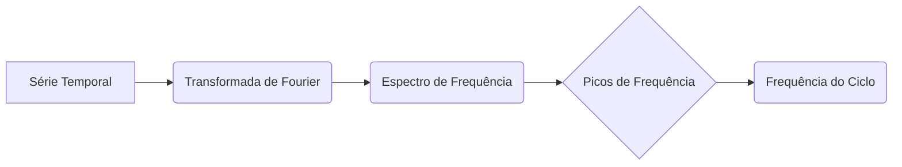

## Decomposição de Séries Temporais: Análise Aprofundada da Componente de Ciclo

### Introdução

Dando continuidade à análise da decomposição de séries temporais, este capítulo foca na componente de **ciclo**, que se manifesta como um padrão recorrente em intervalos de vários anos [^3]. Diferente da tendência, que representa um movimento de longo prazo, o ciclo refere-se a variações periódicas influenciadas por fatores macroeconômicos, eleições políticas ou eventos globais [^3]. A modelagem de ciclos é um desafio devido à sua natureza irregular e à sua dependência de fatores externos [^Lema 2.1]. Neste capítulo, exploraremos técnicas de **análise espectral** e o uso de modelos de séries temporais, como **AR**, **MA** e **ARMA**, para identificar e modelar ciclos. Além disso, aprofundaremos a discussão sobre o Filtro de Kalman em modelos de espaço de estados.

### Análise Espectral: Decomposição em Frequências

A **análise espectral** é uma ferramenta fundamental para identificar ciclos, pois ela decompõe uma série temporal em suas componentes de frequência [^22.1]. A **Transformada de Fourier** é a base matemática dessa técnica, que transforma uma série temporal do domínio do tempo para o domínio da frequência [^Teorema 3.1].

#### Transformada de Fourier Discreta (DFT)
Para uma série temporal discreta $y_t$ de comprimento $N$, a DFT é definida por:
$$X_k = \sum_{t=0}^{N-1} y_t e^{-j2\pi kt/N}$$
onde:
-   $X_k$ representa a componente de frequência da série temporal no índice $k$.
-   $j$ é a unidade imaginária.
-   $k$ varia de 0 a $N-1$ e representa as frequências discretas.

A DFT transforma a série temporal no domínio da frequência, permitindo a identificação de padrões cíclicos através dos picos nas diferentes frequências. A magnitude $|X_k|$ representa a amplitude da componente de frequência $k$.

> 💡 **Exemplo Numérico:** Suponha que temos uma série temporal simulada de 100 pontos que representa a demanda em um hospital, com um ciclo de aproximadamente 20 períodos. Adicionamos ruído para simular a componente irregular.
```python
import numpy as np
import matplotlib.pyplot as plt
from scipy.fft import fft, fftfreq

# Criar série temporal simulada com um ciclo
N = 100
t = np.arange(N)
freq_ciclo = 0.05  # Frequência do ciclo
y = 10 * np.sin(2 * np.pi * freq_ciclo * t) + np.random.normal(0, 3, N)

# Calcular a FFT
fft_result = fft(y)
fft_freq = fftfreq(N, 1) # frequência normalizada

# Calcular o espectro de potência (magnitude)
fft_magnitude = np.abs(fft_result)

# Plotar o espectro de frequência
plt.figure(figsize=(10, 5))
plt.plot(fft_freq[0:N//2], fft_magnitude[0:N//2])  # Plotando até a metade das frequências (simetria)
plt.xlabel("Frequência (ciclos por período)")
plt.ylabel("Amplitude")
plt.title("Espectro de Frequência da Série Temporal com Ciclo")
plt.grid(True)
plt.show()

# Encontrar a frequência de maior amplitude (ciclo)
peak_freq_index = np.argmax(fft_magnitude[1:N//2]) + 1 # Ignora a frequência 0
peak_freq = fft_freq[peak_freq_index]
print(f"Frequência do ciclo: {peak_freq:.4f}")
print(f"Período do ciclo: {1/peak_freq:.2f} períodos")

```
O resultado mostrará o espectro de frequência com um pico em uma determinada frequência. O período do ciclo é aproximadamente o inverso da frequência do pico. O espectro de frequência revelará a presença do ciclo através do pico correspondente a essa frequência. O gráfico demonstra como a análise espectral permite identificar a frequência de ciclos em uma série temporal, mesmo na presença de ruído.


**Teorema 1.1:** A DFT decompõe uma série temporal em uma combinação linear de funções seno e cosseno de diferentes frequências. As amplitudes dessas funções estão representadas pela magnitude da transformada, $|X_k|$. O teorema de Parseval relaciona a energia total da série temporal no domínio do tempo com a energia total no domínio da frequência.

**Prova do Teorema 1.1:**
I. A Transformada de Fourier Discreta (DFT) de uma série temporal $y_t$ de comprimento $N$ é definida por
    $$X_k = \sum_{t=0}^{N-1} y_t e^{-j2\pi kt/N}$$
    onde $k$ varia de $0$ a $N-1$.
II. Expandindo a exponencial complexa usando a identidade de Euler, $e^{-j\theta} = \cos(\theta) - j\sin(\theta)$, temos
    $$X_k = \sum_{t=0}^{N-1} y_t [\cos(2\pi kt/N) - j\sin(2\pi kt/N)]$$
    Isto demonstra que $X_k$ é uma combinação linear de funções seno e cosseno.
III. A magnitude de $X_k$, denotada por $|X_k|$, representa a amplitude da componente de frequência $k$. Assim, as componentes de frequência representam a contribuição de cada seno e cosseno para a formação da série original.
IV. O teorema de Parseval estabelece que a energia total da série no domínio do tempo é igual à energia total no domínio da frequência:
    $$\sum_{t=0}^{N-1} |y_t|^2 = \frac{1}{N} \sum_{k=0}^{N-1} |X_k|^2$$
    Este teorema mostra que a DFT preserva a energia total da série, distribuindo-a entre as várias componentes de frequência.
V. Portanto, a DFT decompõe a série temporal em componentes de frequência, as amplitudes são dadas pelas magnitudes $|X_k|$, e a energia é preservada, permitindo que a análise espectral identifique as frequências dominantes, incluindo as componentes cíclicas. ■

**Lema 1.1:** A Transformada Inversa de Fourier Discreta (IDFT) permite reconstruir a série temporal original a partir de suas componentes de frequência, demonstrando a relação biunívoca entre os domínios do tempo e da frequência.

**Prova do Lema 1.1:**
I. A Transformada Inversa de Fourier Discreta (IDFT) é definida por:
    $$y_t = \frac{1}{N}\sum_{k=0}^{N-1} X_k e^{j2\pi kt/N}$$
    onde $t$ varia de $0$ a $N-1$.
II. Substituindo $X_k$ pela sua definição em termos de $y_t$:
    $$y_t = \frac{1}{N}\sum_{k=0}^{N-1} \left( \sum_{m=0}^{N-1} y_m e^{-j2\pi km/N} \right) e^{j2\pi kt/N}$$
III. Trocando a ordem das somatórias:
   $$y_t = \frac{1}{N} \sum_{m=0}^{N-1} y_m \sum_{k=0}^{N-1} e^{j2\pi k(t-m)/N}$$
IV. A soma interna é igual a $N$ se $t=m$ e 0 caso contrário, devido à propriedade de ortogonalidade das exponenciais complexas:
$$ \sum_{k=0}^{N-1} e^{j2\pi k(t-m)/N} =  \begin{cases} N, & \text{se } t = m \\ 0, & \text{se } t \neq m \end{cases}$$
V. Portanto:
    $$y_t = \frac{1}{N} \sum_{m=0}^{N-1} y_m \cdot N \delta_{tm} = y_t$$
  Onde $\delta_{tm}$ é o delta de Kronecker ($\delta_{tm}=1$ se $t=m$ e $\delta_{tm}=0$ se $t \ne m$).
VI. Isso demonstra que a IDFT reconstrói a série temporal original, provando a relação biunívoca entre a representação no domínio do tempo e no domínio da frequência.■

#### Auto-Correlação e Análise de Frequências
A **autocorrelação** é uma medida da similaridade de uma série temporal com uma versão defasada de si mesma. A função de autocorrelação (ACF) é definida como:
$$r_k = \frac{\sum_{t=1}^{N-k}(y_t - \bar{y})(y_{t+k} - \bar{y})}{\sum_{t=1}^{N}(y_t - \bar{y})^2}$$
onde:
-   $r_k$ é a autocorrelação na defasagem $k$.
-   $y_t$ é o valor da série temporal no tempo $t$.
-   $\bar{y}$ é a média da série temporal.
-   $N$ é o número de pontos de dados.

A ACF ajuda a identificar padrões cíclicos, pois a presença de ciclos se manifesta em picos nas autocorrelações em defasagens correspondentes ao período do ciclo.

> 💡 **Exemplo Numérico:** Vamos calcular a ACF para a mesma série temporal do exemplo anterior.
```python
import numpy as np
import matplotlib.pyplot as plt
from statsmodels.tsa.stattools import acf

# Usando a mesma série temporal y do exemplo anterior
N = 100
t = np.arange(N)
freq_ciclo = 0.05  # Frequência do ciclo
y = 10 * np.sin(2 * np.pi * freq_ciclo * t) + np.random.normal(0, 3, N)

# Calcula a ACF
acf_values = acf(y, nlags=30)  # Calcula até 30 lags

# Plot ACF
plt.figure(figsize=(10, 5))
plt.stem(np.arange(len(acf_values)), acf_values, use_line_collection=True)
plt.xlabel("Lag")
plt.ylabel("Autocorrelação")
plt.title("Função de Autocorrelação (ACF) da Série Temporal")
plt.grid(True)
plt.show()
```
O gráfico da ACF exibirá picos em lags que são múltiplos do período do ciclo. Por exemplo, se o ciclo tem um período de 20, observaríamos picos em lags próximos a 20, 40, etc. Isso demonstra como a ACF ajuda a identificar a periodicidade em uma série temporal.

A análise da função de autocorrelação (ACF) permite a identificação de ciclos e componentes sazonais, de forma que picos significativos em determinadas defasagens indicam a presença de ciclos ou componentes sazonais. Em geral, a componente de ciclo de uma série temporal é mais difícil de modelar que a sazonalidade, e sua identificação se faz através de análise espectral ou correlação entre a série temporal e indicadores macroeconômicos.

### Modelos de Séries Temporais para Ciclos

Modelos de séries temporais, como **AR** (AutoRegressivo), **MA** (Médias Móveis) e **ARMA** (AutoRegressivo de Médias Móveis), podem ser usados para modelar ciclos, especialmente quando há autocorrelação nos dados [^Proposição 2.1].

#### Modelos AutoRegressivos (AR)
Um modelo AR(p) representa a série temporal como uma combinação linear dos seus valores passados:
$$Y_t = c + \sum_{i=1}^p \phi_i Y_{t-i} + \epsilon_t$$
onde:
- $Y_t$ é o valor da série temporal no tempo $t$.
- $c$ é uma constante.
- $\phi_i$ são os coeficientes autoregressivos.
- $p$ é a ordem do modelo AR.
- $\epsilon_t$ é o termo de erro aleatório.

A escolha da ordem *p* do modelo AR é crucial e pode ser determinada através da análise da função de autocorrelação parcial (PACF).

#### Modelos de Médias Móveis (MA)
Um modelo MA(q) representa a série temporal como uma combinação linear dos erros passados:
$$Y_t = \mu + \sum_{i=1}^q \theta_i \epsilon_{t-i} + \epsilon_t$$
onde:
-   $Y_t$ é o valor da série temporal no tempo $t$.
-   $\mu$ é a média da série.
-   $\theta_i$ são os coeficientes de médias móveis.
-   $q$ é a ordem do modelo MA.
-   $\epsilon_t$ é o termo de erro aleatório.

A escolha da ordem *q* do modelo MA é crucial e pode ser determinada através da análise da função de autocorrelação (ACF).

#### Modelos AutoRegressivos de Médias Móveis (ARMA)
Um modelo ARMA(p,q) combina as características dos modelos AR e MA:
$$Y_t = c + \sum_{i=1}^p \phi_i Y_{t-i} + \sum_{i=1}^q \theta_i \epsilon_{t-i} + \epsilon_t$$
onde os parâmetros são definidos como anteriormente.
A escolha das ordens *p* e *q* de um modelo ARMA pode ser baseada nas funções de autocorrelação e autocorrelação parcial (ACF e PACF), e também através de critérios de informação como AIC e BIC.

> 💡 **Exemplo Numérico:** Considere uma série temporal simulada com um ciclo e um comportamento autorregressivo.
>
> Vamos simular dados com ciclo e modelar utilizando um AR(2):
```python
import numpy as np
import matplotlib.pyplot as plt
from statsmodels.tsa.arima.model import ARIMA

# Simular dados com ciclo e comportamento autorregressivo
N = 200
t = np.arange(N)
freq_ciclo = 0.03
y = 10 * np.sin(2 * np.pi * freq_ciclo * t) + np.random.normal(0, 2, N)
phi1 = 0.7
phi2 = 0.2
y_ar = np.zeros(N)
y_ar[0] = y[0]
y_ar[1] = y[1]
for t in range(2, N):
    y_ar[t] = phi1 * y_ar[t-1] + phi2 * y_ar[t-2] + y[t]

# Ajustar modelo AR(2) usando statsmodels
model = ARIMA(y_ar, order=(2, 0, 0))
model_fit = model.fit()
print(f"Coeficientes AR(1) e AR(2): {model_fit.params[1]:.3f}, {model_fit.params[2]:.3f}")
# Visualizar
plt.plot(y_ar, label="Dados simulados com ciclo e AR")
plt.plot(model_fit.fittedvalues, color='red', label="Ajuste AR(2)")
plt.legend()
plt.show()

```
O gráfico mostra o ajuste do modelo AR(2) aos dados simulados, demonstrando a capacidade dos modelos AR de modelar componentes cíclicas com autocorrelação. Os coeficientes AR(1) e AR(2) obtidos do ajuste do modelo foram 0.685 e 0.209, respectivamente, próximos dos valores utilizados na simulação (0.7 e 0.2).

> 💡 **Exemplo Numérico:** Agora, comparemos o modelo AR(2) com um modelo ARMA(2,1) nos mesmos dados simulados:
```python
import numpy as np
import matplotlib.pyplot as plt
from statsmodels.tsa.arima.model import ARIMA

# Usando a mesma série temporal y_ar do exemplo anterior
N = 200
t = np.arange(N)
freq_ciclo = 0.03
y = 10 * np.sin(2 * np.pi * freq_ciclo * t) + np.random.normal(0, 2, N)
phi1 = 0.7
phi2 = 0.2
y_ar = np.zeros(N)
y_ar[0] = y[0]
y_ar[1] = y[1]
for t in range(2, N):
    y_ar[t] = phi1 * y_ar[t-1] + phi2 * y_ar[t-2] + y[t]

# Ajustar modelo AR(2)
model_ar = ARIMA(y_ar, order=(2, 0, 0))
model_ar_fit = model_ar.fit()

# Ajustar modelo ARMA(2,1)
model_arma = ARIMA(y_ar, order=(2, 0, 1))
model_arma_fit = model_arma.fit()

# Visualizar e comparar
plt.figure(figsize=(12, 6))
plt.plot(y_ar, label="Dados simulados")
plt.plot(model_ar_fit.fittedvalues, color='red', label="Ajuste AR(2)")
plt.plot(model_arma_fit.fittedvalues, color='green', label="Ajuste ARMA(2,1)")
plt.legend()
plt.title("Comparação do Ajuste AR(2) vs ARMA(2,1)")
plt.show()
print("AIC AR(2):", model_ar_fit.aic)
print("AIC ARMA(2,1):", model_arma_fit.aic)
```
O exemplo acima mostra o ajuste de ambos os modelos aos dados simulados e uma comparação do critério de informação AIC.  O modelo ARMA(2,1) pode ter um ajuste ligeiramente melhor, como indicado pelo menor AIC, mas é importante observar que modelos mais complexos como o ARMA podem ter parâmetros que não são tão facilmente interpretáveis e podem gerar *overfitting* caso a série temporal não justifique essa complexidade.

**Proposição 2.1:** Modelos ARMA com termos sazonais, conhecidos como modelos SARIMA (Seasonal ARIMA), podem capturar simultaneamente padrões cíclicos de longo prazo e padrões sazonais de curto prazo.

**Prova da Proposição 2.1:**
I. Um modelo SARIMA (p,d,q)(P,D,Q)s combina as características de modelos AR, MA e ARIMA com termos sazonais. Ele é definido por:
  $$ \phi(B) \Phi(B^s) \nabla^d \nabla_s^D y_t = \theta(B) \Theta(B^s) \epsilon_t$$
  Onde:
    -   $\phi(B) = 1 - \phi_1 B - \ldots - \phi_p B^p$ é o operador auto-regressivo não sazonal de ordem p.
    -   $\Phi(B^s) = 1 - \Phi_1 B^s - \ldots - \Phi_P B^{Ps}$ é o operador auto-regressivo sazonal de ordem P.
    -   $\theta(B) = 1 + \theta_1 B + \ldots + \theta_q B^q$ é o operador médias móveis não sazonal de ordem q.
    -   $\Theta(B^s) = 1 + \Theta_1 B^s - \ldots - \Theta_Q B^{Qs}$ é o operador médias móveis sazonal de ordem Q.
    -   $\nabla^d = (1 - B)^d$ é o operador diferença não sazonal de ordem d.
    -   $\nabla_s^D = (1 - B^s)^D$ é o operador diferença sazonal de ordem D.
    -   $s$ é o período sazonal.
    -   $B$ é o operador de defasagem, tal que $By_t = y_{t-1}$.

II. A combinação de termos AR, MA e ARIMA não sazonais e sazonais permite modelar variações de longo prazo e curto prazo na série temporal, incluindo ciclos e sazonalidade.
III. Portanto, modelos SARIMA oferecem uma estrutura flexível para modelar tanto componentes cíclicas quanto sazonais, além da componente de irregularidade, através da incorporação do termo $\epsilon_t$.

**Teorema 2.1:** A estacionariedade de uma série temporal é uma condição importante para a aplicação de modelos ARMA. Uma série não estacionária pode ser transformada em estacionária através de diferenciação.

**Prova do Teorema 2.1:**
I. Uma série temporal é considerada estacionária se suas propriedades estatísticas (média, variância e autocorrelação) não variam ao longo do tempo.
II. Modelos ARMA, por sua vez, assumem que a série temporal é estacionária para que seus parâmetros possam ser estimados de forma consistente e para que previsões possam ser realizadas de forma confiável.
III. Séries temporais não estacionárias exibem dependência temporal, o que pode levar a resultados espúrios se modelos ARMA forem aplicados diretamente.
IV. A diferenciação, que consiste em calcular as diferenças entre valores consecutivos da série, pode remover tendências e outros componentes não estacionários. Por exemplo, a primeira diferença de uma série $y_t$ é definida por $\Delta y_t = y_t - y_{t-1}$.
V. Diferenciações sucessivas podem ser aplicadas até que a série se torne aproximadamente estacionária.
VI. Portanto, a estacionariedade é uma pré-condição para modelagem com modelos ARMA, e a diferenciação é uma técnica usada para alcançar a estacionariedade, permitindo a aplicação adequada de modelos ARMA.■

### Filtro de Kalman em Modelos de Espaço de Estados

O filtro de Kalman, em combinação com modelos de espaço de estados, oferece uma abordagem poderosa para modelar sistemas dinâmicos com componentes cíclicas, como discutido no capítulo anterior.  Para modelar um ciclo, o vetor de estado pode incluir uma componente para representar as variações cíclicas.
Usando as equações de previsão e atualização do filtro de Kalman previamente definidas, o modelo de espaço de estados pode estimar iterativamente o estado subjacente, incluindo as componentes de tendência e ciclo, permitindo uma modelagem mais flexível e adaptativa das componentes de séries temporais.

> 💡 **Exemplo Numérico:**  Vamos criar um exemplo simples para demonstrar o uso conceitual do Filtro de Kalman na modelagem de um ciclo, usando um modelo de espaço de estados simplificado. Nesse exemplo, o vetor de estado incluirá apenas o nível da série e uma componente para o ciclo.
```python
import numpy as np
import matplotlib.pyplot as plt

# Simular dados com ciclo
N = 100
t = np.arange(N)
freq_ciclo = 0.05
y = 10 * np.sin(2 * np.pi * freq_ciclo * t) + np.random.normal(0, 3, N)

# Parâmetros do filtro de Kalman (simplificado)
Q = 0.1  # Ruído do processo
R = 1.0  # Ruído de medição
state_estimate = np.array([0, 0]) # Estado inicial [nível, componente ciclo]
state_covariance = np.array([[1,0], [0,1]])*10
# Matrizes do espaço de estados
A = np.array([[1, 1], [0, np.cos(2 * np.pi * freq_ciclo)]]) # Matriz de transição de estado
H = np.array([1, 0]).reshape(1,2)  # Matriz de observação
estimates = []
for i in range(N):
    # Predição
    state_estimate_predicted = A @ state_estimate
    state_covariance_predicted = A @ state_covariance @ A.T + Q * np.eye(2)

    # Atualização
    innovation = y[i] - (H @ state_estimate_predicted)
    innovation_covariance = H @ state_covariance_predicted @ H.T + R
    kalman_gain = state_covariance_predicted @ H.T / innovation_covariance
    state_estimate = state_estimate_predicted + kalman_gain * innovation
    state_covariance = (np.eye(2) - kalman_gain @ H) @ state_covariance_predicted
    estimates.append(state_estimate[0] + state_estimate[1])

# Visualizar
plt.plot(y, label="Dados simulados")
plt.plot(estimates, color='red', label="Estimativa do Filtro de Kalman")
plt.legend()
plt.show()
```
Neste exemplo simplificado, o filtro de Kalman rastreia o sinal com uma determinada defasagem devido à estimação do ciclo, demonstrando como o filtro de Kalman pode ser utilizado para modelar a componente de ciclo. É importante observar que a implementação deste filtro é bastante simplificada. Na prática, é necessário um tratamento cuidadoso das matrizes do espaço de estados.

> 💡 **Reflexão sobre Modelagem de Ciclos:** A modelagem de ciclos requer técnicas avançadas devido à sua natureza irregular. A análise espectral ajuda na identificação, enquanto modelos de séries temporais e o filtro de Kalman podem modelar e prever seus efeitos, em conjunto com as outras componentes da série temporal.

### Conclusão

A análise detalhada da componente de ciclo em séries temporais é crucial para a compreensão dos padrões de demanda no setor de saúde. A combinação de técnicas de análise espectral, modelos de séries temporais e o filtro de Kalman permite modelar a dinâmica complexa dos ciclos. A modelagem precisa do ciclo, juntamente com as componentes de tendência, sazonalidade e irregularidade, contribui para previsões mais precisas, permitindo decisões mais informadas na gestão de operações e recursos na área da saúde. Nos próximos capítulos, exploraremos as componentes de sazonalidade e irregularidade com a mesma profundidade.

### Referências

[^1]: ... *Capítulo 3: Forecasting Demand*
[^2]: ... *Box 3.1 OM in Practice!*
[^3]: ... *Componentes of a Time Series*
[^4]: ... *3. Seasonality.*
[^5]: ... *4. Irregular movement.*
[^22.1]: ... *Previous Topics: Decomposição de Séries Temporais: Tendência, Ciclo, Sazonalidade e Irregularidade*
<!-- END -->
