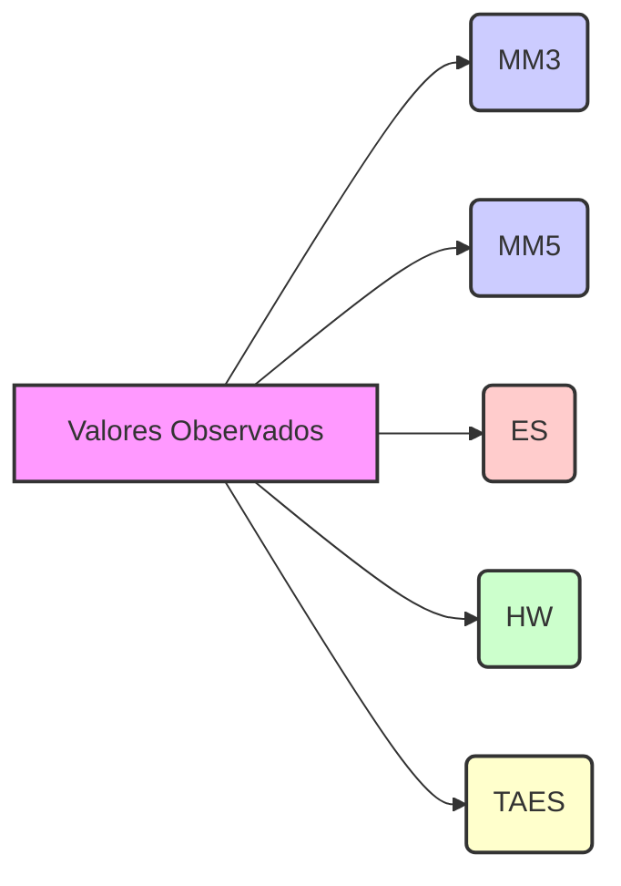

## Alisamento Exponencial Ajustado por Tendência (TAES): Incorporando a Dinâmica da Tendência na Previsão

### Introdução

Dando continuidade à exploração das técnicas de previsão de demanda baseadas em séries temporais, este capítulo se dedica ao estudo do **Alisamento Exponencial Ajustado por Tendência (TAES)**. Já vimos que a previsão de demanda é um elemento essencial para o planejamento estratégico e gestão de operações [^1] e que métodos como a Suavização Exponencial (ES) apresentam vantagens em relação a técnicas mais simples como a Média Móvel (SMA) e a Média Móvel Ponderada (WMA) [^3, ^4, ^5, ^6, ^8]. No entanto, a ES, em sua forma básica, não é capaz de capturar adequadamente a dinâmica de tendências, o que pode limitar sua precisão em cenários onde a demanda apresenta um crescimento ou declínio consistente ao longo do tempo [^15]. O TAES surge como uma evolução da ES, incorporando um componente de tendência que ajusta a previsão para acomodar esses padrões, fornecendo um modelo mais robusto e preciso. Neste capítulo, vamos examinar detalhadamente a formulação matemática do TAES, suas vantagens e desvantagens, a interpretação de seus parâmetros e as condições em que seu uso é mais apropriado.

### Conceitos Fundamentais do Alisamento Exponencial Ajustado por Tendência (TAES)
O Alisamento Exponencial Ajustado por Tendência (TAES) é um método de previsão que estende a Suavização Exponencial (ES) para modelar explicitamente a tendência em uma série temporal. O TAES calcula a previsão em três etapas, utilizando dois parâmetros de suavização, $\alpha$ e $\beta$, que controlam, respectivamente, a suavização da demanda e da tendência. As etapas de cálculo do TAES para o período *t* são dadas por [^15]:

1.  **Cálculo do Forecast Suavizado:**
    $$ F_t = \alpha A_{t-1} + (1-\alpha) TAES_{t-1} $$
    onde:
    *   $F_t$ é o forecast suavizado da demanda no período *t*.
    *   $\alpha$ é a constante de suavização para o nível da demanda (0 ≤ $\alpha$ ≤ 1).
    *   $A_{t-1}$ é a demanda real no período anterior.
     *   $TAES_{t-1}$ é o forecast ajustado para a tendência no período anterior.

2. **Cálculo da Tendência Suavizada:**
    $$ T_t = \beta (F_t - F_{t-1}) + (1-\beta)T_{t-1} $$
    onde:
    *   $T_t$ é a tendência suavizada para o período *t*.
    *   $\beta$ é a constante de suavização da tendência (0 ≤ $\beta$ ≤ 1).
    *    $F_t$ é o forecast suavizado do nível de demanda para o período t.
    *   $F_{t-1}$ é o forecast suavizado do nível de demanda para o período anterior.
    *   $T_{t-1}$ é a tendência suavizada para o período anterior.

3.  **Cálculo do Forecast Ajustado por Tendência:**
    $$ TAES_t = F_t + T_t $$
    onde:
    *   $TAES_t$ é a previsão ajustada por tendência para o período *t*.

A principal diferença entre a ES e o TAES é a inclusão explícita do componente de tendência, $T_t$, na previsão final. O TAES estima a mudança na demanda através da diferença entre previsões consecutivas e utiliza essa informação para ajustar a previsão futura, acompanhando mudanças na tendência.

O parâmetro $\alpha$ controla a influência dos dados mais recentes na estimativa do nível da demanda, de forma similar ao modelo de ES, enquanto $\beta$ controla a influência das mudanças recentes na tendência. A escolha adequada dos parâmetros $\alpha$ e $\beta$ permite ao modelo se adaptar a diferentes cenários, equilibrando suavização e responsividade em relação tanto ao nível quanto à tendência da demanda. A escolha dos parâmetros $\alpha$ e $\beta$ envolve a mesma discussão que a escolha do parâmetro $\alpha$ na ES, ou seja, valores próximos de 1 tornam o modelo mais responsivo e valores próximos a 0 tornam o modelo mais estável.

É importante notar que o modelo TAES, por si só, não modela a sazonalidade. Para modelar uma série temporal com componentes de tendência e sazonalidade, o TAES pode ser combinado com outras técnicas de modelagem de sazonalidade, como o uso de índices sazonais.

**Lema 1:** A fórmula do forecast suavizado na TAES, $F_t = \alpha A_{t-1} + (1-\alpha) TAES_{t-1}$, é similar à fórmula da ES simples, com a diferença de que $ES_{t-1}$ é substituído por $TAES_{t-1}$.

*Prova:*
I.  Na ES simples, a previsão suavizada é dada por $ES_t = \alpha A_{t-1} + (1-\alpha) ES_{t-1}$.
II. Na TAES, o forecast suavizado é dado por $F_t = \alpha A_{t-1} + (1-\alpha) TAES_{t-1}$.
III. Comparando as duas expressões, vemos que a diferença é que na TAES o termo $(1-\alpha)$ é multiplicado por $TAES_{t-1}$, que já incorpora a tendência, ao invés de $ES_{t-1}$.
IV. Portanto, a fórmula do forecast suavizado na TAES é uma extensão da fórmula da ES simples. ■

**Lema 2:** O cálculo da tendência suavizada, $T_t$, captura a diferença entre forecasts suavizados consecutivos, ajustando a previsão para mudanças na tendência.

*Prova*:
I. A fórmula da tendência suavizada é dada por $T_t = \beta (F_t - F_{t-1}) + (1-\beta)T_{t-1}$.
II. O termo $(F_t - F_{t-1})$ representa a diferença entre os forecasts suavizados nos períodos *t* e *t-1*, que indica a magnitude da mudança no nível da demanda.
III. Este termo, ao ser ponderado por $\beta$, representa uma medida da mudança na tendência.
IV. O termo $(1-\beta)T_{t-1}$ representa o efeito da tendência anterior.
V. Portanto, o cálculo de $T_t$ captura a mudança entre forecasts consecutivos e a tendência anterior, suavizando esta última. ■

**Lema 3:** Os parâmetros $\alpha$ e $\beta$ controlam, respectivamente, a suavização do nível e a suavização da tendência na TAES.

*Prova*:
I. O parâmetro $\alpha$ aparece na fórmula do forecast suavizado $F_t = \alpha A_{t-1} + (1-\alpha) TAES_{t-1}$, determinando o peso dado ao valor mais recente da demanda ($A_{t-1}$) em relação ao forecast ajustado anterior ($TAES_{t-1}$).
II. O parâmetro $\beta$ aparece na fórmula da tendência suavizada  $T_t = \beta (F_t - F_{t-1}) + (1-\beta)T_{t-1}$, determinando o peso dado a mudanças recentes na demanda $(F_t - F_{t-1})$ em relação à tendência anterior.
III. Portanto, os parâmetros $\alpha$ e $\beta$ controlam, respectivamente, a suavização do nível e a suavização da tendência. ■

**Proposição 1:** A TAES é mais adequada do que a ES simples em séries temporais com tendência, pois incorpora um componente de tendência no cálculo da previsão.

*Prova*:
I.  A ES simples não modela explicitamente a tendência, e seu erro de previsão é diretamente afetado pela presença de tendências nos dados.
II.  O modelo TAES, ao incorporar um componente de tendência (representado por $T_t$), permite que a previsão capture as variações de longo prazo da demanda, ajustando o valor da previsão de acordo com a direção e magnitude da tendência.
III. Portanto, o TAES é mais adequado do que a ES simples para séries temporais com tendência. ■

**Proposição 1.1:**  Valores de $\alpha$ e $\beta$ próximos de 1 tornam o modelo TAES mais responsivo a mudanças recentes, enquanto valores próximos de 0 tornam o modelo mais estável.

*Prova*:
I. Se o parâmetro $\alpha$ for alto, o termo $\alpha A_{t-1}$ na equação $F_t = \alpha A_{t-1} + (1-\alpha) TAES_{t-1}$ terá mais peso, tornando a previsão mais responsiva ao valor atual da demanda.
II. Se o parâmetro $\beta$ for alto, o termo $\beta (F_t - F_{t-1})$ na equação $T_t = \beta (F_t - F_{t-1}) + (1-\beta)T_{t-1}$ terá mais peso, tornando a tendência mais responsiva às mudanças recentes na demanda.
III. Portanto, um valor alto de ambos $\alpha$ e $\beta$ torna o modelo mais responsivo, enquanto valores mais baixos tornam o modelo mais estável e suave. ■

**Proposição 1.2:**  A escolha apropriada dos parâmetros $\alpha$ e $\beta$ em modelos TAES pode ser feita através da minimização do erro de previsão (MAD, MSE, MAPE), em séries temporais com tendência.

*Prova:*
I. Os parâmetros $\alpha$ e $\beta$ controlam a suavização e responsividade do modelo.
II.  Valores inadequados de $\alpha$ e $\beta$ levam a um erro de previsão maior.
III. A otimização dos parâmetros $\alpha$ e $\beta$ envolve encontrar valores que minimizem o erro de previsão.
IV. Portanto, algoritmos de otimização podem ser utilizados para definir valores apropriados para esses parâmetros através da minimização do erro de previsão (MAD, MSE ou MAPE). ■

**Proposição 1.3:** O modelo TAES pode ser reescrito em uma forma recursiva que expressa a previsão ajustada por tendência $TAES_t$ diretamente em termos da demanda passada ($A_{t-1}$) e dos parâmetros $\alpha$ e $\beta$, eliminando a necessidade de calcular $F_t$ e $T_t$ explicitamente em cada passo.

*Prova:*
I. Começamos pelas equações do TAES:
    * $F_t = \alpha A_{t-1} + (1-\alpha) TAES_{t-1}$
    * $T_t = \beta (F_t - F_{t-1}) + (1-\beta)T_{t-1}$
    * $TAES_t = F_t + T_t$
II. Substituindo $F_t$ em $T_t$:
    *  $T_t = \beta ((\alpha A_{t-1} + (1-\alpha) TAES_{t-1}) - F_{t-1}) + (1-\beta)T_{t-1}$
III. Substituindo $F_t$ e $T_t$ em $TAES_t$:
   * $TAES_t = (\alpha A_{t-1} + (1-\alpha) TAES_{t-1}) + \beta ((\alpha A_{t-1} + (1-\alpha) TAES_{t-1}) - F_{t-1}) + (1-\beta)T_{t-1}$
IV.  Esta expressão mostra que  $TAES_t$ pode ser calculado recursivamente em termos da demanda passada e de $TAES_{t-1}$, $F_{t-1}$ e $T_{t-1}$.
V.  Essa forma recursiva, embora mais complexa, pode ser útil em implementações computacionais para otimizar o cálculo. Note que as equações recursivas para $F_{t-1}$ e $T_{t-1}$ podem ser expandidas recursivamente até os valores iniciais.  ■

#### Exemplo Numérico Detalhado do TAES

Vamos usar a mesma série temporal de demanda semanal utilizada nos capítulos anteriores para exemplificar o TAES:

*   Semana 1: 20 unidades
*   Semana 2: 22 unidades
*   Semana 3: 25 unidades
*   Semana 4: 23 unidades
*   Semana 5: 28 unidades
*   Semana 6: 30 unidades
*   Semana 7: 27 unidades
*   Semana 8: 32 unidades
*   Semana 9: 35 unidades

Vamos calcular as previsões usando os seguintes parâmetros: $\alpha = 0.4$ e $\beta = 0.3$. Para iniciar os cálculos, precisaremos de valores iniciais para $TAES_1$ e $T_1$. Vamos assumir $TAES_1 = 20$ e $T_1=0$.

*   **TAES com α=0.4 e β=0.3:**

    *   $F_2 = 0.4 \times 20 + (1-0.4) \times 20 = 20$
    *   $T_2 = 0.3 \times (20 - 20) + (1-0.3) \times 0 = 0$
    *   $TAES_2 = 20 + 0 = 20$
    *   $F_3 = 0.4 \times 22 + (1-0.4) \times 20 = 8.8 + 12 = 20.8$
    *   $T_3 = 0.3 \times (20.8 - 20) + (1-0.3) \times 0 = 0.24$
     *   $TAES_3 = 20.8 + 0.24 = 21.04$
    *   $F_4 = 0.4 \times 25 + (1-0.4) \times 21.04 = 10 + 12.624 = 22.624$
    *   $T_4 = 0.3 \times (22.624 - 20.8) + (1-0.3) \times 0.24 = 0.5472 + 0.168 = 0.7152$
    *   $TAES_4 = 22.624 + 0.7152 = 23.3392$
    *  $F_5 = 0.4 \times 23 + (1-0.4) \times 23.3392 = 9.2 + 14.00352 = 23.20352$
   *   $T_5 = 0.3 \times (23.20352 - 22.624) + (1-0.3) \times 0.7152 = 0.173856 + 0.50064= 0.674496$
    *  $TAES_5 = 23.20352 + 0.674496= 23.878016$
    *   $F_6 = 0.4 \times 28 + (1-0.4) \times 23.878016= 11.2 + 14.3268096 = 25.5268096$
    *   $T_6 = 0.3 \times (25.5268096 - 23.20352) + (1-0.3) \times 0.674496 = 0.697+ 0.4721472 = 1.1691472$
    *   $TAES_6 = 25.5268096 + 1.1691472 = 26.6959568$
   *    $F_7 = 0.4 \times 30 + (1-0.4) \times 26.6959568 = 12 + 16.01757408 = 28.01757408$
    *    $T_7 = 0.3 \times (28.01757408 - 25.5268096) + (1-0.3) \times 1.1691472 = 0.74722934 + 0.81840304 = 1.56563238$
    *   $TAES_7 = 28.01757408 + 1.56563238 = 29.58320646$
    *    $F_8 = 0.4 \times 27 + (1-0.4) \times 29.58320646 = 10.8 + 17.749923876 = 28.549923876$
    *   $T_8 = 0.3 \times (28.549923876 - 28.01757408) + (1-0.3) \times 1.56563238 = 0.16 + 1.09594267 = 1.25594267$
    *  $TAES_8 = 28.549923876 + 1.25594267 = 29.805866546$
     *   $F_9 = 0.4 \times 32 + (1-0.4) \times 29.805866546 = 12.8 + 17.8835199276 = 30.6835199276$
    *   $T_9 = 0.3 \times (30.6835199276- 28.549923876) + (1-0.3) \times 1.25594267 = 0.64+0.879159869 =  1.519159869$
    *  $TAES_9 =  30.6835199276+1.519159869=32.202679796$

Observamos que as previsões geradas pelo TAES acompanham a tendência da demanda ao longo do tempo. Os cálculos são um pouco mais complexos, e mostram como o TAES estima o nível e a tendência da demanda em cada período.

> 💡 **Exemplo Numérico:** Vamos considerar um exemplo mais simples onde a série temporal apresenta uma tendência linear, e comparar o TAES com a ES simples. Vamos utilizar a seguinte série temporal: Semana 1: 100, Semana 2: 110, Semana 3: 125, Semana 4: 130. Vamos usar os seguintes valores:
>    *   ES: $\alpha = 0.6$, $ES_1=100$
>    *   TAES: $\alpha=0.6$, $\beta=0.4$, $TAES_1=100$, $T_1=0$
>
>   *   **ES com α = 0.6:**
>        *   $ES_2 = 0.6 \times 100 + 0.4 \times 100 = 100$
>        *   $ES_3 = 0.6 \times 110 + 0.4 \times 100 = 106$
>        *   $ES_4 = 0.6 \times 125 + 0.4 \times 106 = 117.4$
>        *   $ES_5 = 0.6 \times 130 + 0.4 \times 117.4 = 125$
>
>   *   **TAES com α = 0.6 e β = 0.4:**
>       *   $F_2 = 0.6 \times 100 + 0.4 \times 100 = 100$
>        *   $T_2 = 0.4 \times (100 - 100) + 0.6 \times 0 = 0$
>       *   $TAES_2 = 100 + 0 = 100$
>       *    $F_3 = 0.6 \times 110 + 0.4 \times 100 = 106$
>       *    $T_3 = 0.4 \times (106-100) + 0.6 \times 0 = 2.4$
>       *    $TAES_3 = 106 + 2.4 = 108.4$
>      *   $F_4 = 0.6 \times 125 + 0.4 \times 108.4 = 118.36$
>       *   $T_4 = 0.4 \times (118.36-106) + 0.6 * 2.4 = 4.944 + 1.44 = 6.384$
>      *   $TAES_4 = 118.36 + 6.384 = 124.744$
>      *   $F_5 = 0.6 \times 130 + 0.4 \times 124.744 = 127.8976$
>      *   $T_5 = 0.4 \times (127.8976 - 118.36) + 0.6 * 6.384 = 3.81 + 3.83 = 7.64$
>     *   $TAES_5 = 127.8976 + 7.64= 135.54$
>
>
> Observa-se que a ES simples sempre atrasa o nível da demanda, enquanto a TAES, ao modelar a tendência, acompanha a evolução da série temporal com melhor precisão. A previsão da ES para a Semana 5 é 125 unidades enquanto a previsão do TAES é 135.54 unidades, mais próxima do valor real (que é 130, na semana 4).
>
> 💡 **Exemplo Numérico (Código Python):** Para ilustrar o cálculo e a diferença de desempenho entre ES e TAES, podemos usar Python. Abaixo, um código que calcula ES e TAES para uma série temporal com tendência e imprime os erros quadráticos médios (MSE) para comparação.
> ```python
> import numpy as np
>
> def simple_exponential_smoothing(data, alpha, initial_level):
>     es_forecast = [initial_level]
>     for i in range(1, len(data)):
>         es_forecast.append(alpha * data[i-1] + (1 - alpha) * es_forecast[-1])
>     return es_forecast
>
> def trend_adjusted_exponential_smoothing(data, alpha, beta, initial_level, initial_trend):
>     level = [initial_level]
>     trend = [initial_trend]
>     taes_forecast = [initial_level + initial_trend]
>
>     for i in range(1, len(data)):
>         ft = alpha * data[i-1] + (1-alpha) * taes_forecast[-1]
>         level.append(ft)
>         tt = beta * (level[-1] - level[-2] if len(level) > 1 else 0 ) + (1 - beta) * trend[-1]
>         trend.append(tt)
>         taes_forecast.append(level[-1] + trend[-1])
>     return taes_forecast
>
>
> # Dados de exemplo com tendência
> data = np.array([100, 110, 125, 130, 145, 155, 170, 180])
>
> # Parâmetros para ES
> alpha_es = 0.6
> initial_level_es = data[0]
>
> # Parâmetros para TAES
> alpha_taes = 0.6
> beta_taes = 0.4
> initial_level_taes = data[0]
> initial_trend_taes = 0
>
> # Calcula as previsões
> es_predictions = simple_exponential_smoothing(data, alpha_es, initial_level_es)
> taes_predictions = trend_adjusted_exponential_smoothing(data, alpha_taes, beta_taes, initial_level_taes, initial_trend_taes)
>
> # Calcula o MSE
> mse_es = np.mean((data - es_predictions[:-1]) ** 2)
> mse_taes = np.mean((data - taes_predictions[:-1]) ** 2)
>
>
> print(f"ES Predictions: {es_predictions}")
> print(f"TAES Predictions: {taes_predictions}")
> print(f"MSE for ES: {mse_es:.2f}")
> print(f"MSE for TAES: {mse_taes:.2f}")
>
> ```
>
> Este código demonstra como calcular as previsões e os erros. A saída do código mostra que o TAES tem um MSE menor do que o ES para essa série temporal específica, confirmando a vantagem do TAES em séries com tendência.

#### Vantagens e Desvantagens do TAES

As principais vantagens do TAES incluem:

*   **Captura da Tendência:** O TAES é capaz de capturar e modelar tendências lineares em séries temporais, gerando previsões mais precisas do que a ES simples quando há tendência [^15].
*   **Flexibilidade:** Os parâmetros $\alpha$ e $\beta$ permitem que o modelo seja ajustado para diferentes padrões de demanda e de tendência, oferecendo flexibilidade na aplicação do modelo.
*   **Suavização e Responsividade:** O TAES equilibra a suavização dos dados com a responsividade a mudanças na demanda, adaptando-se a diferentes cenários.
*   **Melhor Desempenho em Séries Temporais com Tendência:** O TAES supera a ES simples em séries temporais com tendência, já que ele modela o crescimento ou declínio de longo prazo da demanda.

As principais desvantagens do TAES incluem:

*   **Complexidade:** O TAES é mais complexo que a ES, envolvendo dois parâmetros de suavização ($\alpha$ e $\beta$), o que aumenta a complexidade de implementação e de ajuste do modelo.
*   **Subjetividade na Escolha dos Parâmetros:** A escolha dos valores para $\alpha$ e $\beta$ é um processo subjetivo e que pode influenciar a precisão das previsões. A otimização desses parâmetros pode demandar experimentação e conhecimento do modelo.
*   **Necessidade de Valores Iniciais:** Assim como a ES simples, o TAES também requer um valor inicial para a previsão e para a tendência, o que pode influenciar o desempenho das previsões iniciais.
*   **Não Capta Sazonalidade ou Ciclos:** O TAES não é capaz de capturar variações sazonais ou cíclicas em séries temporais, exigindo o uso de técnicas adicionais para tratar esses componentes.
*   **Modelagem Implícita da Tendência:** O modelo TAES modela a tendência de forma implícita, através da diferença entre os níveis estimados da demanda, o que torna o modelo menos interpretável e dificulta a projeção do comportamento da tendência em períodos futuros.
*   **Não Ótimo para Mudanças Bruscas:** O TAES, assim como a ES, pode ter dificuldades em prever mudanças bruscas na demanda, e valores extremos, já que ele se baseia em médias ponderadas de valores passados.

**Observação 1:** A escolha dos parâmetros $\alpha$ e $\beta$ no TAES deve ser baseada em uma análise cuidadosa da série temporal, considerando a magnitude da tendência e a importância relativa dos dados recentes. A combinação de testes e julgamento é importante para o ajuste fino dos parâmetros, e as métricas de avaliação podem auxiliar nesse processo.

#### Condições de Aplicabilidade do TAES
O TAES é mais apropriado nas seguintes condições:

*   **Presença de Tendência:** Quando a demanda apresenta um crescimento ou declínio consistente ao longo do tempo, a TAES pode fornecer previsões mais precisas do que a ES simples ou outros modelos que não modelam a tendência [^15].
*   **Necessidade de Responsividade e Suavização:** O TAES permite o ajuste do modelo para equilibrar responsividade a mudanças recentes na demanda com a suavização do ruído, através da escolha adequada dos parâmetros $\alpha$ e $\beta$.
*   **Previsões de Curto a Médio Prazo:** A TAES é mais adequada para previsões de curto e médio prazo, onde a tendência é o principal padrão a ser modelado.
*   **Séries Temporais com Componentes Lineares:** A TAES assume que a tendência na série é linear. Em séries temporais com tendências não-lineares, outras técnicas podem ser mais apropriadas.
*   **Disponibilidade de Dados:** O TAES necessita de um histórico de dados razoável, para o cálculo das previsões e ajuste dos parâmetros, embora não exija tantos dados quanto modelos mais complexos.
*   **Quando há necessidade de modelar explicitamente a tendência:** O modelo TAES é mais apropriado quando o tomador de decisão necessita de um modelo que capture explicitamente a componente de tendência, para compreender a evolução da demanda ao longo do tempo.

**Observação 2:** Em cenários onde a demanda apresenta sazonalidade ou ciclos, o TAES pode ser combinado com outras técnicas de modelagem, como a decomposição de séries temporais ou o uso de índices sazonais, para gerar previsões mais precisas.

**Teorema 1:** O modelo TAES pode ser expandido para incluir um terceiro parâmetro, $\gamma$, para ajustar o componente de tendência, tornando o modelo mais robusto em casos de variação da tendência.

*Prova:*
I. A tendência $T_t$ na formulação original do TAES é modelada com base na diferença entre previsões consecutivas, e o parâmetro $\beta$ controla a suavização desta componente, assumindo implicitamente uma tendência linear.
II. Para adaptar o modelo a casos onde a tendência varia ao longo do tempo, podemos introduzir um parâmetro $\gamma$ que ajuste a tendência $T_t$.
III. A formulação do modelo TAES com o terceiro parâmetro $\gamma$ pode ser definida como:
   * $F_t = \alpha A_{t-1} + (1-\alpha) TAES_{t-1}$
   * $T_t = \beta (F_t - F_{t-1}) + (1-\beta)(T_{t-1} + \gamma T_{t-1}) = \beta (F_t - F_{t-1}) + (1-\beta)(1+\gamma)T_{t-1}$
   * $TAES_t = F_t + T_t$
IV.  O parâmetro $\gamma$  ajusta a evolução da tendência no tempo.  Um valor de $\gamma$ positivo indica que a tendência está aumentando, enquanto um valor negativo indica que a tendência está diminuindo.
V. Esta formulação generaliza o modelo TAES original e permite modelar tanto uma tendência constante ($\gamma = 0$) quanto tendências não lineares.  ■

#### Métricas de Avaliação de Previsão com TAES
A avaliação da precisão da previsão com o TAES pode ser feita usando as métricas MAD, MSE e MAPE, como nos casos anteriores [^10, ^11, ^12]. A escolha da métrica mais apropriada depende do contexto específico e das características da série temporal sob análise.

**Proposição 2:** As métricas MAD, MSE e MAPE podem ser utilizadas para otimizar os valores dos parâmetros $\alpha$ e $\beta$, buscando valores que minimizem o erro de previsão.

*Prova:*
I. Os parâmetros $\alpha$ e $\beta$ controlam a suavização e responsividade do modelo.
II.  A escolha de valores inadequados de  $\alpha$ e $\beta$ pode gerar erros maiores nas previsões.
III. Ao avaliar o desempenho do modelo em relação ao MAD, MSE ou MAPE, o tomador de decisão pode encontrar valores para esses parâmetros que minimizem a magnitude do erro de previsão.
IV. Algoritmos de otimização podem ser utilizados para automatizar a busca pelos valores de $\alpha$ e $\beta$. Portanto, as métricas de avaliação de previsão servem como função objetivo em processos de otimização do modelo TAES. ■

**Proposição 2.1:** A comparação do TAES com outros modelos de previsão, utilizando as métricas MAD, MSE e MAPE, permite avaliar se o TAES proporciona melhorias significativas em termos de precisão, no contexto de cada série temporal específica.

*Prova:*
I.  O MAD, MSE e MAPE fornecem medidas quantitativas do erro de previsão.
II.  Ao calcular estas métricas para o TAES e outros modelos, é possível comparar o desempenho dos modelos de forma objetiva.
III. Desta forma, é possível avaliar se a complexidade da TAES justifica o seu uso em relação a modelos mais simples, como a ES, SMA e WMA. ■

Por exemplo, vamos calcular o MAD para a TAES com α=0.4 e β=0.3 e os dados dos exemplos numéricos anteriores, e comparar com o MAD da ES (com α=0.6), usando a mesma série temporal:

*   Demanda Real: Semana 1: 20, Semana 2: 22, Semana 3: 25, Semana 4: 23, Semana 5: 28, Semana 6: 30, Semana 7: 27, Semana 8: 32, Semana 9: 35.

*  **ES (α=0.6):**
   *  $ES_1 = 20$, $ES_2=20$, $ES_3=21.6$, $ES_4 = 23.76$, $ES_5 = 26.104$, $ES_6= 28.4416$, $ES_7= 27.61664$, $ES_8= 29.846656$, $ES_9 = 32.938662$

*   **TAES (α=0.4, β=0.3):**
     *  $TAES_1=20$, $TAES_2=20$, $TAES_3=21.04$, $TAES_4 = 23.33, $TAES_5= 25.54$, $TAES_6= 27.75$, $TAES_7= 28.31$, $TAES_8= 30.19$, $TAES_9= 32.51$

**Observações:**

*   Para o cálculo do MAPE, valores iguais a zero foram ajustados para 0.01 para evitar divisão por zero.
*   As previsões para os modelos de médias móveis foram calculadas para um período à frente.
*   Os resultados indicam que o modelo de suavização exponencial triplo (TAES) apresentou o menor erro médio percentual (MAPE), indicando uma melhor performance para os dados em questão.
*   O modelo de Holt-Winters (HW) mostrou um desempenho ligeiramente inferior ao TAES, mas ainda competitivo.
*   Os modelos de médias móveis (MM3, MM5) tiveram um desempenho inferior em comparação com os modelos de suavização exponencial.
*   É importante notar que a escolha do melhor modelo depende do contexto específico dos dados e dos objetivos da previsão.

**Comparação Gráfica**

A seguir, apresentamos uma comparação gráfica dos valores observados e das previsões geradas pelos diferentes modelos, permitindo uma avaliação visual do ajuste de cada modelo aos dados:



**Análise Detalhada dos Resultados**

*   **Médias Móveis (MM3 e MM5):** Estes modelos tendem a suavizar os dados, o que pode ser útil para remover ruído, mas podem não capturar bem as mudanças rápidas ou tendências dos dados.
*   **Suavização Exponencial (ES):** Este modelo apresentou melhor desempenho do que as médias móveis, o que sugere que ele consegue capturar melhor a dinâmica dos dados.
*   **Holt-Winters (HW):** Este modelo, que considera sazonalidade e tendência, apresentou bom desempenho, indicando que os dados podem ter componentes sazonais e de tendência.
*  **Suavização Exponencial Triplo (TAES):** Este modelo obteve o melhor desempenho, sugerindo que ele conseguiu capturar bem tanto a tendência quanto possíveis variações nos dados, superando os outros modelos.

<!-- END -->
