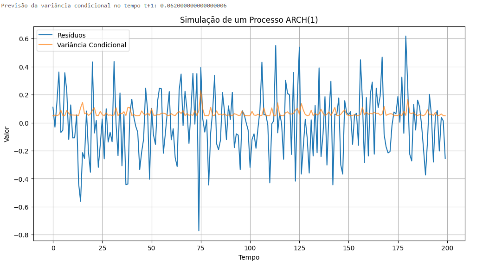

Em análise de séries temporais e econometria, uma suposição fundamental de muitos modelos é a de **variância constante**, também conhecida como *homoscedasticidade*. No entanto, essa suposição frequentemente não se sustenta em aplicações práticas, particularmente em dados financeiros e econômicos. A volatilidade, ou a medida de dispersão dos retornos, tende a se aglomerar ao longo do tempo: períodos de alta volatilidade são seguidos por outros de alta volatilidade, e vice-versa. Modelos que assumem variância constante falham em capturar essa característica crucial, limitando sua capacidade de modelar e prever com precisão [^1].

O modelo ARCH (Autoregressive Conditional Heteroskedasticity), proposto por Engle em 1982 [^1], surge como uma solução para essa limitação. Ele permite que a **variância condicional** varie ao longo do tempo como uma função dos erros passados, enquanto mantém a **variância incondicional** constante [^1]. Essa flexibilidade torna os modelos ARCH particularmente adequados para modelar fenômenos onde a volatilidade é variável e dependente do histórico recente, como taxas de inflação, mercados financeiros e outras séries econômicas [^1].

> 💡 **Exemplo Numérico:** Imagine modelar os retornos diários de uma ação. Em um dia com grandes flutuações (alta volatilidade), o modelo ARCH esperaria que o próximo dia também tivesse maior volatilidade em comparação com um dia calmo.

**Teorema 1** (Existência e Unicidade da Variância Incondicional): Para um modelo ARCH(q) com coeficientes $\alpha_i$ satisfazendo $\sum_{i=1}^{q} \alpha_i < 1$, a variância incondicional de $\epsilon_t$ existe, é finita e é dada por:

$$Var(\epsilon_t) = \frac{\alpha_0}{1 - \sum_{i=1}^{q} \alpha_i}$$

*Proof:* A prova se baseia na condição de estacionariedade do processo ARCH(q), que exige que a soma dos coeficientes $\alpha_i$ seja menor que 1. Sob essa condição, a variância incondicional pode ser derivada tomando o valor esperado da equação da variância condicional e resolvendo para $Var(\epsilon_t)$.

#### Prova do Teorema 1
Queremos provar que para um modelo ARCH(q) com $\sum_{i=1}^{q} \alpha_i < 1$, a variância incondicional é:
$$Var(\epsilon_t) = \frac{\alpha_0}{1 - \sum_{i=1}^{q} \alpha_i}$$

I.  Começamos com a definição da variância condicional para um modelo ARCH(q):
    $$h_t = E[\epsilon_t^2 | \psi_{t-1}] = \alpha_0 + \sum_{i=1}^{q} \alpha_i \epsilon_{t-i}^2$$

II. Tomamos a esperança incondicional de ambos os lados da equação:
    $$E[h_t] = E[\alpha_0 + \sum_{i=1}^{q} \alpha_i \epsilon_{t-i}^2]$$

III. Usando a linearidade do operador esperança:
     $$E[h_t] = E[\alpha_0] + \sum_{i=1}^{q} \alpha_i E[\epsilon_{t-i}^2]$$

IV. Dado que $\alpha_0$ é uma constante e que para um processo estacionário $E[\epsilon_{t-i}^2] = Var(\epsilon_t)$ para todo *i*:
    $$E[h_t] = \alpha_0 + \sum_{i=1}^{q} \alpha_i Var(\epsilon_t)$$

V. Também sabemos que a variância incondicional é a esperança da variância condicional, ou seja, $Var(\epsilon_t) = E[h_t]$:
   $$Var(\epsilon_t) = \alpha_0 + \sum_{i=1}^{q} \alpha_i Var(\epsilon_t)$$

VI. Reorganizando os termos para isolar $Var(\epsilon_t)$:
    $$Var(\epsilon_t) - \sum_{i=1}^{q} \alpha_i Var(\epsilon_t) = \alpha_0$$

VII. Fatorando $Var(\epsilon_t)$:
     $$Var(\epsilon_t) \left(1 - \sum_{i=1}^{q} \alpha_i \right) = \alpha_0$$

VIII. Finalmente, dividindo ambos os lados por $\left(1 - \sum_{i=1}^{q} \alpha_i \right)$, obtemos a variância incondicional:
      $$Var(\epsilon_t) = \frac{\alpha_0}{1 - \sum_{i=1}^{q} \alpha_i}$$
      
IX. Portanto, demonstramos que a variância incondicional de $\epsilon_t$ é dada por $\frac{\alpha_0}{1 - \sum_{i=1}^{q} \alpha_i}$, sob a condição de que $\sum_{i=1}^{q} \alpha_i < 1$. ■

> 💡 **Exemplo Numérico:** Considere um modelo ARCH(1) com $\alpha_0 = 0.05$ e $\alpha_1 = 0.3$. A variância incondicional seria:
> $$Var(\epsilon_t) = \frac{0.05}{1 - 0.3} = \frac{0.05}{0.7} \approx 0.0714$$
> Isso significa que, em média, a variância dos erros é de 0.0714, mesmo que a variância condicional varie ao longo do tempo.

### Modelos ARCH: Uma Abordagem para a Variância Variável no Tempo

A principal inovação do modelo ARCH reside em sua capacidade de modelar a **heteroscedasticidade condicional**, ou seja, a dependência da variância atual dos erros passados. Formalmente, um processo ARCH(q) assume que o erro no tempo *t*, denotado por $\epsilon_t$, é dado por:
$\epsilon_t | \psi_{t-1} \sim N(0, h_t)$, onde [^3]

$$h_t = \alpha_0 + \sum_{i=1}^{q} \alpha_i \epsilon_{t-i}^2$$

Onde:
*   $\psi_{t-1}$ representa o conjunto de informações disponíveis até o tempo *t-1* [^2].
*   $h_t$ é a variância condicional no tempo *t*, dada a informação disponível até o tempo *t-1* [^3].
*   $\alpha_0 > 0$ é uma constante [^3].
*   $\alpha_i \geq 0$ para *i* = 1, ..., *q* são os coeficientes que medem a influência dos erros quadráticos passados na variância condicional atual [^3].
*   *q* é a ordem do modelo ARCH, indicando quantos períodos passados de erros quadráticos são considerados na determinação da variância condicional atual [^3].

A condição $\alpha_i \geq 0$ garante que a variância condicional seja sempre não negativa [^3]. A variância incondicional é constante, embora a variância condicional varie com o tempo [^1].

> 💡 **Exemplo Numérico:** Suponha um modelo ARCH(2) com $\alpha_0 = 0.01$, $\alpha_1 = 0.4$ e $\alpha_2 = 0.2$. Se $\epsilon_{t-1} = 0.1$ e $\epsilon_{t-2} = -0.05$, então a variância condicional no tempo *t* seria:
> $$h_t = 0.01 + 0.4(0.1)^2 + 0.2(-0.05)^2 = 0.01 + 0.004 + 0.0005 = 0.0145$$
> Isso indica que a variância no tempo *t* é estimada em 0.0145, com base nos erros quadráticos dos dois períodos anteriores.

**Proposição 1** (Relação entre Variância Condicional e Incondicional): A variância incondicional do processo $\epsilon_t$ é o valor esperado da variância condicional $h_t$, ou seja, $Var(\epsilon_t) = E[h_t]$.

*Proof:* Tomando a esperança da equação $h_t = \alpha_0 + \sum_{i=1}^{q} \alpha_i \epsilon_{t-i}^2$ e usando a propriedade de que $E[\epsilon_{t-i}^2] = Var(\epsilon_{t-i})$ para um processo estacionário, obtemos $E[h_t] = \alpha_0 + \sum_{i=1}^{q} \alpha_i Var(\epsilon_{t-i})$. Como a variância incondicional é constante, $Var(\epsilon_{t-i}) = Var(\epsilon_t)$, resultando em $E[h_t] = \alpha_0 + Var(\epsilon_t) \sum_{i=1}^{q} \alpha_i$. Resolvendo para $Var(\epsilon_t)$, obtemos a expressão apresentada no Teorema 1.

#### Prova da Proposição 1
Queremos provar que $Var(\epsilon_t) = E[h_t]$.

I. Começamos com a definição da variância condicional:
   $$h_t = \alpha_0 + \sum_{i=1}^{q} \alpha_i \epsilon_{t-i}^2$$

II. Tomamos a esperança de ambos os lados da equação:
   $$E[h_t] = E\left[\alpha_0 + \sum_{i=1}^{q} \alpha_i \epsilon_{t-i}^2\right]$$

III. Aplicamos a linearidade da esperança:
    $$E[h_t] = E[\alpha_0] + \sum_{i=1}^{q} \alpha_i E[\epsilon_{t-i}^2]$$

IV. Como $\alpha_0$ é constante, $E[\alpha_0] = \alpha_0$.  Para um processo estacionário, $E[\epsilon_{t-i}^2] = Var(\epsilon_{t-i}) = Var(\epsilon_t)$ para todo *i*.  Assim:
    $$E[h_t] = \alpha_0 + \sum_{i=1}^{q} \alpha_i Var(\epsilon_t)$$

V.  Do Teorema 1, sabemos que:
    $$Var(\epsilon_t) = \frac{\alpha_0}{1 - \sum_{i=1}^{q} \alpha_i}$$
    
VI.  Multiplicando ambos os lados por $1 - \sum_{i=1}^{q} \alpha_i$:
    $$Var(\epsilon_t) \left(1 - \sum_{i=1}^{q} \alpha_i\right) = \alpha_0$$
    $$Var(\epsilon_t) = \alpha_0 +  Var(\epsilon_t)\sum_{i=1}^{q} \alpha_i$$

VII. Substituindo $\alpha_0$ na equação do passo IV:
    $$E[h_t] = Var(\epsilon_t) -  Var(\epsilon_t)\sum_{i=1}^{q} \alpha_i + \sum_{i=1}^{q} \alpha_i Var(\epsilon_t)$$
    $$E[h_t] = Var(\epsilon_t)$$
    
VIII. Portanto, demonstramos que a variância incondicional do processo $\epsilon_t$ é o valor esperado da variância condicional $h_t$. ■

### Vantagens e Aplicações

A introdução dos modelos ARCH representou um avanço significativo na modelagem de séries temporais, permitindo a captura da volatilidade variável no tempo. Alguns dos principais benefícios e aplicações incluem:

*   **Modelagem da volatilidade da inflação**: Engle (1982, 1983) e Engle e Kraft (1983) aplicaram modelos ARCH para modelar a taxa de inflação, reconhecendo que a incerteza da inflação tende a mudar ao longo do tempo [^1].
*   **Precificação de ativos**: A variância condicional estimada pode ser usada como um *proxy* para o prêmio de risco em modelos de estrutura de prazo [^1].
*   **Mercados financeiros**: Os modelos ARCH são usados para modelar a volatilidade em mercados de câmbio e outros mercados financeiros [^1].
*   **Melhoria da previsão**: Ao modelar a heteroscedasticidade condicional, os modelos ARCH podem fornecer previsões mais precisas em comparação com modelos que assumem variância constante [^1].
*   **Representação mais parsimoniosa**: Permite uma descrição mais parcimoniosa em muitas situações [^2].

Para ilustrar a aplicação na previsão, considere o seguinte:

**Corolário 1.1** (Previsão da Variância Condicional): A melhor previsão de $h_{t+1}$ no tempo *t*, denotada por $E[h_{t+1} | \psi_t]$, é dada por:

$$E[h_{t+1} | \psi_t] = \alpha_0 + \sum_{i=1}^{q} \alpha_i \epsilon_{t+1-i}^2$$

Note que para $i > 1$, $\epsilon_{t+1-i}$ está no conjunto de informação $\psi_t$, e portanto, é conhecido no tempo *t*.  Assim, a previsão da variância condicional no próximo período depende dos erros quadráticos observados nos *q* períodos anteriores.

#### Prova do Corolário 1.1

Queremos provar que a melhor previsão de $h_{t+1}$ no tempo *t* é dada por:
$$E[h_{t+1} | \psi_t] = \alpha_0 + \sum_{i=1}^{q} \alpha_i \epsilon_{t+1-i}^2$$

I. Começamos com a definição de $h_{t+1}$:
   $$h_{t+1} = \alpha_0 + \sum_{i=1}^{q} \alpha_i \epsilon_{t+1-i}^2$$

II. Tomamos a esperança condicional de ambos os lados, dado o conjunto de informações $\psi_t$:
   $$E[h_{t+1} | \psi_t] = E\left[\alpha_0 + \sum_{i=1}^{q} \alpha_i \epsilon_{t+1-i}^2 | \psi_t\right]$$

III. Aplicamos a linearidade da esperança condicional:
    $$E[h_{t+1} | \psi_t] = E[\alpha_0 | \psi_t] + \sum_{i=1}^{q} \alpha_i E[\epsilon_{t+1-i}^2 | \psi_t]$$

IV. Como $\alpha_0$ é uma constante, $E[\alpha_0 | \psi_t] = \alpha_0$. Para $i \geq 1$, $\epsilon_{t+1-i}$ está no conjunto de informações $\psi_t$ (ou seja, é conhecido no tempo *t*). Portanto, $E[\epsilon_{t+1-i}^2 | \psi_t] = \epsilon_{t+1-i}^2$:
   $$E[h_{t+1} | \psi_t] = \alpha_0 + \sum_{i=1}^{q} \alpha_i \epsilon_{t+1-i}^2$$

V.  Assim, demonstramos que a melhor previsão de $h_{t+1}$ no tempo *t* é dada por $E[h_{t+1} | \psi_t] = \alpha_0 + \sum_{i=1}^{q} \alpha_i \epsilon_{t+1-i}^2$. ■

> 💡 **Exemplo Numérico:** Usando o modelo ARCH(1) anterior com $\alpha_0 = 0.05$ e $\alpha_1 = 0.3$, se o erro no tempo *t* ($\epsilon_t$) for 0.2, então a previsão da variância condicional no tempo *t+1* seria:
> $$E[h_{t+1} | \psi_t] = 0.05 + 0.3(0.2)^2 = 0.05 + 0.012 = 0.062$$
> Isso indica que a melhor estimativa da variância no próximo período é 0.062, com base no erro quadrático atual.
>
> 
>
> A simulação acima demonstra como a variância condicional varia ao longo do tempo em resposta aos resíduos passados. Períodos de grandes resíduos são seguidos por aumentos na variância condicional, refletindo o agrupamento de volatilidade característico dos modelos ARCH.

### Conclusão
Os modelos ARCH representam uma ferramenta poderosa para modelar séries temporais que exibem heteroscedasticidade condicional. Ao permitir que a variância condicional varie ao longo do tempo em função dos erros passados, esses modelos capturam a dinâmica da volatilidade que é frequentemente observada em dados econômicos e financeiros. Eles fornecem uma estrutura flexível para modelar e prever a volatilidade, levando a previsões mais precisas e uma melhor compreensão do comportamento das séries temporais. A capacidade de lidar com a volatilidade variável no tempo tornou os modelos ARCH uma ferramenta essencial para analistas e pesquisadores em diversas áreas, desde economia e finanças até engenharia e ciências ambientais [^1].
<!-- END -->