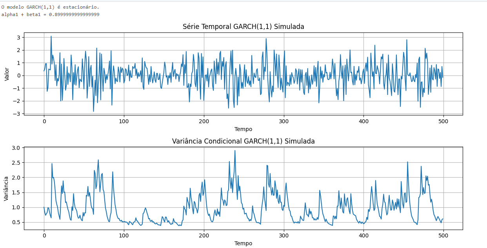

Como discutido anteriormente, modelos ARCH (Autoregressive Conditional Heteroskedasticity) representam um avanço importante na modelagem de séries temporais ao permitir que a variância condicional varie ao longo do tempo em função de erros passados [^1]. No entanto, a necessidade de impor estruturas de defasagem lineares decrescentes arbitrárias para capturar a memória longa observada em dados empíricos limita sua flexibilidade e pode levar a uma especificação incorreta do modelo [^1, ^2]. Em continuidade ao tópico anterior, este capítulo se aprofunda na introdução de modelos GARCH (Generalized Autoregressive Conditional Heteroskedasticity) como uma generalização que oferece uma estrutura de defasagem mais flexível e parcimoniosa, mitigando as limitações dos modelos ARCH tradicionais.

### A Formulação do Modelo GARCH(p, q)

Os modelos GARCH ampliam a estrutura ARCH ao permitir que a variância condicional dependa não apenas dos erros quadrados passados, mas também de suas próprias defasagens [^1]. Formalmente, um processo GARCH(p, q) assume que o erro no tempo *t*, denotado por $\epsilon_t$, é dado por:

$$\epsilon_t | \psi_{t-1} \sim N(0, h_t)$$

onde a variância condicional $h_t$ é definida como:

$$h_t = \alpha_0 + \sum_{i=1}^{q} \alpha_i \epsilon_{t-i}^2 + \sum_{j=1}^{p} \beta_j h_{t-j}$$

Onde:

*   $\psi_{t-1}$ representa o conjunto de informações disponíveis até o tempo *t-1* [^2].
*   $h_t$ é a variância condicional no tempo *t*, dada a informação disponível até o tempo *t-1* [^3].
*   $\alpha_0 > 0$ é uma constante [^3].
*   $\alpha_i \geq 0$ para *i* = 1, ..., *q* são os coeficientes que medem a influência dos erros quadráticos passados na variância condicional atual [^3].
*   $\beta_j \geq 0$ para *j* = 1, ..., *p* são os coeficientes que medem a influência das variâncias condicionais passadas na variância condicional atual [^3].
*   *q* é a ordem do componente ARCH, indicando quantos períodos passados de erros quadráticos são considerados na determinação da variância condicional atual [^3].
*   *p* é a ordem do componente GARCH, indicando quantos períodos passados de variâncias condicionais são considerados na determinação da variância condicional atual [^3].

A condição $\alpha_i \geq 0$ e $\beta_j \geq 0$ garante que a variância condicional seja sempre não negativa [^3]. Similarmente aos modelos ARCH, a variância incondicional é constante, embora a variância condicional varie com o tempo [^1].

> 💡 **Exemplo Numérico:** Considere um modelo GARCH(1,1) com $\alpha_0 = 0.01$, $\alpha_1 = 0.2$ e $\beta_1 = 0.7$. Se $\epsilon_{t-1} = 0.1$ e $h_{t-1} = 0.02$, então a variância condicional no tempo *t* seria:
> $$h_t = 0.01 + 0.2(0.1)^2 + 0.7(0.02) = 0.01 + 0.002 + 0.014 = 0.026$$
> Isso indica que a variância no tempo *t* é estimada em 0.026, com base no erro quadrático e na variância condicional do período anterior.

**Proposição 1** (Esperança Condicional): Dado um processo GARCH(p,q) como definido acima, a esperança condicional de $\epsilon_t^2$ dado $\psi_{t-1}$ é igual à variância condicional $h_t$.

*Prova:* Por definição, $\epsilon_t | \psi_{t-1} \sim N(0, h_t)$. Portanto, $E[\epsilon_t | \psi_{t-1}] = 0$ e $Var(\epsilon_t | \psi_{t-1}) = E[\epsilon_t^2 | \psi_{t-1}] - (E[\epsilon_t | \psi_{t-1}])^2 = E[\epsilon_t^2 | \psi_{t-1}] - 0^2 = E[\epsilon_t^2 | \psi_{t-1}]$. Como $Var(\epsilon_t | \psi_{t-1}) = h_t$, então $E[\epsilon_t^2 | \psi_{t-1}] = h_t$. ■

### A Analogia com Modelos ARMA

Como apontado por Bollerslev [^2], a extensão do processo AR aos processos ARMA (Autoregressive Moving Average) se assemelha muito à extensão dos modelos ARCH aos modelos GARCH. Esta analogia oferece uma visão intuitiva sobre os benefícios dos modelos GARCH.

Em modelos de séries temporais lineares, um modelo AR(q) representa uma regressão da variável atual sobre suas *q* defasagens passadas. No entanto, para capturar dependências de longo prazo, pode ser necessário incluir um número grande de defasagens, levando a um modelo com muitos parâmetros. Os modelos ARMA introduzem a componente de média móvel (MA), que permite que a variável atual dependa também de erros passados. Isso possibilita capturar dependências de longo prazo com um número menor de parâmetros.

De forma análoga, os modelos GARCH introduzem a componente GARCH, que permite que a variância condicional dependa também de suas próprias defasagens passadas. Isso possibilita capturar a persistência da volatilidade, que é uma característica comum das séries temporais financeiras e econômicas, com um número menor de parâmetros em comparação com um modelo ARCH de ordem alta.

### Condições de Estacionariedade

Assim como nos modelos ARMA, os modelos GARCH requerem condições de estacionariedade para garantir que o processo seja bem comportado e que a variância incondicional exista e seja finita.

**Teorema 1** (Condição de Estacionariedade de Ampla Senso): O processo GARCH(p, q) definido pelas equações anteriores é estacionário de ampla senso se e somente se:

$$\sum_{i=1}^{q} \alpha_i + \sum_{j=1}^{p} \beta_j < 1$$

Neste caso, a variância incondicional do processo é dada por:

$$\text{Var}(\epsilon_t) = \frac{\alpha_0}{1 - \sum_{i=1}^{q} \alpha_i - \sum_{j=1}^{p} \beta_j}$$

*Proof:* A prova envolve tomar a esperança da equação da variância condicional e aplicar a condição de estacionariedade para garantir que a variância incondicional exista e seja finita. A condição $\sum_{i=1}^{q} \alpha_i + \sum_{j=1}^{p} \beta_j < 1$ garante que a variância condicional não exploda ao longo do tempo e que o processo tenha uma variância incondicional bem definida.

#### Prova do Teorema 1

I.  Começamos com a definição da variância condicional para um modelo GARCH(p, q):
    $$h_t = \alpha_0 + \sum_{i=1}^{q} \alpha_i \epsilon_{t-i}^2 + \sum_{j=1}^{p} \beta_j h_{t-j}$$

II. Tomamos a esperança incondicional de ambos os lados da equação:
    $$E[h_t] = E\left[\alpha_0 + \sum_{i=1}^{q} \alpha_i \epsilon_{t-i}^2 + \sum_{j=1}^{p} \beta_j h_{t-j}\right]$$

III. Usando a linearidade do operador esperança:
     $$E[h_t] = E[\alpha_0] + \sum_{i=1}^{q} \alpha_i E[\epsilon_{t-i}^2] + \sum_{j=1}^{p} \beta_j E[h_{t-j}]$$

IV. Dado que $\alpha_0$ é uma constante e que para um processo estacionário $E[\epsilon_{t-i}^2] = \text{Var}(\epsilon_t)$ e $E[h_{t-j}] = \text{Var}(\epsilon_t)$ para todo *i* e *j*:
    $$E[h_t] = \alpha_0 + \sum_{i=1}^{q} \alpha_i \text{Var}(\epsilon_t) + \sum_{j=1}^{p} \beta_j \text{Var}(\epsilon_t)$$

V. Também sabemos que a variância incondicional é a esperança da variância condicional, ou seja, $\text{Var}(\epsilon_t) = E[h_t]$:
   $$\text{Var}(\epsilon_t) = \alpha_0 + \sum_{i=1}^{q} \alpha_i \text{Var}(\epsilon_t) + \sum_{j=1}^{p} \beta_j \text{Var}(\epsilon_t)$$

VI. Reorganizando os termos para isolar $\text{Var}(\epsilon_t)$:
    $$\text{Var}(\epsilon_t) - \sum_{i=1}^{q} \alpha_i \text{Var}(\epsilon_t) - \sum_{j=1}^{p} \beta_j \text{Var}(\epsilon_t) = \alpha_0$$

VII. Fatorando $\text{Var}(\epsilon_t)$:
     $$\text{Var}(\epsilon_t) \left(1 - \sum_{i=1}^{q} \alpha_i - \sum_{j=1}^{p} \beta_j \right) = \alpha_0$$

VIII. Finalmente, dividindo ambos os lados por $\left(1 - \sum_{i=1}^{q} \alpha_i - \sum_{j=1}^{p} \beta_j \right)$, obtemos a variância incondicional:
      $$\text{Var}(\epsilon_t) = \frac{\alpha_0}{1 - \sum_{i=1}^{q} \alpha_i - \sum_{j=1}^{p} \beta_j}$$

IX. Para que a variância incondicional exista e seja finita, é necessário que o denominador seja positivo, ou seja, $1 - \sum_{i=1}^{q} \alpha_i - \sum_{j=1}^{p} \beta_j > 0$.  Isto é equivalente a:
    $$\sum_{i=1}^{q} \alpha_i + \sum_{j=1}^{p} \beta_j < 1$$
      
X. Portanto, demonstramos que a condição de estacionariedade de ampla senso para um modelo GARCH(p, q) é $\sum_{i=1}^{q} \alpha_i + \sum_{j=1}^{p} \beta_j < 1$, e que, sob esta condição, a variância incondicional de $\epsilon_t$ é dada por $\frac{\alpha_0}{1 - \sum_{i=1}^{q} \alpha_i - \sum_{j=1}^{p} \beta_j}$. ■

> 💡 **Exemplo Numérico:** Considere um modelo GARCH(1,1) com $\alpha_0 = 0.05$, $\alpha_1 = 0.3$ e $\beta_1 = 0.6$. A condição de estacionariedade é:
> $$0.3 + 0.6 = 0.9 < 1$$
> A variância incondicional seria:
> $$\text{Var}(\epsilon_t) = \frac{0.05}{1 - 0.3 - 0.6} = \frac{0.05}{0.1} = 0.5$$
> Isso significa que, a longo prazo, a variância média dos erros se estabilizará em 0.5, dado que o modelo é estacionário e os parâmetros são os especificados.

> 💡 **Exemplo Numérico:** Vamos usar o Python para simular um processo GARCH(1,1) e verificar a condição de estacionariedade numericamente.
>
> 
> 
> Este código simula um processo GARCH(1,1) e plota a série temporal resultante, bem como a variância condicional.  A condição de estacionariedade é verificada no início.  Ao executar este código, você pode visualizar como a volatilidade varia ao longo do tempo. Se a condição de estacionariedade não for satisfeita (por exemplo, se `alpha1 + beta1 >= 1`), a variância condicional tenderá a explodir.

**Teorema 1.1** (Condição de Existência de Momentos): Para um processo GARCH(1,1), a existência do quarto momento (e, portanto, a curtose ser finita) requer uma condição mais restritiva do que a estacionariedade de segunda ordem. Especificamente, para que $E[\epsilon_t^4] < \infty$, é necessário que:

$$ \alpha_1^2 + 2\alpha_1\beta_1 + \beta_1^2 < 1 $$

*Proof:* A prova é mais complexa e envolve derivar a expressão para o quarto momento condicional e, em seguida, impor a condição para que o quarto momento incondicional seja finito. Essa condição garante que a cauda da distribuição do processo GARCH não seja excessivamente pesada. Um processo GARCH(1,1) pode ser estacionário no sentido de que sua variância é finita, mas ainda assim ter momentos de ordem superior infinitos.

**Corolário 1.1**: Se a condição para a existência do quarto momento em um GARCH(1,1) não for satisfeita, a distribuição dos retornos terá caudas mais pesadas do que a distribuição normal, implicando em maior probabilidade de eventos extremos.

> 💡 **Exemplo Numérico:** Vamos considerar um modelo GARCH(1,1) com $\alpha_1 = 0.2$ e $\beta_1 = 0.8$. A condição de estacionariedade de segunda ordem é satisfeita, pois $\alpha_1 + \beta_1 = 0.2 + 0.8 = 1$, que *não* é estritamente menor que 1, então o processo está no limite da estacionariedade e pode apresentar comportamento explosivo em amostras finitas. No entanto, vamos verificar a condição para a existência do quarto momento:
> $$\alpha_1^2 + 2\alpha_1\beta_1 + \beta_1^2 = (0.2)^2 + 2(0.2)(0.8) + (0.8)^2 = 0.04 + 0.32 + 0.64 = 1$$
> Neste caso, a condição para a existência do quarto momento *não* é satisfeita (é igual a 1, não menor que 1). Isso implica que, embora o processo possa ser estacionário no limite, a distribuição dos retornos terá caudas pesadas, e a curtose pode ser muito alta ou até mesmo indefinida.
>
> Agora, compare com um modelo com $\alpha_1 = 0.1$ e $\beta_1 = 0.8$:
> $$\alpha_1^2 + 2\alpha_1\beta_1 + \beta_1^2 = (0.1)^2 + 2(0.1)(0.8) + (0.8)^2 = 0.01 + 0.16 + 0.64 = 0.81 < 1$$
> Neste caso, a condição para a existência do quarto momento é satisfeita. A distribuição dos retornos ainda terá caudas mais pesadas do que a normal, mas a curtose será finita.

### Vantagens dos Modelos GARCH

Os modelos GARCH oferecem várias vantagens em relação aos modelos ARCH tradicionais:

*   **Flexibilidade**: A estrutura GARCH é mais flexível do que a estrutura ARCH, permitindo capturar uma gama mais ampla de padrões de dependência na volatilidade [^1].
*   **Parsimônia**: Os modelos GARCH podem capturar a persistência da volatilidade com um número menor de parâmetros em comparação com os modelos ARCH de ordem alta [^1].
*   **Ajuste aos Dados**: Modelos GARCH, geralmente, fornecem um melhor ajuste aos dados empíricos em comparação com modelos ARCH com uma estrutura linear decrescente [^2].

A capacidade de os modelos GARCH capturarem a persistência da volatilidade é particularmente importante em aplicações financeiras. A persistência da volatilidade refere-se à tendência da volatilidade de permanecer alta (ou baixa) por um período de tempo prolongado. Os modelos GARCH capturam essa característica ao incluir as variâncias condicionais passadas como determinantes da variância condicional atual [^3].

### GARCH(1,1): O Modelo Mais Popular

Embora a estrutura GARCH(p, q) permita flexibilidade na escolha de *p* e *q*, o modelo GARCH(1,1) é o mais amplamente utilizado na prática [^3]. Isso se deve a sua simplicidade e à sua capacidade de capturar grande parte da dinâmica da volatilidade observada em dados financeiros e econômicos. A equação para o modelo GARCH(1,1) é:

$$h_t = \alpha_0 + \alpha_1 \epsilon_{t-1}^2 + \beta_1 h_{t-1}$$

Onde:

*   $\alpha_0 > 0$
*   $\alpha_1 \geq 0$
*   $\beta_1 \geq 0$
*   $\alpha_1 + \beta_1 < 1$

> 💡 **Exemplo Numérico:** Se $\alpha_1$ for próximo de zero, o modelo indica que choques passados têm pouco efeito na volatilidade corrente. Se $\beta_1$ for próximo de um, o modelo indica que a volatilidade é altamente persistente, ou seja, um período de alta volatilidade tende a ser seguido por outros períodos de alta volatilidade.

> 💡 **Exemplo Numérico:** Num modelo GARCH(1,1), se $\alpha_1 = 0.1$ e $\beta_1 = 0.85$, então a condição de estacionariedade é satisfeita (0.95 < 1). A volatilidade corrente responde relativamente pouco a choques individuais, mas depende fortemente do nível de volatilidade do período anterior.

**Proposição 2**: (Interpretação da Persistência no GARCH(1,1)) No modelo GARCH(1,1), o parâmetro $\alpha_1 + \beta_1$ mede o grau de persistência da volatilidade. Quanto mais próximo de 1 for esse valor, mais tempo levará para que o efeito de um choque na volatilidade desapareça.

*Prova*: A variância condicional no período t é dada por $h_t = \alpha_0 + \alpha_1 \epsilon_{t-1}^2 + \beta_1 h_{t-1}$. Iterando para trás, podemos expressar $h_t$ como uma soma ponderada de choques passados e o nível inicial de volatilidade. O peso de cada choque diminui exponencialmente a uma taxa determinada por $\alpha_1 + \beta_1$. Se $\alpha_1 + \beta_1$ estiver próximo de 1, a taxa de decaimento será lenta, indicando alta persistência. ■

> 💡 **Exemplo Numérico:** Considere dois modelos GARCH(1,1):
>
> *   Modelo A: $\alpha_0 = 0.01$, $\alpha_1 = 0.1$, $\beta_1 = 0.7$
> *   Modelo B: $\alpha_0 = 0.01$, $\alpha_1 = 0.1$, $\beta_1 = 0.89$
>
> No Modelo A, a persistência é $\alpha_1 + \beta_1 = 0.1 + 0.7 = 0.8$. No Modelo B, a persistência é $\alpha_1 + \beta_1 = 0.1 + 0.89 = 0.99$.
>
> Isso significa que, no Modelo B, um choque na volatilidade levará muito mais tempo para se dissipar do que no Modelo A. Para quantificar isso, podemos calcular a meia-vida do choque, que é o tempo necessário para que o efeito do choque seja reduzido pela metade. Uma aproximação para a meia-vida é dada por:
>
> $$ \text{Meia-Vida} \approx -\frac{\ln(2)}{\ln(\alpha_1 + \beta_1)} $$
>
> Para o Modelo A:
> $$ \text{Meia-Vida}_A \approx -\frac{\ln(2)}{\ln(0.8)} \approx 3.11 \text{ períodos} $$
>
> Para o Modelo B:
> $$ \text{Meia-Vida}_B \approx -\frac{\ln(2)}{\ln(0.99)} \approx 69.66 \text{ períodos} $$
>
> Isso demonstra que, no Modelo B, o efeito de um choque na volatilidade persiste por um período de tempo muito mais longo (aproximadamente 70 períodos) em comparação com o Modelo A (aproximadamente 3 períodos).

### Conclusão

Os modelos GARCH representam uma generalização importante dos modelos ARCH, oferecendo uma estrutura mais flexível e parcimoniosa para modelar a heteroscedasticidade condicional. Ao permitir que a variância condicional dependa não apenas dos erros quadráticos passados, mas também de suas próprias defasagens, os modelos GARCH capturam a persistência da volatilidade e fornecem um melhor ajuste aos dados empíricos [^2]. Em particular, o modelo GARCH(1,1) é amplamente utilizado na prática devido à sua simplicidade e à sua capacidade de capturar grande parte da dinâmica da volatilidade observada em dados financeiros e econômicos [^3]. Na próxima seção, exploraremos as propriedades estatísticas dos modelos GARCH e discutiremos métodos para estimar e testar esses modelos.
<!-- END -->