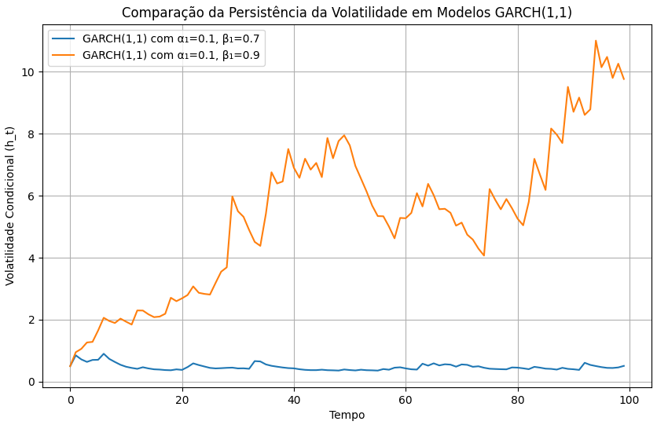
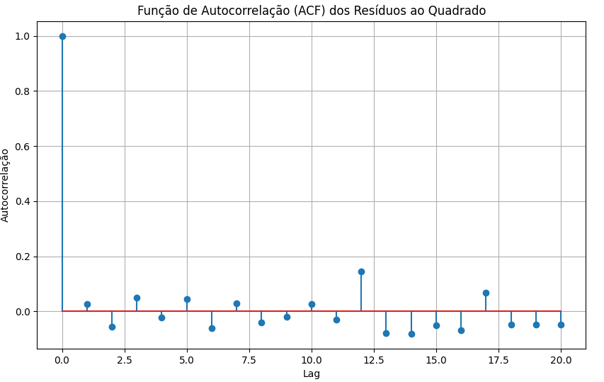

### Introdução
Este capítulo visa aprofundar a compreensão do modelo GARCH(p, q), explorando suas propriedades avançadas, decomposição em componentes mais simples e implicações para a modelagem da volatilidade. Construindo sobre a definição básica e os conceitos fundamentais já estabelecidos [^1, ^2], focaremos em como a estrutura da variância condicional $h_t$ permite capturar fenômenos cruciais como *volatility clustering* e persistência [^2].

### Conceitos Fundamentais

Relembrando, a definição formal de um processo GARCH(p, q) é [^2]:

$$
\varepsilon_t|\psi_{t-1} \sim N(0, h_t) \qquad (1)
$$
$$
h_t = \alpha_0 + \sum_{i=1}^{q} \alpha_i\varepsilon_{t-i}^2 + \sum_{i=1}^{p} \beta_ih_{t-i} \qquad (2)
$$

Onde, conforme definido anteriormente, $h_t$ é a variância condicional, expressa como uma combinação ponderada de inovações quadráticas passadas ($\varepsilon_{t-i}^2$) e variâncias condicionais passadas ($h_{t-i}$) [^2].

**Volatility Clustering e Persistência**

A característica fundamental do modelo GARCH(p, q) reside na sua capacidade de capturar dois fenômenos empíricos observados em séries temporais financeiras:

1.  ***Volatility Clustering***: Grandes mudanças (positivas ou negativas) tendem a ser seguidas por grandes mudanças, e pequenas mudanças tendem a ser seguidas por pequenas mudanças [^2]. Em outras palavras, períodos de alta volatilidade tendem a se agrupar, assim como períodos de baixa volatilidade.

2.  ***Persistência***: Os efeitos de *shocks* na volatilidade persistem ao longo do tempo [^3]. Um grande *shock* no tempo *t* afeta não apenas a volatilidade no tempo *t+1*, mas também a volatilidade em *t+2*, *t+3* e assim por diante, embora com intensidade decrescente.

A equação (2) permite que esses fenômenos sejam modelados através da ponderação das inovações quadráticas passadas e das variâncias condicionais passadas [^2]. Os coeficientes $\alpha_i$ capturam a influência das inovações recentes na volatilidade atual, enquanto os coeficientes $\beta_i$ capturam a persistência da volatilidade. A magnitude de $\beta_i$ está diretamente relacionada com a persistência; valores mais elevados indicam uma memória mais longa dos *shocks* passados [^3]. A condição de estacionariedade fraca, $\sum_{i=1}^{q}\alpha_i + \sum_{i=1}^{p}\beta_i < 1$ [^4], garante que o efeito dos *shocks* eventualmente se dissipe, prevenindo que a volatilidade exploda para o infinito.

> 💡 **Exemplo Numérico:** Considere dois modelos GARCH(1,1). No Modelo A, $\alpha_1=0.1$ e $\beta_1=0.7$. No Modelo B, $\alpha_1=0.1$ e $\beta_1=0.9$. O Modelo B exibirá uma persistência de volatilidade significativamente maior. Após um grande *shock*, a volatilidade no Modelo B retornará à sua média com muito mais lentidão do que no Modelo A.

> 💡 **Exemplo Numérico:** Para ilustrar numericamente a persistência, vamos simular dois modelos GARCH(1,1) com diferentes valores de $\beta_1$ e observar como a volatilidade reage a um choque.
> 
> 
> 
>O gráfico gerado ilustra que a volatilidade no Modelo B (com $\beta_1=0.9$) leva mais tempo para retornar ao seu nível médio após o choque inicial do que no Modelo A (com $\beta_1=0.7$). Isso demonstra visualmente a maior persistência da volatilidade no Modelo B.

**Análise da Autocorrelação e Identificação do Modelo**

Como mencionado anteriormente [^3], a análise da função de autocorrelação (ACF) e da função de autocorrelação parcial (PACF) dos resíduos ao quadrado ($\varepsilon_t^2$) é crucial para identificar a ordem apropriada (p, q) do modelo GARCH. Se a ACF e PACF dos resíduos ao quadrado exibem decaimento lento e significativo, isso sugere a necessidade de modelar a volatilidade com um modelo GARCH.

> 💡 **Observação:** As condições gerais para a existência de um momento de quarta ordem finito são desconhecidas [^7]. No entanto, uma ordem específica para o modelo permite derivar as condições necessárias seguindo os mesmos argumentos que levam ao Teorema 2 para um processo GARCH(1,1).

A partir da autocorrelação parcial, podemos inferir que, para um processo ARCH(q), $\phi_{kk}$ corta após *q* defasagens: $\phi_{kk} \neq 0, k \leq q$ e $\phi_{kk} = 0, k > q$ [^8].

Formalmente, a análise da autocorrelação é baseada nos teoremas a seguir:

**Teorema 1 (Autocorrelação dos Shocks Quadrados)**: Para um processo GARCH(p,q), a função de autocorrelação dos *shocks* quadrados $\varepsilon_t^2$ exibe dependência serial, mesmo que $\varepsilon_t$ em si seja não correlacionado.

**Teorema 2 (Decomposição da Função de Autocovariância):** A função de autocovariância $\gamma_n$ para o processo GARCH(p,q) pode ser decomposta como [^8]:
$$
\gamma_n = \sum_{i=1}^{q} \alpha_i\gamma_{n-i} + \sum_{i=1}^{p} \beta_i\gamma_{n-i} \quad \text{para} \quad n > 0
$$

Esta equação mostra que a autocovariância no *lag* *n* é uma função linear das autocovariâncias nos *lags* anteriores, com pesos determinados pelos parâmetros $\alpha_i$ e $\beta_i$.

> 💡 **Exemplo Numérico:** Considere um processo GARCH(1,1) com $\alpha_1 = 0.2$ e $\beta_1 = 0.6$. Se $\gamma_1 = 0.5$ e $\gamma_2 = 0.4$, podemos calcular $\gamma_3$ usando a fórmula acima:
>
> $\gamma_3 = \alpha_1 \gamma_2 + \beta_1 \gamma_2 = 0.2 \times 0.4 + 0.6 \times 0.4 = 0.08 + 0.24 = 0.32$.
>
> Este cálculo ilustra como as autocovariâncias anteriores influenciam a autocovariância atual, demonstrando a dependência serial nos *shocks* quadrados.
>
> 
> 
> A ACF plotada demonstra o decaimento lento e significativo, característico de processos GARCH, confirmando a dependência serial dos *shocks* quadrados.

**Teorema 2.1 (Estacionariedade da Autocovariância):** Se o processo GARCH(p, q) é fracamente estacionário, então a função de autocovariância $\gamma_n$ decai para zero quando $n$ tende ao infinito.

*Prova:* A estacionariedade fraca implica que a variância condicional $h_t$ é finita e constante no tempo. Sob esta condição, a influência dos *shocks* passados na volatilidade diminui à medida que o *lag* aumenta, fazendo com que $\gamma_n$ convirja para zero.

I. Assumimos que o processo GARCH(p,q) é fracamente estacionário. Isso significa que a média, a variância e a autocovariância do processo são constantes no tempo.

II. A autocovariância $\gamma_n$ é definida como $Cov(\varepsilon_t^2, \varepsilon_{t-n}^2) = E[(\varepsilon_t^2 - E[\varepsilon_t^2])(\varepsilon_{t-n}^2 - E[\varepsilon_{t-n}^2])]$.

III. Para um processo fracamente estacionário, $E[\varepsilon_t^2]$ é constante. Portanto, podemos escrever $\gamma_n = E[(\varepsilon_t^2 - \mu)(\varepsilon_{t-n}^2 - \mu)]$, onde $\mu = E[\varepsilon_t^2]$.

IV. Como o processo é fracamente estacionário, a influência de $\varepsilon_{t-n}^2$ em $\varepsilon_t^2$ diminui à medida que $n$ aumenta. Isso ocorre porque a persistência dos choques passados se dissipa com o tempo, conforme garantido pela condição de estacionariedade fraca: $\sum_{i=1}^{q}\alpha_i + \sum_{i=1}^{p}\beta_i < 1$.

V. Portanto, conforme $n \to \infty$, a dependência entre $\varepsilon_t^2$ e $\varepsilon_{t-n}^2$ diminui, e a autocovariância $\gamma_n$ converge para zero: $\lim_{n \to \infty} \gamma_n = 0$.  ■

**Representação ARMA do GARCH(p, q)**

Um *insight* valioso é que um processo GARCH(p, q) pode ser representado como um processo ARMA aplicado aos resíduos ao quadrado. Defina $v_t = \varepsilon_t^2 - h_t$. Então, reescrevendo a equação (2) [^4]:
$$
\varepsilon_t^2 = \alpha_0 + \sum_{i=1}^{q} \alpha_i\varepsilon_{t-i}^2 + \sum_{i=1}^{p} \beta_ih_{t-i} + v_t
$$
$$
\varepsilon_t^2 = \alpha_0 + \sum_{i=1}^{q} \alpha_i\varepsilon_{t-i}^2 + \sum_{i=1}^{p} \beta_i(\varepsilon_{t-i}^2 - v_{t-i}) + v_t
$$
$$
\varepsilon_t^2 = \alpha_0 + \sum_{i=1}^{\max\{p,q\}} (\alpha_i + \beta_i)\varepsilon_{t-i}^2  - \sum_{i=1}^{p} \beta_iv_{t-i} + v_t
$$
Aqui, os parâmetros $\alpha_i$ são definidos como zero para $i > q$ e os parâmetros $\beta_i$ são definidos como zero para $i > p$. Esta equação é uma representação ARMA($\max\{p, q\}, p$) para o processo $\varepsilon_t^2$ [^4].

> 💡 **Exemplo Numérico:** Um modelo GARCH(1,1) pode ser expresso como um ARMA(1,1) no processo quadrado $\varepsilon_t^2$. Assim, a identificação e estimação do modelo GARCH pode se beneficiar das ferramentas desenvolvidas para modelos ARMA.

> 💡 **Exemplo Numérico:** Para ilustrar a representação ARMA de um GARCH(1,1), considere um modelo GARCH(1,1) com $\alpha_0 = 0.1$, $\alpha_1 = 0.2$ e $\beta_1 = 0.5$. A representação ARMA(1,1) correspondente para $\varepsilon_t^2$ é:
>
> $\varepsilon_t^2 = 0.1 + (0.2 + 0.5)\varepsilon_{t-1}^2 - 0.5v_{t-1} + v_t$
>
> $\varepsilon_t^2 = 0.1 + 0.7\varepsilon_{t-1}^2 - 0.5v_{t-1} + v_t$
>
> Isso mostra que $\varepsilon_t^2$ pode ser modelado como um processo ARMA(1,1) com um coeficiente AR de 0.7 e um coeficiente MA de -0.5.  Podemos usar técnicas de estimação de ARMA para estimar os parâmetros do GARCH subjacente.

**Lema 1 (Relação entre GARCH e ARMA):** Dado um processo GARCH(p, q) e sua representação ARMA($\max\{p, q\}, p$) para $\varepsilon_t^2$, as raízes do polinômio AR da representação ARMA estão relacionadas com os parâmetros $\alpha_i$ e $\beta_i$ do processo GARCH.

*Prova:* O polinômio AR da representação ARMA é dado por $1 - \sum_{i=1}^{\max\{p,q\}} (\alpha_i + \beta_i)L^i$, onde $L$ é o operador de defasagem. As raízes deste polinômio determinam o comportamento de longo prazo da autocorrelação de $\varepsilon_t^2$, e portanto estão intrinsecamente ligadas à persistência da volatilidade capturada pelos parâmetros $\alpha_i$ e $\beta_i$ do modelo GARCH.

I. Começamos com a representação ARMA do processo GARCH(p, q): $\varepsilon_t^2 = \alpha_0 + \sum_{i=1}^{\max\{p,q\}} (\alpha_i + \beta_i)\varepsilon_{t-i}^2  - \sum_{i=1}^{p} \beta_iv_{t-i} + v_t$.

II. Definimos o polinômio AR associado a esta representação ARMA como: $A(L) = 1 - \sum_{i=1}^{\max\{p,q\}} (\alpha_i + \beta_i)L^i$, onde $L$ é o operador de defasagem (ou seja, $L^i x_t = x_{t-i}$).

III. As raízes do polinômio AR são os valores de $z$ para os quais $A(z) = 0$.  Estas raízes determinam o comportamento da função de autocorrelação do processo $\varepsilon_t^2$.

IV. A persistência da volatilidade no modelo GARCH é controlada pelos parâmetros $\alpha_i$ e $\beta_i$.  Na representação ARMA, estes parâmetros aparecem nos coeficientes do polinômio AR.

V. Portanto, as raízes do polinômio AR, que determinam o comportamento da autocorrelação de $\varepsilon_t^2$, estão diretamente relacionadas com os parâmetros $\alpha_i$ e $\beta_i$ do processo GARCH, que governam a persistência da volatilidade.  ■

**Formas Equivalentes do Modelo GARCH**

É importante notar que existem formas equivalentes de representar o modelo GARCH, o que pode facilitar a análise e a estimação. Como apontado por Bollerslev [^4], uma representação alternativa é dada por:
$$
\varepsilon_t^2 = \alpha_0 + \sum_{i=1}^{q} \alpha_i\varepsilon_{t-i}^2 + \sum_{j=1}^{p} \beta_i(\varepsilon_{t-j}^2 - \nu_{t-j}) + \nu_t
$$
$$
\nu_t = \varepsilon_t^2 - h_t = (\eta_t^2 - 1)h_t \qquad \eta_t \sim N(0,1)
$$

Note que $\nu_t$ é serialmente não correlacionada com média zero. Isto nos permite ver que o processo GARCH(p,q) pode ser interpretado como um processo autoregressivo de média móvel em $\varepsilon_t^2$.

Embora esta parametrização possa ser mais significativa do ponto de vista teórico das séries temporais, as equações (1) e (2) são mais fáceis de trabalhar na prática [^4].

**Teorema 3 (Condição Suficiente para Estacionariedade Forte do GARCH(1,1))** Um processo GARCH(1,1) é estritamente estacionário se $E[log(\alpha_1\eta_t^2 + \beta_1)] < 0$.

*Prova:* Veja [^6] para uma prova detalhada. Essa condição garante que a volatilidade não exploda ao longo do tempo, mesmo que a condição de estacionariedade fraca ($α_1 + β_1 < 1$) seja satisfeita.

> 💡 **Exemplo Numérico:** Considere um processo GARCH(1,1) com $\alpha_1 = 0.1$ e $\beta_1 = 0.8$. Para verificar a condição de estacionariedade forte, precisamos calcular $E[log(\alpha_1\eta_t^2 + \beta_1)] = E[log(0.1\eta_t^2 + 0.8)]$, onde $\eta_t \sim N(0,1)$.
>
> Aproximando numericamente esta expectativa usando simulação Monte Carlo:
>
> ```python
> import numpy as np
>
> # Define os parâmetros
> alpha1 = 0.1
> beta1 = 0.8
>
> # Número de simulações Monte Carlo
> num_simulations = 100000
>
> # Gera amostras de uma distribuição normal padrão
> eta = np.random.normal(0, 1, num_simulations)
>
> # Calcula o valor dentro do logaritmo
> log_argument = alpha1 * eta**2 + beta1
>
> # Calcula o logaritmo
> log_values = np.log(log_argument)
>
> # Estima a expectativa
> expected_value = np.mean(log_values)
>
> print(f'E[log(α₁ηₜ² + β₁)] ≈ {expected_value}')
>
> # Verifica a condição de estacionariedade forte
> if expected_value < 0:
>     print('O processo GARCH(1,1) provavelmente é estritamente estacionário.')
> else:
>     print('A condição de estacionariedade forte não é satisfeita.')
> ```
>
> Se o resultado da simulação for negativo (e.g., -0.15), então a condição de estacionariedade forte é satisfeita, e o processo é estritamente estacionário. Se o resultado for positivo, então a condição não é satisfeita, e a estacionariedade forte não é garantida. Este exemplo mostra como a simulação Monte Carlo pode ser usada para verificar as condições teóricas na prática.

### Conclusão

A variância condicional $h_t$ no modelo GARCH(p, q) é uma combinação ponderada de inovações quadráticas passadas e variâncias condicionais passadas, que captura o *volatility clustering* e a persistência [^2]. Compreender a relação com a estrutura ARMA do GARCH(p,q) fornece ferramentas para a análise e identificação do modelo [^4]. As condições de estacionariedade garantem que o processo seja estatisticamente tratável [^4].

### Referências
[^1]: Engle, R.F., 1982, Autoregressive conditional heteroskedasticity with estimates of the variance of U.K. inflation, Econometrica 50, 987-1008.
[^2]: Bollerslev, T., 1986, Generalized autoregressive conditional heteroskedasticity, Journal of Econometrics 31, 307-327.
[^3]: Bollerslev, T., 1986, Generalized autoregressive conditional heteroskedasticity, Journal of Econometrics 31, 307-327.
[^4]: Bollerslev, T., 1986, Generalized autoregressive conditional heteroskedasticity, Journal of Econometrics 31, 307-327.
[^5]: Ling, S., and McAleer, M. (2002). Necessary and sufficient condition for the existence of the fourth moment of GARCH(p,q) processes. *Journal of Econometrics*, *110*(2), 317-339.
[^6]: Bollerslev, T., 1986, Generalized autoregressive conditional heteroskedasticity, Journal of Econometrics 31, 307-327.
[^7]: Bollerslev, T., 1986, Generalized autoregressive conditional heteroskedasticity, Journal of Econometrics 31, 307-327.
[^8]: Bollerslev, T., 1986, Generalized autoregressive conditional heteroskedasticity, Journal of Econometrics 31, 307-327.
<!-- END -->